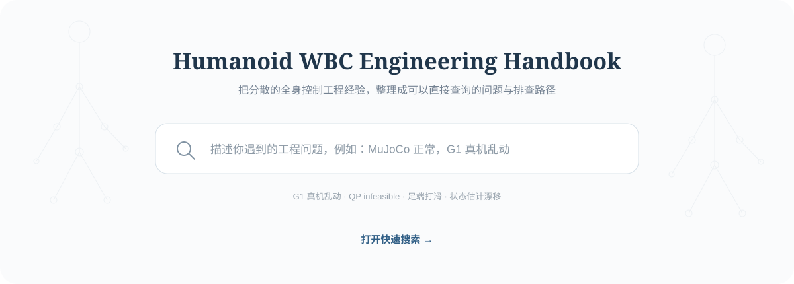

# Humanoid WBC Engineering Handbook

[](https://guangjunzeng.github.io/Humanoid-WBC-Handbook/)

**[打开中英文快速搜索](https://guangjunzeng.github.io/Humanoid-WBC-Handbook/)**：所有工程问题均可搜索；可信度、状态和证据边界在独立详情页查看。

---

## 论文按 7 个 Topics 浏览

论文库保持 7 个固定板块；下面按主要技术路线各选一篇已完成中英文全文精读的代表作。点击论文名直接进入中文解读页，页面顶部可切换英文版；完整收录见[论文库](content/papers/README.md)。

| Topic | 代表技术路线与精读入口 |
|---|---|
| [训练数据与动作重定向](content/papers/domains/training-data-retargeting.md) | 统一人体动作库：[AMASS](content/papers/amass-1904.03278.md) · 优化式可行重定向：[Retargeting Matters](content/papers/retargeting-matters-2510.02252v1.md) · 视频世界轨迹恢复：[GVHMR](content/papers/gvhmr-2409.06662.md) · 万级动作渐进跟踪：[PHC](content/papers/phc-2305.06456.md) |
| [通用跟踪与全身遥操](content/papers/domains/universal-tracking-teleoperation.md) | 人体到人形全身遥操：[Human2Humanoid（H2O）](content/papers/human2humanoid-2403.04436.md) · 稀疏关键点遥操：[OmniH2O](content/papers/omnih2o-2406.08858v1.md) · 统一掩码控制：[HOVER](content/papers/hover-2410.21229v2.md) · 影子模仿到视觉技能：[HumanPlus](content/papers/humanplus-2406.10454.md) |
| [行走与复杂地形](content/papers/domains/locomotion-terrain.md) | 周期奖励多步态：[APEX](content/papers/apex-2011.01387.md) · 大规模并行强化学习：[Learning to Walk in Minutes](content/papers/learning-walk-2109.11978.md) · 感知复杂地形：[Learning Humanoid Locomotion over Challenging Terrain](content/papers/challenging-terrain-2410.03654v1.md) · 单卡离策略快速训练：[Learning Sim-to-Real Humanoid Locomotion in 15 Minutes](content/papers/fast-humanoid-locomotion-2512.01996.md) |
| [移动操作与末端 WBC](content/papers/domains/loco-manipulation-wbc.md) | 经典层级操作空间控制：[Sentis–Khatib WBC](content/papers/sentis-khatib-wbc-2006.md) · 多接触最优控制：[Crocoddyl](content/papers/crocoddyl-1909.04947.md) · 位置接口力矩估计：[TSID 高减速比实现](content/papers/torque-control-high-ratio-gearboxes-2016.md) · 受力自适应双策略：[FALCON](content/papers/falcon-2505.06776v2.md) |
| [体育与高动态技能](content/papers/domains/sports-athletic-skills.md) | 示例引导技能学习：[DeepMimic](content/papers/deepmimic-1804.02717.md) · 仿真—真实动力学校准：[ASAP](content/papers/asap-2502.01143v3.md) · 潜在原语与末端修正：[LATENT](content/papers/latent-2603.12686.md) · 动作修正与自适应跟踪：[KungfuBot](content/papers/kungfubot-2506.12851.md) |
| [动作生成与可命令行为](content/papers/domains/motion-generation.md) | 对抗运动先验：[AMP](content/papers/amp-2104.02180.md) · 可复用潜技能空间：[ASE](content/papers/ase-2205.01906.md) · 测试时代价引导扩散：[BeyondMimic](content/papers/beyondmimic-2508.08241v4.md) · 零样本行为基础模型：[Meta Motivo](content/papers/meta-motivo-2504.11054.md) |
| [起身恢复、跌倒与受力安全](content/papers/domains/recovery-safety-force.md) | 发现—跟踪两阶段起身：[HumanUP](content/papers/humanup-2502.12152.md) · 多姿态分阶段起身：[HoST](content/papers/host-2502.08378v2.md) · 端到端跌倒恢复：[FRASA](content/papers/frasa-2410.08655v3.md) · 跌倒预测与保护切换：[SafeFall](content/papers/safefall-2511.18509.md) |

---

An original, offline-first toolkit for turning papers, code, issues, releases, official documentation, and authorized field notes into auditable answers to concrete humanoid whole-body-control questions.

Status: alpha implementation with a coverage catalog spanning seven WBC engineering domains and separate quality gates for papers and open-source projects. The current snapshot contains 76 unique papers (35 complete bilingual deep reads and 41 primary-source-verified queued works) plus 43 selected projects (21 complete bilingual, commit-pinned code reviews). Content still requires qualified human technical and safety review before hardware use.

## What makes an answer publishable

An answer is retrieved from reviewed `EngineeringClaim` records. Each claim contains:

- an atomic engineering statement and the question it answers;
- supporting, conflicting, superseding, and contextual evidence links;
- precise evidence locators and canonical URLs;
- robot/simulator/controller/environment applicability;
- confidence with written rationale and a review date;
- a mandatory simulation-first safety case for hardware-critical guidance.

The tool never turns likes, views, or stars into technical confidence, and it returns “no reviewed claim” instead of inventing an answer.

## Quick start

Python 3.9+ is sufficient; runtime dependencies are intentionally zero.

```bash
python3 -m venv .venv
. .venv/bin/activate
python3 -m pip install -e .
wbc-handbook validate --data-dir data
wbc-handbook build-index --data-dir data --index var/handbook.sqlite
wbc-handbook query "全身遥操作需要全局线速度吗？" --index var/handbook.sqlite
```

Without installing:

```bash
PYTHONPATH=src python3 -m wbc_handbook validate --data-dir data
```

Render the versioned Chinese and English problem pages, then build their shared
offline search index:

```bash
PYTHONPATH=src python3 -m wbc_handbook render-problems \
  --data-dir data --translations-dir data/locales/en/problems \
  --output-dir content/problems
PYTHONPATH=src python3 -m wbc_handbook build-web-index \
  --data-dir data --translations-dir data/locales/en/problems \
  --problems-dir content/problems --output site/search-index.json
```

Chinese detail URLs remain `content/problems/<id>.md`; English versions are
generated at `content/problems/en/<id>.md`. Both interface languages search the
same bilingual corpus, while result links follow the selected interface language.
Source fingerprints make CI reject missing or stale English records.

Import one manually reviewed source record:

```bash
PYTHONPATH=src python3 -m wbc_handbook import-source examples/manual-source.json --data-dir data
```

The importer performs no network access. Review the resulting JSON and add claims separately.

Create plans for each social acquisition level:

```bash
PYTHONPATH=src python3 -m wbc_handbook social-browser-plan --platform x --max-posts-per-run 15
PYTHONPATH=src python3 -m wbc_handbook social-collect-zhihu --dry-run
PYTHONPATH=src python3 -m wbc_handbook social-queue-xiaohongshu
PYTHONPATH=src python3 -m wbc_handbook github-issue-plan
# GITHUB_TOKEN is an optional free rate-limit increase:
PYTHONPATH=src python3 -m wbc_handbook github-issue-collect
# Paid X API is optional: PYTHONPATH=src python3 -m wbc_handbook social-collect-x --dry-run
```

When the user asks for a social-source update, X defaults to no-API-fee bounded
visible-browser search/detail/reply extraction, Zhihu uses the official invited-preview
search API plus bounded visible-browser enrichment, and Xiaohongshu uses bounded visible-browser search/detail extraction with a
no-network review queue as fallback. The user handles only login expiry, CAPTCHA,
risk control, paywalls, or unavailable pages—not individual post navigation. Raw candidates and
incremental state stay under ignored `var/`; the minimal URL-level inventory is committed under `data/`. Reviewed captures are normalized with
`import-social-captures`; `social-report` groups all reviewed experiences by stable
problem ID, assigns both problem-level and experience-level grades, and keeps mandatory
original-post/reply links, answer status and collection-completeness markers. Chinese and English posts are both
summarized Chinese-first, with canonical `中文（English, ABBR）` terminology. Browse the generated
[Chinese engineering-problem handbook](content/social-engineering-candidates.md). See the
[Chinese collection runbook](docs/social-collection.md) and
[visible-browser execution contract](docs/social-browser-automation.md). Cross-run query
yield, canonical-URL deduplication, post/comment-driven topic evolution, and resumable
large GitHub Issues backfills are specified in the
[social discovery evolution runbook](docs/social-discovery-evolution.md).
The complete topic catalogue, minimal all-candidate index, three-grade rules and
pending appendix are specified in the
[social credibility and inventory standard](docs/social-credibility-and-inventory.md).
The paid official X API remains an explicit opt-in mode; its pagination, retry,
incremental-state and failure-recovery details are in the [X API automation runbook](docs/x-api-automation.md).

Inspect paper-topic coverage and run a bounded, on-demand discovery pass:

```bash
PYTHONPATH=src python3 -m wbc_handbook papers-status
PYTHONPATH=src python3 -m wbc_handbook papers-discover \
  --max-per-topic 8 --out var/paper-candidates.json
```

Paper discovery never runs on a schedule and never auto-accepts candidates. When the
user asks for an update, follow the [on-demand paper update runbook](docs/on-demand-paper-update.md),
which uses only the single-paper analysis part of `paper-daily` and has no push/digest workflow.

Inspect the separate high-quality open-source project inventory or run an official
GitHub discovery pass. Stars are only a discovery floor, never technical confidence:

```bash
PYTHONPATH=src python3 -m wbc_handbook projects-status
PYTHONPATH=src python3 -m wbc_handbook projects-discover \
  --query "humanoid whole-body control" --out var/project-candidates.json
```

## Repository map

| Path | Purpose |
|---|---|
| `src/wbc_handbook/` | Original models, validation, import, paper coverage, on-demand social collection, index, answer, and CLI code |
| `config/social-queries.json` | Open WBC engineering-problem scopes shared by X, Zhihu, and Xiaohongshu; optional domain hints are not collection boundaries |
| `content/papers/` | Paper and project catalogs, generated seven-topic indexes, quality-gated deep reads, bilingual project reviews, and key-figure manifests |
| `content/problems/` | Generated Chinese engineering-problem pages plus matching English pages under `content/problems/en/` |
| `data/` | 307 canonical source records, a minimal all-candidate social/Issue index, and 35 bounded, human-reviewed Engineering Claims |
| `data/locales/en/problems/` | Reviewed, versioned English problem translations with stale-source fingerprints |
| `docs/` | Architecture, safety, source policy, clean-room record, and workflows |
| `site/` | Dependency-free bilingual GitHub Pages search UI, vendored FlexSearch, SVG background, and generated schema-v2 index |
| `templates/` | Authoring templates, including full-paper interpretation |
| `tests/` | Offline deterministic acceptance tests |
| `var/` | Ignored generated indexes and test artifacts |

Start with the [paper corpus](content/papers/README.md), [on-demand paper update workflow](docs/on-demand-paper-update.md), [paper interpretation standard](docs/paper-interpretation.md), [architecture](docs/architecture.md), [data contract](docs/data-contract.md), [source gate](docs/source-feasibility/README.md), [safety policy](docs/safety.md), [Git commit conventions](docs/git-conventions.md), and [clean-room study](docs/clean-room-study.md).

Every deep-read registry paper has a version-pinned paper record, a commit-pinned official implementation or explicit public-code status, at least one bounded claim, complete Chinese and English interpretations, and three source-traceable key figures shared across both languages. The larger catalog records classic anchors, verified official-code papers, hardware evidence, and current topic gaps without pretending every queued item has already been deeply interpreted.

## Scope boundary

Core reproducibility uses GitHub, arXiv, official documentation/project pages, and manual imports. Social sources are optional and user-triggered: X defaults to bounded signed-in browser extraction with the paid official API as an opt-in; Zhihu uses official discovery plus bounded signed-in browser enrichment; Xiaohongshu uses bounded signed-in browser extraction with a manual queue fallback. Browser results describe only the visible bounded subset and never claim complete reply coverage. All remain outside offline builds and are never unattended dependencies. The project contains no cookie/profile reader, hidden API client, CAPTCHA/paywall bypass, background scheduler, or autonomous gated-platform daemon.

## Development

```bash
PYTHONPATH=src python3 -m unittest discover -s tests -v
PYTHONPATH=src python3 -m wbc_handbook validate --data-dir data
python3 scripts/check_corpus.py
python3 scripts/check_paper_quality.py
python3 scripts/render_paper_topics.py --check
```

See [CONTRIBUTING.md](CONTRIBUTING.md) before proposing a source or claim. All current work is local; no remote repository is configured or pushed by this build process. Public repository identity and contact details remain explicit items in the [release checklist](docs/release-checklist.md).

## License and safety

Original code and documentation are Apache-2.0 licensed. Imported source material keeps its own copyright and license and should normally be represented by metadata, original summaries, short necessary excerpts, and links—not vendored full text.

This project is not a real-time controller. Hardware execution requires qualified human review, manufacturer limits, physical safeguards, and the complete safety case in [docs/safety.md](docs/safety.md).
