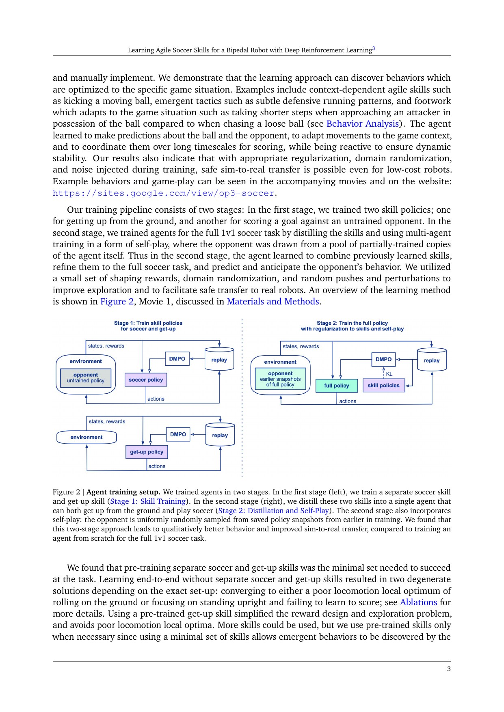
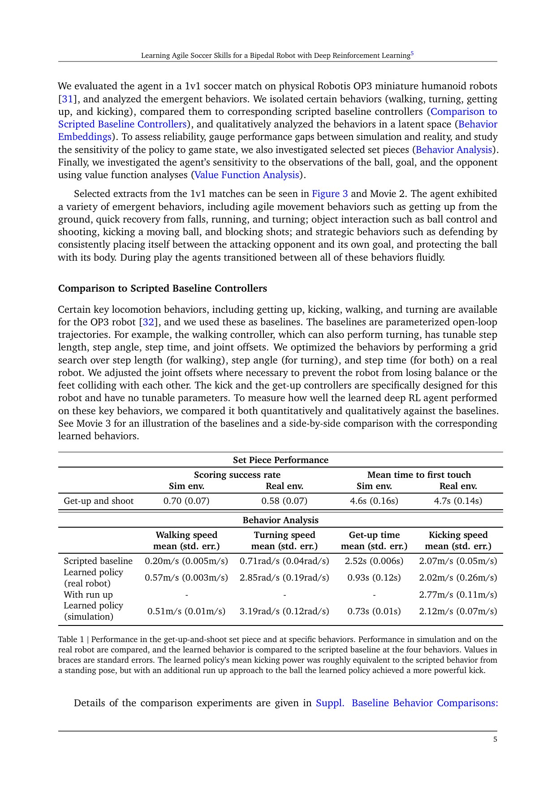
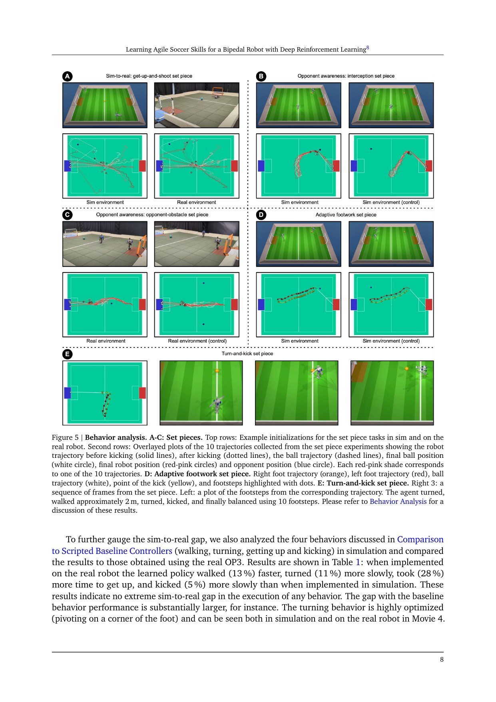
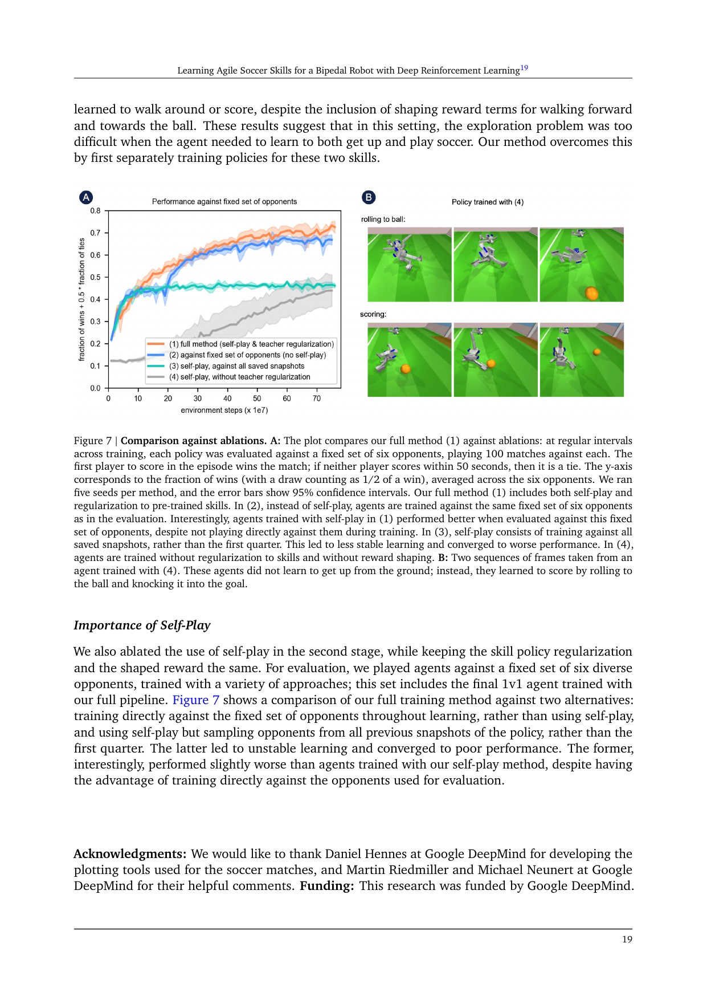
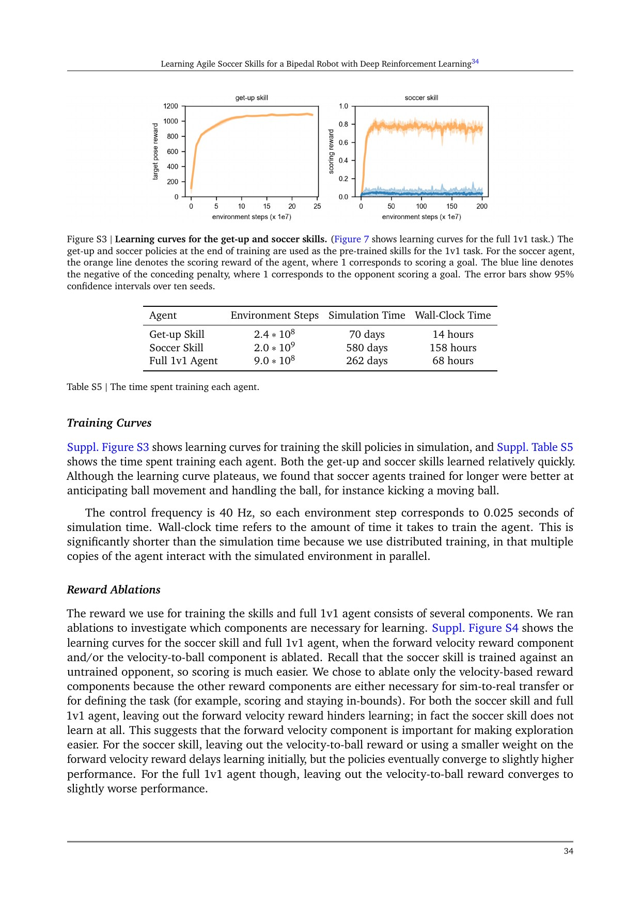

# Agile Soccer：小型人形如何把起身、移动、踢球与对抗策略合成一个真机策略

[English version](en/agile-soccer-2304.13653v2.md)

来源：[arXiv:2304.13653v2](https://arxiv.org/abs/2304.13653) · [Science Robotics DOI](https://doi.org/10.1126/scirobotics.adi8022) · [作者实验数据](https://doi.org/10.5281/zenodo.10793725)

解读范围：完整 38 页作者版本，包括正文、101 条参考文献和 Supplementary Materials。论文没有给出可唯一核验的官方训练代码；作者公开的是定量图表数据而不是控制栈，因此本文只做论文级复现规格，不虚构函数级映射。

> 一句话总结：论文先分别训练足球与起身技能，再用自适应多教师蒸馏、第一季度历史策略对手池和针对性 sim-to-real 随机化训练统一 1v1 策略，使 20 关节 Robotis OP3 在动作捕捉场地中零样本完成真机起身、奔跑、转向、踢球与基础对抗；证据扎实地支持“小型、受保护、外部全状态”的系统，却不支持无动捕、大尺寸人形或开放人机共域。

术语导航：分布式最大后验策略优化（Distributional Maximum a Posteriori Policy Optimization, DMPO）、技能蒸馏（skill distillation）、自适应教师正则（adaptive teacher regularization）、自博弈（self-play）、历史对手池（opponent pool）、域随机化（domain randomization）、零样本仿真到现实（zero-shot sim-to-real）、动作捕捉（motion capture, MoCap）、位置目标动作（joint-position target action）、受控定位球实验（set-piece experiment）和适用设计域（operational design domain, ODD）是理解结果边界的关键。

## 工程痛点

足球不是把行走器、起身器和踢球器依次调用就结束。机器人会在转身中失衡、在抢球时改变步幅、倒地后要判断球与对手的位置，还要在几十毫秒控制周期内平滑切换。手写有限状态机可以组合几个动作，却很难覆盖每个接触、速度和对手位置的连续变化；直接用一个稀疏进球奖励从零训练，又几乎遇不到足够多的“站起来—接近球—踢进门”完整轨迹。

论文报告了两个典型坏局部最优。只有稀疏任务奖励时，策略学会在地面滚动并偶然把球碰走；加入前进和靠近球的塑形奖励后，它能起身站立，却仍不会稳定进球。这个现象像要求一个从未学会站立的人只凭“比赛获胜”反馈练足球：终局信号太远，早期任何合理动作都难以被区分。

第二个难点是廉价硬件的仿真差异。OP3 只有 51 cm 高、3.5 kg，使用 20 个 XM430 舵机；执行器间隙、关节零位、低电量、控制延迟和跌落冲击会持续改变系统。论文甚至说明髋部逐渐松动、编码器失准会让性能恶化，需要定期维护。所谓 zero-shot transfer 不是“仿真足够真实”，而是位置闭环、随机化、扰动和保护结构共同遮蔽了一部分模型误差。

第三个难点是对抗训练的非平稳性。只和当前策略自博弈，双方会一起追逐暂时有效的漏洞，旧能力可能被遗忘；只和固定弱对手训练，策略又不会处理逐步增强的防守。工程上要同时解决技能探索、策略组合、对手课程和真机鲁棒性，而不是只选择一个更大的网络。

## 核心洞察

第一层洞察是把“技能获取”与“比赛整合”分开。Stage 1 独立训练足球技能和起身技能：前者对无训练对手进球，后者跟踪来自脚本起身控制器的三个关键姿态。Stage 2 从仰卧、俯卧与站立等概率初始化，用两个教师的 KL 正则帮助同一个学生跨过早期探索空白，同时让任务回报逐渐接管决策。

自适应正则不是永久模仿。学生在直立状态向足球教师靠近，在倒地状态向起身教师靠近；当对应 Q 值越过阈值，教师权重逐步降到零。可以把教师理解为学车时副驾的辅助刹车：最危险、最没有经验时介入，学员能够完成任务后必须松开，否则学生只能复制分离技能，学不出抢球时的短步、转身后连续踢球等新组合。

第二层洞察是只从训练前四分之一的历史快照采样对手，并混入未训练对手。早期对手随主策略一起增强，形成自然课程；限制在前四分之一又避免把训练后期大量相似或过强快照全部塞进池中。Figure 7 说明这不是装饰性设置：对全部快照采样的自博弈不稳定，而固定对手方案在评估对手上较早平台化。

第三层洞察是用高频位置接口而不是直接电流控制承接 sim-to-real。作者报告电流控制的零样本迁移失败；40 Hz 策略输出 20 维关节位置目标，经 `u_t = 0.8 u_{t-1} + 0.2 a_t` 指数滤波，再由仿真力矩 PD 或真机电压式 PID 跟踪。内环快速反馈像减震器，不能消除模型误差，却把高频执行器差异限制在策略较少直接接触的层级。

## 方法主线

环境使用 MuJoCo 与 DeepMind Control Suite，球场为 5 m × 4 m、球门宽 0.8 m。策略观测含 5 帧堆叠的关节位置、线加速度、角速度、重力方向和前一滤波动作；外部比赛状态含机器人速度、球、对手与两侧球门的相对位置和速度。actor 因而不是纯本体感知策略，更不是依赖板载视觉自主踢球的完整系统。

DMPO 使用前馈 Gaussian actor 和 categorical distribution critic。Supplementary Table S4 给出 critic 隐层 `(400, 400, 400, 300)`、51 atoms、support `[-150, 150]`、5-step return、折扣 0.99；actor 隐层 `(256, 256, 128)`，每状态采 20 个动作。经验回放为 `10^6`，batch 256，trajectory segment 48；策略与 critic 学习率均为 `10^-4`。这些数字定义了论文实现尺度，但代码未公开，不能证明独立实现的归一化、终止和并行采样完全一致。

Stage 1 足球情节在倒地、越界、进入禁区、对手得分或 50 秒时结束。Supplementary Table S3 中进球权重 1000，向前速度、朝球速度、避免干扰对手、直立与膝关节力矩项提供稠密信号。起身教师不是追踪整条脚本，而是从正面和背面起身轨迹各取三个关键姿态，目标平均每 1.5 秒按指数分布切换，这保留了到达姿态的多种动力学路径。

Stage 2 将技能蒸馏和比赛回报线性组合。对手从未训练策略及主策略训练前四分之一的历史快照均匀采样，critic 额外获得对手整数 ID。这个 privileged opponent ID 只在价值估计中出现，部署 actor 不需要它；不过外部 MoCap 比赛状态仍然是不可忽略的系统依赖。

仿真到真机前先做舵机辨识：文中近似参数为阻尼 1.084 Nm/(rad/s)、armature 0.045 kg·m²、摩擦 0.03、最大力矩 4.1 Nm、P gain 21.1 N/rad。随机化覆盖摩擦 0.5–1、关节偏置 ±2.9°、IMU 姿态 2°、位置 5 mm、躯干附加质量至 0.5 kg和 10–50 ms 观测延迟；训练还每 1–3 秒施加持续 0.05–0.15 秒的外部扰动。论文将扰动幅值写为 5–15 Nm，复现时应保留原单位并核查作者环境定义，不擅自解释为冲量。

真机由 14 台 OptiTrack PrimeX 22 相机经 VRPN/ROS 提供比赛状态。机器人加装躯干缓冲、3D 打印前臂、髋部载荷改件和动捕背心，场地铺橡胶砖。软件奖励限制膝部高力矩、直立姿态与动作范围；这些是降低损伤的组合措施，不是经认证的安全控制屏障。

## 关键图解

Figure 2 左侧是两个独立 replay/DMPO 技能环，右侧才是统一 1v1 学生。图中 KL 连接解释了知识如何进入学生，而 opponent earlier snapshots 解释了比赛难度如何增长。它支持“两阶段分工”这一机制，不说明任何教师权重或快照比例天然适合其他机器人。

Table 1 同时给出 set-piece 与四项隔离行为。真机 learned policy 为 0.57 m/s 行走、2.85 rad/s 转向、0.93 s 起身、2.02 m/s 原地踢球；脚本基线分别为 0.20、0.71、2.52 和 2.07。2.5 m 助跑时 learned policy 达 2.77 m/s。这里的 181%、302%、63% 与 34% 是相对脚本基线的特定测试，不是对所有经典控制器或更大人形的普遍优势。

Figure 5 用十条轨迹分别展示起身射门、拦截、绕开对手和步幅适应；转身踢球案例用 10 个脚步完成转身、约 2 m 行走、再转身、踢球和恢复平衡。它说明策略会对场景条件改变轨迹，但每个对抗 set piece 只有 10 次左右，不能据此推导一般“战术理解”。

Figure 7 是机制层最强证据：每个方法 5 个随机种子，定期对六类固定对手各打 100 场，并画 95% 置信区间。完整方法后期表现最高；从全部历史快照采对手出现不稳定，只用固定对手较早平台化；没有教师正则与奖励塑形时，策略退化为地面滚动碰球。曲线支持“课程和技能先验共同重要”，却没有分离教师正则与塑形奖励各自的独立贡献。

Supplementary Figure S3 和 Table S5 给出容易被演示视频隐藏的成本：起身技能 2.4×10^8 步、70 个仿真日、14 小时墙钟；足球技能 2.0×10^9 步、580 个仿真日、158 小时；完整 1v1 为 9.0×10^8 步、262 个仿真日、68 小时。并行训练把约 912 个仿真日压到 240 小时墙钟，但没有披露计算节点规格，不能直接换算个人设备预算。

## 最有说服力的实验

真机证据中最有说服力的是同初始化网格的 50 次仿真加 50 次真机 get-up-and-shoot：策略每次都起身并触球，真机 29/50（58%）进球，仿真 35/50（70%），第一次触球均值 4.7 s 与 4.6 s。它既有明确分母，也同时报告成功差距与时间一致性，比单条连续比赛视频更适合判断迁移。

Table 1 的行为测试为脚本与学习策略各 10 次，提供了速度、起身时间和标准误；但转向比较会重跑跌倒试验，learned policy 实际 13 次中跌倒 3 次才取得 10 个有效样本，而脚本连续 10 次保持直立。因此 302% 转向速度提高不能脱离失败处理规则解读。助跑踢球也没有等价脚本对照，只能说明学习策略能利用跑动蓄能。

机制证据则以 Figure 7 更强：5 seeds × 6 opponents × 100 matches 的周期评估比 10 次 set-piece 更能覆盖训练随机性。两组证据应合读——Figure 7 说明训练配方在仿真中稳定产生更强策略，50+50 与 Table 1 说明其中一份策略能在特定 OP3 系统上迁移；任一组都不能单独证明一般人形足球方案。

论文补充的视觉策略是独立、较小的探索。通过 NeRF 静态背景叠加 MuJoCo 动态物体并随机化球颜色，视觉 actor 在仿真 penalty set piece 10/10 进球，真机 6/10 进球、3 次击中门柱。critic 训练时仍拿到状态信息，策略网络沿用 NeRF2Real 配置；这个 10 次真机结果不足以把正文的 MoCap 全状态结论升级为可靠板载视觉足球。

## 论文—实现状态

截至本次锁定版本，论文未公开可唯一核验的官方训练代码、环境配置或部署控制栈；作者明确公开的是 Zenodo 图表数据集。Robotis OP3 基础软件和 MuJoCo/dm_control 是环境组件，不等于论文实现。因而无法对 DMPO、奖励、teacher-weight 调节、对手快照选择或硬件 PID 做至少两个符号的固定提交映射。

这意味着复现可以按 Supplementary Table S1–S5 重建合同，却不能声称与作者 bitwise 或 symbol-level 等价。未来若出现作者仓库，必须核对作者归属、论文引用关系、许可证和固定 40 位提交，再把“尚未公开”状态升级；同名第三方足球环境不能替代这条证据链。

## 适用边界与局限

作者明确列出的局限包括：依赖手工奖励、手工起身关键姿态和技能选择；只做仿真训练、没有真实数据；仅测试小型 OP3；MoCap 球跟踪易被遮挡；控制周期经常错过 25 ms；执行器模型理想化；电池状态敏感且实用运行常限于 5–10 分钟；髋部松动和编码器偏移需维护；self-play 不稳定；塑形权重经过大量调参。

作者也明确说明动作范围仍不能彻底避免自碰撞，训练奖励中的 knee-torque penalty 和 upright reward 只是鼓励项。机器人存在结构脆弱性，论文使用缓冲件、改装手臂、软地面与维护来降低测试损伤。所谓“safe movements”是实验观察，不是功能安全认证，也没有系统报告所有碰撞、摔倒或硬件更换次数。

独立工程判断一：ODD 极窄——固定尺寸球场、两台同型 51 cm OP3、外部 14 相机 MoCap、已知球门、简化 1v1 规则、软地面和实验人员维护。质量、惯量、跌落能量随尺寸非线性增长，不能把小型机器人可承受的滚地起身和高速转向直接移植到成人尺寸平台。

独立工程判断二：策略观测依赖完整对手和球的相对状态，实际比赛的板载视觉会引入遮挡、相机运动、时钟漂移、识别延迟和不确定性。Supplementary Figure S7 的 6/10 只证明一个受控视觉 set piece 有初步可行性，没有覆盖对抗、连续跌倒恢复或长局比赛。

独立工程判断三：奖励消融并不完全正交。Figure 7 的最弱方案同时去掉技能正则与奖励塑形，因此无法量化谁贡献更多；Figure S4 只消融两类速度奖励。复现若更换 PPO、SAC 或更现代并行仿真，应保留阶段和失败统计，不能因总回报相似就认为机制复现成功。

## 可执行但有边界的结论

可复用的核心不是“用 RL 踢足球”，而是四个工程合同：先训练最小必要技能；用状态条件教师正则让学生进入可学习区，再逐步退出；用受控历史对手池形成课程；在位置接口外显式随机化关节偏置、延迟、摩擦、载荷与扰动。每个合同都应有单独消融和失败记录。

对于 WBC 项目，这篇论文适合作为“恢复—任务不中断”的系统锚点。起身不应只是独立 demo，而应在起身后继续感知球和对手、恢复任务目标；反过来，比赛策略也要在跌倒状态切换到低能量、可恢复动作。这个思想可迁移到搬运或巡检，但教师选择、终止条件和安全监督必须按任务重做。

硬件上线前必须把策略、快速关节内环与独立安全层分开。仿真策略输出先经过机器人特定的关节范围、速度、力矩/电流、温度和姿态监控；通信或 MoCap 超时进入确定的低能量状态；保护架、软地面、急停与安全员在逐级验收中不可省略。论文参数是实验记录，不是可直接下发的安全限值。

## 复现与验收清单

第一阶段冻结环境合同：记录 OP3 URDF/接触几何、5×4 m 场地、球参数、40 Hz actor、控制内环、动作滤波、全部观测帧与时钟。对每个 episode 保存终止原因，尤其区分倒地、越界、禁区、对手进球和超时；只比较总回报会隐藏靠滚地碰球的坏策略。

第二阶段单独复现起身与足球教师。起身需覆盖正面、背面和关键姿态切换的随机性，并报告达到 36 cm 肩部高度的时间、失败与动作峰值；足球技能要报告进球、触球、倒地和朝球探索。教师自身未达到稳定阈值时，不应进入蒸馏。

第三阶段记录自适应正则的每个状态变量：upright/fallen 门、两个教师的 Q 阈值、KL 权重、下降过程和教师分歧。分别运行“永久教师”“固定退火”“自适应退出”和“无教师”对照，验证新策略能力来自学生优化而不是教师一直接管。

第四阶段冻结对手池抽样。重现未训练对手、第一季度历史快照、全部历史快照和六个固定对手方案；每方法至少 5 seeds，每轮对每个固定对手跑 100 场，保留 95% 区间和循环退化案例。快照按训练步而非文件顺序确定，避免重启训练改变“第一季度”的语义。

第五阶段把 sim-to-real 拆成系统辨识、随机化和外扰三组消融。论文已给出“无随机化/扰动时真机每 1–2 步跌倒且无法进球”的关键负结果；复现应进一步分别移除延迟、零位、摩擦、附加质量和扰动，报告哪一项修复了哪类失败。

第六阶段按 Table 1 的原协议复现隔离行为，并公开失败重跑规则。行走测第 2–7 秒距离；转向测 ±45° 到 ±135°；起身用肩部 36 cm 阈值；踢球以首次接触后 0.2 秒路程算球速。跌倒必须进入分母，不能只保留十条成功轨迹。

第七阶段运行相同网格的 50 仿真 + 50 真机 get-up-and-shoot，报告起身、触球、进球、首次触球时间与完整分布。额外按电池电压、舵机温度、髋部间隙和零位校准分层，检查 58% 成功率是否依赖刚维护的单一状态。

第八阶段才尝试视觉替换。先离线比较 MoCap 真值、视觉估计和策略实际输入，再在静态球、滚动球、对手遮挡和跌倒相机运动下逐级测试。critic 的 privileged state、NeRF 背景和离线 replay 都要单独说明；视觉 6/10 不可与正文 MoCap 50 次结果合并。

第九阶段建立硬件停止条件：连续控制周期超时、MoCap/IMU 丢失、姿态越界、温度/电流过限、保护区有人、机器人离开软地面或结构件松动时立即停机。每 5–10 分钟窗口检查电池与机械零位，记录跌倒次数、碰撞位置、急停和更换零件，而不只保存成功进球视频。

> **金句**：能把技能合进一个策略的是蒸馏与课程；能让它进入真机的，是被逐项审计的位置内环、随机化和安全边界。
