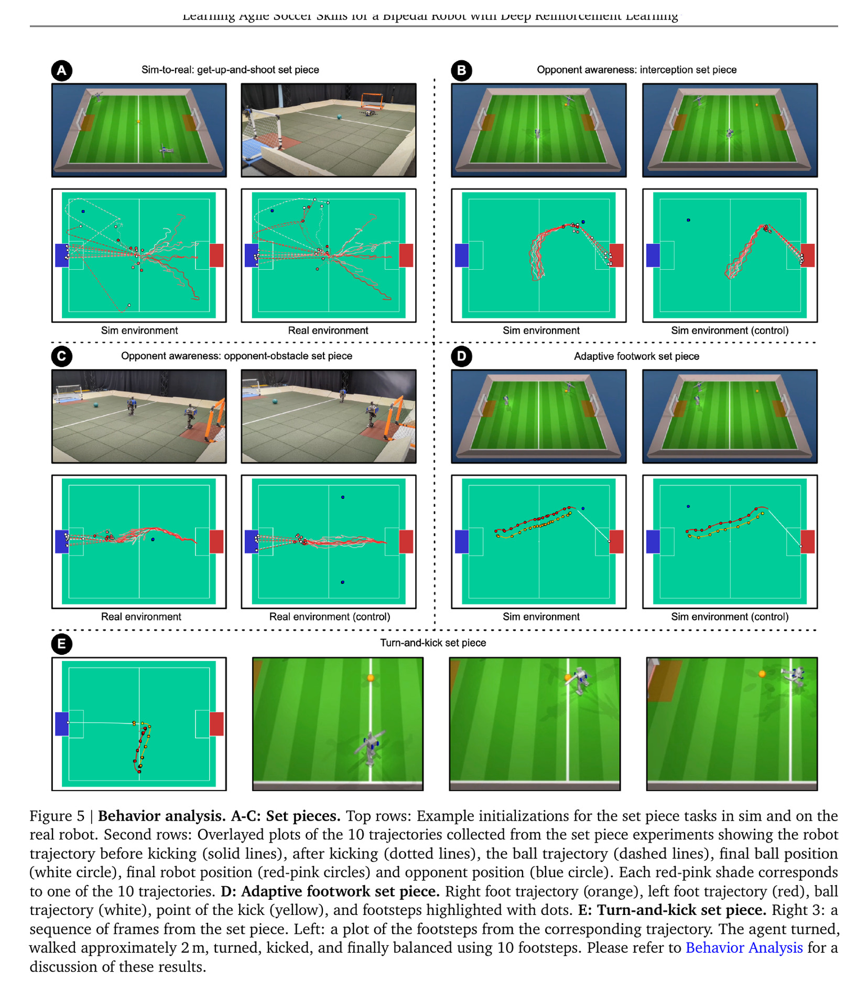
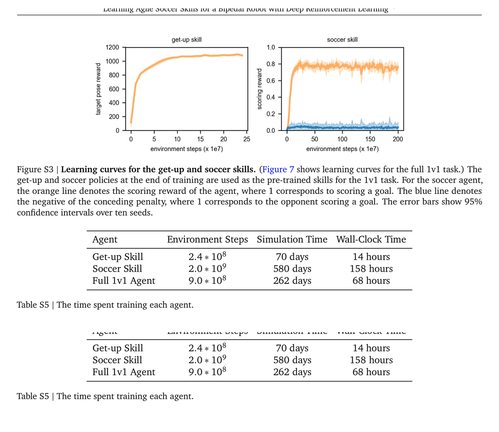

# 双足机器人足球：为什么先学起身和足球技能，再用自博弈组合

[English version](en/agile-soccer-2304.13653v2.md)

来源：[arXiv:2304.13653v2](https://arxiv.org/abs/2304.13653v2) · [官方项目页](https://sites.google.com/view/op3-soccer)

公开实现状态：截至本次审计，作者官方训练/部署代码尚未公开，未发现可锁定的软件仓库；论文关联数据集与视频不能替代策略实现。因此本文只依据论文与项目页给出事实，不提供伪造的代码映射。

> 一句话结论：作者先分别训练足球技能和起身技能，再把正确教师按状态蒸馏进统一 1v1 策略，并用历史快照自博弈学习对抗；高频控制、针对性随机化、扰动和行为正则使策略零样本部署到 OP3。有效的是分阶段探索与硬件闭环，不是“端到端自博弈自然会学会一切”。

术语导航：技能预训练（skill pretraining）、策略蒸馏（policy distillation）、自博弈（self-play）、教师正则（teacher regularization）、动力学随机化（dynamics randomization）、随机扰动（random perturbation）、行为正则（behavior regularization）、零样本迁移（zero-shot transfer）、起身策略（get-up policy）、运动捕捉定位（motion-capture localization）。

## 工程痛点

1v1 足球同时要求行走、转向、踢球、倒地恢复、追球、拦截和对手策略。若从稀疏进球奖励直接训练，早期机器人经常倒地，根本没有机会探索带球和射门；若把每个技能做成手写状态机，切换又僵硬，难以根据球和对手连续调整。

小型 OP3 还具有脆弱齿轮、有限驱动与控制延迟。仿真中“更快”的策略可能用现实电机做不到的高频动作或膝部冲击。论文的系统价值是把技能课程、策略组合、对抗课程和 sim-to-real 保护同时设计，而不是把所有问题归给一个 RL 算法。

## 方法主线：两阶段训练

第一阶段分别训练 soccer skill 与 get-up skill。足球技能在站立状态学习接近球、得分与基本移动；起身技能以手写关键姿态为课程，从不同倒地姿态回到站立。作者发现这两个是成功所需的最小预训练集：完全端到端会学到趴地不动或低效局部最优。

第二阶段训练单一 1v1 agent。当前站立时用 soccer teacher，倒地时用 get-up teacher，通过 KL 正则让学生靠近对应教师；同时学生继续优化游戏回报。教师权重随学生预测 Q 值相对教师表现自适应下降，使学生能超过教师并学习技能间的连续过渡，而不是永久复制固定动作。

状态路由本身必须可测试：倾倒角、躯干高度和接触条件怎样判定“站立/倒地”，边界处是否会频繁切换教师。虽然教师只在训练中提供正则，错误路由仍会给学生相反监督。应保存每批状态的教师选择比例和 KL 损失，检查起身后是否及时转回足球技能、被撞瞬间是否误判。

对手从训练历史策略快照池中采样，形成 self-play curriculum。只对当前最新自己训练容易循环或忘记；使用历史池让策略面对不同强度与风格。论文也报告自博弈训练并非完全稳定，池构成和采样是训练系统的一部分。

历史池像保存软件回归测试：新版本不仅要打赢另一个新版本，还不能重新输给旧漏洞。若只看总体平均胜率，策略可能专门克制常见对手却被某一旧策略稳定击败；因此要查看完整策略×对手矩阵，并按防守、追球、起身后丢球等失败类型切分。

实机接口 40 Hz，策略输出关节目标，再经指数动作滤波与位置伺服执行。作者尝试直接电流控制但零样本迁移失败，最终选择高频稳定反馈的关节位置接口。这是关键负面事实：理论上更直接的力矩/电流动作，不一定在低成本硬件模型误差下更易迁移。

随机化并非“全参数越宽越好”。作者针对少数系统辨识轴、观测 10–50 ms 随机延迟，并加入推扰；过度随机化会得到保守策略。为减少硬件损伤，又加入膝力矩惩罚和躯干倾角阈值内保持直立的奖励。足球回报与硬件行为约束共同决定最终动作。

## 关键图解

Figure 2 左侧是两个独立技能，右侧学生一边接受状态相关教师正则，一边与历史对手自博弈。图证明不是用手写层级在运行时切换两个策略：最终是单策略，教师只塑造训练早期分布，之后学生可以调整技能和过渡。

Table 1 报告学习策略相对脚本基线：行走快 181%、转向快 302%、起身时间少 63%、踢球速度快 34%；真实踢球均速 2.8 m/s。get-up-and-shoot 50 次实机进球 29 次（58%），仿真 35/50（70%）。这些数字同时展示优势与 sim-to-real 落差，不能只摘百分比改写为稳定成功。

Figure 5 把起身射门、拦截、绕障、自适应步幅和转身踢球放在仿真与真实场景中对照。该图说明统一策略学到的不只是单一踢球轨迹，但这些精选轨迹不等于全部测试分母。

Figure 7 比较完整方法、不同对手池、无技能正则/塑形等设置。无预训练正则时，稀疏回报策略出现躺地或用腿偶然推球的退化行为；自博弈历史池在固定六个对手评测上仍更好。它说明课程解决的是探索与行为先验，不只是提高最终网络容量。

Figure S3 显示起身与足球技能的学习曲线；Table S5 把环境步数、仿真时间和墙钟时间分开。起身技能约用 2.4×10⁸ 环境步、70 仿真天与 14 墙钟小时；足球技能约用 2.0×10⁹ 步、580 仿真天与 158 小时。这些数字依赖论文的分布式并行设置，不是换一台机器后仍成立的通用训练时间。

## 最有说服力的实验

Table 1 的实机量化比精彩比赛视频更有价值，因为有明确脚本基线、仿真/现实对照和固定次数。尤其 58% 对 70% 的 set piece 成功率保留了失败，说明零样本迁移并未抹平差距。对新平台应复制这种分行为测量，再做完整比赛。

direct current control 迁移失败、高频位置反馈成功，是另一个决定性工程结论。它不证明位置控制永远优于力矩控制，而是说明动作接口必须与可辨识模型、硬件低层环和通信频率匹配。控制抽象选错，更多策略训练无法补偿执行器未建模动态。

40 Hz 只是策略步频，电机内部伺服和通信实现仍决定实际闭环带宽。复现应测命令时间戳到编码器响应的频响/延迟分布，并把动作滤波相位滞后计入仿真。若只把 nominal 40 Hz 写进配置，随机延迟和内部位置环差异会在快速转向、踢球和起身触地时集中暴露。

作者的消融还表明域随机化与推扰缺失时零样本迁移失败，膝力矩/直立正则减少前倾摔倒与齿轮损伤。这些结果支持“训练奖励包含硬件保护代理指标”，但代理奖励不是正式安全约束，阈值和电机能力仍是 OP3 专用。

## 论文—实现状态

官方代码尚未公开，无法核验网络、环境、驱动和部署状态机的具体符号。依据论文，独立实现至少应拆为：`SoccerSkillTrainer`、`GetUpSkillTrainer`、`StateRoutedDistillation`、`SnapshotOpponentPool`、`SimToRealRandomizer`、`ActionFilter` 与硬件 `OP3Driver`。这些名称是审计接口，不是作者源码。

数据契约要显式保存球/对手/机器人状态来源。论文实机全状态任务使用 mocap 定位，不能简化为“机器人自主视觉踢球”。补充视觉实验使用 NeRF/视觉策略属于独立设置；首页代表作解读应避免把两条感知管线合并。

复现若只实现 self-play 而没有两类教师、历史池和硬件正则，不是论文等价基线。应给每个阶段独立 checkpoint、成功分布和冻结教师版本，记录学生何时降低教师权重，才能判断退化来自技能本身还是组合阶段。

## 适用边界与局限

作者承认需要领域知识设计起身关键姿态、奖励和随机化，教师选择由人工状态规则决定；不使用真实数据做迁移；自博弈可能不稳定；若干辅助奖励通过大量超参数搜索确定。它不是无人工先验的通用端到端方案。

独立工程判断是：OP3 是 20 个驱动关节的小型机器人，地面铺橡胶垫并加躯干 3D 打印护罩，比赛环境有边界坡道让球返回。全尺寸人形的动能、跌倒损伤和接触力完全不同，策略结构可参考，动作幅度和安全证据不可外推。

感知也限定了任务难度。mocap 提供全局机器人、球和对手状态，避免了视觉遮挡、检测延迟与相机标定误差。若换成本体相机，问题会多出部分可观测性和跟踪丢失；应先用记录的 mocap 状态注入噪声/延迟建立上界，再逐步替换感知，而不是把控制与视觉同时重训后无法定位失败。

论文“safe movement”主要由行为正则、低成本平台与实验保护支持，不是形式化安全证明。对手碰撞、人员进入场地、mocap 丢失、球卡住和通信超时需要独立状态机；RL 策略不应成为唯一保护层。

## 可执行但有边界的结论

复杂动态任务从零训练卡住时，优先找阻断探索的最小技能集，而不是预训练所有可能动作。这里起身保证倒地后能继续，足球技能保证早期能接触回报；统一策略再学习何时以及怎样过渡。这个原则比“足球”任务本身更可复用。

自博弈应与固定评测池分离。训练池提供课程，评测池保存不同版本/策略的冻结对手；每次更新报告胜率矩阵，而不是只对最新自己。像考试题库不能只包含昨天做过的题，对手池也不能随训练一起遗忘。

## 复现与验收清单

保存两个教师、蒸馏路由规则、权重退火、对手池快照、奖励分量、动作接口/滤波、控制与观测延迟、随机化和保护项。先复现 walk/turn/get-up/kick 四项 Table 1 风格基准，再做 50 次 set piece 和固定对手胜率；报告均值、方差、失败类型与硬件干预次数。

训练预算也要分阶段记账：教师各自样本数、蒸馏期、停止教师正则的条件、自博弈对手更新频率和总环境步数。若只报最终 1v1 步数，会把大量技能预训练成本隐藏起来，使“端到端效率”无法与其他方法公平比较。

实机必须使用平台专用关节/速度/电流/温度限制、物理急停、隔离场、护罩与逐级动作幅值。全尺寸机器人还需吊架/防坠和接触风险评审。本文不提供可直接执行的 OP3 或其他机器人参数，比赛视频不能代替安全验收。

发布结果时应同时给出未经剪辑的失败回合、人工扶起/更换零件次数和每小时干预率。精彩片段只能说明行为存在，连续统计才能说明系统可用；两类证据都保留，读者才能判断策略是稳定能力还是偶发成功。

比赛回归测试还要固定球的初始位置、对手快照、摩擦条件与倒地姿态，否则每次对局的难度分布不同，胜率无法归因到策略更新。这也是论文中固定技能测量和自博弈对局应同时保留的原因：前者定位基础能力，后者检查组合后的策略适应。

> **工程判断**：分阶段训练的价值，是先让策略有机会进入“能踢球的状态分布”，再让统一策略与对手学习超越教师，而不是永久堆叠技能状态机。
