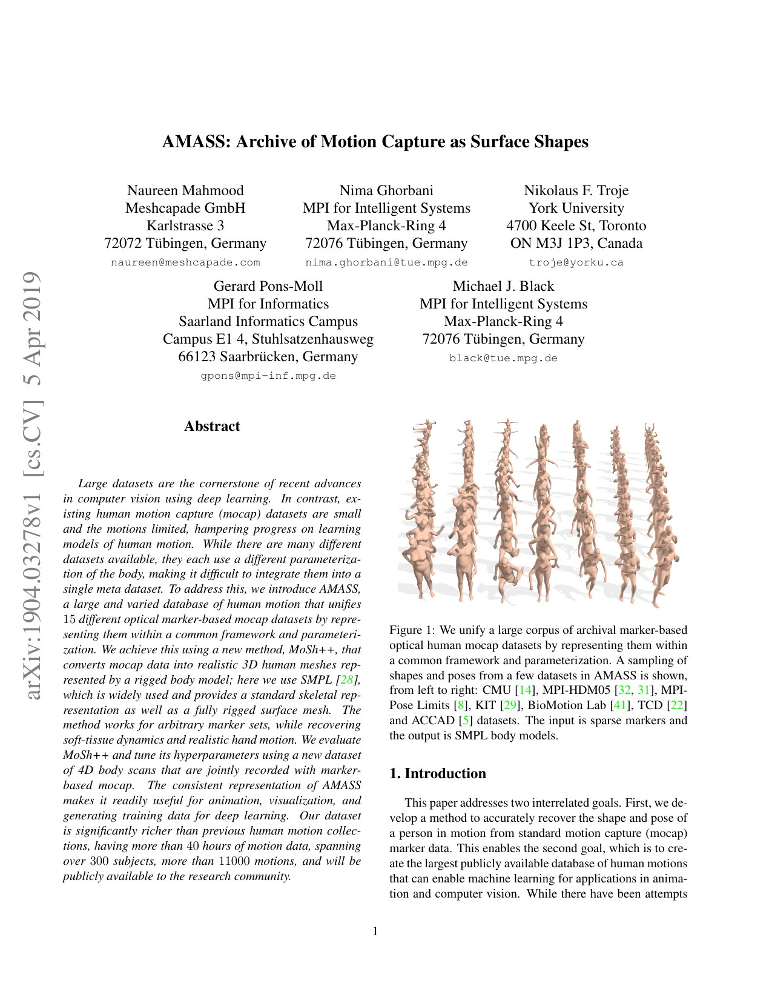
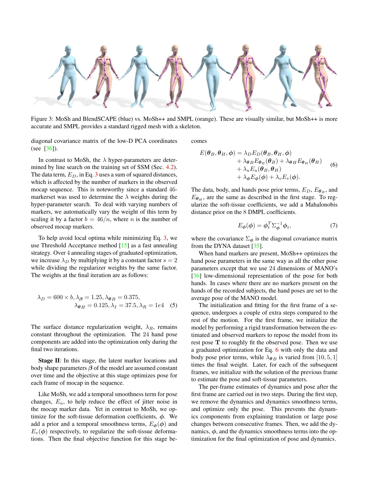
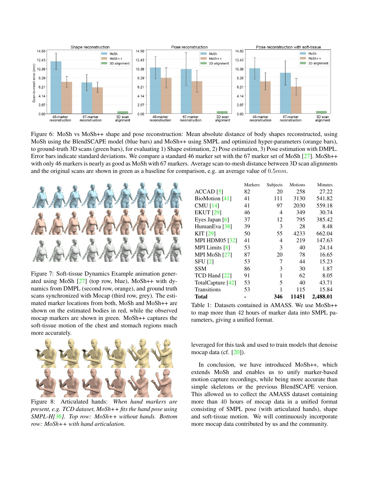
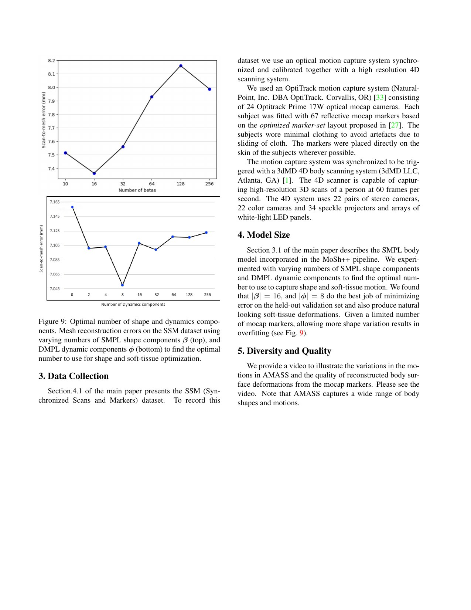

# AMASS：统一动作数据不是“拼文件夹”，而是把 marker 观测变成可复用的身体表面表示

[English version](en/amass-1904.03278.md)

来源：[arXiv:1904.03278](https://arxiv.org/abs/1904.03278) · [固定提交的官方代码](https://github.com/nghorbani/amass/tree/a9888a92a4e62533454aa43e5f979d9a8bc8c893)

解读范围：完整 12 页论文、补充实验与官方 AMASS 数据准备/SMPL-H 可视化代码。论文中的 AMASS 是人体动作数据基础设施，不是直接部署到机器人上的控制器。

> 一句话总结：AMASS 用 MoSh++ 将 15 个 marker 数量、布局和骨架格式各异的动捕库统一拟合为 SMPL-H+DMPL，得到 42 小时、346 人、11,451 段动作；它解决表示一致性，却没有自动解决机器人可行性、接触、许可和实时处理。

术语导航：光学动作捕捉（optical motion capture）、表面形状（surface shape）、潜在 marker（latent marker）、人体参数模型（parametric body model）、软组织动力学（soft-tissue dynamics）、形状参数（shape coefficients）、姿态参数（pose parameters）、动作重定向（motion retargeting）与运动学可行性（kinematic feasibility）。

## 工程痛点

不同 mocap 数据库像来自不同工厂的螺丝：都记录“人体在动”，但 marker 数量可能从 37 到 91，命名、骨架、采样率、人体形状和坐标习惯都不一致。直接拼接只能得到更大的文件夹，模型会把采集系统差异误学成动作差异。WBC 数据管线真正需要的是同一个身体参数空间。

传统 MoSh 从稀疏 marker 估计人体形状和姿态，但旧 BlendSCAPE 表面、固定 marker 权重和弱软组织模型限制了精度。AMASS 的问题可理解为“用同一把三维尺重新测量所有旧档案”：既要推断每个人不变的体型和 marker 在皮肤上的潜在位置，也要逐帧解释关节姿态、根平移和软组织晃动。

机器人使用者还面对第二层误区：SMPL-H 动作在人形几何上自然，不代表在某台 G1、H1 或 Atlas 上可跟踪。人体没有相同关节限位、执行器带宽、足底、质量分布与自碰撞模型。AMASS 是数据“共同语言”，不是机器人动作的合格证。

## 核心洞察

MoSh++ 把优化拆为两个时间尺度。Stage I 从一段序列随机选 12 帧，联合估计主体形状、潜在 marker 位置和姿态；Stage II 固定这些序列级变量，再逐帧估计姿态、根平移和 DMPL 动态系数。它像先校准相机和量尺，再批量测每一帧，避免每帧都重新发明一个身体。

数据项用 SMPL-H 表示：52 个关节，姿态含根旋转共 159 维，16 个 shape 参数描述静态体型，8 个 DMPL 参数描述软组织动态，另有全局平移。统一表面模型让原始 marker 数量不同的数据库输出相同字段，也让手部 marker 存在时保留关节手姿。

缺失 marker 不是简单补零。论文让数据项权重随可见 marker 数变化，并在多个 marker 同时缺失时提高姿态先验，最坏可放大到 3.5 倍。这个设计好比证人变少时提高常识先验的权重：能防止解发散，却也可能把罕见真实姿态拉向训练先验。

## 方法主线

输入是每帧的三维 marker 位置及其标签。Stage I 的目标同时包含 marker 重投影误差、形状先验、姿态先验、手姿先验和表面距离正则；Stage II 增加时间平滑、速度一致性与 DMPL 先验。Figure 3 与 Equation 5–7 展示了 SMPL/DMPL 项如何进入目标。

作者新采集 SSM（Synchronized Scans and Markers）作为校准集：光学 marker 与高分辨率 4D 扫描同步，从扫描表面提供近似真值。三个受试者、30 段动作分别用于搜索超参数与留出评估，避免只在原有 mocap marker 上“自证精度”。

最终汇总 15 个数据集。论文对错标、交换和缺失 marker 做人工检查、修正或剔除，再输出统一 npz。这个人工环节很关键：表示统一并不意味着原始错误自动消失；没有 provenance 和异常列表的大规模动作库仍会把坏帧扩散到策略训练。

## 关键图解

Figure 1 直观展示同一个 SMPL 身体如何承接 CMU、MPI、BioMotionLab、TCD 和 ACCAD 等不同 marker 布局。输入仍是稀疏 marker，输出变成带骨架的表面序列。图的价值是“统一表示”，不应解读为已消除数据域偏差。

Figure 3 比较旧 MoSh/BlendSCAPE 与 MoSh++/SMPL。视觉差异不夸张，但标准骨架、手部和更准确表面让后续学习能跨库复用。右侧 Equation 6–7 同时提醒：结果由数据项和多个先验共同决定，并非纯几何反演。

Figure 6 报告形状从旧 MoSh 的 12.1 mm 降到 7.4 mm，姿态无动态项从 10.5 mm 降到 8.1 mm；加入动态后约从 10.24 mm 降到 7.3 mm。Figure 7–8 给出软组织和手部定性结果，Table 1 汇总 346 人、11,451 段、2,488 分钟。手部没有独立真值，不能把图像自然直接当作毫米级证据。

Figure 9 用 SSM 验证集选择 16 个 shape 与 8 个 DMPL 分量。曲线说明“维度更多”会过拟合；这一选择绑定 SSM 的 marker 布局与三名受试者，机器人任务若只关心骨架和接触，不应机械照搬全部维度。

## 最有说服力的实验

最强证据是同步 4D 扫描留出集上的 scan-to-mesh 误差，而不是数据规模。MoSh++ 用 46 个 marker 已接近旧 MoSh 使用 67 个 marker 的结果，并在形状、姿态和软组织项上稳定降低误差。这说明改进来自模型与优化，而不只是更密集观测。

数据规模仍有价值，但 42 小时横跨多种许可、采样率和动作分布。对机器人训练，更应报告每条序列通过重定向、接触修复和闭环跟踪后的保留率，而不是只引用 AMASS 总小时数。

## 论文—代码映射

固定提交 `a9888a92a4e62533454aa43e5f979d9a8bc8c893` 中，`src/amass/data/prepare_data.py::dump_amass2pytroch` 读取各数据集 `*_poses.npz`，提取 `poses`、`dmpls`、`trans`、`betas` 与 `gender`；`AMASS_Augment.fetch_data` 将 axis-angle 姿态转换成旋转矩阵字段，对应统一训练输入。

`src/amass/tools/make_teaser_image.py` 将根旋转、body pose、hand pose、betas 与 DMPL 送入 `BodyModel` 并渲染表面。公开仓库提供消费和可视化工具，不含完整 MoSh++ 优化实现；模型与数据下载还受单独许可约束。因此“代码公开”不能理解为任意用途、端到端重拟合都无门槛。

## 局限与工程判断

作者明确指出 MoSh++ 当前不是实时系统，附录给出的 Stage I 每序列约 25 分钟，Stage II 无动态约 0.5 秒/帧、含动态约 2 秒/帧；面部未建模，手部评估缺真值，marker 缺失仍需更好处理。数据集源许可也不完全相同。

独立工程局限包括：SSM 只有三名受试者，扫描误差不等于机器人跟踪误差；人体脚与地面接触没有形成可靠力学标签；动作中可能含脚滑、自碰撞或机器人不可达速度；shape 与 DMPL 对 WBC 状态并不总是必要，反而可能增加转换错误。

硬件安全边界是绝不能把 AMASS 关节序列直接发送给机器人。必须经过形态拟合、关节限位、自碰撞、足底接触、速度/加速度/力矩检查和仿真闭环筛选，再用低增益、系留、急停与温度/电流监测逐步上线。

## 可执行但有边界的结论

AMASS 最适合充当上游“规范化人体动作层”。先保留原始数据集、主体、序列、帧率、许可和转换版本，再派生机器人关节、接触与可行性标签。不要覆盖原始表示，也不要把一个布尔 `valid` 混合几何、动力学和安全三类判定。

对 WBC Handbook，AMASS 的核心经验是数据量必须与转化率一起看：多少动作能重定向，多少能由特权策略跟踪，多少在域随机化后仍稳定，多少经过硬件安全检查。统一表示只完成第一关。

## 复现与验收清单

固定 AMASS、SMPL-H、DMPL、human_body_prior 与代码提交，记录每个源数据集的许可证、帧率、marker 布局和哈希。随机抽样可视化根姿态、手、平移与软组织，检查坐标轴、单位和性别模型。对读取失败、NaN、极端速度和错标保留显式清单。

用公开样例验证 `poses` 切片：根旋转前三维、body pose、hand pose、16 个 betas、8 个 DMPL 与 `trans` 的维度。建立往返测试，确认 axis-angle 转矩阵再转回时误差和旋转约定一致；不要默默截断不同版本的姿态长度。

进入机器人管线后，按动作类别报告逆运动学残差、关节限位率、自碰撞率、足滑、接触切换与策略跟踪成功率。训练/验证/测试按主体与原始序列隔离，避免同一动作的相邻帧泄漏。最后只在通过仿真扰动与安全阈值的子集上做系留真机验收。

## 进一步工程审计

数据统一还需要区分“序列级常量”和“帧级变量”。同一主体的体型、性别模型与潜在标记点位置应在整段动作内保持一致；若下游预处理把每帧体型重新归一化，就会人为制造肢段长度抖动。验收时可对每段序列统计骨长方差、根平移连续性与旋转跳变，任何异常都应回溯到源文件和转换版本，而不是在训练时用平滑器悄悄抹去。

帧率转换是另一个常被低估的错误源。不同数据库的原始采样率不同，下游策略又可能固定在五十赫兹或更低频率。简单按索引抽帧会改变速度和接触时间，尤其会让跑跳动作的腾空期丢失。正确流程应先读取原始时间戳，在连续旋转表示上插值，再重新计算速度与加速度；足接触不能仅用重采样后脚高阈值推断，还要结合足速和持续时间迟滞。

数据切分必须追踪动作血缘。一个长片段被切成多个窗口后，不能把相邻窗口分到训练与测试；同一受试者重复表演同一动作也可能造成身份和场景泄漏。建议以原始数据集、主体、录制序列三级键生成不可变分组，再为每次实验保存分组哈希。只有这样，测试误差才反映未见动作或未见主体，而不是记住相邻帧。

许可同样是技术契约的一部分。官方工具代码、人体模型和十五个源动作库不一定使用同一授权，能下载不等于能重新分发。仓库应只保存转换说明、哈希、来源和必要的小型合规样例，不把受限动作打包进公开发行物；商业使用前还需逐项确认人体模型、数据源和衍生权利。数据管线若不能回答某一帧来自哪里，就无法可靠处理撤回或许可证变化。

面向机器人时，建议保留三套并行表示：人体表面用于视觉和语义，机器人关节用于控制，接触与动力学派生量用于安全。三者通过稳定序列编号关联，但不互相覆盖。这样在机器人模型、足底几何或接触算法更新后，可以从同一人体源重新生成派生数据，并比较转换前后的保留率、滑移率和跟踪误差，避免把旧模型假设固化进所谓标准数据。

最终质量报表不应只有总帧数。至少按数据源和动作类别给出有效时长、缺失标记比例、拟合表面误差、速度异常、接触修复、机器人重定向成功与策略闭环成功。对高动态长尾动作单独列出，因为平均误差很容易被大量站立和缓慢行走稀释。只有这条逐层可追踪漏斗，才能说明新增数据是否真的增加了可用控制经验。

> **工程判断**：AMASS 把异构人体动作变成同一种语言；把这门语言翻译成某台人形机器人能安全执行的动作，仍是另一套完整工程。
