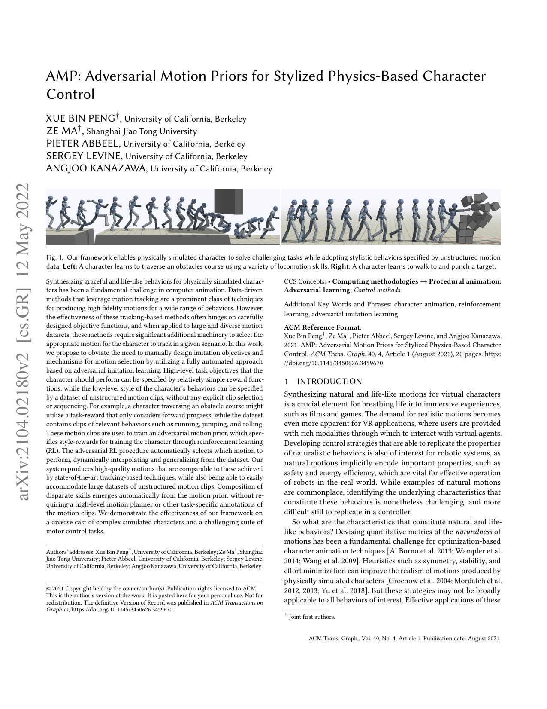
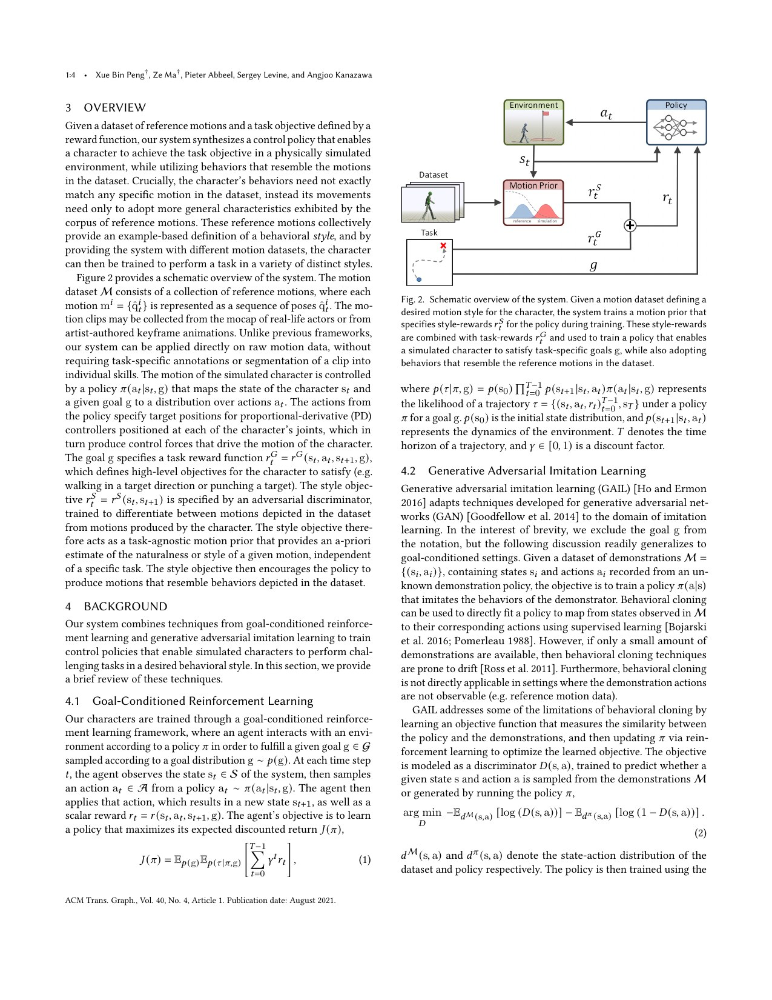
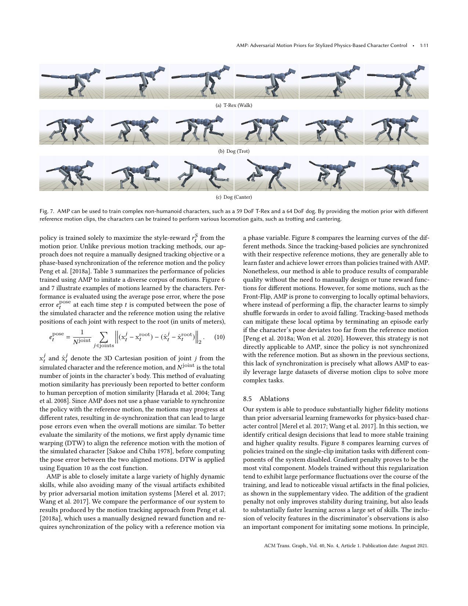

# AMP：用动作分布学习 style reward，而不是逐片段追踪或手写“自然度”

[English version](en/amp-2104.02180.md)

来源：[arXiv:2104.02180](https://arxiv.org/abs/2104.02180) · [固定提交的官方实现](https://github.com/isaac-sim/IsaacGymEnvs/tree/aeed298638a1f7b5421b38f5f3cc2d1079b6d9c3)

解读范围：完整 20 页论文及所有附录任务奖励、超参数、消融与官方 IsaacGymEnvs AMP 代码。论文对象是模拟角色；现代人形机器人工作借鉴 AMP，不等于本文做了真实硬件实验。

> 一句话总结：AMP 用判别器比较策略状态转移与未标注动作库，产生与 task reward 解耦的 style reward，使策略自动选择并组合数据中的动作完成导航、运球和击打；它降低逐片段 reward 工程，却仍会 mode collapse、依赖数据覆盖并需为每个策略重新训练 prior。

术语导航：对抗运动先验（adversarial motion prior）、风格奖励（style reward）、任务奖励（task reward）、生成对抗模仿学习（generative adversarial imitation learning）、状态转移（state transition）、判别器（discriminator）、梯度惩罚（gradient penalty）、回放缓冲区（replay buffer）、模式坍塌（mode collapse）与占用分布（occupancy distribution）。

## 工程痛点

DeepMimic 需要为每个 reference clip 计算 phase-aligned pose error。动作库变大后，逐片段选择、对齐和 reward 权重成为瓶颈；“自然”“像人”又难写成可泛化公式。AMP 要解决的是：只给无动作标签的 motion clips，能否自动学到一个可用于不同 task 的风格判据。

任务奖励与动作先验必须解耦。导航 reward 只关心到目标，数据集却可能包含 walk、run、jump、roll；策略应根据障碍和速度自己选动作，而不是由工程师标注每段何时使用。它像给演员一本风格样片和一个舞台目标，而不是规定每一拍照着哪段录像演。

对抗学习本身不稳定。判别器过强会给策略近乎零梯度，过弱会把不自然动作判真；策略分布不断变化还会忘记旧失败。因而梯度惩罚、policy replay、reference state initialization 和 early termination 不是附属技巧，而是可训练性的核心。

## 核心洞察

AMP 的 style objective 不要求策略匹配某条 clip，只要求策略产生的局部状态转移与数据分布难以区分。判别器特征包含 root 线/角速度、关节旋转/速度和末端相对位置，并转换到角色局部坐标，减少全局位置与朝向干扰。

高层 task reward `r^G` 与 style reward `r^S` 加权相加，常用权重各 0.5。判别器以 demonstration 为正、policy 为负，论文使用 least-squares 形式并构造有界 style reward；官方后续实现使用等价目的的 log-probability 形式，页面必须区分论文公式与代码版本。

梯度惩罚只在真实动作样本附近限制判别器梯度，避免决策面过陡；replay buffer 混入旧 policy transition，减轻分布漂移。可以把它理解为让裁判既复习旧错题，也不能在训练样本周围画一条无限陡的分界线。

## 方法主线

环境产生 `(s_t,s_{t+1})`，任务模块计算目标 reward，判别器根据同一转移输出 style score。PPO 更新策略与 value，判别器则用动作库 transition、当前 policy transition 和 replay transition 训练。RSI 从 motion data 初始化，ET 清理明显失败状态。

网络规模与 DeepMimic 类似，policy 两层 1024/512，Bullet 1.2 kHz、policy 30 Hz。不同任务约 1–3 亿样本，在 16 CPU core 上 30–140 小时。最大动作集包含 56 clips、8 位演员、434 秒，说明“大规模”是相对逐 clip 方法，并非互联网级数据。

任务包括目标朝向/位置、运球、击打、越障和 stepping stones。动作库没有 task label；策略根据 reward 从数据分布中选择对应技能。附录给出每个 task reward 与超参数，并展示 spatial composition，但空间组合仍需要人工定义高层目标。

## 关键图解

Figure 1 展示 obstacle course 与 target walk。角色在需要时跑、跳、翻滚；这支持“自动选择动作”，但没有说明所有数据 mode 都被覆盖，也没有 real-robot 证据。

Figure 2 将 dataset 送入 motion prior，将 task goal 送入 task reward，再把两种 reward 合并到 policy。Equation 1–2 表明 style 是 occupancy matching，而非 reference pose regression；任务和风格的接口因此可以分别修改。

Figure 3 覆盖导航、zombie style、getup、dribble、strike、obstacle 和 stepping stones。Table 1–2 报告 normalized task return：例如 heading locomotion 0.90、target 0.63、dribble 0.78、strike 0.73。总分不能单独衡量动作多样性。

Figure 7 展示 T-Rex 与狗，Figure 8 附近比较 tracking 与 AMP，并引出消融。单 clip 下 AMP 误差常高于追踪，front flip 甚至收敛到 shuffle-forward 局部最优；梯度惩罚关闭时训练波动或失败，velocity feature 缺失会出现静止/滚动作弊。

## 最有说服力的实验

最强证据不是单项 task return，而是同一未标注动作库在多个 task 中自动产生不同技能，配合判别器特征和梯度惩罚消融。它说明 style objective 能把动作先验与任务接口分开，且稳定化机制确有因果作用。

反例同样重要：front flip 的 average pose error 约 0.425，而 tracking baseline 约 0.278；AMP 会选择局部 mode，并非完整复现数据集。作者明确讨论 mode collapse，读者不应把“prior”理解为所有动作均匀可用。

## 论文—代码映射

固定提交 `aeed298638a1f7b5421b38f5f3cc2d1079b6d9c3` 中，`isaacgymenvs/learning/amp_continuous.py::AMPAgent._combine_rewards` 合并 task 与 discriminator reward；`_disc_loss` 计算 agent/demo loss、logit regularization、真实样本梯度惩罚与 weight decay；`_store_replay_amp_obs` 维护 policy replay。

`isaacgymenvs/tasks/humanoid_amp.py::HumanoidAMP._compute_amp_observations` 和 `build_amp_observations` 构造 root、DOF 与 key-body 特征；`_reset_ref_state_init` 实现参考状态初始化。官方实现的 discriminator loss/reward 与论文 least-squares 公式存在版本差异，复现论文数字必须锁定对应分支与配置。

## 局限与工程判断

作者明确指出 mode collapse：策略可能只模仿动作库子集；每个 policy 需重新训练 motion prior；生成数据依赖当前 task，prior 不是独立可复用模型；复杂 spatial composition 仍有限，局部最优会产生不自然行为。

独立工程局限包括：434 秒动作对真实人形行为仍小；判别器 reward 可被利用，分数高不等于接触/力矩合理；没有硬件执行器、传感延迟或碰撞代价；对抗训练的 seed 方差、判别器校准和 out-of-distribution score 未成为部署门槛。

硬件安全上，style reward 绝不是安全 prior。真实机器人需要 torque/contact/collision/CoP/thermal constraints、独立状态监测和 fallback。判别器对未见危险状态可能给任意分数，因此不能用其代替约束控制器或安全过滤器。

## 可执行但有边界的结论

AMP 适合在“task 容易定义、自然动作难手写”时减少 reward 工程。motion data 定义行为分布，task reward 定义目标，二者分别评估。训练必须监测各 motion mode 覆盖，而不只看平均 discriminator reward。

对人形 WBC，先用 robot-feasible 数据重定向和接触修复，再训练 prior；若数据包含脚滑、不可达关节或高速碰撞，判别器会把这些缺陷当风格。数据审计是 prior 的安全上界。

## 复现与验收清单

固定动作集、帧率、特征、局部坐标、RSI/ET、PPO、判别器结构、replay、gradient penalty、提交与 seed。复现无梯度惩罚、无 velocity、无 replay 的消融；记录 discriminator accuracy/logit、task return、pose error 与 motion-mode coverage。

用 held-out motion、时间扰动、镜像、速度变化和不自然作弊轨迹校准判别器。对每个 task 报告多 seed、任务成功、风格人评或独立运动指标、跌倒、能耗和接触。专门保存 mode collapse 和 reward hacking 的失败视频/轨迹。

迁移机器人前，将真实执行器、延迟、噪声、接触和限位加入环境，并在策略外保留安全层。真机从低动态 style 与低速 task 开始，使用系留、急停、场地隔离和 thermal/current watchdog；任何先验分数都不能放宽硬件 envelope。

## 进一步工程审计

判别器输入定义了它能看见的行为缺陷。若只包含姿态而没有速度，角色静止在某个常见姿势也可能获得高分；若没有足接触和地面关系，脚滑可能被当成自然移动。论文用速度特征消除了部分退化，但机器人应用还应加入或独立检查接触、足滑、关节负载与碰撞。增加特征会改变数据需求和训练稳定性，必须通过有针对性的作弊轨迹验证，而不是凭直觉堆维度。

判别器准确率存在两种坏极端。接近百分之百可能意味着策略始终远离动作数据，奖励梯度失去分辨率；接近一半也可能是策略学好，或判别器容量不足。应同时观察真实/策略分数分布、梯度范数、动作模式覆盖与任务回报，并在固定验证轨迹上做校准。训练面板若只有一个准确率，很难区分进步、失衡和崩溃。

回放缓冲区的时间尺度同样重要。保存过多早期失败会让判别器反复学习已经无关的负样本，保存太少又会遗忘旧漏洞。可以按策略版本、动作类别和分数分层采样，并记录样本年龄。每次修改动作集或任务时清楚定义缓冲是否继承，避免旧分布与新特征不兼容却仍参与训练。

模式覆盖不能只靠随机观看视频。将动作库按步态、速度、转向、起身和技能片段聚类，使用固定探针状态或短 rollout 估计策略访问比例；对从未访问的簇单独报告。若某些动作对当前任务本就无用，可以接受低覆盖，但应明确这是任务选择而非“完整掌握动作库”。需要通用先验时，还可设置均衡采样或多判别器，但会引入新的稳定性取舍。

动作数据质量会直接变成奖励规范。数据中脚滑、碰撞穿透、相机重建抖动或不适合机器人形态的动作，不再只是少量坏样本，而会被判别器积极奖励。进入训练前应先做接触修复、速度异常和机器人可行性筛选，并保留清洗版本。对被删除片段抽样复核，防止安全过滤同时清除真正需要的恢复动作。

任务与风格权重应按帕累托关系选择。只报告一组各占一半的权重，不能说明新任务是否需要更强目标或更严格风格。应扫多个权重，分别画任务成功、动作质量、能耗和失败类型；若提高风格导致任务根本无法完成，可能是数据不含相应行为，而不是继续调权重就能解决。此时应扩充动作集或改变任务分解。

对抗训练的可复现性需要保存三方状态：策略、价值网络和判别器，以及输入归一化、回放内容和优化器。只保存策略权重无法继续训练，也无法解释某个策略当时为何获得高风格分。检查点应带动作集哈希和特征版本，加载不匹配时直接失败，避免 silently 使用新的归一化统计评估旧策略。

分布外状态必须有显式处理。判别器是分类器，不会自动承认“没见过”，极端跌倒或传感错误可能落在高分区域。可以训练独立异常检测、使用多模型分歧或计算到动作数据的距离，但这些也只能触发保守降级。最稳妥的边界仍是显式姿态、速度、接触和硬件限制，先验只能在安全集合内排序动作。

真实人形通常还需要上层命令与底层跟踪解耦。动作先验生成的行为若通过另一跟踪器执行，应分别评估生成分布和跟踪误差；跟踪器无法实现的细节会改变判别器所假设的状态转移。最好用闭环机器人状态重新训练或微调 prior，并在任务评价中使用实际执行结果，而不是只看高层目标轨迹。

最后，失败样本应成为长期资产。每次出现模式坍塌、静止作弊、滚动捷径或任务奖励漏洞，都保存最小轨迹、触发配置和修复后的回归测试。对抗方法的问题常在更换数据或任务后复发；把失败变成自动验收，比依赖研究者再次发现同一异常更可靠。

从中文工程视角看，这套方法的关键并不是让一个裁判给动作打分，而是用数据界定可接受行为的边界。裁判只能复述它见过的样本规律：样本偏、边界就偏；样本缺少危险状态，裁判也不会自动知道危险。因此部署前要先回答三个朴素问题：动作数据是否适合这台机器人，策略是否覆盖了需要的动作类型，异常状态是否会被独立保护拦截。三项任何一项没有证据，都不能用较高的风格分数补足。

质量验收应让非算法成员也能读懂。除训练曲线外，按动作类别列出被采用、被忽略和失败的比例，展示足部是否打滑、身体是否碰撞、任务是否完成，以及安全层是否介入。这样机械、控制和安全人员能共同判断结果，而不是把决定权交给一个难解释的判别分数。先验可以帮助选择动作，但最终发布结论必须落到可观察、可重复、可追责的现象上。

> **工程判断**：AMP 学到的是“动作数据看起来允许什么”，不是“机器人在物理和安全上允许什么”；后者必须由数据清洗与显式约束另行保证。
