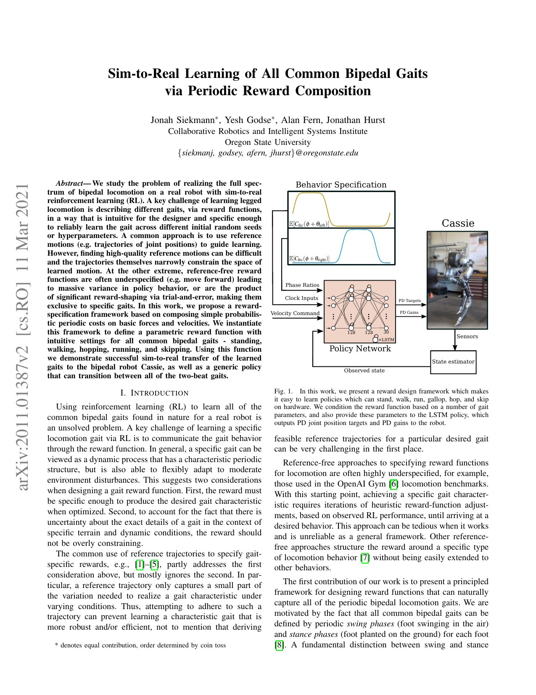
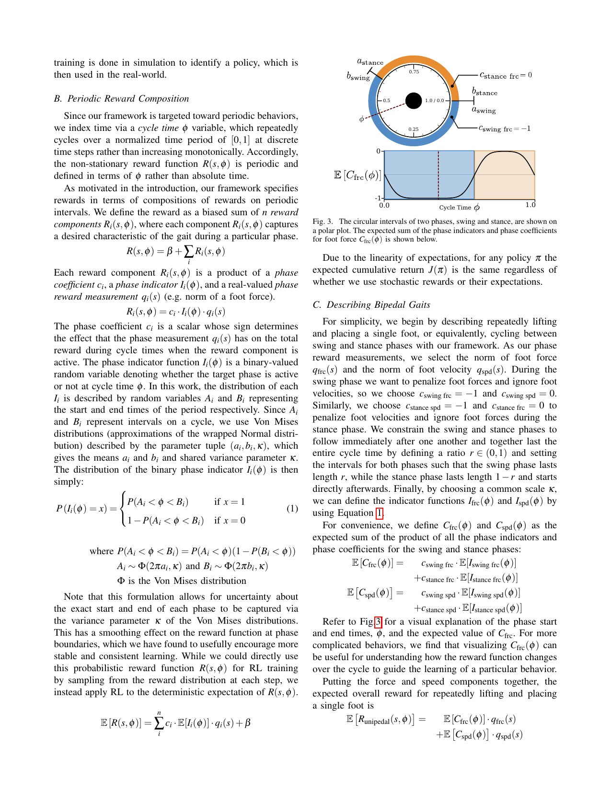
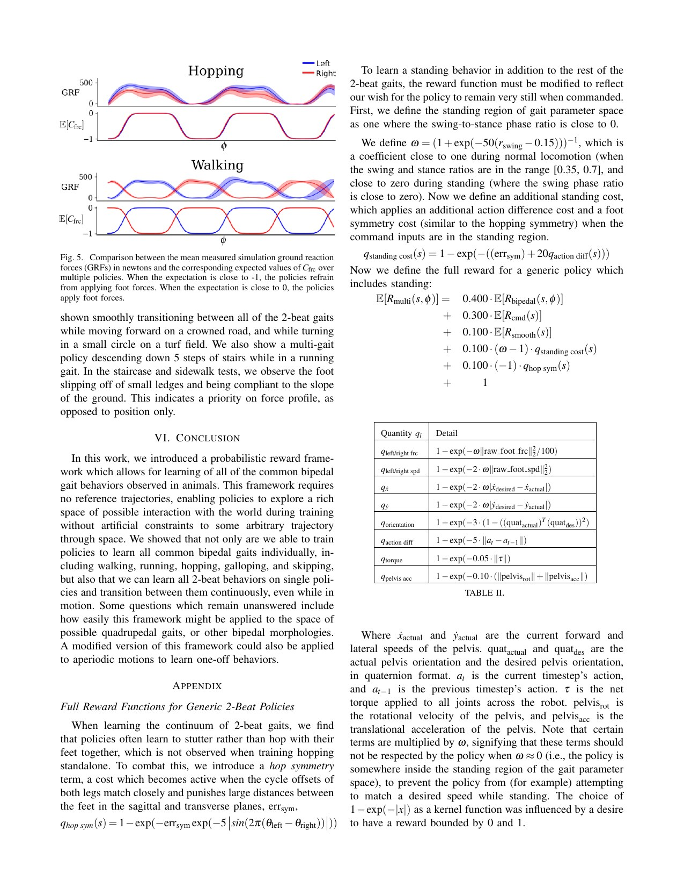

# APEX：用周期奖励组合学习 Cassie 全部常见双足步态，参数化的是接触节奏而非参考轨迹

[English version](en/apex-2011.01387.md)

来源：[arXiv:2011.01387](https://arxiv.org/abs/2011.01387) · [固定提交的官方代码](https://github.com/osudrl/apex/tree/82c44af2b5d7bffe884fd2f69856bb1b3c9948e0)

解读范围：完整 7 页论文及附录奖励、Cassie 官方代码中的相位函数、clock reward、LSTM policy 与环境。目录曾误写为无关论文 `2010.01909`，本次已按原始论文修正为 `2011.01387`。

> 一句话总结：APEX 不跟踪预制步态轨迹，而把左右足 swing/stance 的相位偏移、占空比与足力/足速偏好组合成奖励，训练 Cassie 站立、行走、跑、跳、疾驰和跳步并实机迁移；它擅长周期步态，不等于能自动合成任意非周期运动。

术语导航：周期奖励组合（periodic reward composition）、步态相位（gait phase）、摆动期（swing phase）、支撑期（stance phase）、相位偏移（phase offset）、占空比（duty factor）、地面反作用力（ground reaction force, GRF）、循环策略（recurrent policy）与仿真到现实（sim-to-real）。

## 工程痛点

参考轨迹能清楚规定步态，却会把学习限制在某条曲线上；只写“向前走、别摔”又太宽，策略可能拖脚、跳跃或利用仿真漏洞。要学习多种双足步态，奖励必须既表达脚何时承重、何时摆动，又允许关节轨迹根据扰动自行调整。

双足常见步态的差别主要在接触节奏：走路左右交替且有双支撑，跑步有腾空，hop 双脚同步，gallop 左右错位，skip 还需要四个相位。这个观察像把乐曲从每个音符的绝对音高改写为节拍和声部进入时刻：节奏足以区分风格，具体关节动作由策略和动力学填充。

工程难点是周期边界不能产生 reward 跳变，否则策略会在相位切换时收到不连续梯度；左右脚相位、支撑比例和命令还要同时输入策略，避免环境对策略而言非平稳。APEX 用环形概率区间和平滑期望解决这一点。

## 核心洞察

论文把 cycle time 归一化为 φ∈[0,1)，每个 reward component 由相位系数、随机相位 indicator 和测量量相乘。区间起止用 wrapped Von Mises 分布表达，训练实际使用 indicator 的期望，因此周期边界连续且对相位时序留有软容差。

足力与足速是最小行为描述。在 swing 时惩罚足力、允许或鼓励足速；在 stance 时惩罚足速、允许或鼓励足力。左右脚共享同一模板，只用 `θ_left`、`θ_right` 偏移。hop 令两脚同步，walk/run 令偏移半周期，gallop 取非半周期偏移，skip 组合四个相位。

相位参数进入策略观测，而不是只藏在 reward 中。两层 128 单元 LSTM 以 40 Hz 输出 10 个 PD 关节目标及 10 组 P/D 增益，共 30 维；底层 PD 以 2 kHz 执行。循环状态帮助策略从部分观测和接触历史中恢复动力学上下文。

## 方法主线

状态包含姿态与速度估计、期望前向/侧向速度、phase ratio 与左右 clock 的正余弦编码。奖励以周期足力/足速为核心，另加姿态、速度、动作差、力矩和平滑项；站立命令用额外静止和双脚对称项，避免 hop 策略在零速仍跳。

策略用 PPO 训练。论文给出 32 条×300 步 rollout、学习率 `1e-4`、50k replay、4 epochs，单策略约 1.5 亿样本、24–36 小时。动力学随机化包括阻尼 0.3–4.0 倍、质量 0.5–1.5 倍、摩擦 0.35–1.1、地面坡度约 ±0.03 rad 与 encoder offset ±0.05。

作者分别训练单步态策略及通用策略。只同时连续改变左右 offset 与 phase ratio 会出现步态融合、不对称和相位捷径；加入步态转换惩罚与结构限制后，一张策略可在命令下切换全部 2-beat gait。四相 skip 仍需要专门结构。

## 关键图解

Figure 1 把行为规格、相位比例和 clock 输入送入 LSTM，再输出 PD 目标与增益。状态估计闭环意味着策略不是播放动作。图也暴露安全边界：策略与真实电机之间仍依赖高频 PD、估计器和硬件保护。

Figure 3 将 swing/stance 区间画在圆上，再给出足力系数的连续期望。Equation 1 的关键不是随机采样本身，而是 wrapped interval 在 φ=0/1 处连续。复现若用普通矩形窗口，会在周期边界制造奖励尖点。

Figure 4 显示 hopping、running、skipping 的左右足相位块。walk 与 run 可以共享相位偏移但用 stance ratio 区分双支撑/腾空；skip 需要四相才能表达混合接触。它证明步态参数有物理可解释性，却不保证连续插值总是自然。

Figure 5 对照 hop/walk 的实测 ground reaction force 与期望系数：系数接近 0 时策略施力，接近 -1 时抑制施力。曲线表明奖励塑造了接触时序，但没有给出真机 GRF 误差、统计区间或长期疲劳结果。

## 最有说服力的实验

最强证据是 Cassie 真机同一框架覆盖 hopping、walking、running、galloping 与 skipping，并能在 multi-gait 策略中转换；作者还展示路缘、拱形路面、草地和盲下 5 级楼梯。这比只在仿真比较 reward 更能说明接触节奏可迁移。

然而硬件证据多为定性视频与波形。论文没有每种步态的重复成功率、跌倒数、功耗或跨 seed 方差。Figure 5 更像机制验证，不能推出所有地面或长期运行都可靠。

## 论文—代码映射

固定提交 `82c44af2b5d7bffe884fd2f69856bb1b3c9948e0` 中，`cassie/phase_function.py::create_phase_reward` 构造 swing、double-stance、left-swing 与第二支撑区间，并用 `PchipInterpolator` 跨三个周期生成连续足力/足速系数；这是论文相位奖励的直接实现。

`cassie/rewards/clock_rewards.py::clock_reward` 将相位系数与足力、足速、姿态等误差组合；`rl/policies/actor.py::LSTM_Actor` 与 `Gaussian_LSTM_Actor` 实现循环策略。仓库包含多个历史环境和 reward 变体，复现必须固定入口配置，不能仅凭文件名声称完全等同论文实验。

## 局限与工程判断

作者明确说框架针对周期行为；向四足、其他双足形态和非周期一次性动作的推广仍未知。多参数连续变化会出现不期望融合和不对称，表明可解释参数空间并不自动等于平滑技能流形。

独立工程局限包括：150M 样本与 24–36 小时并不轻量；LSTM 隐状态在真机 reset、丢包和急停后可能失配；2 kHz 内环、Cassie 弹簧腿与状态估计器是结果的重要组成；定性楼梯演示没有遮盖感知、踏空和重复统计。

硬件安全上，相位 reward 不是接触约束。仍需关节/扭矩/速度限制、足部碰撞检测、姿态终止、步态转换守卫、估计器健康检查与急停。步态参数突变应限速或只在安全相位接受，避免瞬间改变预期接触。

## 可执行但有边界的结论

APEX 最值得复用的是“先描述接触节奏，再让策略发明关节轨迹”。对新机器人，应先用足接触、GRF 和速度构建最小相位模板，再少量添加任务奖励，不要从一长串关节参考开始。

但周期结构只是强先验。起身、跳台落地、受扰恢复和移动操作存在事件驱动接触，应该用状态机、事件变量或非周期技能衔接，而不是硬塞进一个循环 clock。

## 复现与验收清单

固定正确论文 ID `2011.01387`、代码提交、Cassie 模型、状态估计器、PPO 参数和随机化。为 φ=0/1 构造单元测试，验证相位系数值和一阶变化连续；分别测试左右 offset、stance ratio 和四相 skip 的接触窗口。

仿真按步态报告命令跟踪、接触序列、GRF、足滑、腾空/双支撑时长、能耗、跌倒和转换成功率，多 seed 训练。单独扫阻尼、质量、摩擦、坡度和 encoder offset，确认训练范围外退化是受控的。

真机按站立、单步态、低速转换、地面变化逐级验收，记录重复试验、峰值力矩、接触冲击、估计器重置和热状态。参数命令经限速器进入，并在异常 GRF、姿态或通信时切回已验证站立/停机逻辑。

## 进一步工程审计

相位变量需要明确由谁维护。若只按墙钟累加，足部提前或延迟着地后，期望接触与真实接触会长期错位；若每次触地都强行重置，又可能因传感抖动产生相位跳变。实用实现通常需要触地观测、允许的相位校正窗口和迟滞，并记录校正量。论文的固定周期适合稳定节奏，遇到障碍或大扰动时应增加事件驱动同步，而不是把所有误差交给循环网络记忆。

步态转换应被视为独立技能。起始步态与目标步态的相位、速度和双脚接触组合决定是否存在安全过渡，同一命令在不同瞬间发出可能得到完全不同冲击。建议为每对步态建立允许转换区间和最大参数变化率，分别统计转换时的足冲击、躯干角速度和恢复步数。只报告转换后能继续走，可能遗漏一次接近跌倒的危险瞬态。

地面反作用力曲线还应与机器人负载关联。Figure 5 的相位系数只规定什么时候鼓励或抑制施力，并不限制峰值、加载速率或左右不平衡。新平台应把机体重量归一化后的峰值、冲量和压力中心加入验收，同时核对弹性机构与刚性执行器差异。Cassie 的机械顺应性会吸收部分碰撞，刚性人形照搬奖励可能产生更高冲击。

循环策略的内部状态必须可管理。训练中环境 reset 会清空隐藏状态，真实系统中的通信重连、急停恢复和模式切换也应执行相同协议。若在机器人站立姿态下继承跑步时的隐藏状态，输出可能短时偏离当前观测。至少要测试冷启动、热重启、丢包保持和隐藏状态清零四种情况，并为每种规定安全动作和重新进入步态的等待时间。

随机化覆盖应和系统辨识结果对应。论文给出的阻尼、质量与摩擦范围很宽，但宽不等于合理；不相关的极端组合会浪费训练容量，真实误差未覆盖则仍会迁移失败。先从执行器阶跃、被动摆动、足地接触和传感偏置实验估计范围，再保留少量外推裕度，并追踪每个随机参数对成功和动作质量的敏感度。

评价通用策略时，还要防止容易步态掩盖困难步态。按命令时间平均的 return 可能主要来自站立和行走，少量 skipping 或 galloping 失败不会显著改变总分。应采用均衡命令采样，并为每种步态、速度区间、转向和转换单独报告成功、误差、足滑、冲击与能耗；总体得分取最差分位或宏平均，才能说明“一张策略”确实覆盖全部行为。

最后，非周期事件需要清晰退出周期控制。踩空、被推、足部卡住或需要急停时，继续按 clock 追逐下一接触可能放大问题。系统应由异常检测切换到恢复、保护落地或停机状态，并把相位冻结或重新初始化。周期控制像节拍器，正常演奏时极其有效；舞台塌陷时，正确行为是停下来处理事故，而不是更用力追拍。

复现实验还应同步保存每步的相位、左右足接触、期望系数和实际足力，使一次失败能沿时间线回放。若只保留最终奖励，无法判断是相位模板错误、触地估计偏移、循环状态失配，还是底层执行未跟上目标。把这些信号做成固定诊断图，比反复观看真机视频更快定位根因，也能检验修改奖励后是否真的改善了接触节奏而非产生新的补偿动作。

> **工程判断**：周期奖励给策略的是“拍子”，不是脚本；拍子能组织常见步态，却不能替代接触安全和非周期任务规划。
