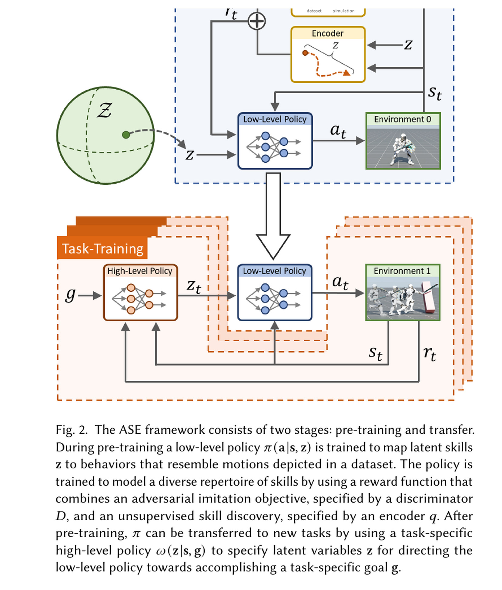
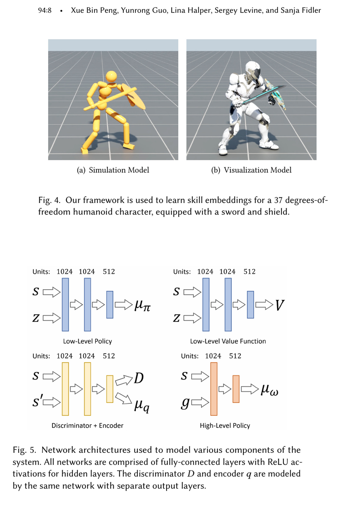
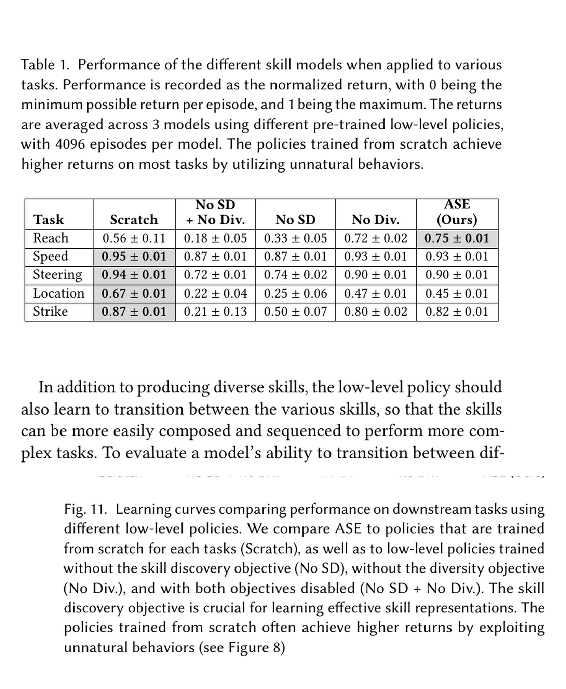
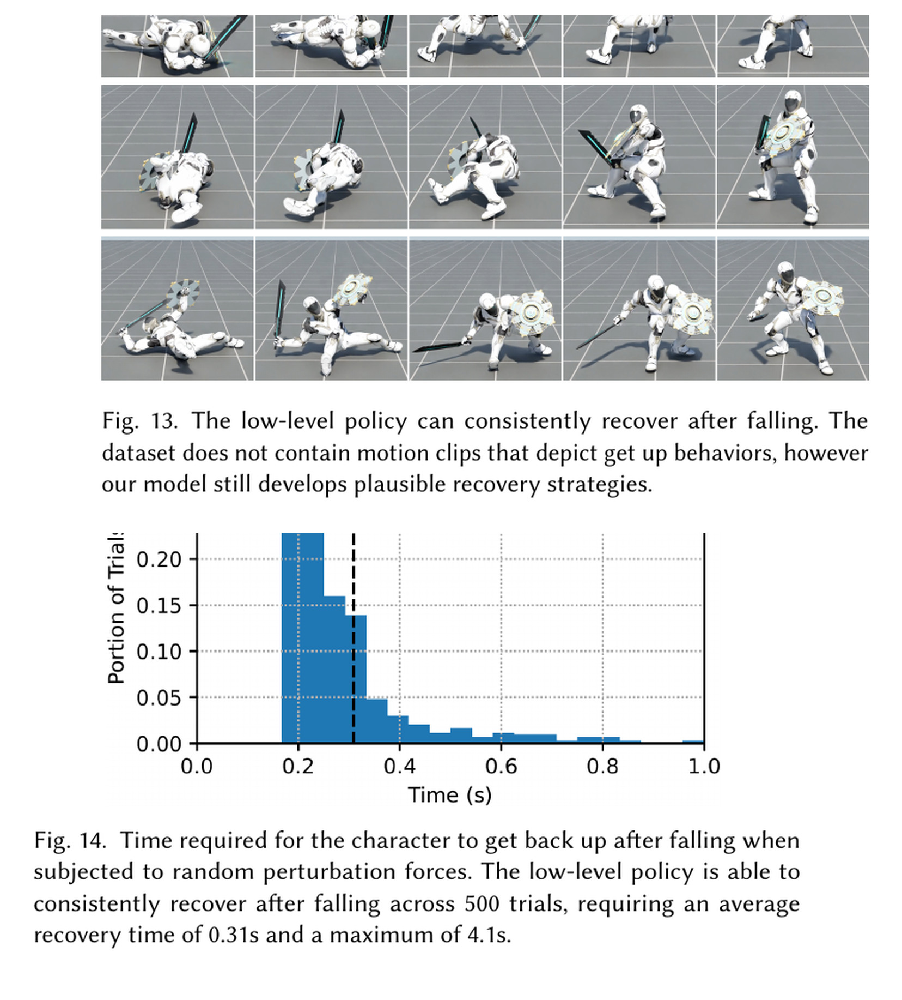

# ASE：用对抗模仿与技能互信息学习可复用连续动作空间

[English version](en/ase-2205.01906.md)

来源：[arXiv:2205.01906](https://arxiv.org/abs/2205.01906) · [固定提交的官方代码](https://github.com/nv-tlabs/ASE/tree/6f9b4f1f289603eee6a4f45d082bc6e6d83fecec)

解读范围：完整 18 页论文、超参数附录和官方 Isaac Gym low-level ASE、high-level task、判别器/encoder 与倒地恢复代码。ASE 面向 physics-based character animation，本页不把持剑盾角色表述成机器人实机。

> 一句话总结：ASE 用 AMP 风格判别器让低层策略匹配无标签动作数据，再最大化 latent 与状态转移的互信息，使单位超球面上的连续技能可区分、可组合；同一低层策略支持 Reach/Speed/Steering/Location/Strike，并在 500 次仿真扰动中全部起身，但训练约 100 亿样本、10 天 V100，仍会抖动和产生高能量恢复，且无机器人硬件证据。

术语导航：对抗式技能嵌入（Adversarial Skill Embeddings, ASE）、对抗动作先验（Adversarial Motion Prior, AMP）、技能发现（skill discovery）、互信息（mutual information）、冯·米塞斯–费舍尔分布（von Mises–Fisher distribution）、超球面潜变量（hyperspherical latent）、模式崩塌（mode collapse）、高层策略（high-level policy）与动作先验（motion prior）。

## 工程痛点

逐片段动作跟踪能学出高质量技能，却要求任务知道要跟哪条 reference；只做对抗模仿又可能 mode collapse，只复现数据中少数动作。下游任务若直接在 31 维关节动作里探索，随机动作往往立即跌倒，几乎没有语义结构；每个任务从零学习还会重复学习站立、行走和挥击。

ASE 先从无标签动作数据学习 latent-conditioned 低层策略：判别器约束生成动作分布，encoder 迫使不同 latent 对应可区分行为，高层任务只需选择或组合 latent。把 latent 约束在球面避免走到无限远的未知区域，但高层先在未归一化空间采样，再投影到球面，让探索仍能从中心向各种方向展开。

## 核心洞察

预训练目标由两项构成。第一项通过判别器匹配数据状态转移分布；第二项最大化 I(s,s′;z)，用 encoder q(z|s,s′) 给出可计算下界。连续 z 位于单位超球面，encoder 用 von Mises–Fisher；diversity loss 要求 latent 距离和策略动作分布差异一致，减少不同 latent 产生同一行为。

为提高响应性，训练序列会在一段时间后切换 latent，迫使低层策略跟随新命令。高层 policy 输出未归一化 z_bar，再归一化给低层；这比直接在球面局部高斯探索覆盖更广。预训练判别器可固定为下游 motion prior，使任务 reward 之外仍约束自然度。

## 方法主线

角色有 37 DoF、31 维动作、120 维 state，持剑盾。低层 30 Hz，高层 6 Hz；4096 环境、Isaac Gym 120 Hz、单 V100。数据为 187 clips、约 30 分钟，低层训练超过 100 亿样本、约十年仿真时间、墙钟 10 天。64 维 latent，低层每次 update 131,072 samples。

任务包括 Reach、Speed、Steering、Location、Strike。高层只看到简单 goal/reward，复用冻结低层技能。预训练还以 10% 概率从随机倒地状态开始；数据没有起身动作，策略依靠状态与对抗/技能目标发现恢复。

## 关键图解

Figure 2 区分无任务标签的低层预训练和每任务高层迁移。若复现只训练 low-level 而不固定接口测试 high-level，就没有验证“可复用”这一核心主张。

Figure 4–5 显示 37-DoF 角色、1024/1024/512 低层网络以及共享 trunk 的 discriminator/encoder。它也提醒网络和数据针对动画角色，不包含机器人 actuator、足底和观测限制。

Table 1 中 ASE 在 Reach/Speed/Steering/Location/Strike 为 0.75/0.93/0.90/0.45/0.82；from-scratch 某些任务更高，却用不自然动作。去掉 skill discovery 性能大降；去掉 diversity 对回报影响较小，但 Figure 9 的跨技能连接明显减少。

Figure 13–14 在根部施加 500–1000 N、0.5 s 随机力，500 次均恢复，平均 0.31 s、最大 4.1 s。成功阈值为根高 >0.5 m、头高 >1 m；这是仿真定义，且作者承认会出现翻滚、旋转等高能量不自然动作。

## 最有说服力的实验

最强证据是 Table 1 与 Figure 9–11 的联合消融：回报说明 latent 对下游任务有用，transition coverage 则检验是否学到可切换的技能，而不是单一动作。结果还区分 skill-discovery 与 diversity loss：前者对任务性能关键，后者更多改善连接密度。

恢复 500 次全部成功很醒目，但必须与条件一起读。扰动力、地面、角色和成功阈值固定在仿真；平均 0.31 s 还可能来自非人类高能量动作。因此它证明低层 policy 具有 emergent recovery，不证明机器人可以承受相同冲击。

## 论文—代码映射

固定提交 `6f9b4f1f289603eee6a4f45d082bc6e6d83fecec` 中，`ase/learning/ase_agent.py::ASEAgent` 计算 discriminator、encoder 与 diversity reward，采样 `ase_latents` 并训练 low-level。`ase/learning/ase_network_builder.py::ASEBuilder` 构造 actor、判别器和 encoder 输出。

`ase/learning/hrl_agent.py::HRLAgent` 把高层 latent 转成低层动作；`ase/env/tasks/humanoid_amp_getup.py::HumanoidAMPGetup` 的 `_generate_fall_states`、`_reset_fall_episode` 和 `_compute_reset` 实现随机倒地与恢复窗口。配置 `humanoid_ase_sword_shield_getup.yaml` 固定 recovery 概率和步数。

## 局限与工程判断

作者明确指出：下游任务仍相对简单；大规模并行训练比人类学习样本效率低；低层偶尔产生抖动、突然抽动和过度用力恢复；未来可加入自然起身数据和能量目标，也可替换 GAN/互信息近似。

独立工程局限包括：动作数据来自商业 Reallusion，复现许可和精确 clips 需确认；单 V100 十天、100 亿样本成本高；角色持剑盾而非真实 humanoid；任务 reward 和自然度存在冲突；transition coverage 依赖最近动作匹配启发式；没有观测噪声、延迟、力矩和硬件试验。

硬件安全上，ASE latent 不是可解释安全命令。高层可能选中自然但不适合当前空间的挥击、下蹲或恢复；固定判别器也可能被 exploitation。机器人迁移需 skill-level envelope、碰撞/力矩/功率限制、动作预测和拒绝机制，不能只把 z 归一化就认为在分布内。

## 可执行但有边界的结论

ASE 适合把大动作库压缩成可探索控制接口：先验证 latent coverage、切换和平滑，再让高层解决任务。对 WBC Handbook 的价值是解释“动作先验”和“任务策略”应分层测试；高层成功不能掩盖低层某些 latent 的危险动作。

若用于机器人，应先从 locomotion-only、无持械数据和低能量恢复开始。为 latent 建立可审计标签不是训练必须，却是部署必须：统计每个区域的速度、腾空、接触、能量和失败率，并禁止未覆盖区域。

## 复现与验收清单

固定 PDF、ASE commit、Isaac Gym、V100/环境数、120/30/6 Hz、187 clips、state/action、64 维 latent、网络、reward 权重、latent duration、motion prior、seed 与 100 亿样本预算。复现 Table 1、Figure 9–14 和附录 Table 2–3。

分别关闭 skill discovery、diversity、motion prior、random latent switching 与 fall initialization；报告回报、coverage、自然度、能量、抖动和训练时间。保存 latent 到动作/clip 的匹配矩阵，检查是否只覆盖少数 idle/locomotion。

机器人候选先在 actuator-aware 仿真加入延迟、噪声、碰撞和限幅，扫描 latent 球面并建立风险地图。实机仅开放已验证区域，低速、悬挂和软垫递进；记录 policy handoff、未知动作拒绝、急停和热状态。恢复必须满足冲击和站稳门槛，而非动画高度阈值。

## 进一步工程审计

latent coverage 不能只靠“看起来动作很多”。应在固定初始状态和多初始状态下均匀采样球面，记录根速度、方向、手脚轨迹、接触序列、能量和终止，然后聚类。若大量 latent 都落到站立或同一走路，说明 mode collapse 仍存在；若动作多但只能从特定初态触发，部署可用性也有限。

技能切换需要测瞬态，而不是只统计两段最终匹配哪个 clip。对每对常用 latent 记录切换后的最大动作变化、足滑、失衡和恢复时间，得到有向 transition graph。A 到 B 安全不表示 B 到 A 安全，高层规划应使用这个图约束切换，而不是任意在球面上跳转。

高层策略通过未归一化空间探索的技巧提高多样性，却可能在归一化前产生极小向量，方向对噪声异常敏感。实现应监控 norm、归一化数值稳定和 action distribution，必要时对近零向量设置 fallback。只检查归一化后的 z 长度始终为 1，会漏掉这个输入条件问题。

判别器作为固定 motion prior 可能被下游策略钻空子。任务训练时应同时回放真实 motion transition 和新策略 transition，离线检查 discriminator score 与人工自然度、能量的相关性；若策略找到高分抖动，不能继续提高 style weight，而应更新或限制 prior。作者已观察 scratch policy 用不自然动作拿高分，同类 reward exploitation 也可能出现在 prior。

恢复初始化的 10% 概率是训练技巧，不是完整恢复数据。随机下落构型与任务中真实失衡的速度、接触和装备状态不同。可收集 nominal task 的失败 replay，比较随机 fall 和真实 fail 的 latent 分布及恢复率；差异大时加入真实失败课程，但仍需控制高能量动作。

动作数据许可也是可复现工程的一部分。若商业 clips 无法随仓库分发，应提供可替代开源数据的转换说明、统计和预期差异；模型 checkpoint 能下载不代表训练数据可审计。对每个动作源保存许可证、版本、frame rate、骨架转换和过滤 hash，才能合法持续更新。

面向机器人，建议在 latent 上再加一层 command semantics：只开放“站立、低速前进、转向、低能量恢复”等经过验证的区域，高层请求超出时投影或拒绝。这一层只允许进入经过验证的 latent 区域，不能因整个空间连续就假定任意坐标可安全执行。

Handbook 搜索“动作先验为何仍会乱动”时，应指向四类原因：数据分布本身含高能量动作、latent collapse/切换瞬态、判别器 exploitation、高层目标与自然度冲突。ASE 页面把这些层分开，避免把所有问题都归为 PPO 不稳定。

低层策略的冻结也有代价。下游任务遇到预训练数据从未覆盖的精细接触时，高层只能在既有技能中绕路，可能永远无法达到目标。应比较冻结、有限微调和新增小型残差三种方案，检查任务性能与旧技能退化。若微调后原动作空间改变，所有依赖它的高层策略都要重新验证。

动作先验和任务奖励的比例不能只用回报选择。先验过强会拒绝完成任务所需但数据中少见的姿态，过弱又会出现抖动和投机。可在人评自然度之外加入能量、关节变化、接触和轨迹平滑指标，并对不同任务分别画权衡曲线。一个固定比例不一定适合到达、奔跑和击打。

随机采样看到的技能不等于高层容易到达。某个动作只占球面极小区域，即使存在，也很难被策略稳定选中。应统计技能区域面积、边界和对观测噪声的敏感度；对重要技能可增加条件化、重采样或显式入口，而不是期待高层在连续空间偶然命中。

仿真角色的手持剑盾改变惯量和可用接触，迁移到空手机器人时不能只删掉模型。训练数据、状态中的剑尖/盾牌关键点和任务奖励都需要重新定义；否则 latent 语义会改变。每次形态变化都应视为新的动作空间版本，而不是同一个模型的小配置。

恢复动作尤其要限制接触部位。动画角色可以用手撑地、旋转翻起，真实机器人的手指、相机和外壳可能承受不了。风险地图应包含接触部件与冲量，禁止用脆弱结构支撑；必要时用专门保护或起身策略替代自然度先验。恢复快不应成为唯一目标。

预训练成本使按需更新更适合增量审计而非频繁重训。新增动作先离线检查旧模型是否已覆盖；若未覆盖，再决定微调、新 primitive 或重新训练。每次更新保留旧 checkpoint 和固定评测，只有 coverage 提升、任务回报与安全指标都通过才替换。这样持续扩库不会让模型版本不可追溯。

搜索页面应把 ASE 连接到具体工程问题，例如“高层随机探索总跌倒”“动作先验只会一种动作”“技能切换时抖动”“恢复动作过猛”。每个问题链接到相应图、代码和验收方法，让读者得到可执行诊断，而不只是一个论文摘要。

> **工程判断**：ASE 学到的是可组合的仿真动作坐标系；把它变成机器人接口的关键工作，是为 latent 空间补上执行器、环境和安全语义。
