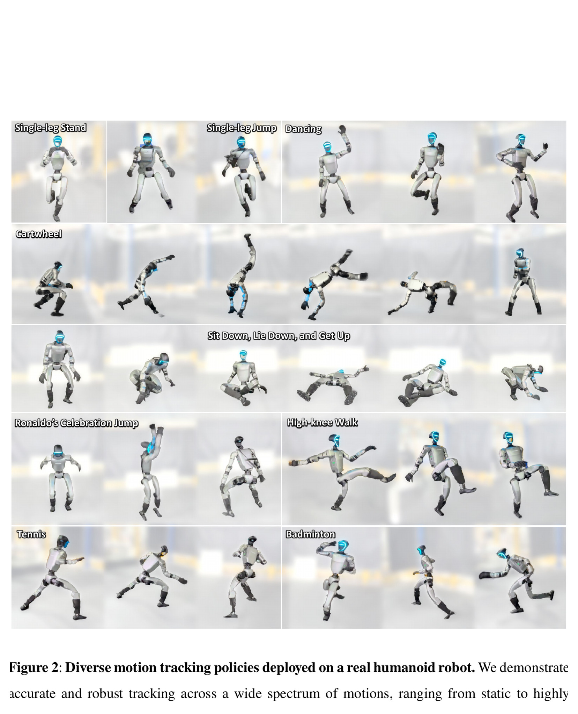
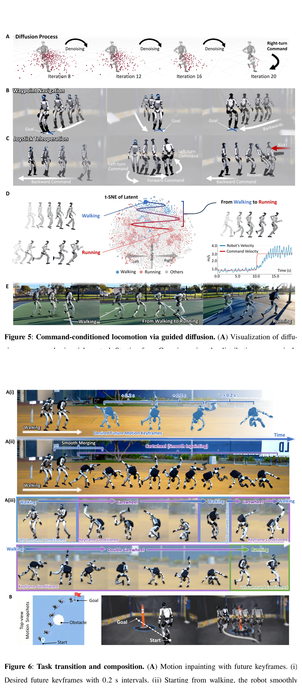
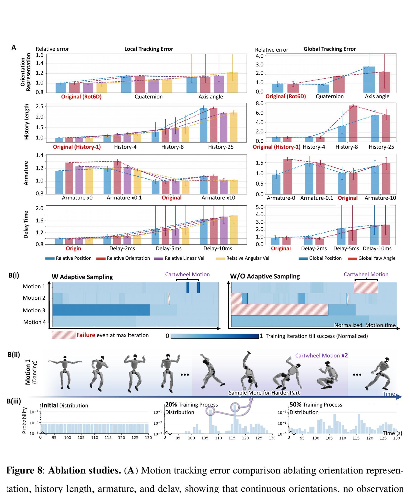

# BeyondMimic：用状态—动作潜扩散在测试时组合人形技能

[English version](en/beyondmimic-2508.08241v4.md)

来源：[arXiv:2508.08241v4](https://arxiv.org/abs/2508.08241v4) · [官方项目页](https://beyondmimic.github.io/) · [官方运动跟踪代码](https://github.com/HybridRobotics/whole_body_tracking)

解读范围：完整 34 页正文、方法和补充材料。官方 `whole_body_tracking` 仓库现可核验，但它明确只覆盖 BeyondMimic 的运动跟踪训练；本文不把它扩写为潜扩散生成层的完整开源。

> 一句话总结：BeyondMimic 先用简化且可扩展的跟踪 MDP 为多样动作生成闭环数据，再在状态—潜动作空间中学扩散模型，通过测试时代价梯度组合速度、waypoint、关键帧与避障目标。

术语导航：通用运动跟踪（general motion tracking）产生可执行数据，条件变分自编码器（conditional variational autoencoder, CVAE）压缩动作。潜扩散（latent diffusion）、测试时引导（test-time guidance）、关键帧补全（keyframe inpainting）、有符号距离场（signed distance field, SDF）、自适应采样（adaptive sampling）与短视预测（receding-horizon prediction）是两层系统的核心。

## 工程痛点

一个通用 tracker 可以稳定重放数据库中的动作，但上层任务往往只给速度、空间路点或某个时刻必须到达的姿态。为每个组合重新训练策略，数据与计算成本会随任务数爆炸。直接在原始关节动作上生成又容易输出跟踪器从未见过的不连续指令。

BeyondMimic 把问题分成“运动语法”和“给定句意”。跟踪数据先教潜空间哪些状态—动作连接是自然且可执行的，测试时代价再把样本推向特定目标。这好比先学会语法再按题写句子，而不是为每个题目重新发明一种语言。

难点是代价可组合不等于约束一定可同时满足。速度目标可能把机器人推向障碍，waypoint 可能要求超出 0.64 s horizon 的急转，关键帧也可能与当前支撑状态不可达。生成器会给出概率上较好的折中，却不会自动生成形式化安全证明。

## 核心洞察

第一个洞察是生成层的上限取决于跟踪层数据。如果跟踪策略在转身、腾空或起止片段上失败，扩散模型学到的就是带缺口的动作语法。困难片段自适应采样不只提高 tracker 成功率，也在修补生成数据的覆盖度。

第二个洞察是将状态与潜动作一起扩散。只在动作潜空间采样很难计算 waypoint 或 SDF 对未来状态的梯度；把未来状态放进样本，任务代价就能直接引导去噪路径。它像在地图上直接拉未来路线，而不是盲目转动方向盘并猜测汽车会去哪里。

第三个洞察是潜空间的价值需要通过消融证明，而不是以“压缩更平滑”为理由。cartwheel 跨 MuJoCo 成功率 5%→95% 是论文对这一点最清楚的数值支持，也同时提醒读者该结论来自特定高动态任务与模拟器。

## 方法主线：两层系统

第一层是可扩展运动跟踪：把参考姿态写成锚点坐标系下的相对刚体位置/旋转，策略只看单帧机器人中心观测和上一动作，输出关节位置设定值。奖励只有统一任务空间跟踪项，以及关节限位、动作变化和动作幅度三类正则；同一超参数用于约 2.5 小时人体动作。困难片段依据失败率自适应提高重置采样概率。

第二层将若干跟踪策略的数据压进条件 VAE，再学习过去状态—潜动作到未来状态—潜动作的扩散模型。推理时在去噪过程中加入可微任务代价梯度，之后用最新本体观测解码当前潜动作。这样 waypoint、速度、关键帧 inpainting 和 SDF 避障只需定义代价，无需为每个任务重训策略。

## 关键图解

Figure 2-4 是第一层的能力证据：34 条、约 15 分钟的选定运动在 G1 上包含侧空翻、旋踢与跑步等不同接触模式。它们证明跟踪 MDP 能上机，但未提供每个动作的随机初始化成功率，因而不能用视频规模替代统计分母。

- Figure 7：统一跟踪 MDP、VAE 与状态—潜动作扩散/指导的完整算法图。
- Figure 2/3/4：34 条约 15 分钟运动在 G1 实机验证，包含侧空翻、旋踢、跑步和 GRF 形态；多为技能展示而非逐动作成功率表。
- Figure 5/6：同一扩散策略用速度、waypoint、关键帧和障碍代价组合出步态切换、遥操作、cartwheel 插入和避障。
- Figure 8A：Rot6D 比四元数/轴角更稳；加入历史反而恶化该最小随机化设置的实机迁移；5–10 ms 人为延迟已出现失败。
- Figure 8B-D：无自适应采样时 4 个困难运动中 3 个在 30k iteration 后仍卡住；简单运动训练量由 4k 降到 2k。
- latent ablation：cartwheel 跨 MuJoCo 成功率从无潜编码 5% 提升到潜扩散 95%，是生成层最清晰的数值证据。

Figure 5-6 应从控制结果读回引导链：同一生成控制器接受命令并在技能间过渡、组合；它证明可命令行为形态，但不能单凭选定轨迹证明每种过渡的成功率。去噪过程对未来状态和潜动作生成短视轨迹，任务代价的梯度在每次去噪中推动样本，最新本体观测再解码当前动作。这是短 horizon 重规划，不是一次性生成整段开环动作。

Figure 8 比实机花式更有机制价值。Rot6D、无历史和自适应采样在该设置中更稳，而 5–10 ms 附加延迟已导致实机失败。“历史更差”应窄化为该单帧跟踪 MDP 和最小随机化设置；它不与其他论文中用历史恢复隐状态的结果矛盾，因为问题设置不同。

最强证据是潜空间 5%→95% 与延迟/表示/采样消融，因为它们解释了系统为何不仅能做演示。真实 waypoint/避障主要是案例，不能据此声称通用规划。

## 最有说服力的实验

cartwheel 的 5%→95% 潜空间消融最能回答“为什么不直接在原始空间扩散”。它在跨 MuJoCo 环境中保留了很大差距，说明改善不只是同一引擎内的数值偶然。但这是一个特定高动态技能，还需通过多动作、多种引导代价和多随机种子检验潜表示收益的普遍性。

Figure 8 提供另一类有说服力的负面证据：更多历史不一定更好，轻微人为延迟也可能打破实机转移。这说明低延迟系统的简化 observation 可以是主动设计，不是遗漏。复现应将延迟分布而非一个平均值写入系统卡。

## 论文—代码映射

截至 2026-08-10，作者组织下的公开仓库已明确标注为 BeyondMimic Motion Tracking Code，使用 MIT 许可证。它可核验论文第一层跟踪 MDP，但 README 也明确说明仓库覆盖 motion tracking training；潜扩散生成器、CVAE 和引导推理不应因此被声称为已完整开源。

| 论文组件 | 官方仓库位置 | 对应关系 |
|---|---|---|
| 参考运动、误差与自适应采样 | `tasks/tracking/mdp/commands.py` | 仓库说明该文件计算姿态/速度误差、初始状态随机化与 adaptive sampling |
| 统一跟踪奖励与平滑正则 | `tasks/tracking/mdp/rewards.py` | 实现 DeepMimic 型跟踪项与论文中的简化正则项 |
| 域随机化与环境边界 | `events.py` / `terminations.py` | 分别定义训练事件、早停与超时，用于区分奖励失配和终止条件 |
| G1 跟踪任务与 PPO 入口 | `Tracking-Flat-G1-v0` / `rsl_rl_ppo_cfg.py` | 提供训练、回放入口和 G1 PPO 配置，可对照论文跟踪层但不代表生成层 |

复现时还要固定实际 commit、Isaac Lab 版本、机器人资产和 WandB motion artifact。仓库在论文 v4 后仍有更新，因而当前 `commands.py` 的所有能力不能都倒写为论文当时的实验设置。

## 局限与工程判断

作者明确指出：状态估计误差会传入生成轨迹；预测 horizon 仅 0.64 s，不足以远期规划；历史会把模型困在周期运动，增大 guidance 又会让模式切换/高方差状态不稳，起止容易绊步；细粒度目标仍需调 guidance 权重。项目页还说明 waypoint/障碍与状态估计使用 MoCap。

独立判断：代价可组合不等于约束可满足，SDF 避障没有形式化碰撞保证；34 条实机运动是选择性验证；“自然”包含主观比较和少量 GRF；最小域随机化高度依赖机械建模和低延迟部署。

跟踪层开源可以降低第一层复现门槛，但无法消除生成层未完整核验的不确定性。对生成部分的任何再实现，都应明确标成独立复现，不与官方 tracker 仓库混为同一开源完整度。

## 可执行但有边界的结论

工程上应将 diffusion guidance 作为短视预测控制候选，并单独测代价冲突、切换瞬态、状态估计偏差、延迟和不可行目标。引导权重应有任务特定的消融与失败回退，不把某个演示的最优值当成通用参数。

外部仍需碰撞/限位/急停监督器，不能用生成模型概率替代安全约束。实机验收应分开 tracker 失败、生成价值冲突、状态估计失败和安全监督器触发。

## 复现与验收清单

容易误读的第一点是将跟踪仓库的开源状态代替整篇论文的实现完整度。`whole_body_tracking` 可以支撑 tracker 层的符号级审计，潜扩散、CVAE 与 guidance 仍只能按论文重建。两部分的版本、许可与复现证据应在项目表中分开记录。

第二点是将“无需针对每个任务重训策略”写成“无需任务调参”。引导权重、代价尺度、horizon 和不同目标间的平衡仍然需要设计与消融。这些不会更改模型权重，却会直接改变动作和失败模式。

第三点是将短视生成器当成全局规划器。0.64 s 预测可以在每个循环重新优化，但无法对需要数秒提前准备的落脚、助跑或障碍序列提供完整保证。这类任务需要更高层规划与可行性检查。

跟踪层首先要生成动作级报告：每条轨迹的长度、重置采样次数、失败率、初始状态分布、姿态/速度误差、接触终止和被自适应采样提高的权重。只看整个数据库平均会让空翻和起止等困难片段被大量简单步行淹没，生成层则会继承这些数据缺口。

生成层应分别复现无潜编码、仅动作潜空间、状态—潜动作联合扩散和不同 horizon，并在多个动作簇上报告成功与跟踪误差。cartwheel 的 5%→95% 应作为一个强信号起点，而不是结束复现的唯一验收项。尤其要检查潜表示是否改善了模式切换，还是只对单一高动态技能有效。

引导评估要构造价值冲突：速度目标穿过障碍、waypoint 超出 horizon 可达区、关键帧与当前支撑不兼容，以及两个代价同时要求相反转向。除了最终成功，还要记录每个代价的残差、引导梯度范数、动作切换峰值与安全监督器触发。系统应对不可行目标退化或拒绝，而不是无限增大 guidance。

低延迟是论文的隐性设施。复现应对状态估计、扩散推理、通信、解码和 PD 执行分别打时间戳，再注入固定、随机和突发延迟。如果 5–10 ms 就可导致失败，平均计算时间远远不够；尾部抖动、丢帧和时钟错位必须进入部署 ODD。

> **金句**：可组合的代价函数只是一种任务语言；它能说清“想要什么”，却不能单独证明“这些要求能安全地同时实现”。
