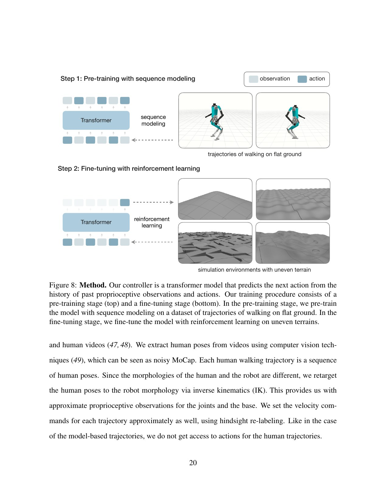
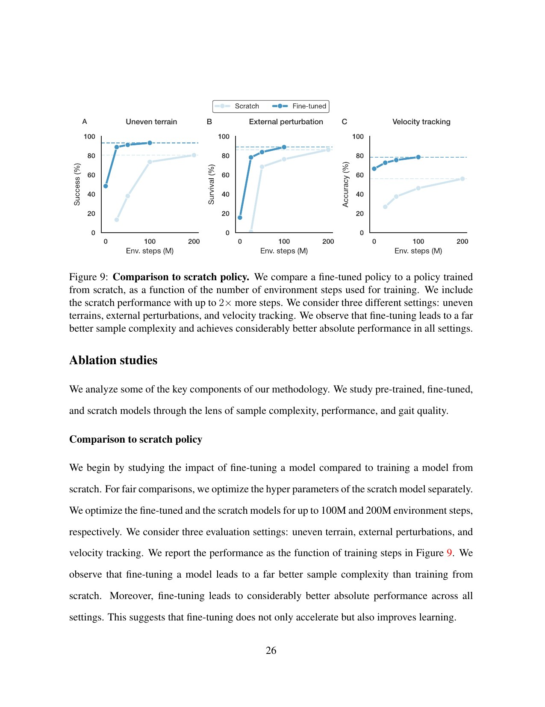
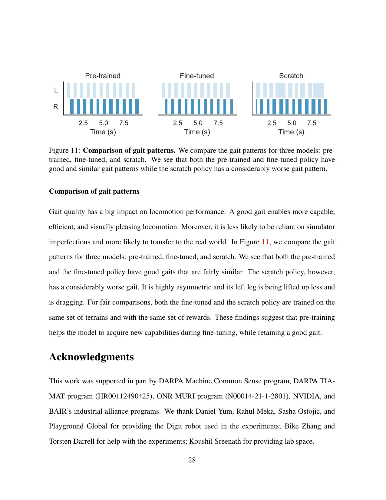

# HT-2：先从平地轨迹学会走，再用强化学习攻克复杂地形

来源：[arXiv:2410.03654v1](https://arxiv.org/abs/2410.03654v1) · [官方项目页](https://humanoid-challenging-terrain.github.io/)

解读范围：完整 42 页正文、方法、消融与补充材料。截点时官方页面未提供可核验代码仓库，因此没有伪造论文—代码映射。

> 一句话总结：HT-2 不从复杂地形上从零摸索步态，而是先用多源平地观测—动作序列预训练 Transformer，再用 PPO 把这个起点改造成 Digit 的盲走越野策略。

术语导航：序列预训练（sequence pretraining）从历史预测动作，遮码动作标记（masked action token）表示轨迹没有可用控制量。策略微调（policy fine-tuning）、样本效率（sample efficiency）、本体感知（proprioception）、特权评论家（privileged critic）与操作设计域（operational design domain, ODD）是评估它能否上机的关键概念。

## 工程痛点与方法

直接从零在复杂地形上训练 Digit，需要更多交互、奖励调参和 sim-to-real 迭代。HT-2 先把既有神经策略、厂商模型控制器和人体动作产生的平地轨迹统一为观测—动作序列；缺动作的轨迹用可学习 `[M]` 标记，并用连续值序列建模预训练 Transformer。然后把该模型作为 actor 初始化，在六类程序化刚性地形上用 PPO 微调。

策略输入是 16 步本体观测与动作历史，四层、隐藏维 192、约 1.4M 参数。Digit 有 20 个执行关节，但脚部被当作被动关节；动作是其余 16 个电机的目标位置、Kp、Kd，共 48 维。策略 50 Hz，PD 2000 Hz。部署只用关节/IMU 等本体感知，不用视觉或高度图；critic 在训练时可看高度图、机器人参数和绝对状态。

从零训练好比让一个从未站立的人直接在碎石坡上学走路：大量交互都浪费在基本姿态和节律上。预训练先把“什么样的本体历史通常对应什么动作”写进网络，不平地 RL 才能把样本用在接触变化和抗扰上。

## 核心洞察

HT-2 的第一个洞察是动作来源不必须完全同构。神经策略、模型控制器和人体运动都可以贡献状态序列；只有部分来源有真实的机器人动作标签。用 `[M]` 显式标记缺失，比用零值假装成一个动作更干净，因为模型能区分“不知道”与“确实输出零”。

第二个洞察是预训练的价值必须在相同或更大 RL 预算的 scratch 对照中验证。否则“收敛更快”可能只是预训练方法看了更多总数据。Figure 9 给从零基线两倍环境步仍然落后，是这篇论文最重要的公平性设计。

第三个洞察是初始化会留下行为偏好。Figure 11 中的对称步态不只是外观更好，它还说明 PPO 没有完全抛弃平地先验。这好比书写时的初始笔画：后续可以修改，却会影响最终形状。

## 关键图解

Figure 8 要看清两个数据边界：预训练阶段可以吸收多源平地序列，但不直接学复杂地形奖励；微调阶段才使用特权高度图 critic 和程序化地形。部署 actor 最终仍为盲走，不应把训练期 critic 的地形信息误写成实机观测。

- Figure 8：平地序列预训练 → 不平地 RL 微调的两阶段流程，缺失动作由 mask token 表示。
- Figure 7：与先前 HT 基线在下坡、上坡、粗糙地面与负载能耗上比较；HT-2 在更困难上坡/粗糙与负载设置更强。
- Figure 9：微调模型最多 100M 环境步，对照从零训练最多 200M；微调在不平地、外扰和速度跟踪上样本效率与最终表现均更好。
- Figure 10：预训练到微调后，下坡/上坡/推扰/障碍/粗糙/滑地六类成功率分别对照；困难条件提升最明显。
- Figure 11：预训练与微调保留相似对称步态，从零策略出现左腿拖地，说明初始化影响的不只是最终回报。
- Table S2/S5/S7：48 维动作、六类地形配比与完整域随机化，是复现接口的关键补充。

Figure 9 的横轴是环境交互预算，因而它比只报最终成功率更能说明预训练的作用。预训练策略在不平地、推扰和速度跟踪上更早进入有效学习区间；但这些曲线仍依赖论文的网络、奖励和地形配比，不是一个与任务无关的加速比。

Figure 11 提供了表格没有的行为证据：微调后仍保留较对称的支撑切换，scratch 策略则出现左腿拖地。读图时仍要警惕选择性可视化：应辅以足端净空、左右支撑时间和全测试集的分布，不能只凭一条轨迹判断“更自然”。

最强的机制证据是 Figure 9：给从零基线两倍交互预算仍落后，支持“相关平地序列预训练改善复杂地形 RL 起点”的窄结论。真实世界的五次徒步合计约 4.3 英里、31% 坡度和沙/泥/湿地展示了系统耐久性，但它们是案例研究，没有随机对照、失败次数或置信区间。

## 最有说服力的实验

Figure 9 的贡献是把“学得快”与“最后分高”分开。与只给一个终点相比，学习曲线显示预训练初始化在较早交互阶段就形成优势，而且 scratch 使用更大预算仍未追上。这是对“样本效率”最直接的支持。

真实徒步是另一类证据：它说明策略能经历较长时间和多种自然地面，但由于没有对照、失败分母和人工接管记录，它不能与 Figure 9 一样做机制归因。应将前者称为案例耐久性，后者称为受控消融。

## 公开实现状态

截至 2026-08-10，论文内链接与官方项目页只提供论文、作者和演示，官方代码未公开，也未给出唯一可核验的仓库、提交或许可证。因此无法按符号核对 mask token、预训练损失、PPO 初始化或 Digit 部署实现。本条记录明确标为 `no_public_code_found`；第三方复现不作为作者代码。

## 局限与安全边界

作者明确指出控制器是盲走，本体历史无法预见离散台阶、踏石等必须提前选落脚点的障碍，未来需融合视觉。独立工程判断：训练只含刚性地形，软沙/泥地泛化来自案例而非受控样本；五次徒步没有报告人工接管、跌倒和完整失败分母；动作同时预测 Kp/Kd，提高适应性也扩大了硬件风险面；潜在表示聚类不等于可解释或可靠地形估计。

增益作为策略动作还要求额外监督：网络输出必须被限制在机器人审定边界内，并检测突变、高频振荡和长时间高刚度。策略通过某一个仿真力矩限制，不代表执行器温度、峰值电流与结构冲击都在安全范围。

## 可执行但有边界的结论

工程上可把“相关轨迹预训练 + 困难地形 RL 微调”作为从零训练的对照，但必须同时报告相同与更大预算的 scratch 基线，并把无视觉能力限制写进部署 ODD。评估中还应分开刚性程序地形、未见刚性地形和软地面案例，避免用一个总成功率混淆泛化范围。

任何 Digit 以外复现都需重新定义动作、被动关节、增益边界、接触限制和实机门禁。实机测试应从有系留、低坡度和低速开始，记录跌倒、接管、足端滑移、峰值力矩与热状态。

## 复现与验收清单

还要把“预训练学到的表示”与“微调后的最终行为”分开检查。可以冻结不同层、仅更新动作头，或在相同小预算下比较完整微调，观察样本效率是来自时序特征还是仅来自更好的动作头初始化。这些是超出原文的新实验，结果应与论文复现值分开报告。

盲走能力的失效测试不应只在训练地形上增大难度，还要引入信息结构不同的障碍：突然高差、窄落脚面、可变形地面和视觉可见但本体不可预见的台阶。它们的目标不是迫使策略全部通过，而是确认终止、拒绝和 ODD 边界没有被长距离徒步展示掩盖。

动作中的 Kp/Kd 还要做时序审计：幅值、变化率、长时间高刚度占比和与冲击事件的关联。仿真里完成地形不代表这些增益对真实电机温度和减速器冲击可接受；实机监督层必须拥有独立于 actor 的增益、力矩、速度和热边界。

首先要为每种预训练数据建立来源卡：生成器类型、机器人形态、观测字段、动作是否存在、帧率、序列长度和许可边界。有动作的机器人轨迹与只有姿态的人体轨迹不能在统计中混为“若干小时数据”，因为 `[M]` 标记所承担的监督强度完全不同。

其次要跑三个预训练基线：无预训练随机初始化、只使用有动作标签轨迹，以及完整多源数据与 mask token。三者应使用相同网络容量、优化预算和评估轨迹，否则无法判断收益是来自无动作数据还是总交互量增加。

然后微调阶段必须同时给 scratch 相同预算与更大预算，完整保存学习曲线而不只是最终点。评估应按上坡、下坡、粗糙、障碍、湿滑和外扰分层，同时记录速度误差、足端净空、滑移、接触冲量和终止。一个综合成功率会掩盖策略只在某类地形上进步。

对步态形态的检查也要从图片升级为数据：左右支撑时间差、足高、摆动轨迹、躯干角速度和代价速率都应在整个测试集上统计。Figure 11 可以用来定义假设，但不能单独证明预训练保留了更自然步态。

最后，实机户外试验必须带完整日志：路线、地面材料、坡度、负载、天气、续航、跌倒、接管、停机和硬件异常。五次徒步只有在同时报告所有失败和人工介入时，才能从展示转化为耐久性证据。盲走策略的 ODD 应明确排除需要提前落脚规划的离散台阶与踏石。

由于官方代码未公开，复现时还要将“论文明确说明”、“从图表反推”和“复现者自行选择”的参数分开标注。例如序列切片、mask token 比例、预训练损失归约和 PPO 状态导入细节，少量差异都可能改变学习曲线。诚实报告这些未知项，比在结果接近时宣称符号级复制更有科学价值，也便于后续官方代码出现时逐项校对。

> **金句**：预训练的价值不在替策略学会地形，而在让它别再把复杂地形的预算花在重新发明站立和迈步上。

在官方实现出现之前，手册不应把任何第三方同类项目的函数名、配置或训练命令写成 HT-2 的论文—代码映射。可以列为独立复现线索，但必须与作者证据分栏。

后续更新时应先核对项目页与作者账号，只有来源、许可证和论文引用关系都可验证，才将代码状态从未公开改为官方已核验。
