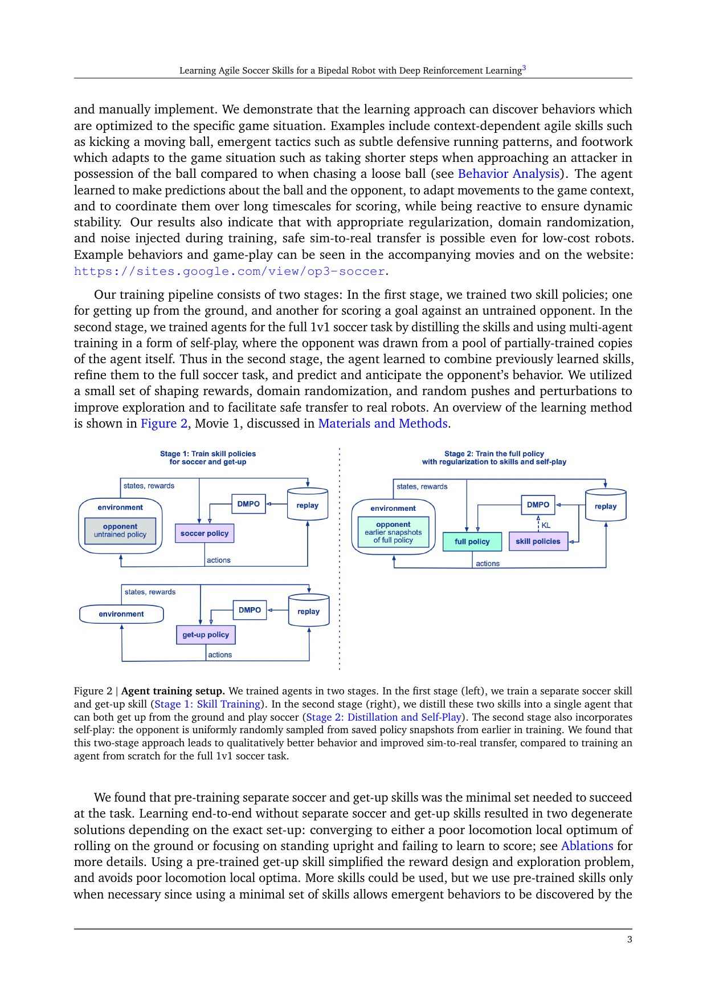
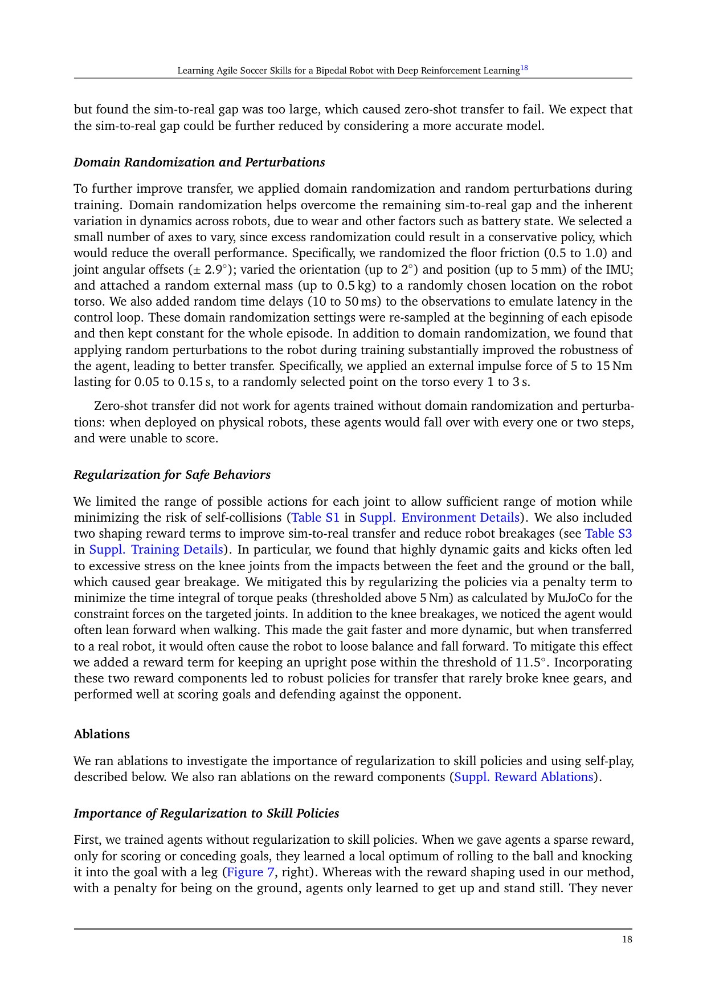

# Agile Soccer: Pretrain Get-Up and Ball Skills Before Self-Play

[中文版](../agile-soccer-2304.13653v2.md)

Source: [arXiv:2304.13653v2](https://arxiv.org/abs/2304.13653v2). Official training/deployment code was not public at the audited point.

> **Bottom line:** The system pretrains soccer and get-up teachers, distills the state-appropriate teacher into one 1v1 agent, and then learns tactics through a pool of historical self-play opponents. Its success comes from staged exploration and hardware-aware control, not from sparse end-to-end self-play alone.

## Engineering problem
From-scratch soccer agents fall before reaching ball rewards; hand-built skill switching is brittle. OP3 hardware adds fragile gears, control delay, and impact constraints that simulation-only speed optimization can exploit.

## Method
Separate soccer and key-pose get-up policies become teachers. A unified student receives state-routed KL regularization while optimizing game reward; teacher influence decreases as the student improves. Historical opponent snapshots prevent training only against the latest self. Position commands at 40 Hz, filtering, targeted randomization, perturbations, and behavior penalties support transfer.

## Key figures

The final controller is one policy; teacher routing is a training signal, not a runtime skill switch.

The table reports explicit scripted baselines and a 29/50 real versus 35/50 simulated set-piece result, preserving the transfer gap.

Without skill priors, sparse-reward policies exhibit lying or accidental ball-pushing behavior.

## Decisive evidence
Behavior-level hardware benchmarks and fixed-count set pieces are stronger than highlight matches. The failure of direct current-control transfer is also important: a theoretically direct action interface was less robust than the identified position-control path on this platform.

## Paper-to-implementation mapping
Without official code, audit interfaces are the two teacher trainers, state-routed distillation, snapshot opponent pool, randomization, action filter, and OP3 driver. These are functional boundaries, not invented author class names.

## Limits and evidence boundary
The system uses expert-designed get-up poses, rewards, routing, and tuning; self-play can be unstable. OP3 is a small protected robot and global state is supplied by motion capture. Results do not transfer safety limits to full-size humanoids or autonomous vision.

## Bounded engineering takeaway
Find the smallest skills that unlock exploration, distill them into one controller, and evaluate self-play against a frozen historical matrix. Measure each base skill independently before interpreting match win rate.

## Reproduction checklist
Lock teachers, routing, distillation schedule, opponent pool, rewards, action/filter interface, delay, randomization, and protection. Report walk/turn/get-up/kick tests, fixed set pieces, opponent matrix, falls, interventions, parts replaced, and continuous unedited failures.
