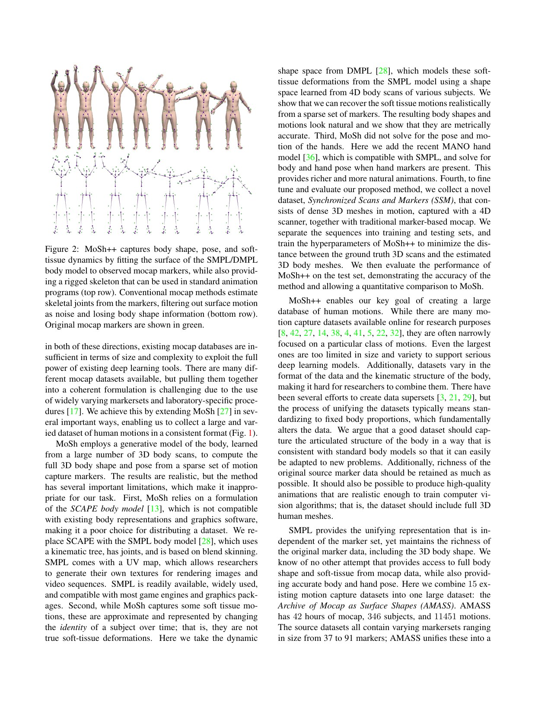
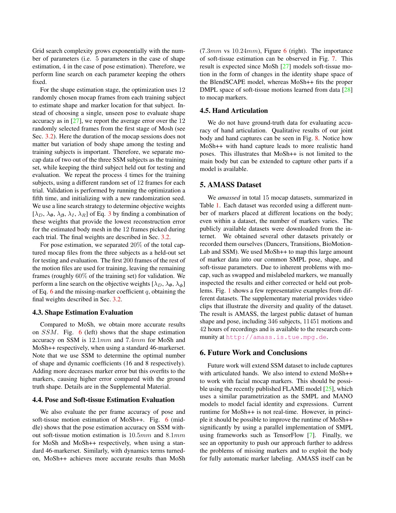
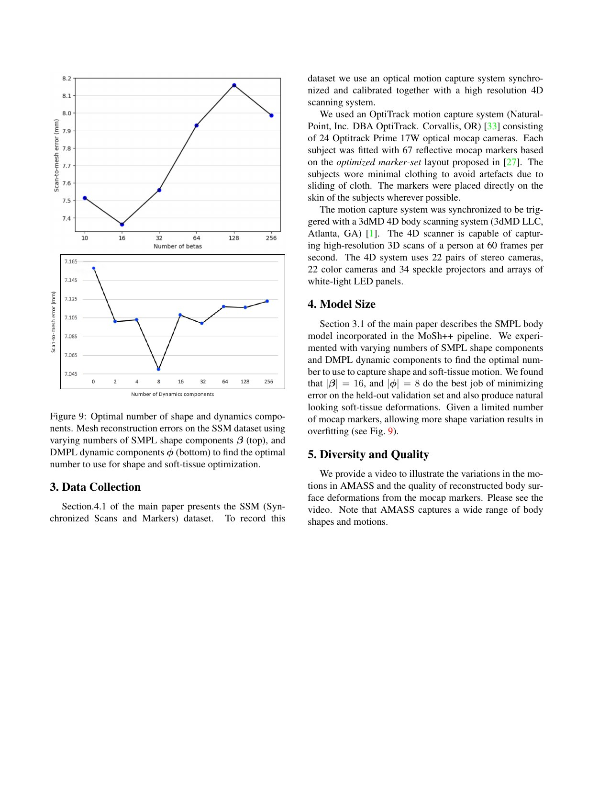

# AMASS: A Unified Human-Motion Corpus Is Not Yet Robot-Feasible Motion

[中文版](../amass-1904.03278v1.md)

Source: [arXiv:1904.03278v1](https://arxiv.org/abs/1904.03278v1). This reviewed brief covers the paper, its figures, and the pinned official preprocessing code; it does not redistribute the dataset.

> **Bottom line:** AMASS unifies heterogeneous optical motion-capture archives in one SMPL-H/DMPL representation. It does not enforce a robot's joint limits, contacts, torque limits, or balance. Treat corpus unification and robot feasibility as two separate gates.

## Engineering problem
Markers, skeletons, body scales, frame rates, and coordinate conventions differ across mocap archives. Training directly on those incompatible formats mixes representation errors with learning errors. AMASS provides a common human-body parameterization so downstream systems can reason over one data contract.

## Method
MoSh++ fits body shape, pose, hand articulation, and soft-tissue dynamics to marker trajectories, then exports a common temporal representation. This is a human-motion normalization layer: robot morphology mapping, contact repair, dynamics checks, and closed-loop tracking remain downstream responsibilities.

## Key figures

Figure 2 locates exactly where marker observations become a parameterized body sequence; no robot model appears in this path.

Figure 6 evaluates human-body reconstruction, not humanoid tracking or contact feasibility.

Figure 9 shows how shape and dynamic components affect reconstruction error, which helps choose the normalization representation but says nothing about actuator capacity.

## Decisive evidence
The controlled reconstruction comparisons support MoSh++ as a better common representation. The decisive negative fact is equally important: the experiments do not contain robot joints, torques, support polygons, or hardware rollouts.

## Paper-to-implementation mapping
The pinned official repository exposes dataset preparation, body-model loading, and archive conversion. Those functions verify the corpus interface. A robot pipeline must add explicit retargeting, contact labeling/repair, feasibility scoring, and policy-in-the-loop filtering rather than rename the AMASS output as robot motion.

## Limits and evidence boundary
Licenses differ across constituent datasets; access to AMASS does not erase source-dataset terms. SMPL-H fidelity and marker reconstruction quality also do not prove physical validity on a different morphology. No sim-to-real or robot-safety claim is supported here.

## Bounded engineering takeaway
Use AMASS as the canonical human-motion input layer. Version the source archive, body model, coordinate conversion, and frame rate, then create a separate robot-feasibility manifest whose pass/fail decisions are based on the target robot and controller.

## Reproduction checklist
Lock dataset licenses and versions; verify coordinate frames, units, joint order, timestamps, and body-model files; reproduce marker reconstruction checks; then report retargeting error, foot slip, joint-limit violations, torque margins, and closed-loop tracking as separate downstream metrics.
