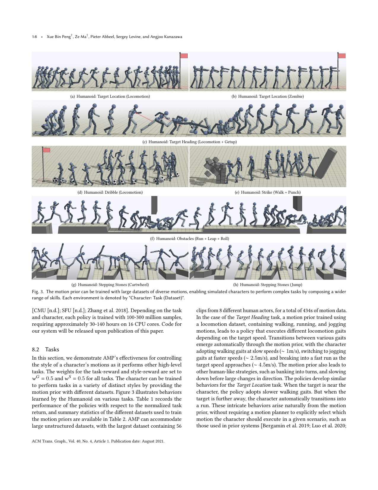
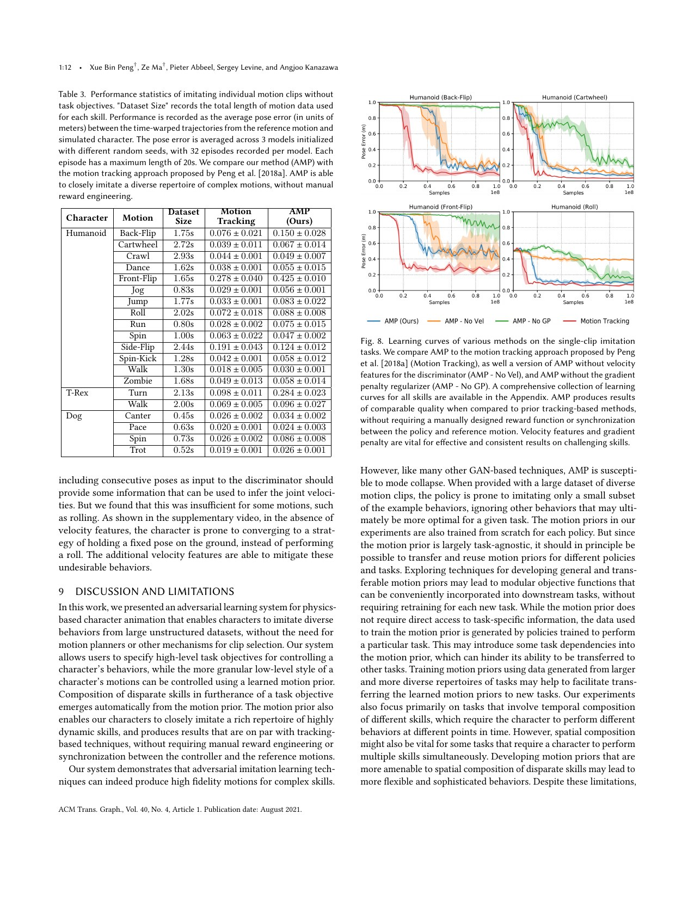

# AMP: Learn a Motion-Style Reward Instead of Selecting a Reference Clip

[中文版](../amp-2104.02180v2.md)

Source: [arXiv:2104.02180v2](https://arxiv.org/abs/2104.02180v2). Code claims are tied to the pinned official IsaacGymEnvs revision linked by the Chinese page.

> **Bottom line:** AMP trains a discriminator on short state transitions from motion data versus policy rollouts, converts its score into a task-agnostic style reward, and combines it with task reward. It removes explicit clip/phase selection but transfers reliability to motion coverage, feature semantics, and adversarial stability.

## Engineering problem
Reference tracking requires selecting a clip and synchronizing phase as the motion library grows. Simple smoothness, energy, and upright terms cannot distinguish natural transitions from stiff or frozen reward-hacking behavior.

## Method
A goal-conditioned policy optimizes task plus style reward. The least-squares discriminator compares demonstration and current/replay policy transitions using root-relative pose, velocity, and key-body features; gradient regularization stabilizes training. Task reward chooses what to do inside the motion prior's support.

## Key figures

Motion data enters the discriminator, while the policy also receives task goals; this is the interface-level separation.

The reported library reaches 56 clips in this paper's context; it should not be relabeled as today's internet-scale robot data.

Removing velocity can let static poses fool the discriminator, proving that feature choice is method semantics.

## Decisive evidence
Changing dataset content changes task behavior—walking versus punching versus their composition—and feature/regularization ablations reveal concrete reward hacking. These tests are more informative than discriminator loss alone.

## Paper-to-implementation mapping
The pinned code exposes AMP observation construction, demonstration sampling, discriminator reward combination, gradient loss, and current/replay buffers. Demonstration and policy transitions must share joint order, normalization, frame, history, and time interval.

## Limits and evidence boundary
AMP learns what resembles the dataset, not safety or optimal physics. Dataset artifacts are rewarded, missing recovery remains unsupported, and adversarial training may collapse. Results are simulated characters, not robot hardware or sim-to-real evidence.

## Bounded engineering takeaway
Start with one audited motion set and a simple task. Validate discriminator ordering on real, time-shuffled, and deliberately corrupted transitions before joint training; version data, retargeting, discriminator, replay, and policy together.

## Reproduction checklist
Lock motion manifest, retargeting, feature map, sample interval/history, demo/current/replay ratios, networks, regularization, task/style weights, and seeds. Report task success, style metrics, discriminator calibration, mode coverage, contacts, torque, and continuous failures.
