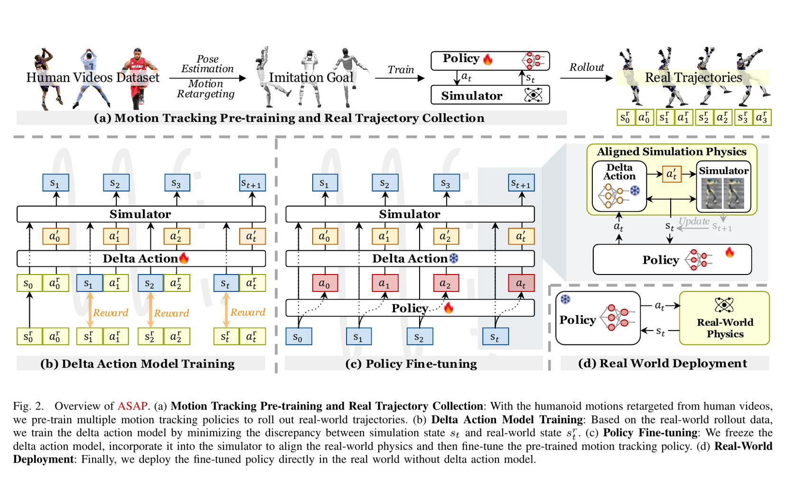
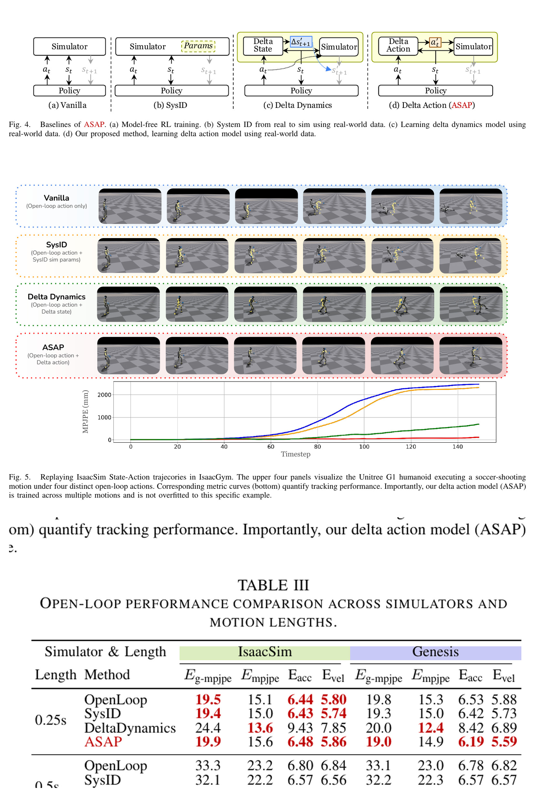
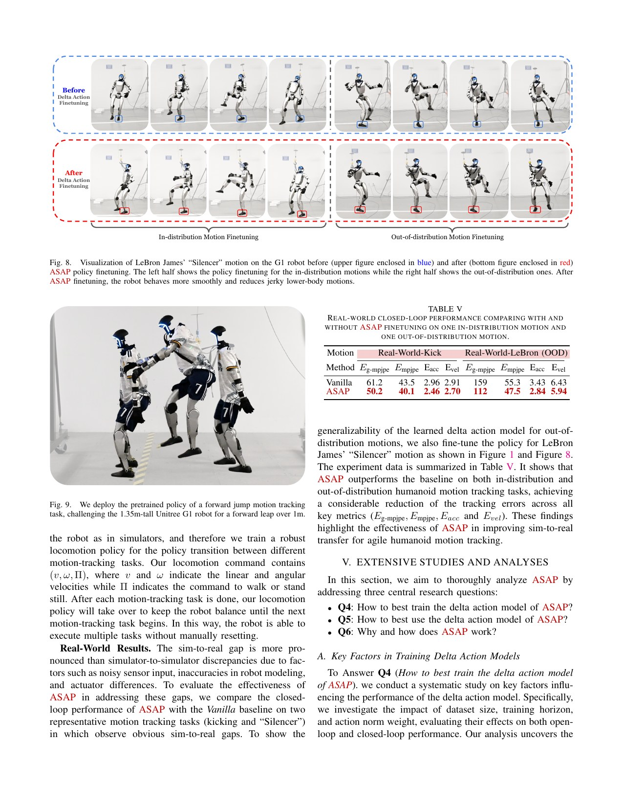

# ASAP: Align Simulation to Hardware with Learned Delta Actions

[中文版](../asap-2502.01143v3.md)

Source: [arXiv:2502.01143v3](https://arxiv.org/abs/2502.01143v3). Code mapping refers to the pinned official ASAP revision linked by the Chinese page.

> **Bottom line:** ASAP records real trajectories from a pretrained policy, learns a delta action that makes simulation reproduce the next real state, freezes that residual, and fine-tunes the main policy in the aligned simulator. Only the fine-tuned main policy runs on hardware.

## Engineering problem
Fixed-parameter system identification cannot capture every actuator, latency, and contact mismatch in agile motion. Yet collecting enough dangerous real trajectories for direct policy learning is expensive and damages hardware.

## Method
A residual policy receives simulated state and recorded action, outputs a small `delta a`, and is rewarded for matching the recorded next hardware state with minimal correction. The frozen residual becomes a training-time dynamics adapter. Real experiments learn only four ankle residuals from 100 clips, unlike broader simulation studies.

## Key figures

Read the stages in order: pretrain/collect, learn residual, fine-tune in aligned simulation, deploy without residual.

Cross-simulator replay separates delta action from system identification and delta dynamics.

Kick and the OOD Silencer motion improve, but two motions cannot establish a universal real-dynamics model.

## Decisive evidence
Lower open-loop error in IsaacSim and Genesis, followed by better closed-loop performance, supports alignment beyond one training engine. Hardware data is important but sparse and must be read with the reported overheating and damage during collection.

## Paper-to-implementation mapping
The pinned code exposes open-loop delta torque construction, minimal-action rewards, closed-loop main-plus-frozen-residual training, and dual-policy rollout. Verify that residual weights and normalization are frozen during main-policy fine-tuning.

## Limits and evidence boundary
A residual may absorb sensor/time-alignment or software bias rather than identify physical parameters. It is versioned by firmware, PD, battery, load, temperature, wear, sensors, and mocap. The paper reports hardware overheating/damage and limited real residual coverage.

## Bounded engineering takeaway
Treat delta action as an ODD-bound calibration artifact. First prove it reproduces held-out real failures and improves error over multiple horizons; then compare aligned fine-tuning with SysID, delta dynamics, and equal-norm noise.

## Reproduction checklist
Lock time alignment, firmware, robot state/action, residual joints, dataset coverage, horizon, residual norm, simulator, main policy, and safety protocol. Report errors by horizon and motion cluster, contact timing, residual distribution, failures, temperature/current, damage, and rejected high-risk data.
