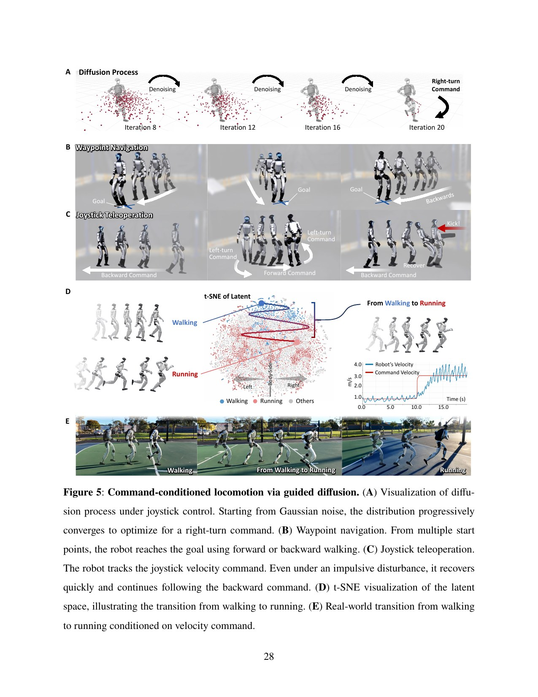

# BeyondMimic: Test-Time Composition with State–Action Latent Diffusion

[中文版](../beyondmimic-2508.08241v4.md)

Sources: [arXiv:2508.08241v4](https://arxiv.org/abs/2508.08241v4) · [official project page](https://beyondmimic.github.io/) · [official motion-tracking code](https://github.com/HybridRobotics/whole_body_tracking)

Review scope: the complete 34-page paper and supplement. The official repository is explicitly the motion-tracking layer; it does not establish that the CVAE, latent diffusion, and guidance stack are fully open-sourced.

> In one sentence: BeyondMimic first uses a compact tracking MDP to produce executable closed-loop data, then learns diffusion over future states and latent actions so differentiable costs can compose velocity, waypoint, keyframe, and obstacle goals at test time.

Key terms are general motion tracking (通用运动跟踪), conditional variational autoencoder (CVAE，条件变分自编码器), latent diffusion (潜扩散), test-time guidance (测试时引导), keyframe inpainting (关键帧补全), signed distance field (SDF，有符号距离场), adaptive sampling (自适应采样), and receding-horizon prediction (短视滚动预测).

## Engineering problem

A general tracker can replay motions in its database, while tasks often specify only speed, spatial waypoints, a future pose, or obstacle cost. Training a new policy for every combination scales poorly. Generating raw joints directly can produce discontinuities that the tracker has never seen.

BeyondMimic separates motion grammar from task intent. Closed-loop tracking data define likely executable state-action transitions; test-time costs push samples toward a request. The analogy is learning grammar before writing to a prompt, rather than inventing a new language for each sentence.

Composable costs are not automatically compatible constraints. A velocity request may cross an obstacle, a waypoint may demand a turn outside the 0.64 s horizon, and a keyframe may be unreachable from the current support state. Diffusion yields a probable compromise, not a formal feasibility or safety proof.

## Core insight

The generator's ceiling is set by tracking data. If the tracker fails at turns, airborne phases, or clip boundaries, diffusion learns motion grammar with the same holes. Adaptive resampling of difficult segments therefore repairs both tracking and the generation dataset.

Diffusing future state together with latent action makes task gradients useful. Waypoint and SDF costs can act directly on predicted states rather than indirectly guessing how raw action changes geometry. This resembles pulling a future route on a map rather than turning a steering wheel and inferring where the car might go.

Latent-space value needs ablation evidence. The paper's cross-MuJoCo cartwheel improvement from 5% without latent encoding to 95% with latent diffusion is the clearest support, but it remains one high-dynamic skill.

## Method: input → processing → output

The tracking layer expresses reference body positions and rotations in an anchor frame. A policy observes one robot-centric frame plus previous action and outputs joint-position targets. Reward uses one task-space tracking term and three regularizers for joint limits, action changes, and action magnitude. Difficult segments are reset more often according to failure rate.

Tracking rollouts are compressed with a conditional VAE. A diffusion model learns from past state/action-latent context to future states and latent actions. During denoising, gradients of differentiable task costs guide the sample. The newest proprioceptive observation decodes the current latent action, and the process repeats over a short horizon.

This architecture can reuse model weights across costs, but cost weights, horizon, feasibility gates, state estimation, and fallback remain task-specific engineering.

## How to read the key figures

Figures 2–4 show 34 selected motions totaling about 15 minutes on G1, including cartwheels, kicks, and running. They demonstrate that the compact tracking MDP can reach hardware across contact modes. They do not provide randomized per-motion success denominators, so video scale cannot substitute for failure rates.

Figures 5–7 should be traced from cost back to control: denoising generates a short future state/latent-action sequence; task gradients modify samples; current proprioception re-anchors the next step. This is receding-horizon generation, not an open-loop full-motion plan or global planner.

Figure 8 reports Rot6D stronger than quaternion/axis-angle, history worse in this minimal tracking setup, 5–10 ms added delay causing hardware failure, and adaptive sampling helping three of four hard motions avoid stagnation. “History hurts” is specific to this low-latency single-frame MDP and does not contradict papers where history addresses partial observability under different sensing.

## Strongest experiment

The 5%→95% cartwheel latent-space ablation most directly answers why diffusion is not performed in raw space, and the gap persists in MuJoCo. The representation, delay, and adaptive-sampling ablations explain why the first-layer data are viable. Waypoint and obstacle demonstrations establish capability cases rather than a universal planner.

A stronger reproduction should repeat latent/no-latent comparisons over several motion families, guidance costs, random seeds, and transition types. It should separately measure tracker failure, generator-cost conflict, state-estimator failure, and safety-supervisor intervention.

## Paper-to-code mapping

The author organization's MIT repository is labeled “BeyondMimic Motion Tracking Code,” so it supports only the first layer at symbol level.

- `tasks/tracking/mdp/commands.py` computes reference errors, initialization, and adaptive sampling for the tracking task.
- `tasks/tracking/mdp/rewards.py` implements the tracking objective and smoothness/limit regularizers.
- `events.py` and `terminations.py` define randomization events and termination boundaries.
- `Tracking-Flat-G1-v0` and `rsl_rl_ppo_cfg.py` expose the G1 task and PPO entry point.

The precise commit, Isaac Lab version, robot asset, and motion artifact must be frozen for reproduction. The public tree has changed after paper v4, and none of these symbols makes the latent generator, CVAE, or guidance inference officially open.

## Limitations and safety boundary

Author-stated limits include state-estimation error propagating into generation; a 0.64 s horizon too short for long-range planning; history trapping the model in periodic motion; guidance instability during high-variance transitions; awkward start/stop phases; and task-specific guidance tuning. Project demonstrations use MoCap for state and waypoint/obstacle setup.

Independent limits are lack of formal SDF collision guarantees, selected hardware motions, subjective naturalness evidence, and reliance on accurate modeling and very low latency. The open tracker reduces one uncertainty but cannot validate the closed generator.

Hardware needs collision, joint, torque, current, thermal, timeout, and emergency-stop supervision external to the probabilistic generator.

## Bounded engineering takeaway

Treat guided diffusion as a short-horizon control candidate. Test conflicting costs, infeasible targets, transition peaks, state-estimation bias, fixed/random/burst latency, and rejection behavior. “No retraining per task” must not be rewritten as “no per-task cost design.”

## Reproduction and acceptance checklist

For tracking, report each clip's length, reset sampling, failure rate, initialization, pose/velocity errors, contact termination, and adaptive weight. For generation, compare raw, action-latent, and state–action-latent models across horizons and motion families. Construct conflicts such as velocity through an obstacle or a keyframe incompatible with support, and log each cost residual, guidance-gradient norm, switch peak, and supervisor trigger. Timestamp estimation, diffusion, communication, decode, and PD execution separately; if 5–10 ms can break transfer, tail latency and clock skew belong in the ODD.
