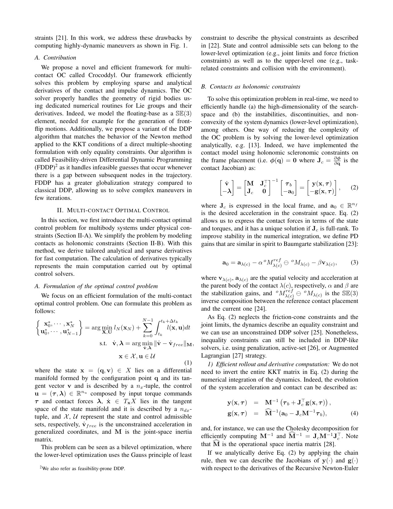
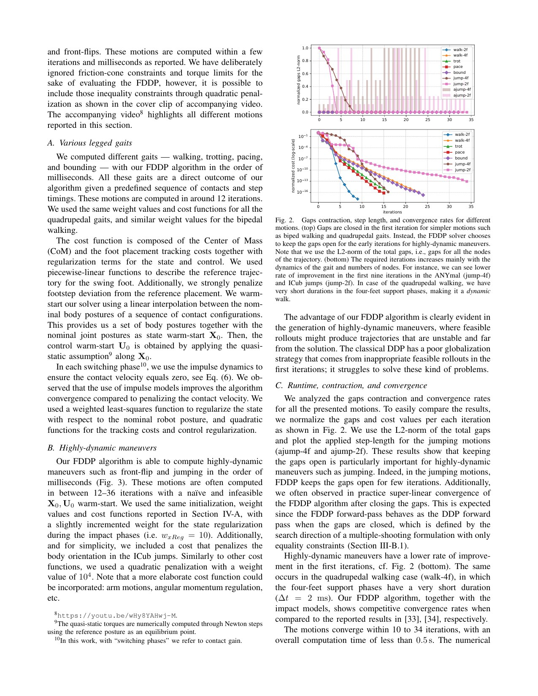
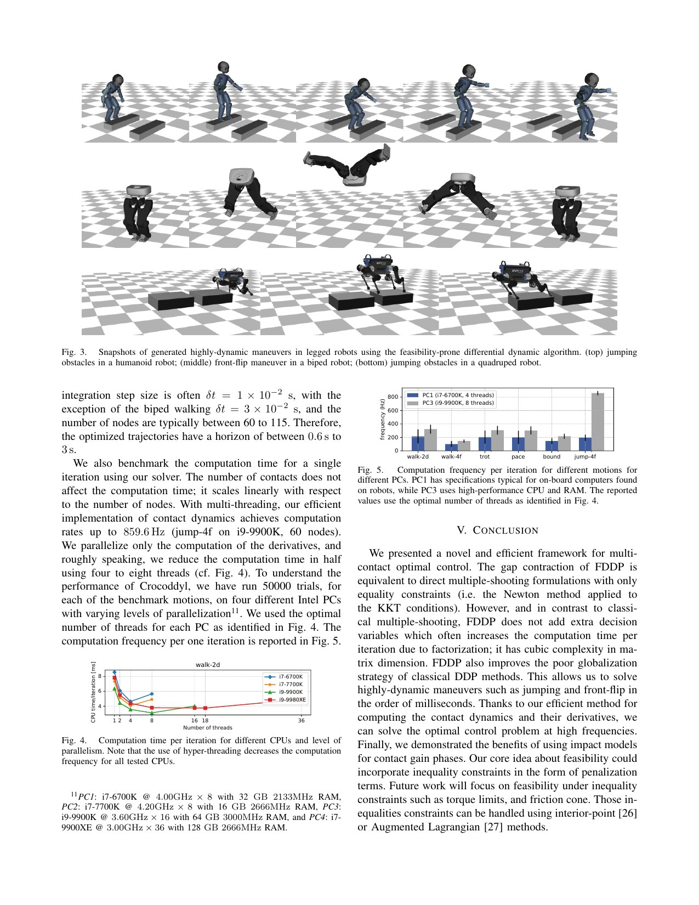

# Crocoddyl: Why Dynamic Multi-Contact Optimization Benefits from Temporary Infeasibility

[中文版](../crocoddyl-1909.04947.md)

Sources: [arXiv:1909.04947](https://arxiv.org/abs/1909.04947) · [pinned official code](https://github.com/loco-3d/crocoddyl/tree/46974c3c49ed956e41f8f95a329cf8537af7550b)

Review scope: the full seven-page paper, FDDP solver, contact forward-dynamics action model, and biped examples.

> In one sentence: Crocoddyl combines analytic derivatives, multi-contact dynamics, and Feasibility-Driven Differential Dynamic Programming to solve dynamic motions in tens of iterations, but the paper deliberately omits friction-cone and torque constraints from its evaluation.

Key terms include multi-contact optimal control (多接触最优控制), Differential Dynamic Programming (DDP，微分动态规划), dynamics gap (动态缺陷), feasible rollout (可行 rollout), forward dynamics (前向动力学), impact model (冲击模型), Lie-group state manifold (李群状态流形), and analytical derivatives (解析导数).

## Engineering problem

Trajectory optimization for whole-body control combines rigid-body dynamics, contact constraints, impacts, and non-Euclidean orientation. Classical DDP fully integrates every forward pass, keeping the candidate dynamically feasible. From a poor initialization in a jump or flip, that feasible rollout can immediately move far from a useful solution and defeat line search.

The problem resembles building a bridge from partially placed segments. Classical DDP insists that every segment connect during each attempt. FDDP permits temporary defects between shooting nodes, then contracts them while cost decreases. Feasibility becomes part of convergence rather than a prerequisite for every early candidate.

Contact derivatives are a second bottleneck. Numerical differentiation of rigid-body and constraint equations is expensive and noisy. Crocoddyl exposes contact dynamics, impacts, and manifold operations as composable action models with sparse analytic derivatives.

## Core insight

FDDP preserves shooting-node defects during line-search steps smaller than one and contracts them with the step. A full step closes the gaps. This is a numerical soft landing: approach the right basin before enforcing full dynamic continuity.

Equations 15–20 incorporate defects into the forward pass and expected improvement. The backward pass still builds local quadratic value approximations and feedback gains. Near a feasible trajectory, FDDP reduces to ordinary DDP, so one solver covers both regimes.

Equations 2–6 formulate holonomic contact forces, constrained acceleration, and impulse. State evolution on SE(3) uses manifold `integrate` and `diff` operations instead of treating rotation as a Euclidean vector.

## Method: input → processing → output

The user supplies robot state, control, contact sequence, node costs, and action models. Contact forward dynamics jointly solves acceleration and constraint force from mass, bias, and contact Jacobian. Contact gain or loss nodes apply an impulse model.

Starting from a potentially infeasible state/control warm start, the backward pass computes feedforward and feedback gains. The forward pass tests step lengths while updating states, controls, and defects. Dynamic maneuvers avoid the destructive full feasible rollout required by classical DDP.

Costs combine center of mass, foot placement, state, and control residuals. The paper uses shared weights across quadruped gaits and similar weights for biped walking. The output includes trajectory, controls, contact forces, and a local feedback policy suitable for receding-horizon use.

For algorithm isolation, evaluation deliberately excludes friction-cone and torque bounds. The authors note penalty-based inclusion, but the reported maneuvers are not proofs of hard inequality feasibility.

## How to read the key figures

Figure 1 and Equations 1–4 show a trajectory crossing contact phases whose action dynamics include holonomic constraints. Contact is not merely a foot-position cost.

Figure 2 shows gaps closing quickly for easy gaits but remaining open during early jump iterations. Cost accelerates after closure. This directly supports the “approach, then close” mechanism rather than a generic benefit from more iterations.

Figures 3–5 present flips, jumps, and iteration frequency across processors and node counts. A 60-node case reaches up to about 859.6 Hz per iteration, while motions take 12–36 iterations and under 0.5 seconds total. Per-iteration frequency is not closed-loop rate because initialization, termination, and iteration count matter.

## Strongest experiment

The strongest evidence combines Figure 2's gap/cost curves with convergence of multiple dynamic maneuvers from naive infeasible warm starts. Classical DDP can enter poor regions through a full feasible rollout, while FDDP contracts defects before converging.

The result does not establish hardware feasibility. The authors explicitly omit friction-cone constraints and torque limits. A hardware-oriented reproduction must add inequality violation, contact margin, peak torque, model perturbation, and closed-loop tracking metrics.

## Paper-to-code mapping

At commit `46974c3c49ed956e41f8f95a329cf8537af7550b`, `include/crocoddyl/core/solvers/fddp.hxx` implements `computeDirection`, `backwardPass`, `forwardPass`, and `expectedImprovement`, covering FDDP direction, defect-aware rollout, and acceptance.

`include/crocoddyl/multibody/actions/contact-fwddyn.hxx` implements contact forward dynamics and derivatives. `examples/biped_gaits_fwddyn.py` and humanoid examples compose contact/impulse action models and costs. Pin Pinocchio, linear algebra, compilation, and assets for runtime comparison.

## Limitations and safety boundary

The authors explicitly state that friction cones and torque limits are ignored and identify inequality constraints as future work. Reported dynamic maneuvers are optimized in models, and contact sequence is predefined rather than discovered.

Independent limitations include sensitivity to model and Jacobian accuracy, rigid impact approximations, cost weights that permit high torque or slip, and warm-start and regularization effects on tail latency. Gap convergence does not guarantee a safe basin.

Offline output requires friction, torque, velocity, collision, and impact checks. Online use needs iteration deadlines and a verified fallback controller. Holding the previous command after solver failure may itself be unsafe.

## Bounded engineering takeaway

Crocoddyl is a classical anchor for composing contact dynamics, manifold state, analytic derivatives, and defect-aware shooting. FDDP is especially valuable for poor initialization and dynamic contact switches.

“Milliseconds” describes optimization throughput under the tested model and task. Performance and success must be remeasured after realistic inequalities, uncertainty, and closed-loop tracking are added.

## Reproduction and acceptance checklist

Pin commit, Pinocchio, compiler, BLAS, threads, CPU, robot model, and contact sequence. Log gap, cost, step, regularization, and acceptance for every iteration and compare DDP and FDDP from identical warm starts.

Report node count, timestep, iteration distribution, and end-to-end time per maneuver. Add poor warm starts, inertia error, and contact-timing perturbation. Then enforce friction, normal force, joint, torque, and collision limits and report maximum violation and margin.

After simulation tracking, stage hardware through static contact, slow gait, and tethered dynamic motion. Every deadline miss must invoke an explicit fallback. Temporary dynamic gaps are a convergence device, never permission to omit safety constraints.
