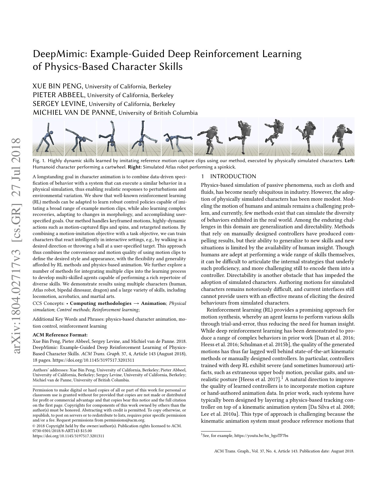
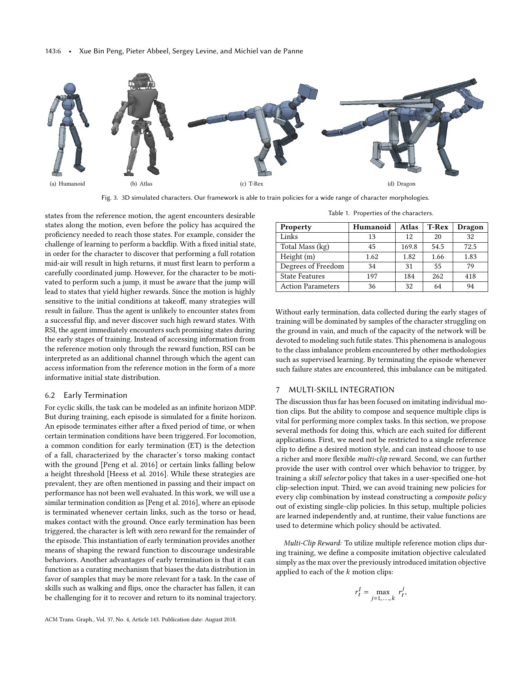
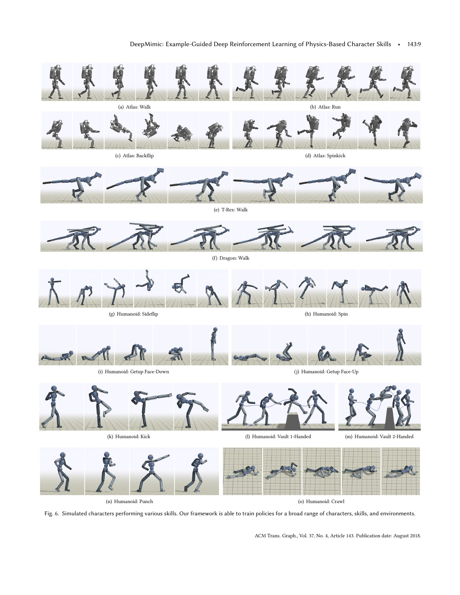
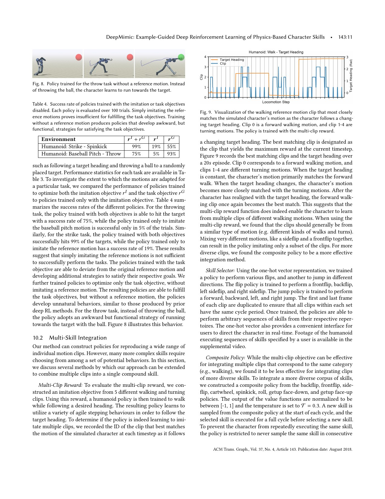

# DeepMimic: Reference Motion, Task Goals, and Curriculum for Dynamic Physical Skills

[中文版](../deepmimic-1804.02717.md)

Sources: [arXiv:1804.02717](https://arxiv.org/abs/1804.02717) · [pinned official code](https://github.com/xbpeng/DeepMimic/tree/1f915c52fcd4b95b5f5f15b759ae91bd81e9a801)

Review scope: the complete eighteen-page paper and supplement, including algorithms and curves, plus official imitation-reward and PPO code. The work controls simulated characters, not real humanoid robots.

> In one sentence: phase-conditioned PD policies combine imitation and task reward, while reference state initialization (RSI) and early termination (ET) make flips, recovery, and combat learnable; this demonstrates guided exploration, not direct sim-to-real transfer.

Key terms include example-guided reinforcement learning (示例引导强化学习), motion imitation (动作模仿), reference state initialization (参考状态初始化), early termination (提前终止), phase variable (相位变量), PD targets (比例—微分目标), composite policy (复合策略), skill selector (技能选择器), and proximal policy optimization (近端策略优化).

## Engineering problem

Backflips, spin kicks, and getting up have sparse rewards. A task-only learner rarely discovers them, while joint playback cannot adapt to disturbance and may conflict with morphology. Reference motion must narrow exploration without eliminating feedback adaptation.

Starting every episode at frame zero exposes only early motion during initial learning. Continuing after a fall fills the buffer with useless struggle. RSI opens the training book at random chapters, and ET replaces a problem after an obvious failure.

Imitation and task success can conflict. A throw can look natural and miss, while task-only behavior may carry the ball to the target. Both objectives and their metrics must remain visible.

## Core insight

State contains local link pose and velocity plus normalized phase. Actions are joint PD targets at 30 Hz, with Bullet at 1.2 kHz, and the network has 1024 and 512 hidden units. Phase is a progress bar that removes timing inference from the policy.

Imitation reward combines pose, velocity, end effector, and center of mass, with paper weights approximately 0.65, 0.10, 0.15, and 0.10. Exponentials smooth local error, but scales and weights are manually authored.

RSI initializes from arbitrary reference times, exposing the full clip early. ET stops episodes after abnormal critical-body contact. Together they form an implicit curriculum from local recovery around reference states to complete skill execution.

## Method: input → processing → output

Each clip provides reference pose and velocity. Current state and phase produce PD targets; the environment combines imitation and task reward. PPO uses batch 4096, minibatch 256, `γ=0.95`, `λ=0.95`, and clip 0.2. A typical skill consumes about 60M samples and two days on eight CPU cores.

Multi-clip reward takes the maximum over clips, a one-hot selector requests a skill, and composite policy selects among trained value functions. These are explicit integration mechanisms rather than one universal latent skill space.

Tasks include heading, throwing, striking, and obstacles. Characters include a 34-DoF humanoid, Atlas, T-Rex, and dragon. Morphology breadth remains entirely in simulation.

## How to read the key figures

Figure 1 shows cartwheel and Atlas spin kick. It establishes physically responsive animation, not seed variance, failure rate, or hardware impact.

Figure 3 and Table 1 show multiple character dimensions. The nearby RSI/ET discussion gives the reusable training structure: initialize over the full reference distribution and remove obvious failures.

Figure 6 spans locomotion, flips, get-up, vault, punch, and crawl. Each still requires reference data, gains, and training; this is not zero-shot general control.

Table 4 reports strike success of 99% combined, 19% imitation-only, and 55% task-only; throw is 75%, 5%, and 93%. Task-only throw scores higher by exploiting behavior such as running toward the target, proving that success and style are distinct.

## Strongest experiment

The task ablation is the strongest result. Reference reward constrains solution style, while goal reward adapts it to the environment. Strike shows complementarity, and throw exposes a style-success trade-off.

Simulated 0.2-second pelvis pushes reach approximately 720 N for running and 690/600 N for spin kick directions. These character-specific simulation values are not robot safety thresholds.

## Paper-to-code mapping

At commit `1f915c52fcd4b95b5f5f15b759ae91bd81e9a801`, `DeepMimicCore/scenes/SceneImitate.cpp::cSceneImitate::CalcRewardImitate` computes pose, velocity, end-effector, root, and CoM exponential reward components.

`learning/ppo_agent.py::_build_losses` and `_train_step` implement ratio clip 0.2, advantage clip 5, clipped actor surrogate, critic loss, and optimization. Configuration, motion files, and the C++ environment are also required.

## Limitations and safety boundary

The authors explicitly identify fixed phase timing, small clip sets, manually tuned PD gains, days per skill, and hand-designed state metrics and weights. Multi-clip methods may use only a subset of data.

Independent limitations include mostly single-seed evidence, ET suppressing recovery distribution, inconsistent mocap contact, idealized high-rate PD, and absent sensor, delay, thermal, and structural-impact models.

Do not deploy flips or kicks from simulated push robustness. Robot-specific retargeting, contact repair, torque/speed/power/collision limits, protected landing, tethering, emergency stop, and thermal monitoring are mandatory.

## Bounded engineering takeaway

Reference reward specifies the kind of solution, task reward specifies the job, RSI covers the clip, and ET controls failure samples. Removing one can produce either no learning or a high-scoring wrong behavior.

Modern WBC can replace fixed phase with controllable timing or motion priors while preserving separate imitation and task metrics. A single weighted return should not hide their conflict.

## Reproduction and acceptance checklist

Pin simulator, XML, clips, frame rate, gains, reward, PPO, commit, and seeds. Unit-test phase wrap, interpolation, quaternion distance, ET contacts, RSI sampling, and 30 Hz to 1.2 kHz stepping.

Reproduce RSI/ET and Table 4 across seeds. Report pose, endpoint, CoM, task success, falls, energy, and shortcuts. Test reference speed, contact offset, and morphology changes.

Before robot transfer, add actuator and estimator models, limits, collision, and impact envelopes. Stage amplitude with tether, stop, isolated workspace, and mechanical and thermal supervision.

> **Engineering judgment:** reference motion matters because it tells sparse task reward which kind of success is actually desired.
