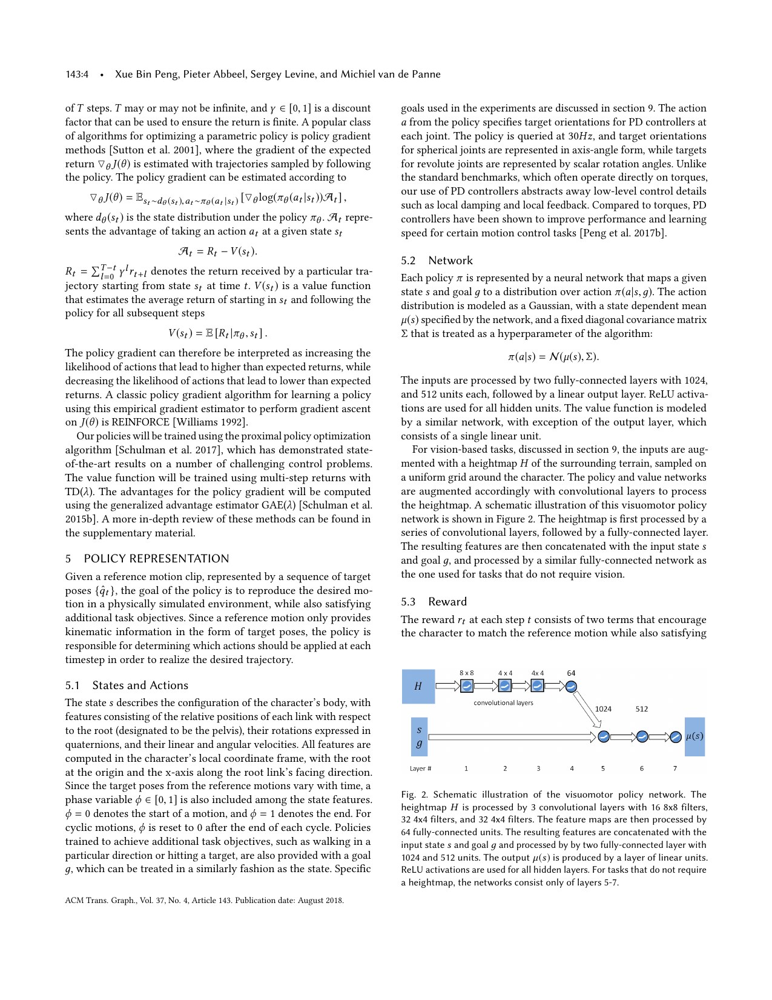
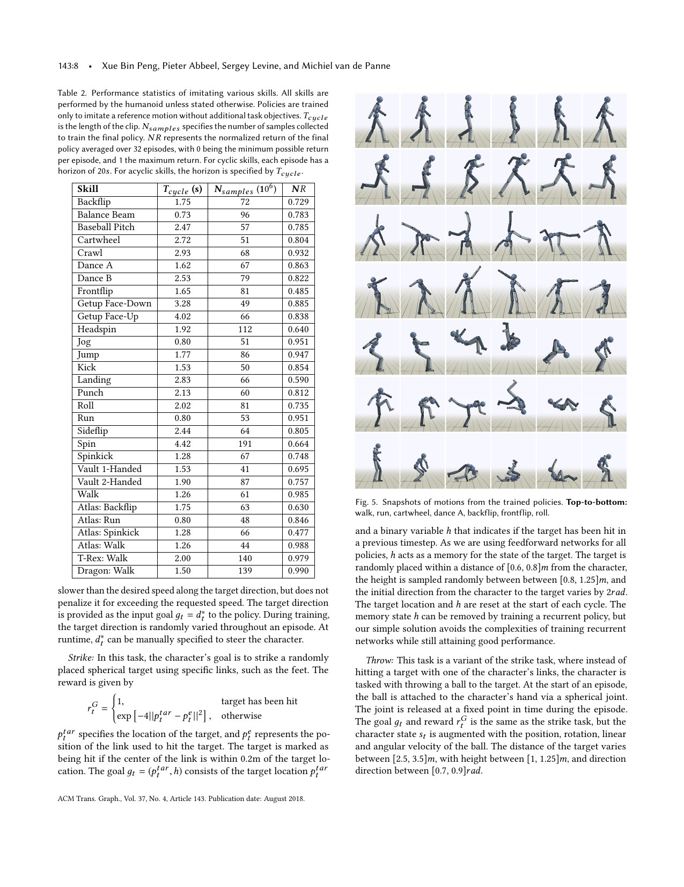
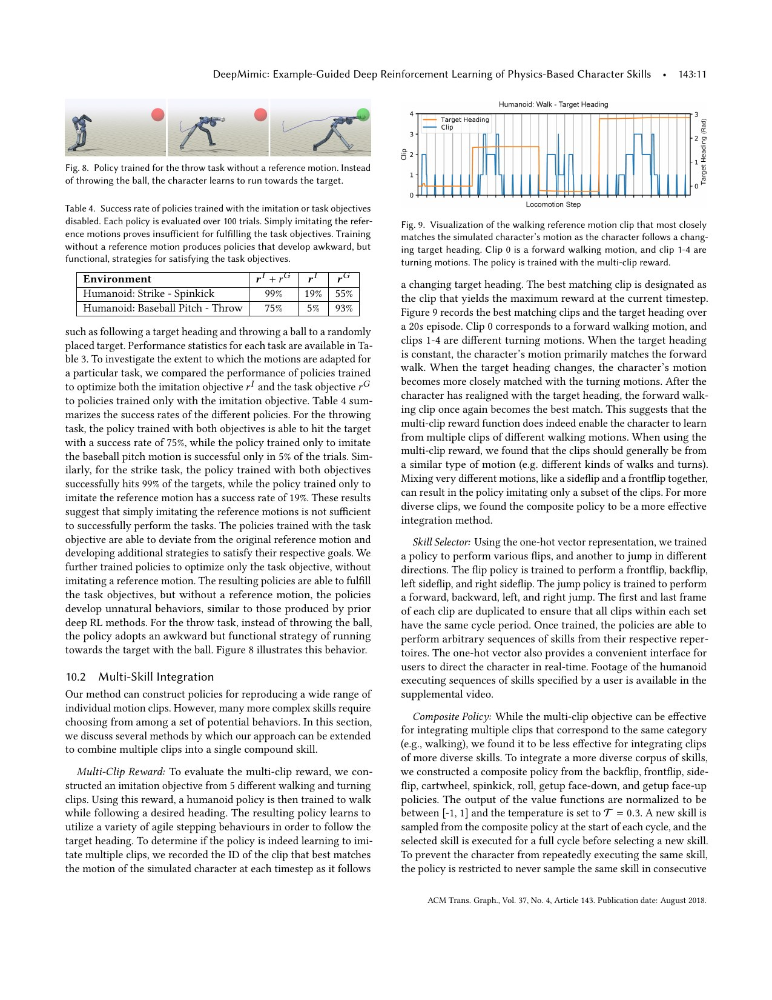

# DeepMimic: Separate Reference Imitation from Task Achievement

[中文版](../deepmimic-1804.02717v3.md)

Source: [arXiv:1804.02717v3](https://arxiv.org/abs/1804.02717v3). Code facts refer to the pinned official DeepMimic repository linked by the Chinese page.

> **Bottom line:** DeepMimic combines phase-conditioned reference tracking with task rewards, while reference-state initialization (RSI) and early termination (ET) reshape exploration for long, dynamic skills. It established a physics-based imitation pattern in simulation; it is not humanoid-robot sim-to-real evidence.

## Engineering problem
High-dynamic motion has narrow valid states and delayed success. Starting every episode at frame zero makes later phases hard to reach, and letting a failed character continue consumes samples far from the reference manifold.

## Method
The policy observes root-relative body state and phase, outputs joint targets through PD, and optimizes pose, velocity, end-effector, and CoM imitation plus task reward. RSI samples valid reference phases; ET stops invalid contacts or large deviation. Multi-clip variants use max reward, skill selectors, or value-based composition.

## Key figures

The figure proves explicit phase dependence and optional terrain input, not raw-vision understanding.

Breadth across separately trained characters does not imply one zero-shot cross-morphology model.

The ablation shows imitation controls style/quality while the task objective controls outcomes such as throwing or obstacle success.

## Decisive evidence
RSI/ET ablations explain sample efficiency, and task-versus-imitation comparisons show that looking correct and accomplishing the goal are independently measurable. Neither total reward can replace the other metric.

## Paper-to-implementation mapping
The pinned code exposes motion loading/phase, clip selection, reward and termination interfaces, and implicit-PD controllers. Porting to another simulator requires matching rotations, state, phase, PD, contact sets, and evaluation termination before comparing PPO results.

## Limits and evidence boundary
The method depends on synchronized phase, retargeting quality, character-specific servos, and mostly small motion sets. RSI and ET reduce experience far from reference states, so recovery is not automatically learned. All main results are simulated characters.

## Bounded engineering takeaway
Treat DeepMimic as a four-part baseline: phase-conditioned tracking, decomposed imitation reward, RSI, and ET. Report tracking and task success separately, then add robot feasibility and recovery tests for any hardware migration.

## Reproduction checklist
Lock motion, retargeting, body model, frames, phase, PD, reward scales, RSI, ET, PPO, and seeds. Compare fixed-start/RSI, no-ET/ET, imitation-only, task-only, and combined training; report per-phase failure, contact, torque, task success, and recovery.
