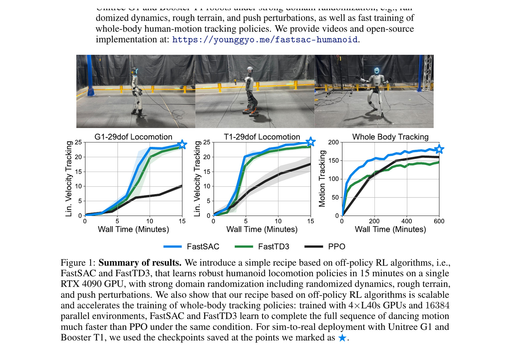
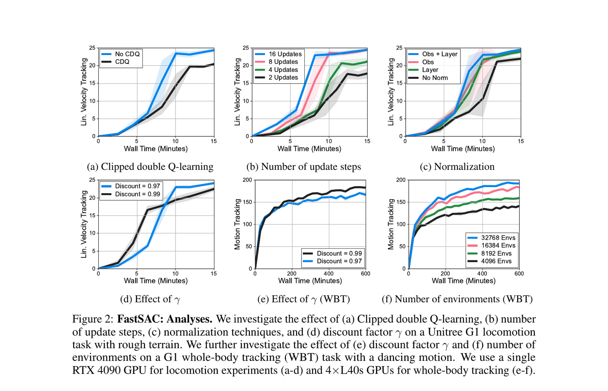
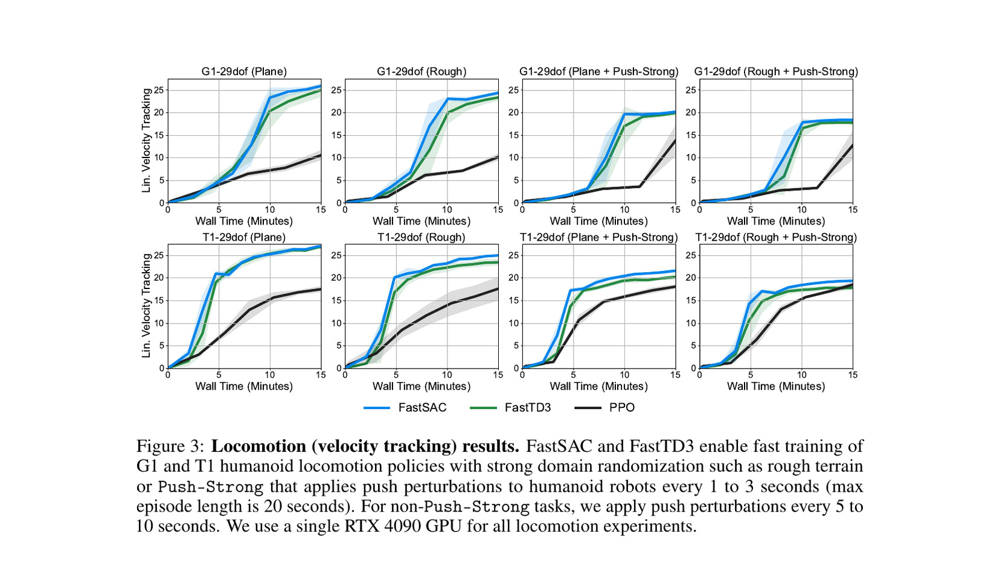
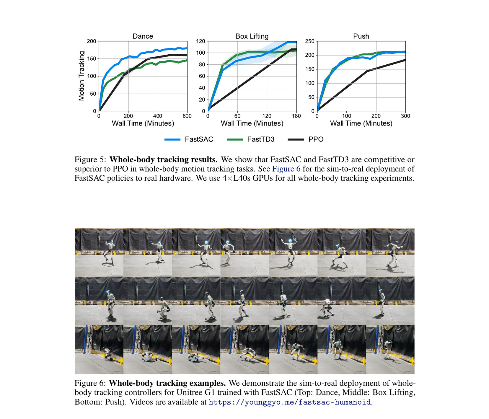

# Humanoid Locomotion in 15 Minutes: The FastSAC/FastTD3 Recipe and Its Boundary

[中文版](../fast-humanoid-locomotion-2512.01996.md)

Sources: [arXiv:2512.01996](https://arxiv.org/abs/2512.01996) · [pinned Holosoma recipe](https://github.com/amazon-far/holosoma/tree/6e146b0af5d7cd8a39b8bb2ed05b977cf70445d3) · [pinned FastTD3 repository](https://github.com/younggyoseo/FastTD3/tree/229ed59bbf43ea2f7a2d5d90d1076314839944d7)

Review scope: the complete twelve-page paper, all ablations and deployment examples, Holosoma FastSAC and G1 locomotion configuration, and the official FastTD3 algorithm repository. “Fifteen minutes” is interpreted only under the paper’s single-RTX-4090 locomotion conditions.

> In one sentence: replay, repeated updates, LayerNorm, average double Q, a C51 critic, low exploration, and compact rewards train G1/T1 locomotion on one RTX 4090 within fifteen minutes, while whole-body tracking uses four L40S GPUs and longer training, and hardware reliability is not statistically reported.

Key terms include off-policy reinforcement learning (离策略强化学习), experience replay (经验回放), Soft Actor-Critic (SAC, 软演员评论家), Twin Delayed DDPG (TD3, 延迟双评论家), distributional critic (分布式评论家), C51 categorical value distribution (类别分布价值), Layer Normalization (层归一化), target entropy (目标熵), and domain randomization (域随机化).

## Engineering problem

Humanoid RL often favors PPO because massive parallel simulation produces fresh on-policy data efficiently. Each transition is reused little, however, and wall time depends on rollout-update balance. Direct SAC or TD3 ports can fail under high-dimensional observations because replay becomes stale, critics become biased, exploration is excessive, and large-batch optimization is unstable.

Replay resembles a training hall that reuses a question bank: it extracts more learning from each transition, but a stale bank or biased grader can reinforce mistakes. The recipe also resembles race-car setup. A larger engine alone is insufficient; tires, gearing, brakes, and suspension must match. Speed comes from a coupled critic, optimizer, noise, reward, and simulator configuration.

## Method

FastSAC/FastTD3 combine many parallel environments with replay and multiple gradient updates. Instead of clipped double Q’s minimum, the critic target uses the average of two Q estimates. LayerNorm stabilizes high-dimensional input, and a C51 critic outperforms the scalar and tested quantile alternatives. Discount is 0.97 for locomotion and 0.99 for whole-body tracking, reflecting different useful horizons.

FastSAC caps pre-tanh standard deviation at one, initializes temperature alpha at 0.001, and auto-tunes it. Target entropy is zero for locomotion and minus half the action dimension for tracking. FastTD3 samples small Gaussian noise between 0.01 and 0.05. Optimization uses roughly 3e-4 learning rate, 0.001 weight decay, and beta2 0.95. Rewards remain under ten principal terms with curriculum, symmetry, and non-foot-contact termination.

### Input → processing → output

Locomotion rewards cover planar speed, yaw, foot height, default posture, foot orientation and crossing, survival, torso posture, and action rate. Rough terrain and strong pushes are introduced through curriculum, with physics randomization. Curves use wall time rather than environment steps, which is operationally useful but binds results to RTX 4090 throughput, environment count, and implementation.

Whole-body tracking reuses the algorithmic recipe on four L40S GPUs and 16,384 environments for dance, boxing, and push recovery. The authors show zero-shot transfer and a dance lasting more than two minutes. This establishes broader applicability, but it is not part of the single-GPU fifteen-minute locomotion claim.

## Key figures

Figure 1 puts locomotion and whole-body tracking together. Separate single-4090 locomotion from multi-L40S tracking before interpreting time, and distinguish qualitative hardware frames from repeated outcomes.

Figure 2 examines average versus clipped Q, replay on terrain, LayerNorm, discount, and entropy. It shows that poor critic and exploration choices—not an immutable property of off-policy learning—often cause failure.

Figure 3 compares G1 and T1 on plane, rough terrain, and strong pushes using one RTX 4090. Fast methods generally pass PPO within five to twelve minutes and reach strong returns by fifteen. The caption’s push interval and twenty-second episode are part of the result contract.

Figure 5–6 show multi-GPU tracking curves and hardware dance, boxing, and push examples. They support scalability to higher-dimensional tracking, but do not report trial count, fall rate, or peak torque.

## Decisive evidence

The strongest evidence combines Figure 2 and Figure 3. Ablations explain why conventional SAC/TD3 configurations fail, while equal-hardware wall-clock curves compare development time against PPO. This makes the result actionable: lock simulator throughput and update ratio, then verify critic, normalization, horizon, and exploration.

Hardware tracking is meaningful capability evidence but lower-grade reliability evidence. There are no repeated-trial distributions, cross-robot statistics, thermal runs, or failure taxonomy. Algorithmic efficiency can be reproduced separately from hardware acceptance.

## Paper-to-implementation mapping

The paper points the current recipe to Holosoma. At commit `6e146b0af5d7cd8a39b8bb2ed05b977cf70445d3`, `src/holosoma/holosoma/agents/fast_sac/fast_sac_agent.py::FastSACAgent` implements replay, C51 target update, temperature, and actor optimization through `_update_main`, `_update_pol`, and `learn`. `config_values/loco/g1/reward.py` and `managers/reward/terms/locomotion.py` define the G1 reward.

`config_values/loco/g1/curriculum.py`, `randomization.py`, and `termination.py` map to terrain/push progression, physics variation, and contact termination. The earlier official FastTD3 commit `229ed59bbf43ea2f7a2d5d90d1076314839944d7` exposes the algorithm and experiments. Reproducing this paper should prioritize Holosoma rather than assuming both repositories’ defaults are identical.

## Limits and evidence boundary

The authors explicitly do not present a standalone limitations section, but leave broader tasks, additional off-policy techniques, and comparisons to future work. The text clearly distinguishes single-GPU locomotion from multi-GPU tracking. The fifteen-minute result binds a 4090, environment configuration, twenty-second episodes, and push schedule.

Independent engineering limitations include return curves rather than hardware success rates; no repeated hardware failure, torque/current, or thermal reporting; strong dependence on simulator, GPU, buffer, precision, and update-to-data ratio; possible stale replay after curriculum changes; and no guarantee that compact rewards preserve safe posture on another platform.

Fast training must not shorten deployment validation. Every checkpoint needs action scale, observation scale, joint order, PD, delay, and saturation checks. Terrain and push tests require restraint, padding, emergency stop, and fall protection. “Train for fifteen minutes and deploy” exceeds the evidence.

## Bounded engineering takeaway

Reuse the wall-clock-oriented recipe and instrumentation. Under fixed hardware, record samples per second, updates per second, buffer age, critic distribution, entropy, action range, and return. If speed increases while critic tails or action jerk become unstable, fix stability instead of merely adding environments.

Treat fifteen minutes as a regression benchmark for a pinned G1/T1 task, not a product promise. Whole-body tracking deserves a separate compute budget and hardware acceptance page so the title does not hide its actual cost.

## Reproduction checklist

Pin GPU, driver, PyTorch, simulator, environment count, physics/control rates, replay size, batch, update ratio, C51 support, Q aggregation, LayerNorm, discount, exploration, alpha, rewards, curriculum, randomization, seeds, and both commits. Reproduce Figure 2, 3, and 5 wall-clock curves with uncertainty.

Log minute-by-minute samples, updates, utilization, memory, replay age, Q distribution, entropy, and action range. Ablate average/clipped Q, scalar/C51, LayerNorm, discount, target entropy, weight decay, and beta2. When changing GPU, report both equal-sample and equal-time comparisons.

Stage hardware through export consistency, MuJoCo sim-to-sim, suspension, stance, low speed, plane, weak push, and terrain. Record success, partial, fall, stop, slip, torque/current, temperature, and duration. Both the training-speed and deployment-safety pipelines must pass.

> **Engineering judgment:** fifteen minutes is a tightly scoped locomotion wall-clock benchmark; the transferable result is the recipe and measurement discipline, not a universal WBC time claim.
