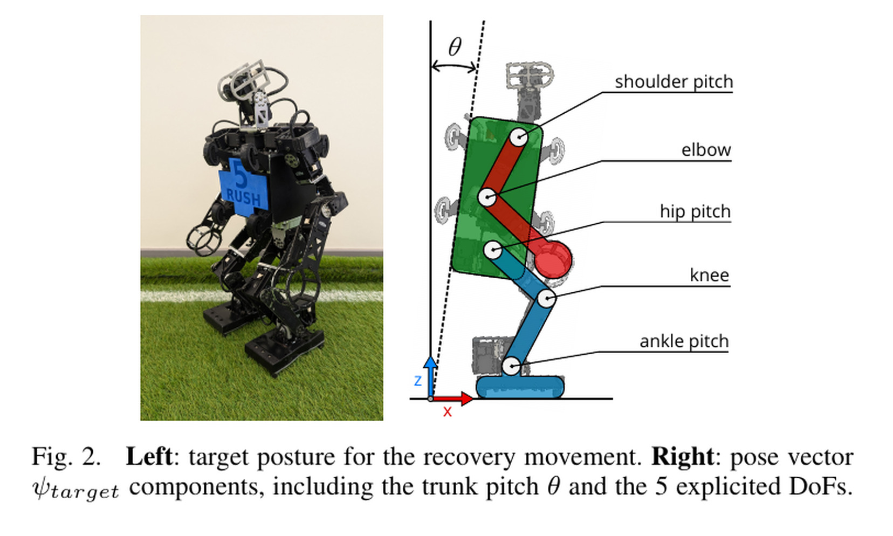
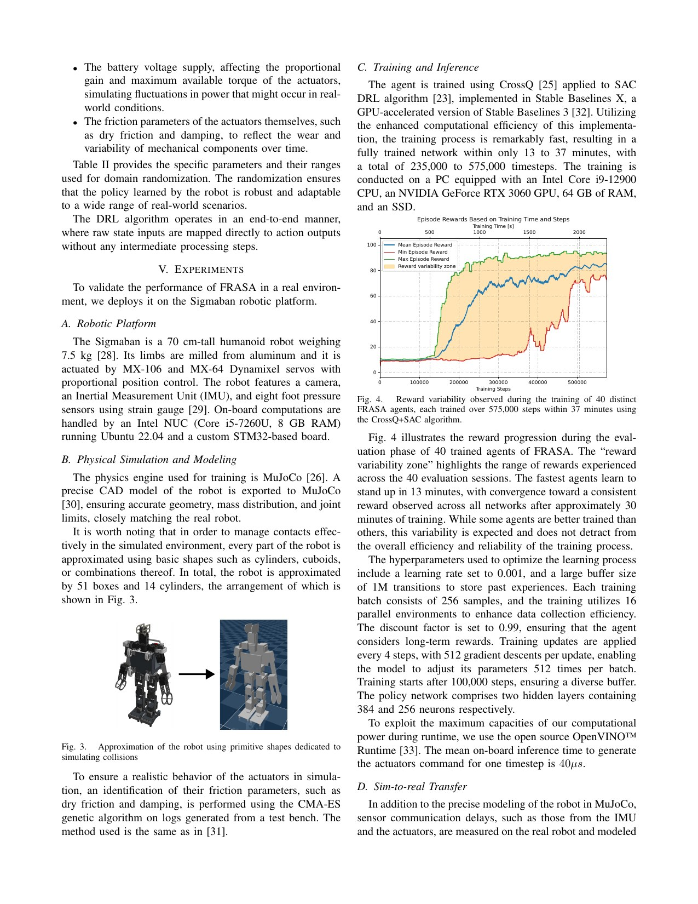
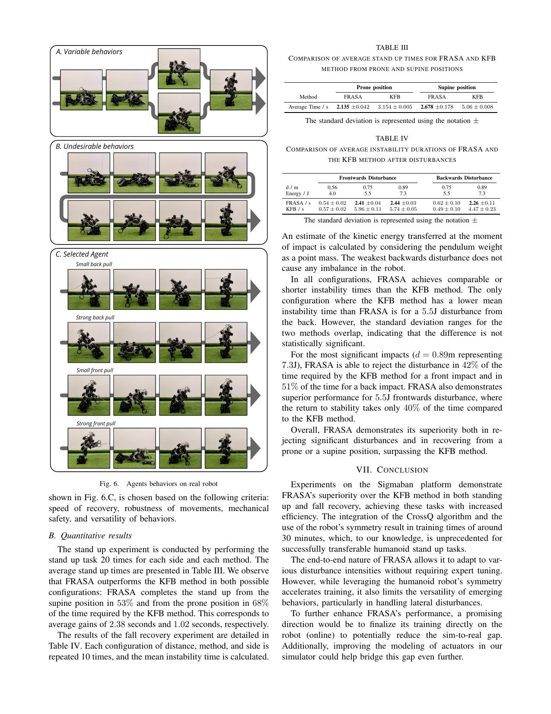

# FRASA: One End-to-End Policy for Disturbance Rejection, Fall Recovery, and Standing Up

[中文版](../frasa-2410.08655v3.md)

Sources: [arXiv:2410.08655v3](https://arxiv.org/abs/2410.08655v3) · [version-pinned official code](https://github.com/Rhoban/frasa/tree/78457df8fb1533b9bbda60a345c015c87cdf9732)

Review scope: the complete seven-page paper, all experiment tables, and the official MuJoCo training implementation at the pinned commit.

> In one sentence: FRASA uses Sigmaban's bilateral symmetry to reduce control to five sagittal joint groups, then trains one CrossQ/SAC policy from randomized falls so disturbance rejection can transition continuously into recovery and stand-up.

Key terms are fall recovery and disturbance rejection (跌倒恢复与站立抗扰), bilateral symmetry reduction (左右对称降维), incremental position target (增量位置目标), randomized fall initialization (随机跌倒初始化), CrossQ, Soft Actor-Critic (SAC，软行为者—评论家), sensor latency (传感延迟), and actuator randomization (执行器随机化).

## Engineering problem

Traditional stacks separate balance recovery from get-up with a hand-written mode switch. A large lean may still be recoverable, while a smaller-looking state may already be unrecoverable. Switching early abandons balance; switching late starts a scripted get-up from the wrong pose.

FRASA places standing and fallen states in one training distribution so the actor can transition continuously based on attitude and action history. This removes an external discrete switch but does not mean the policy has no internal phase; state trajectories may still reveal learned implicit phases.

Random fall initialization creates sparse reward because early behavior rarely approaches the target stand. A small probability of resetting near the target exposes high-return states to the critic, allowing value information to propagate outward. The technique is a structured prior, not unassisted discovery.

## Core insight

Bilateral symmetry is a powerful, platform-specific prior. For sagittal stand-up and front/back pendulum impacts, five shared actions greatly reduce exploration. The same reduction blocks lateral stepping, one-hand support, and asymmetric recovery when terrain or force breaks symmetry.

Action semantics also matter. The actor outputs joint velocity, integrated to position targets, so each step changes the goal incrementally. Observation includes current target and prior actions. This can reduce one-step jumps, but sustained bias still accumulates and requires clipping and termination.

Fast training does not remove engineering selection. Most agents learn within tens of minutes, yet authors reject policies with unacceptable stress or wear. Optimization generates candidates; mechanical review still determines deployability.

## Method: input → processing → output

Sigmaban's elbow, shoulder pitch, hip pitch, knee, and ankle pitch are represented as five symmetric groups. Observations contain these joint angles/velocities, current targets, torso pitch/angular velocity, and past actions. The actor outputs desired joint velocities integrated as `qᵈ_{t+1}=qᵈ_t+Δt·a_t`.

Reward combines proximity to target standing pose, action-change smoothness, and no self-collision. Each episode samples joint positions and torso orientation within physical limits, drops the robot, and lets it settle; a small share starts near standing. CrossQ/SAC trains with 16 parallel MuJoCo environments.

Randomization covers ground friction, trunk mass/CoM, battery voltage, gains/torque, damping/friction, encoder bias, and explicit 30 ms joint-velocity and 50 ms torso-attitude delays. The paper trains at 20 Hz but increases hardware inference to 100 Hz and lowers gains to reduce shaking.

## How to read the key figures

Figure 2 and Equations 1–3 define the main boundary: five actions are mirrored to left/right joints and integrated into position targets. The unified ability exists in a sagittal symmetric subspace, not the full humanoid action space.

Figure 4 reports 40 agents over 575k steps and roughly 37 minutes; the earliest learns around 13 minutes and performance converges after about 30. Table II documents friction, 3.28 kg trunk mass, CoM, voltage, actuator parameters, and delay. Wall-clock time remains hardware/software specific; interaction steps and seed distributions are the stable comparison.

Table III reports 20 hardware trials per prone/supine posture: FRASA takes 2.135±0.042 s prone versus KFB 3.154±0.005 s, and 2.678±0.178 s supine versus 5.06±0.008 s. Table IV uses a 0.9 kg pendulum at 4.0–7.3 J with ten trials per setting; at 7.3 J, forward/back recovery is 2.44/2.26 s versus KFB 5.74/4.47 s.

## Strongest experiment

Tables III–IV are unusually controlled hardware comparisons with repeated denominators and the same existing KFB baseline. They support faster sagittal recovery and stand-up for a 70 cm, 7.5 kg Sigmaban. They do not support lateral recovery, arbitrary humanoids, or a general impact-energy rating.

Pendulum energy omits contact duration, peak force, strike location, and fatigue. Hardware reproduction must begin below the paper energy and log joint loads, foot slip, structural inspection, and safety intervention.

## Paper-to-code mapping

- `StandupEnv.apply_control` and `StandupEnv.get_observation` mirror five controls to bilateral joints and build joint/torso/action-history state.
- `StandupEnv.step` integrates velocity action into clipped position targets and terminates on inversion, excessive angular velocity, or optional impact conditions.
- `StandupEnv.apply_randomization` and `StandupEnv.randomize_fall` randomize physical parameters and initial falls.
- `train_sbx.py` and `hyperparams/crossq.yml` register CrossQ and expose training hyperparameters.

The [pinned official repository](https://github.com/Rhoban/frasa/tree/78457df8fb1533b9bbda60a345c015c87cdf9732) is MIT licensed and contains MuJoCo training/evaluation plus the Sigmaban model. It does not package the complete real-robot safety integration as one-click deployment.

## Limitations and safety boundary

The authors explicitly state that symmetry prevents lateral/asymmetric motion; simple actuator modeling caused hardware vibration; gains and inference rate required manual change; some learned policies caused unacceptable stress and wear and were manually rejected; online hardware learning needs caution.

Independent limitations are invisible survivor bias from selecting among candidates and missing peak-load/fatigue reporting. Reproduction must record how many policies were produced, rejected, and why, with mechanical inspection and load evidence.

The 7.3 J pendulum is a test setup, not a safe impact rating. Hardware needs simulator termination tests, tether or soft capture, robot-specific position/velocity/current/temperature/contact bounds, independent emergency stop, a separated test area, and inspection intervals. Unknown-pose online exploration is out of scope.

## Bounded engineering takeaway

For a small, strongly symmetric robot and primarily front/back disturbance, use bilateral reduction as an explicit baseline and test one policy across balance and full fall recovery. Add asymmetric initial posture, side and oblique impacts, and one-sided support to draw the exact boundary created by that prior.

## Reproduction and acceptance checklist

Unit-test mirrored joint directions and limits. Plot randomized torso/joint/contact distributions and near-target reset ratio, plus a no-near-target ablation. Document how the 20 Hz training action is integrated when hardware inference changes to 100 Hz; otherwise frequency changes also alter per-second target speed. Scan gain and inference rate separately. Report prone, supine, side, and asymmetric trials; front, back, side, and oblique impacts; all denominators, peak loads, slips, terminations, candidate rejections, and post-test inspections. Analyze state trajectories for implicit transitions rather than claiming one actor has no mode structure.
