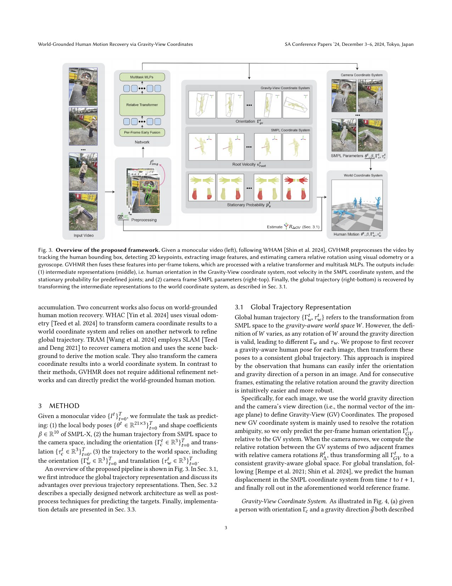
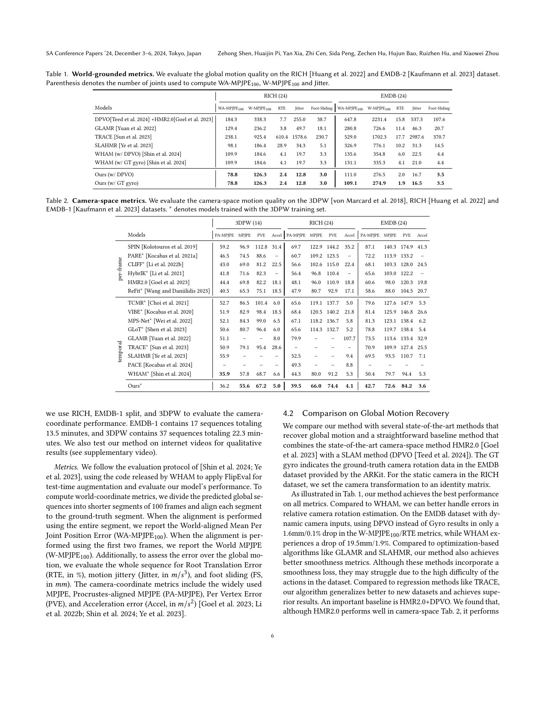
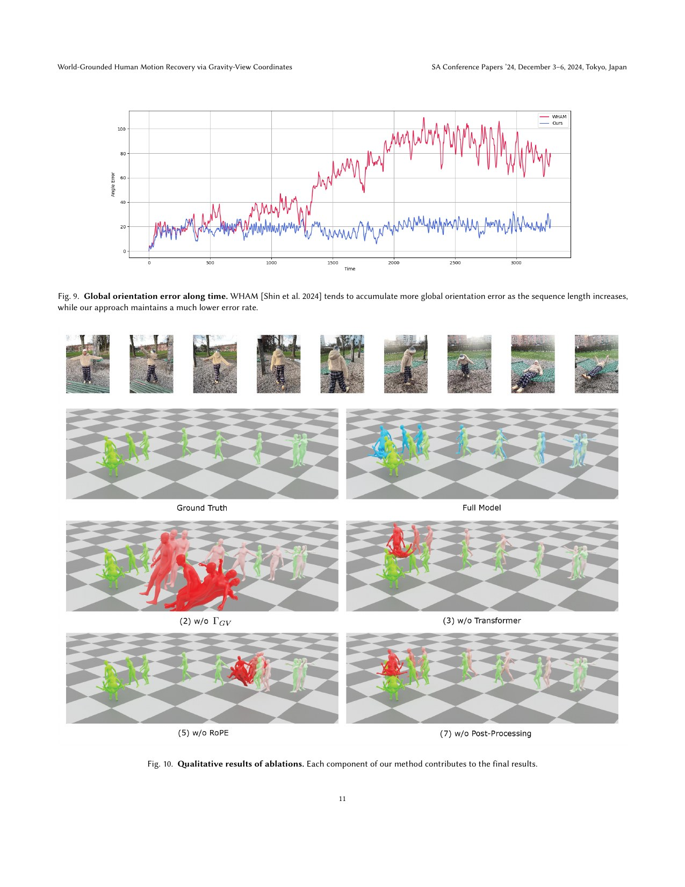

# GVHMR: World-Grounded Human Motion through Gravity-View Coordinates

[中文版](../gvhmr-2409.06662.md)

Sources: [arXiv:2409.06662](https://arxiv.org/abs/2409.06662) · [pinned official code](https://github.com/zju3dv/GVHMR/tree/6ec3ca39336c50492c0fae65fba2fb831fc7d866)

Review scope: the complete eleven-page paper, including appendices and references, plus the official inference pipeline, relative transformer, and stationary-joint post-processing at the pinned commit.

> In one sentence: GVHMR uses a Gravity-View coordinate to reduce pitch and roll drift in monocular world-motion recovery, but its visually grounded human trajectory is not yet a dynamically feasible robot reference.

Key terms include world-grounded human motion recovery (世界坐标人体运动恢复), Gravity-View coordinate (重力—视角坐标), camera ego-motion (相机自运动), root translational velocity (根平移速度), stationary-joint probability (静止关节概率), inverse kinematics (IK，逆运动学), and rotary positional embedding (RoPE，旋转位置编码).

## Engineering problem

Internet video is an attractive source of motion data, but a person moving in a hand-held camera is not observed in a stable world frame. Apparent displacement mixes human motion, camera rotation, camera translation, scale ambiguity, and detection error. A camera-frame sequence can therefore look locally plausible while drifting across the floor or tilting the body when the camera pitches.

This matters directly to humanoid data engineering. A tracker may interpret visual root drift as a commanded velocity, and an incorrect stationary-foot label may be turned into a hard-looking contact by inverse kinematics. A production pipeline must separate world consistency from robot feasibility rather than treating a visually smooth animation as control-ready data.

Conventional pipelines often estimate the body and then use visual odometry or SLAM to transform it into a world frame. The two estimates can accumulate different errors. GVHMR asks whether gravity and view direction can form a representation in which the better-observed rotational components are anchored explicitly.

## Core insight

The Gravity-View frame is defined by world gravity and the camera viewing direction for each image. The network predicts human orientation relative to this per-frame frame, then uses relative camera rotation to bring those orientations into one gravity-aligned world frame. It is like leveling a map with a plumb line before joining its headings: pitch and roll receive a repeated physical anchor, while yaw still has to be connected over time.

The second insight is to predict quantities with distinct meanings: local SMPL-X pose, orientation in the GV frame, root velocity in the body coordinate, and a stationary probability for selected joints. This factorization makes the output easier to diagnose than one opaque absolute world-pose vector.

The representation does not remove all accumulation. World translation is still rolled out from velocity, and heading around gravity still depends on relative rotation. The contribution is a better-conditioned drift structure, not monocular physical ground truth.

## Method: input → processing → output

The input is a monocular RGB sequence. Pre-processing obtains person boxes, 2D keypoints, image features, and relative camera rotation from visual odometry or a gyroscope. Per-frame early fusion produces tokens processed by a relative transformer with RoPE and a bounded receptive field. The reported model uses training clips of length 120, twelve layers, eight attention heads, and a hidden width of 512.

Multitask heads predict local SMPL-X pose and shape, human orientation in the GV coordinate, root translational velocity in the SMPL coordinate, and stationary-joint probability. Around Equation 1 and Section 3.1, per-frame GV orientation is aligned using relative camera rotation; local velocity is rotated into the world and integrated to recover root translation.

Post-processing detects joints expected to remain stationary over a temporal interval and applies IK to stabilize them in the world. This behaves like adding foot pins to an animation. It can reduce visible sliding, but a wrong stationary prediction can conceal a network failure by distorting the body. Raw and post-processed trajectories should both be retained.

The outputs are SMPL-X motion in camera and world coordinates, an estimated camera trajectory, and a contact-like corrected sequence. Robot use requires additional skeleton retargeting, joint limits, collision checking, support constraints, friction, torque, and velocity limits, none of which are objectives of GVHMR.

## How to read the key figures

Figure 3 should be read from visual preprocessing to structured intermediate variables and then world recovery. The three middle outputs—GV orientation, SMPL root velocity, and stationary probability—are deliberately separable. The camera-coordinate and world-coordinate outputs also show why coordinate metadata must accompany every saved matrix.

Tables 1–2 contain the main quantitative evidence. On RICH with DPVO, GVHMR reports WA-MPJPE 78.8 and W-MPJPE 126.3, compared with WHAM at 109.9 and 184.6. On EMDB, it reports 111.0, 276.5, and RTE 2.0%, versus WHAM at 135.6, 354.8, and 6.0%. These results support improved world recovery, not robot contact accuracy.

Figure 9 explains the representation more directly than a rendering montage. Gravity repeatedly corrects pitch and roll instead of allowing all three rotational components to integrate freely. Residual error remains, so the correct reading is reduced drift rather than drift elimination.

## Strongest experiment

The strongest evidence is the consistent improvement on RICH and EMDB world metrics together with the long-sequence orientation comparison in Figure 9. The paper also reports roughly 0.28 seconds for the core network on 1,430 frames, while preprocessing takes about 46 seconds. Engineering throughput must include the complete pipeline rather than quoting network-only latency.

A robot-data reproduction should add ground-truth root velocity, foot sliding, contact precision, and pelvis heading where available. After retargeting, it should measure joint-limit violations, self-collision, support margin, inverse-dynamics residual, and friction-cone margin. Only samples passing both visual and robot feasibility gates should enter a tracking corpus.

## Paper-to-code mapping

At commit `6ec3ca39336c50492c0fae65fba2fb831fc7d866`, `hmr4d/model/gvhmr/pipeline/gvhmr_pipeline.py` and its `forward` method organize features, network outputs, and global recovery. The same file's orientation composition and `rollout_local_transl_vel` correspond to the transformation and velocity integration described in Section 3.1.

`hmr4d/network/gvhmr/relative_transformer.py` implements temporal processing, while `hmr4d/model/gvhmr/utils/postprocess.py::pp_static_joint` applies stationary-joint correction. A reproduction should export tensors at these boundaries and pin DPVO, 2D detection, camera intrinsics, and SMPL-X versions, not merely compare final videos.

## Limitations and safety boundary

The authors explicitly expose dependence on camera-rotation estimation, 2D detection, and image preprocessing, and world translation is accumulated from local velocity. Their experiments evaluate human motion recovery rather than robot joint, torque, or contact constraints. Stationary-joint IK is a post-process and cannot prove physically correct loading.

Independent engineering limitations include DPVO failure under weak texture, fast rotation, or dynamic backgrounds; monocular scale ambiguity; heading drift without an absolute yaw anchor; and false stationary predictions that manufacture contacts. A data pipeline must retain uncertainty and failure flags instead of allowing post-processing to overwrite them silently.

No trajectory derived from GVHMR should be sent directly to hardware. Robot retargeting and offline dynamics checks come first, followed by simulation tracking and staged suspended, low-gain, tethered, and low-speed acceptance. Hardware joint, torque, velocity, thermal, and impact limits do not come from SMPL-X.

## Bounded engineering takeaway

GVHMR is a strong upstream candidate generator for world-consistent human motion from a moving monocular camera. Saving camera estimates, raw outputs, stationary probabilities, corrected outputs, and coordinate metadata makes failures auditable.

It is not a robot motion retargeter or a WBC controller. Only the subset that passes geometry, collision, support, and dynamics gates is suitable as a robot tracking reference; other samples may still serve representation learning without an executability claim.

## Reproduction and acceptance checklist

Pin the paper PDF, official commit, detector, 2D keypoint system, DPVO, intrinsics, and SMPL-X assets. Build a test set containing stationary standing, in-place turning, long walking, fast camera rotation, occlusion, and weak texture. Save frame-level failure states.

Validate camera-frame pose, GV orientation, world velocity rollout, and `pp_static_joint` effects separately. Report numerical drift and sliding before and after correction. Then retarget to the target robot and calculate limits, collision, support, acceleration, inverse-dynamics residual, and friction margin.

Finally, rerun the same regression set whenever the visual front end, odometry, network weights, or IK settings change. Track RTE, foot sliding, contact precision, and robot-feasible yield. This turns a compelling demonstration into a maintainable WBC data component.
