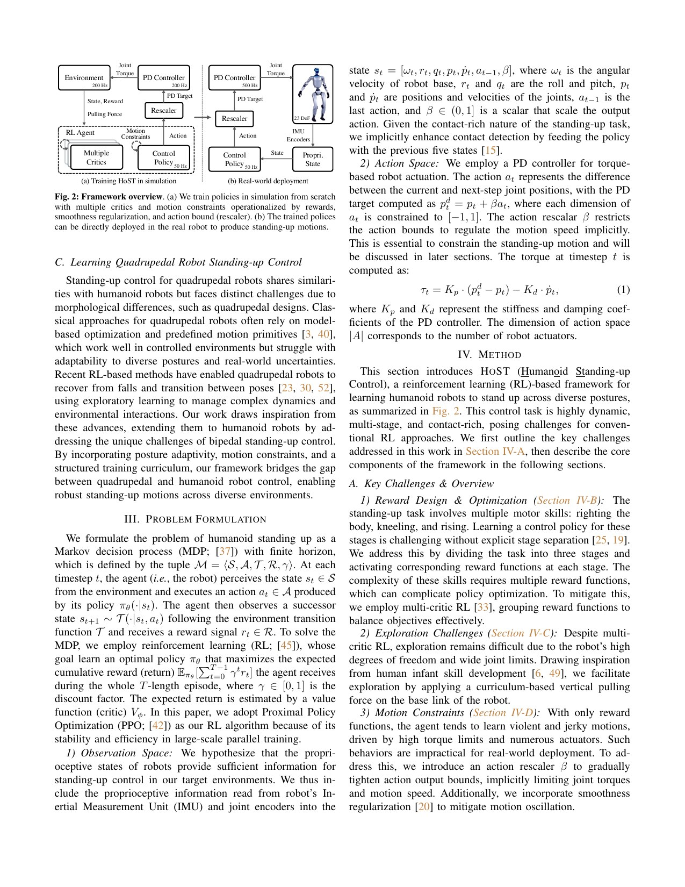
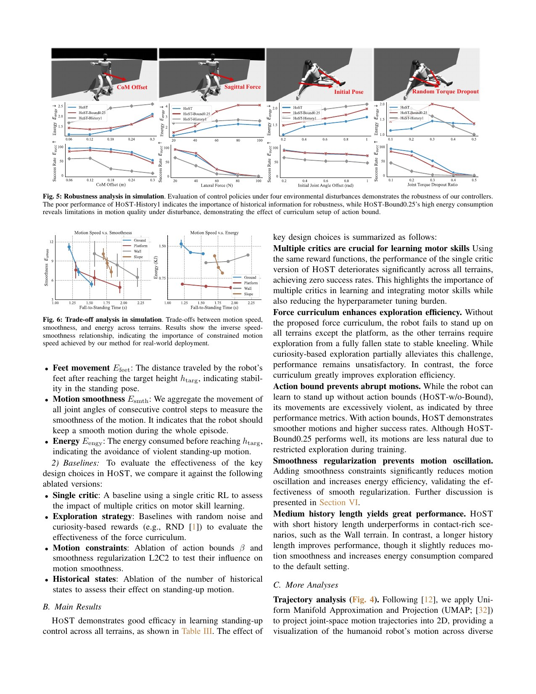
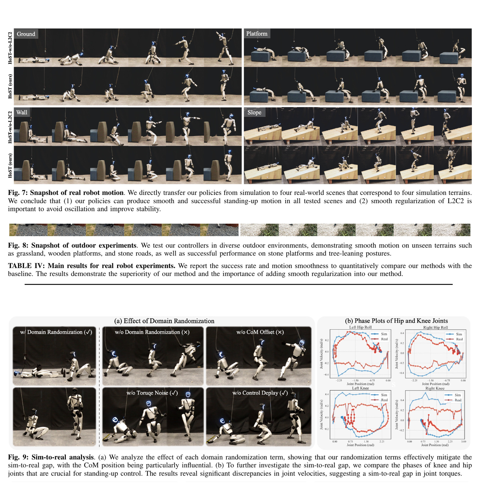

# HoST: Remove the Training Scaffolds Before Calling Stand-Up Solved

[中文版](../host-2502.08378v2.md)

Source: [arXiv:2502.08378v2](https://arxiv.org/abs/2502.08378v2). Code mapping refers to the pinned official HoST revision linked by the Chinese page.

> **Bottom line:** HoST uses separate critics for task, style, regularization, and post-stand behavior, plus a vertical assistance-force curriculum and shrinking action range. These scaffolds help G1 explore stand-up from varied poses, then must be removed before deployment evidence is valid.

## Engineering problem
Random policies rarely lift the torso from multi-contact fallen states. One critic can struggle with sparse success and dense smoothness/style rewards, while successful but violent bouncing, sliding, or oscillation remains unacceptable on hardware.

## Method
One actor outputs 23 relative joint targets from proprioception/history. Four critics estimate grouped objectives before normalized advantages are combined. Early vertical force makes raised states reachable and decays from 200 N; action scale shrinks from 1 to 0.25, while L2C2 and second-action differences constrain sensitivity and jitter.

## Key figures

Training-only critics and assistance are absent from the deployed actor and must not leak into evaluation.

Without multi-critic all four terrain success rates are zero; without assistance most conditions nearly fail; action bounds mainly affect quality.

Full HoST records 20/20 over four small scenario groups, while no-L2C2 records 11/20; phase plots still expose sim-to-real velocity mismatch.

## Decisive evidence
Simulation component ablations plus small but explicit hardware denominators connect mechanism to transfer. Negative load/torque-loss tests show abrupt failure: 12 kg gives 2/3 and 0.2 torque-loss rate gives 0/3.

## Paper-to-implementation mapping
The pinned code exposes assistance/action-scale curricula, multiple critics and advantages, L2C2/smoothness, PD targets, and four evaluation scripts. Simulation termination and clipping are evidence, not a complete hardware safety stack.

## Limits and evidence boundary
Authors report no visual clearance sensing, interference between prone/supine training, incomplete system integration, and unexplained hardware-model gaps. Twenty principal trials cannot establish rare collision or failure probability, especially near obstacles.

## Bounded engineering takeaway
Ablate multi-critic, removable assistance, action scaling, and both smoothness mechanisms separately. Verify success remains when assistance reaches zero, and score contact/impact/foot slip in addition to stand-up time.

## Reproduction checklist
Lock poses/terrains, reward groups, critics, advantage weights, assistance schedule, action scale, regularization, randomization, PD, and rate. Report assistance-free success by pose/environment, time, contact order, head/hand impact, slip, torque/speed peaks, and safety stops.
