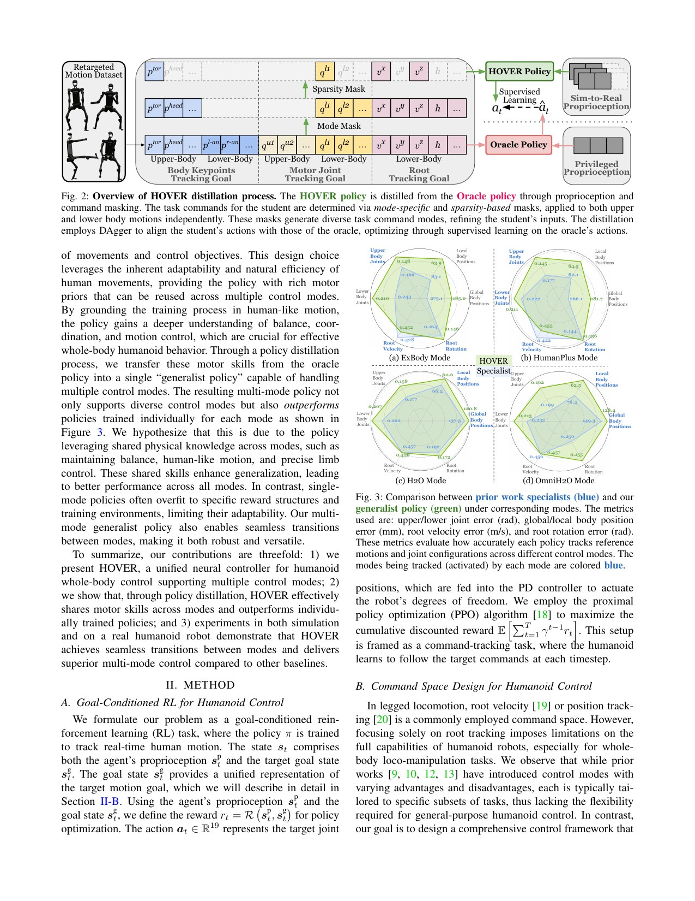

# HOVER: Distilling Multiple Whole-Body Command Interfaces into One Switchable Policy

[中文版](../hover-2410.21229v2.md)

Sources: [arXiv:2410.21229v2](https://arxiv.org/abs/2410.21229v2) · [version-pinned official code](https://github.com/NVlabs/HOVER/tree/8088f6cfb42a8f307dc614735197796a86ce8490)

Review scope: the complete eight-page paper and its official implementation. This page contains original analysis and source links rather than copied code or paper text.

> In one sentence: HOVER trains a full-motion privileged teacher, then distills root velocity, joint-angle, and head/hand keypoint interfaces into one student through explicit mode and sparsity masks.

Key terms are unified command space (统一命令空间), mode mask (模式掩码), sparsity mask (稀疏掩码), privileged teacher (特权教师), student rollout (学生轮转), Dataset Aggregation (DAgger，数据集聚合), runtime switching (运行时切换), and distribution shift (分布偏移).

## Engineering problem

Navigation supplies root velocity, teleoperation supplies head and hand keypoints, and manipulation may provide upper-body joint angles. Training one low-level policy per interface creates repeated training, fragmented contracts, and mode-switch logic. HOVER represents those interfaces as subsets of a common atomic command vector and asks one student policy to cover them.

The idea resembles connecting different controllers to one console: the actuator layer is shared, and masks declare which controls are active. But a console that never sees controls disappear mid-operation is not automatically safe under runtime switching. Atomicity matters too: target values and masks must update together or an interface race looks like a policy failure.

The mask is therefore a command contract, not merely a training trick. It tells the low level what to track, but does not say whether a target is reachable, timely, or safe. Those semantics still require feasibility checks, timeout rules, and supervision outside the policy.

## Core insight

HOVER separates learning how to move from learning which partial command is currently visible. A privileged imitation teacher first learns a complete motion prior. The student then learns to reproduce teacher actions under command subsets. Direct multi-mode RL with random masks must solve coordination and command interpretation simultaneously, and Figure 4 shows that the teacher prior matters beyond the mask itself.

Binary masks also make the interface testable. Individual body positions, joint angles, and root commands can be enabled, removed, and recombined. Yet a mask only states “track this”; it has no native “reject this impossible request” state.

## Method: input → processing → output

AMASS is retargeted to a 19-DoF Unitree H1 and filtered into a trackable set. A privileged full-body teacher, a three-layer `[512,256,128]` MLP, is trained from complete rigid-body states, velocities, and reference motion.

Commands are decomposed into atomic rigid-body positions, local joint angles, and root velocity/height/roll-pitch-yaw. Upper and lower body modes are chosen separately; a sparsity mask removes enabled elements with independent `Bernoulli(0.5)` draws. The mask is sampled once per episode and remains fixed during training.

The student receives 25 steps of joint, orientation, gravity, and action history. It rolls out on its own state distribution, while the teacher labels actions at those states. The student minimizes an action discrepancy written in the paper as squared L2. It outputs 19 joint targets for PD control; deployment changes targets and masks without loading another network.

## How to read the key figures

Figure 2 emphasizes information asymmetry: the teacher sees a complete reference and privileged state; the student sees history plus masked commands. Because labels are queried on student rollouts, this is not one-pass behavior cloning. Figure 1 shows how named interfaces become subsets of the atomic space, but expressibility does not prove reliable execution.

Figure 4 is the closest causal ablation: the end-to-end multi-mode RL baseline uses the same random masks, while HOVER learns from the full-motion teacher. HOVER has lower error in all 8 modes × 4 metrics. Table III reports, for example, 128/62.5 mm global/local position error in OmniH2O mode versus 149/76.4 mm for the specialized comparison. Table IV extends the result to left hand, right hand, both hands, and head sparsity patterns.

Table V verifies multiple interfaces with one policy on hardware and reports HOVER better in 11 of 12 comparisons over 20 standing motions with five tests. It does not quantify high-dynamic switching. Runtime switch evidence is primarily demonstrative, so an acceptance test must record switch peaks and recovery separately from steady-mode error.

## Strongest experiment

Figure 4 best isolates the mechanism because both groups share the command-mask design and differ mainly in teacher distillation. Lower error in all 32 mode-metric cells supports the narrow claim that a complete-motion prior improves this multi-mode student under the paper's robot, data, reward, and simulator.

It does not prove that distillation beats reinforcement learning for arbitrary command spaces. A fair reproduction must match teacher ability, data, network capacity, total samples, and per-mode sampling probability. If the teacher does not cover a motion family, a general interface cannot create it from nothing.

## Paper-to-code mapping

- [`create_mask`](https://github.com/NVlabs/HOVER/blob/8088f6cfb42a8f307dc614735197796a86ce8490/neural_wbc/core/neural_wbc/core/mask.py) enables command elements by mode and applies optional 0.5-probability Bernoulli sparsification.
- [`calculate_mask_length` and `calculate_command_length`](https://github.com/NVlabs/HOVER/blob/8088f6cfb42a8f307dc614735197796a86ce8490/neural_wbc/core/neural_wbc/core/mask.py) distinguish one validity bit per body from three position coordinates, preventing shape mismatches at the interface.
- [`StudentPolicyTrainer.run`, `_produce_actions`, and `_get_ground_truth_actions`](https://github.com/NVlabs/HOVER/blob/8088f6cfb42a8f307dc614735197796a86ce8490/neural_wbc/student_policy/neural_wbc/student_policy/student_policy_trainer.py) implement student rollout with teacher labels.
- [`StudentPolicyTrainer._update_student_network`](https://github.com/NVlabs/HOVER/blob/8088f6cfb42a8f307dc614735197796a86ce8490/neural_wbc/student_policy/neural_wbc/student_policy/student_policy_trainer.py) optimizes the action-label norm. Its reduction is not textually identical to the paper's squared-L2 expression and must be reported by pinned version.

The official repository is Apache-2.0. This handbook does not redistribute implementations, configurations, weights, or motion data.

## Limitations and safety boundary

The Author-stated future limitation is the absence of an automatic mode-switching module. Independent limitations are a 20-motion standing hardware set; mostly qualitative dynamic switching and Vision Pro occlusion; masks fixed for an episode during training but changed abruptly in demonstrations; and comparisons confined to one shared data and algorithm family.

HOVER solves command-interface reuse, not collision avoidance, human-contact safety, failure detection, or formal stability. A mask cannot replace limits, emergency stop, and an independent supervisor.

Hardware commands in this paper do not define transferable gains, torques, velocities, or limits. New robots require simulation-first validation and robot-specific safety review.

## Bounded engineering takeaway

When a system needs root commands, joint commands, and sparse keypoints, first define a typed atomic command dictionary with explicit masks. Compare full-motion teacher distillation against end-to-end RL under the same masks. Evaluate fixed modes, unseen sparse combinations, within-episode switching, stale commands, and unreachable targets separately.

## Reproduction and acceptance checklist

Create an interface card for every mode: active atoms, dimensions, units, frames, update rate, timeout behavior, and reachability rule. Test compatible target ramps, large same-mode jumps, simultaneous cross-mode switches, and partial-mask loss. Log pre/post-switch command tensors, masks, joint targets, root attitude, peak response, recovery time, and termination cause so policy failure can be distinguished from non-atomic interface updates or infeasible commands.
