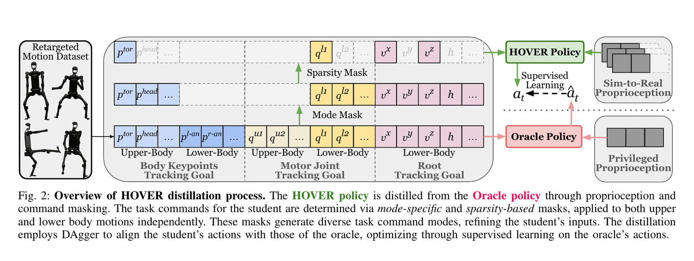
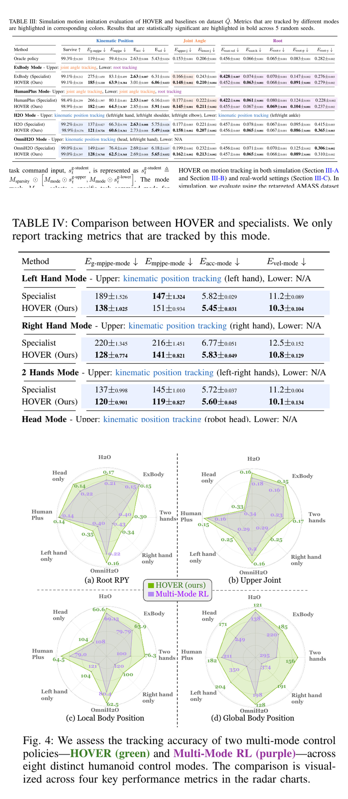
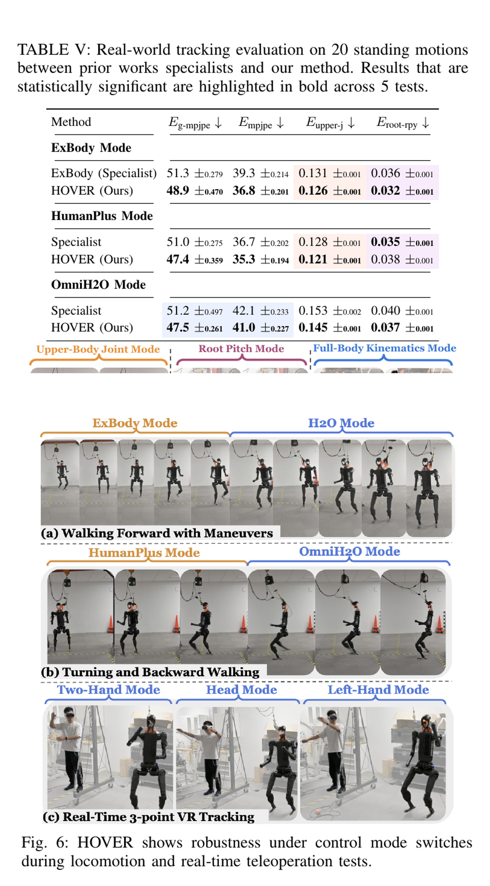

# HOVER: One Humanoid Controller with Explicit Command Masks

[中文版](../hover-2410.21229v2.md)

Source: [arXiv:2410.21229v2](https://arxiv.org/abs/2410.21229v2). The code mapping is tied to the pinned official HOVER repository linked by the Chinese page.

> **Bottom line:** HOVER distills several command-specific teacher behaviors into one policy and uses explicit masks to state which command channels are active. Versatility comes from a trained command contract and switching curriculum, not from guessing arbitrary missing inputs.

## Engineering problem
A humanoid stack may need velocity control, root/upper-body targets, end-effector tracking, and full-body motion tracking. Separate policies create switching discontinuities and duplicate deployment infrastructure; an unmarked concatenation of commands leaves the policy unable to distinguish zero from absent.

## Method
Teachers provide competent behaviors for different control modes. A unified student observes a common state plus command values and masks, and learns through distillation and mode/switch training. The mask is semantic data: it says which objectives should constrain the current action.

## Key figures

These figures define the unified input contract and distinguish inactive channels from numerical zeros.

The evaluations compare modes within one controller and expose mode-specific trade-offs.

The switching table is the relevant evidence for replacing a policy state machine, because it tests transitions rather than isolated steady modes.

## Decisive evidence
Performance across command modes plus explicit switching tests supports the unified-controller claim. A good average over isolated modes alone would not establish safe or smooth transitions.

## Paper-to-implementation mapping
The pinned code contains command-mask construction, mode-specific observations, teacher/student training, and deployment configuration. Mask ordering, body indices, normalization, and mode probabilities must be versioned together; they are not interchangeable metadata.

## Limits and evidence boundary
Only trained command families and mask patterns are supported. Conflicting commands, unseen sensor failures, long-horizon tasks, and contact-rich manipulation still need supervisory logic. Unified neural control does not remove hard joint, torque, collision, or emergency constraints.

## Bounded engineering takeaway
Adopt an explicit command schema with presence masks before merging policies. Test every mode and every allowed transition, and reject contradictory or unsupported mask combinations at the interface boundary.

## Reproduction checklist
Lock teacher checkpoints, command fields, masks, body order, sampling probabilities, transition curriculum, losses, randomization, and control rate. Report each mode separately, a transition matrix, discontinuity peaks, falls, torque/velocity margins, and hardware interventions.
