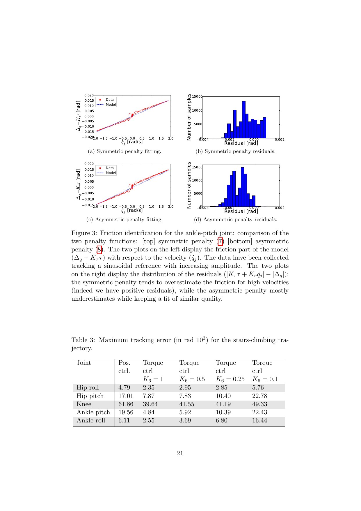
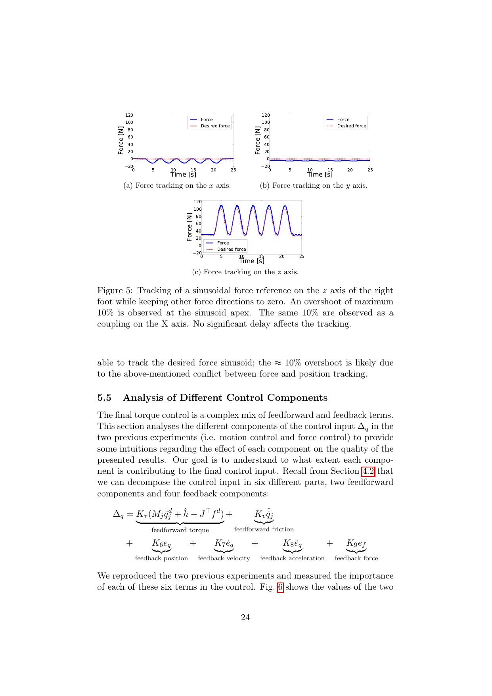

# HRP-2 Torque Control: The Missing Bridge from Desired Torque to Position Actuators

[中文版](../hrp2-torque-control-hal-01136936.md)

Source: [HAL:hal-01136936v2](https://hal.science/hal-01136936v2). The linked TSID repository verifies the modern upper-level optimization mapping, not the complete low-level controller described in this paper.

> **Bottom line:** The authors estimate joint torque from IMU, six-axis force sensing, and rigid-body dynamics, identify a piecewise relation from position error/velocity to torque, then convert desired torque into an HRP-2 position offset. This is platform identification, not a substitute for joint torque sensors on arbitrary robots.

## Engineering problem
A WBC or TSID solver may output desired torques while a high-ratio humanoid exposes only a position interface. Gear friction, hysteresis, elasticity, and proprietary servo behavior break a naive torque-to-position conversion.

## Method
The paper combines external wrench sensing and inverse dynamics to estimate torque, fits actuator behavior in multiple motion regimes, and closes a torque-oriented loop through position offsets. The upper-level dynamics solution and the low-level actuator map are separate models with separate errors.

## Key figures

Figure 1 exposes the non-ideal relation among position error, speed, friction, and produced torque.

The tables quantify identification and trajectory tracking rather than assuming ideal torque actuation.

The force experiment shows useful tracking and the remaining high-frequency boundary.

## Decisive evidence
The HRP-2 experiments demonstrate that identified position offsets improve torque/force behavior on that platform. They do not establish sensor-equivalent torque accuracy across all joints and operating conditions.

## Paper-to-implementation mapping
The pinned TSID code exposes task-space inverse-dynamics formulation and optimization components that produce desired accelerations/forces/torques. The paper's estimator, actuator identification, and HRP-2 position-offset loop are not fully represented by that repository; this distinction is mandatory.

## Limits and evidence boundary
Torque estimates inherit inertial, acceleration, and wrench-sensor errors. Identified friction changes with temperature, direction, wear, and servo settings. Reported leg trajectory and hand-force experiments do not make the interface a universal torque-control plugin.

## Bounded engineering takeaway
Treat desired torque as an upper-level command that needs a separately identified, monitored actuator interface. Validate sign, bandwidth, saturation, hysteresis, and thermal drift before allowing a WBC to rely on torque fidelity.

## Reproduction checklist
Lock inertial model, sensor calibration, differentiation/filtering, identification trajectories, piecewise model, offset limits, servo gains, temperature, and rate. Report torque/force error by frequency and direction, saturation, oscillation, model residual, and hardware protection events.
