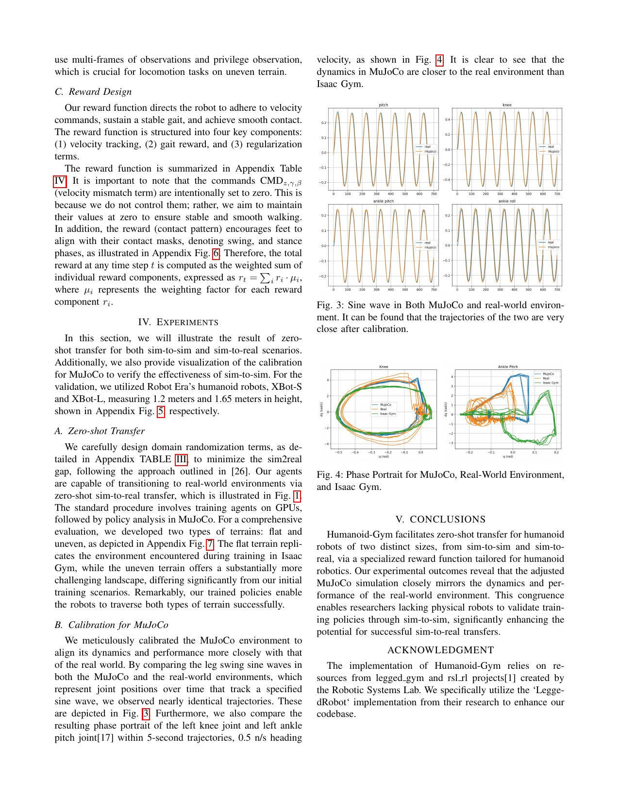

# Humanoid-Gym: A Minimal Open Loop from Training to Cross-Simulator Validation and Hardware

[中文版](../humanoid-gym-2404.05695v2.md)

Sources: [arXiv:2404.05695v2](https://arxiv.org/abs/2404.05695v2) · [version-pinned official code](https://github.com/roboterax/humanoid-gym/tree/ae46e201c85a2b17e7f2cea59a441dae7ea88a8f)

Review scope: the complete six-page paper and appendix, together with the official training, MuJoCo, and deployment paths at the pinned commit.

> In one sentence: Humanoid-Gym's main contribution is an auditable engineering loop—Isaac Gym training, calibrated MuJoCo replay, and XBot hardware deployment—rather than a fundamentally new walking algorithm.

Key terms are zero-shot sim-to-real transfer (零样本仿真到现实迁移), sim-to-sim validation (跨仿真器验证), domain randomization (域随机化), privileged observation (特权观测), frame stacking (帧堆叠), control decimation (策略降采样), and proportional-derivative control (PD，比例—微分控制).

## Engineering problem

A locomotion policy that scores well in one simulator may exploit a cancellation among that engine's actuator delay, damping, friction, and contact errors. Discovering the mismatch on hardware makes the most expensive and hazardous platform the debugger. Humanoid-Gym inserts a second physics engine before hardware, but does not claim that MuJoCo is ground truth.

The second simulator acts like a flight simulator from a different vendor: a policy that fails both virtual systems has no justification for proceeding to hardware. Yet two simulators can share the same wrong robot model. Cross-engine success is therefore a screening signal, not a hardware safety certificate.

The reusable engineering value is that observation order, frame history, action scaling, policy rate, and PD rate are represented across training, replay, and deployment. If these contracts differ, the resulting failure is often an interface mismatch rather than insufficient policy robustness.

## Core insight

Calibration should target the complete input-to-motion chain rather than only named XML parameters. A sinusoidal joint command passes through command scaling, PD control, actuator dynamics, and sensing, so its amplitude and phase expose compound errors. This resembles checking a sound system with a frequency sweep rather than trusting component labels.

The pipeline should be read as capability generation, bias screening, then risk-controlled acceptance. MuJoCo is useful when it rejects policies sensitive to one engine; its usefulness must eventually be measured by how well its failures predict hardware failures.

## Method: input → processing → output

PPO is trained in Isaac Gym. Deployment observations include velocity commands, a gait clock, joint positions and velocities, body angular velocity and Euler attitude, and previous action, with 15-frame stacking. The critic additionally sees friction, mass, base linear velocity, contacts, and pushes. The actor outputs 12 joint position targets at 100 Hz, executed by a 1000 Hz PD loop.

The reward combines velocity, periodic contact, reference joints, attitude/height, energy, second-order action smoothing, and high contact-force penalties. Randomization covers observation noise, 0–10 ms delay, friction, payload, and motor strength. MuJoCo is calibrated with real sinusoidal joint responses and phase portraits before replaying the same policy.

A correct reproduction must compare observation ordering, normalization, previous action, clock phase, action scaling, default pose, saturation, and update frequency across all three back ends. Sharing a model filename does not establish a shared tensor contract.

## How to read the key figures

Figure 2 is a test-order diagram. Isaac Gym generates policy candidates, MuJoCo detects dependence on a single engine, and hardware only receives candidates that passed both. The figure supports staged risk reduction, not equivalence between simulation and hardware.

Figures 3–4 show that selected calibrated MuJoCo joint trajectories and phase portraits become qualitatively closer to hardware. They do not report systematic error across all joints, frequencies, and contact regimes. The evidence motivates calibration but is not a completed system-identification certificate.

These tables expand “domain randomization” into observable assumptions: sensor noise, delay, friction, motor strength, payload, tracking kernels, smoothness, energy, and contact penalties. Their engineering use is to compare a new robot's measured uncertainty with the training support, not to copy XBot numbers.

## Strongest experiment

The paper lacks a single large quantitative table that independently supports a broad robustness claim. Its strongest combined evidence is zero-shot deployment of the same workflow on 1.2 m XBot-S and 1.65 m XBot-L, read with the joint-response calibration. This supports some cross-size engineering reuse within one vendor ecosystem.

It does not provide success rate, distance, fall rate, cross-simulator predictive correlation, or confidence intervals. A reproduction should pre-register commands, surfaces, loads, and duration, then report falls, emergency stops, velocity error, joint saturation, slip, and contact peaks. It should also calculate whether MuJoCo failure predicts hardware failure.

## Paper-to-code mapping

- `XBotLCfg.env.frame_stack/c_frame_stack` and `LeggedRobot.obs_history/critic_history` implement the 15-frame actor and three-frame critic histories.
- `XBotLCfg.control.decimation`, `XBotLCfg.sim.dt`, and `LeggedRobot.step` implement one policy update per ten 1 ms physics steps, corresponding to 100 Hz/1000 Hz control.
- `XBotLCfg.rewards.scales` and `XBotLCfg.domain_rand` bind the appendix reward and uncertainty mechanisms to XBot-L configuration.
- `XBotLCfg.safety` and `LeggedRobot.check_termination` provide scaled position/velocity/torque limits and non-foot-contact termination, but are not a complete real-robot safety system.

All symbols are in the [pinned official repository](https://github.com/roboterax/humanoid-gym/tree/ae46e201c85a2b17e7f2cea59a441dae7ea88a8f). The repository is BSD-3-Clause and inherits legged_gym/rsl_rl notices. This page links rather than copying code or parameter sets.

## Limitations and safety boundary

The paper has no dedicated Author-stated limitations section. Reported boundaries include missing statistical evaluation, two robots from one vendor, calibration plots for only selected joints, and iterative differences between paper appendix and current configuration. Similar sinusoidal response does not establish similar impacts, stick-slip contact, or friction transitions.

Independent engineering limitations include sensitivity to Euler convention, gait-clock phase, history timing, estimator delay, and shared model errors. Open deployment scripts are not an independent hardware safety layer.

Appendix gains, randomization ranges, and limits belong to the paper's XBot systems. New hardware requires manufacturer constraints, current/thermal protection, emergency stop, tethered staging, and qualified review.

## Bounded engineering takeaway

Use a calibrated second simulator as a cheap failure-screening layer between parallel training and hardware. Do not call it proof of sim-to-real robustness. Measure both false negatives—hardware failures not caught—and false positives—safe policies rejected—to tune the gate.

## Reproduction and acceptance checklist

Build one machine-readable interface table shared by Isaac Gym, MuJoCo, and hardware. Freeze paper/code versions, URDF/MJCF assets, inertia, randomization, reward, history, rates, and seeds. Calibrate multiple joints over multiple amplitudes and frequencies using time-domain, phase, and peak metrics. Run identical start/stop/turn/push/friction/load scenarios in both engines, then progress on hardware through suspended signal checks, low-gain standing, tethered slow walking, and only later higher speed. Any engine, asset, runtime, firmware, or inner-loop update must trigger the same regression suite.
