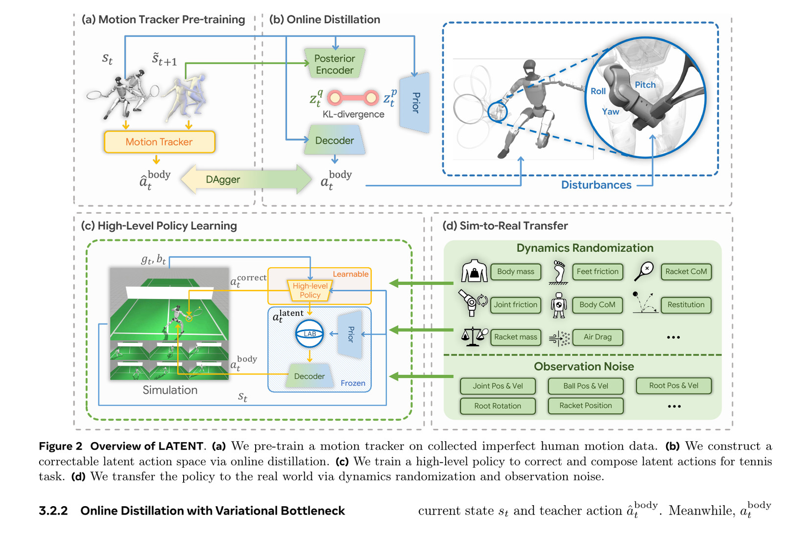
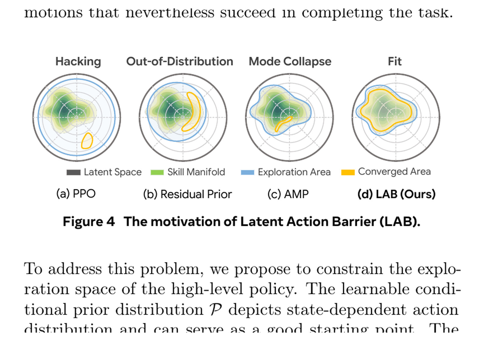
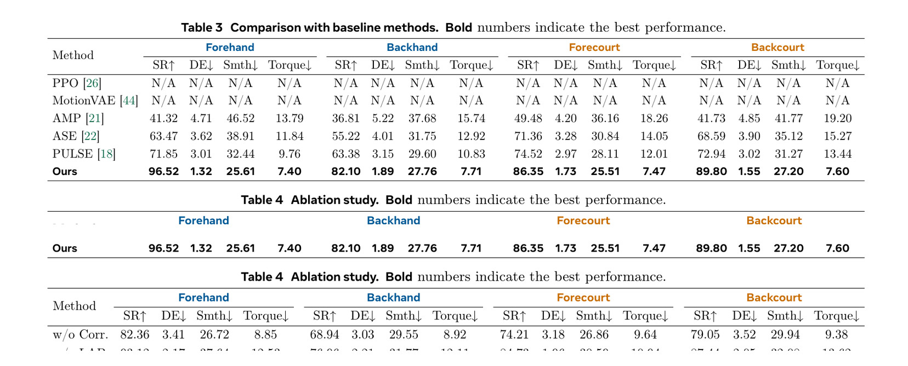
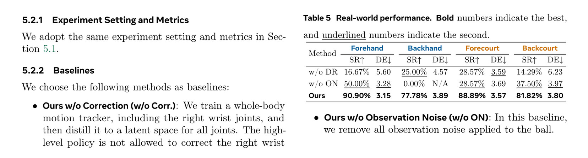

# LATENT: Athletic Tennis from Imperfect Motion Data, with a Critical Open-Code Boundary

[中文版](../latent-2603.12686.md)

Sources: [arXiv:2603.12686](https://arxiv.org/abs/2603.12686) · [pinned official code](https://github.com/GalaxyGeneralRobotics/LATENT/tree/a931da5a70320ba3f07d38debcf71458a005530d)

Review scope: the full thirteen-page paper and appendix, plus the released G1 tennis tracker environment, play path, racket asset, and README release boundary.

> In one sentence: LATENT combines motion tracking, online DAgger distillation, a state-dependent Latent Action Barrier, and direct wrist correction for real G1 tennis, but the public repository does not currently release the central online-distillation and high-level LAB training pipeline.

Key terms include motion primitive (动作原语), online DAgger distillation (在线数据聚合蒸馏), Latent Action Barrier (潜在动作屏障), conditional prior (条件先验), Mahalanobis distance (马氏距离), wrist action correction (手腕动作修正), ball dynamics randomization (球动力学随机化), and sim-to-real transfer (仿真到现实迁移).

## Engineering problem

Tennis compresses locomotion, balance, timing, racket pose, impact, and recovery into seconds. Pure task reward may find unnatural shortcuts, while pure motion tracking cannot adapt a recorded stroke to a different incoming ball.

The data are imperfect: about five hours from five amateur players in a 3×5 m space, with wrist-racket error amplified by human-to-robot morphology. Motion capture is a limited map of plausible movement, not a complete route planner for every ball.

Unconstrained high-level exploration can leave the learned motion manifold, producing jitter, mode switching, or decoder exploitation. Excessive constraint prevents correction of the imperfect racket pose. Exploration must be both adaptable and state dependent.

## Method

The method has four stages: motion tracker, online latent distillation, high-level task policy, and sim-to-real. Tracker training excludes the right wrist and perturbs it, making the low-level skill tolerant of later direct correction. Online DAgger trains the student on states it actually visits, reducing offline distribution shift.

The conditional prior predicts mean and standard deviation. Equation 4 constructs a command like `μ_p + λ σ_p tanh(a_latent)`, giving each latent dimension a state-dependent radius. It resembles a guardrail whose width changes with the local motion manifold, rather than a fixed Euclidean ball.

The high-level action includes both latent motion and direct right-wrist correction. The latent branch preserves whole-body style and movement; the correction branch handles the task-critical racket error. One representation is not forced to solve both naturalness and precision.

### Input → processing → output

Human tennis fragments are retargeted to G1 and used for low-level tracking. Right-wrist tracking is removed and wrist perturbations expand the correction tolerance. A teacher then produces latent actions, and online DAgger distills a conditional prior under the student's evolving state distribution.

The task launches a ball every two seconds and requires eight consecutive returns to a target area. A high-level policy observes robot, ball, and task state and outputs a LAB-bounded latent residual plus wrist correction. Control runs at 50 Hz inside 2,000 Hz simulation, using eight GPUs for training.

Robot dynamics, ball aerodynamics, and collision parameters are randomized. Four-frame velocity averaging reduces real ball-estimation noise. Reward covers approach, hit, landing, smoothness, torque, limits, collision, and termination; Table 1 exposes the many weights behind the result.

Hardware uses a racket-equipped G1 returning balls from a human. This is not a complete autonomous two-player tennis game; vision, service protocol, target area, and exclusion zone remain part of the experiment boundary.

## Key figures

Figure 2 separates tracking, online distillation, task RL, and deployment. Each stage needs an independent checkpoint and acceptance test. Running the released tracker does not reproduce the full pipeline.

Figure 4 contrasts hacking, out-of-distribution exploration, mode collapse, and a fitted region. The operative mechanism is Equation 4's conditional scaling and `tanh` bound. This learned latent constraint is not a formally certified control barrier function.

Table 3 uses 10,000 simulation trials for success, landing error, smoothness, and torque; Table 4 ablates wrist correction and LAB. High simulation count strengthens trends but does not cover racket flexibility, aerodynamics, and hardware estimation error.

Table 5 reports twenty consecutive human-robot rally sets: 90.9% forehand, 77.78% backhand, 88.89% forecourt, and 81.82% backcourt for the full method. Removing ball randomization or observation noise causes substantial degradation. The evidence links engineering mechanisms to transfer, but the sample remains limited.

## Decisive evidence

The hardware ablation in Table 5 is the strongest evidence because removing ball randomization and observation noise damages results. It is more diagnostic than a final-system video. The 10,000-trial simulation comparison provides statistical context.

The authors explicitly identify motion-capture dependence and the incomplete two-player task, proposing vision and self-play. A reproduction should report denominators, ball-speed distributions, landing locations, and failure types for each forehand/backhand and court region cell.

## Paper-to-implementation mapping

At commit `a931da5a70320ba3f07d38debcf71458a005530d`, `latent_mj/envs/g1_tracking/train/g1_env_tracking_tennis.py` exposes the tennis tracker environment and wrist-tracking exclusion. `latent_mj/envs/g1_tracking/play/play_g1_env_tracking_tennis.py` runs tracker playback, and `storage/assets/unitree_g1/g1_mjx_w_racket_wo_ball.xml` fixes the robot-racket asset.

The README explicitly lists DAgger online distillation as TODO, and the repository does not contain the paper's high-level LAB/task-training implementation. Official code is verifiable for a tracker subpipeline, not for end-to-end reproduction of online DAgger, conditional prior, LAB, and the hardware system.

## Limits and evidence boundary

Author-stated limitations are dependence on motion capture, a task short of full two-player tennis, and future need for vision and self-play. Data come from a small amateur cohort and constrained space, and backhand performance is lower.

Independent limitations include the misleading safety connotation of “barrier”: LAB constrains learned latent exploration but is not formal hardware safety. A wrong prior can produce wrong mean and scale; direct wrist correction can leave the motion manifold; ball averaging trades noise for delay.

High-speed rackets near people require an exclusion zone, mechanical checks, speed and torque limits, emergency stops, protective equipment, and controlled launch windows. Success rate cannot replace human-robot risk assessment.

## Bounded engineering takeaway

The pattern is valuable: a motion prior for whole-body naturalness, state-dependent latent limits for exploration, and a narrow direct correction for a task-critical end effector. Hardware ablation shows that ball randomization and observation noise matter.

The public repository currently supports tracker reproduction only. Any “official LATENT reproduction” must disclose whether unreleased online DAgger, conditional prior, and high-level LAB code was independently implemented or obtained.

## Reproduction checklist

Pin motion data, retargeting, wrist exclusion, perturbation, tracker reward, and G1/racket assets. Report tracking success, slip, joint error, and wrist correction margin by primitive.

Implement or obtain online DAgger and conditional prior while logging teacher/student state distributions, latent mean and deviation, aggregation rounds, and validation. Sweep LAB scale and report success, naturalness, latent excursions, and jitter.

Stratify 10,000 simulation trials by ball speed, landing, stroke, and court region. Stage hardware from isolated low-speed balls to controlled human rallies, reporting denominators, failure causes, racket speed, joint saturation, stops, and duration. Mark the full method reproducible only when the release boundary is closed and Tables 3–5 can be regenerated end to end.
