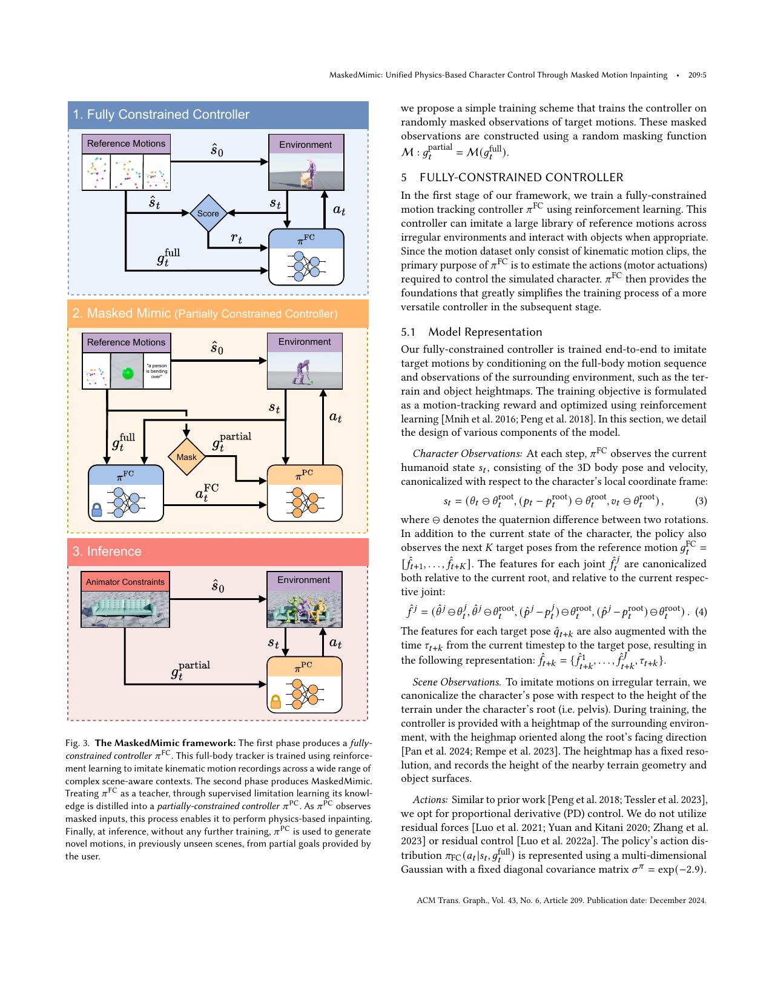
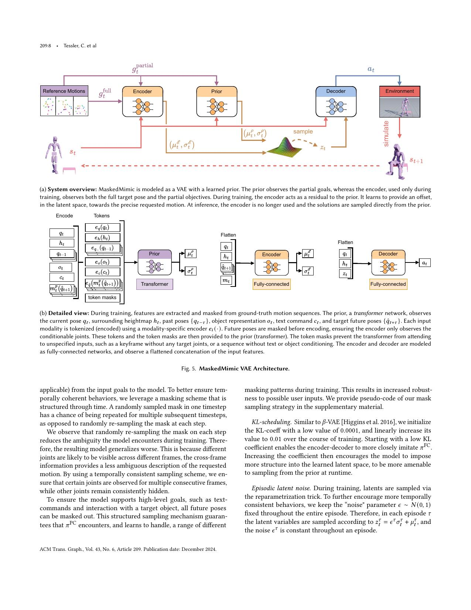
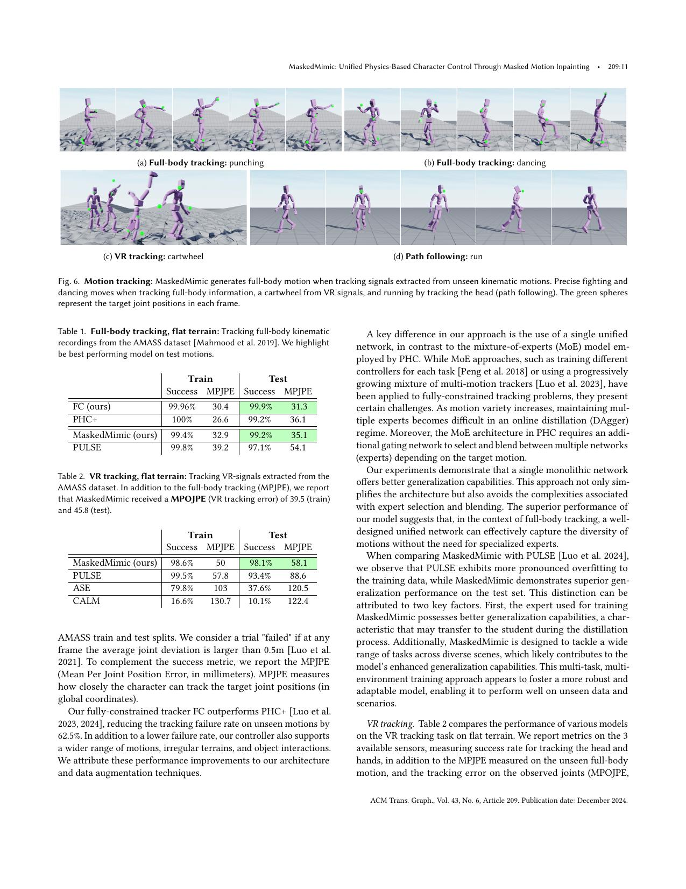
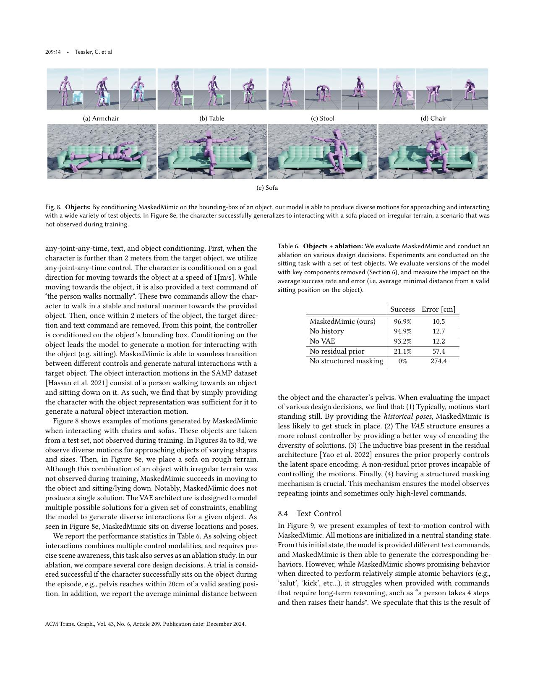

# MaskedMimic: Unifying Control Interfaces as Missing-Motion Completion

[中文版](../maskedmimic-2409.14393.md)

Sources: [arXiv:2409.14393](https://arxiv.org/abs/2409.14393) · [ACM DOI](https://doi.org/10.1145/3687951) · [version-pinned official code](https://github.com/NVlabs/ProtoMotions/tree/5241478e35a7dcf5d1455dac2df0486d5e7f440a)

Review scope: the complete 21-page paper, references, and supplement, plus the sparse-conditioning controller, VAE student, and experiment configuration in the pinned ProtoMotions 3 commit. The paper studies a 69-DoF simulated SMPL character, not humanoid-robot hardware.

> In one sentence: MaskedMimic first learns a full-motion tracking teacher with reinforcement learning, then uses structured random masking and on-policy distillation to train a conditional VAE that sees only partial goals, allowing one physics policy to accept keyframes, sparse joints, text, and object constraints without task-specific retraining.

Key terms are motion inpainting (动作补全), any-joint-any-time control (任意关节任意时刻控制), partial goal (部分目标), structured masking (结构化遮挡), DAgger (在线数据聚合), conditional VAE (条件变分自编码器), learned prior (可学习先验), residual posterior (残差后验), goal-engineering (目标工程), and episodic latent noise (情节固定噪声).

## Engineering problem

Physics-based character controllers are commonly separated by interface: full-motion tracking, sparse VR sensors, joystick steering, text motion, and object interaction each receive a specialized policy and reward. A new task therefore requires more than another network. It adds a new control contract, a new reward-tuning loop, new data curation, and a transition problem between policies.

MaskedMimic reframes all of those interfaces as partial descriptions of an otherwise missing motion. It is similar to an animator pinning a hand, head, or pelvis at selected times and asking a system to fill the physically executable motion between the pins. Text and objects become other constraint modalities instead of new task labels.

Partial constraints are inherently one-to-many. A request for the right hand to reach a point in two seconds does not specify which foot moves first, whether the torso bends, or what path the arm takes. A deterministic regressor can average incompatible solutions. The controller therefore needs a distribution over plausible completions.

There is also a subtle information-leakage problem. If a different random joint is exposed every frame, the model can combine adjacent frames and reconstruct nearly the entire motion. Real VR sparsity or a long keyframe gap persists through time. The temporal structure of the mask determines whether training actually represents an underspecified problem.

## Core insight

The first idea is to separate physical execution from partial-goal inference. A fully constrained policy, `πFC`, learns through reinforcement learning to turn full future motion and scene observations into PD targets. The partially constrained policy, `πPC`, then imitates the teacher's action while seeing a masked goal. This avoids designing a separate reward for every user interface.

The second idea is to use DAgger rather than offline cloning. The student visits states under its own policy, and the teacher labels the appropriate action there. Like a driving instructor correcting a learner after the learner drifts from the ideal route, this attacks covariate shift at the states the deployed student will actually encounter. Equation 2 and Equation 8 explicitly use the student-induced state distribution.

The third idea is to encode visibility itself. Position and rotation constraints have separate masks, target times are explicit, and current pose, history, heightmap, text, and object inputs use modality-specific token encoders. The prior Transformer attends only to present tokens. Changing an interface changes the token set rather than the policy architecture.

The fourth idea is a residual posterior. During training, an encoder sees the full target and predicts an offset from the sparse prior's mean. The decoder converts a sampled latent to action. At inference the privileged encoder is discarded and only the prior remains. This architecture makes the training posterior teach the deployable prior “what is missing” instead of learning an unrelated latent distribution.

## Method: input → processing → output

Stage 1 trains the full-motion teacher on aggregated AMASS, HumanML3D, and SAMP data. The neutral SMPL character has 69 degrees of freedom; the supplement specifies a 358-dimensional state and a 69-dimensional PD target action. Observations include root height and orientation, local joint rotations and velocities, hand and foot positions, full future poses, a terrain heightmap, and object context where applicable. The reward combines global joint position and rotation, root height, joint and angular velocity, and an energy term. No residual force or residual control is used.

The training playground contains flat ground, procedurally irregular terrain, and an object-interaction region. Flat-ground episodes terminate when a joint deviates by more than 0.25 m; irregular-terrain episodes use 0.5 m. Difficult clips receive higher sampling probability based on flat-ground failure, so an intrinsically unsuitable motion such as a flip on stairs does not dominate terrain sampling.

Stage 2 distills the teacher. A masking function converts the full goal `gfull` into `gpartial`. Conditionable bodies are the two ankles, pelvis, head, and two hands, with position and rotation exposed independently. The model also receives the current pose, a 16×16 height grid with 10 cm spacing, and five historical poses sampled every eight steps from the previous 40 steps.

The paper uses eleven future entries: ten immediate frames and one random long-term target. A near-term mask repeats with 98% probability and is resampled with 2% probability. With 1% probability, a fully hidden interval of one to nine frames is inserted; that interval is multiplied by four when text, an object, or a long-term target is available. Objects are hidden in 20% of episodes, text in 80%, and a long-term pose appears in 20%.

The learned prior is a four-layer, four-head Transformer with 512 latent width and 1024 feed-forward width. It predicts a 64-dimensional Gaussian latent. The encoder and decoder are three-layer 1024-unit MLPs. The KL coefficient rises from `0.0001` to `0.01`, while reparameterization noise is held fixed throughout an episode to avoid frame-to-frame style flicker.

Training uses 16,384 Isaac Gym environments on four A100 GPUs for roughly two weeks. The paper reports about 30 billion teacher steps and 10 billion student steps, a 30 Hz policy, and 120 Hz simulation. “Unified” reduces task-specific policies and reward engineering; it does not mean inexpensive training.

## How to read the key figures

Figure 3 has three separate paths. The top trains `πFC` from full targets and environment feedback. The middle rolls out the student, asks the teacher for labels, and masks the motion description. The bottom is deployment, where only animator constraints, the environment, and `πPC` remain. The diagram does not claim that the student can be trained without a teacher or that arbitrary constraints are feasible.

Figure 5 and Equations 6–8 are the mechanism. The prior receives deployable partial information, the encoder adds privileged full-motion residual information, and both paths share the decoder. Retaining the encoder at test time would create a privileged full-motion tracker rather than the advertised inpainting controller.

On AMASS test motions in Table 1, the full teacher reports 99.9% success and 31.3 mm MPJPE, MaskedMimic 99.2% and 35.1 mm, and PULSE 97.1% and 54.1 mm. In the flat-ground VR test of Table 2, MaskedMimic reports 98.1% and 58.1 mm versus PULSE at 93.4% and 88.6 mm; ASE and CALM report success of 37.6% and 10.1%. Some comparison values are taken from prior reports rather than a fresh retraining of every baseline in one current stack.

Table 6 evaluates 5,000 random episodes on held-out seats. The full model reaches 96.9% success and 10.5 cm error; removing history gives 94.9%, removing the VAE 93.2%, removing the residual prior 21.1%, and removing structured masking 0% with 274.4 cm error. This is stronger mechanism evidence than the task montage: persistent masking, not merely a larger network, is necessary in this object task.

## Strongest experiment

The strongest evidence is the combination of Tables 2, 4, and 6. Table 2 tests a unified model that was not explicitly specialized for VR tracking. Table 4 applies the same model on procedurally irregular terrain. Table 6 isolates architectural and masking choices in object interaction. Together they address one model, changed environments, and causal component evidence.

Table 4 reports MaskedMimic test performance of 95.4% success and 62.9 mm error for full-body tracking on irregular terrain, and 93.6% with 69.4 mm for VR. These numbers support robustness to the paper's procedural terrain distribution, not real terrain, sensor noise, or robot foot-contact transfer.

Table 5 uses 5,000 episodes per goal-engineered task. On irregular terrain, path following reaches 96.3% with 12.5 cm error, steering 93.8% with 8.4 cm/s error, and reach 87.3% with 21.7 cm error. Hand-written finite-state machines switch the constraints, so the result demonstrates a programmable goal interface rather than autonomous long-horizon planning.

## Paper-to-code mapping

- [`MaskedMimicControl._shift_and_sample_body_masks` and `_sample_body_masks`](https://github.com/NVlabs/ProtoMotions/blob/5241478e35a7dcf5d1455dac2df0486d5e7f440a/protomotions/envs/control/masked_mimic_control.py) maintain future pose visibility and independently sample translation/rotation masks.
- [`MaskedMimicControl.populate_context`](https://github.com/NVlabs/ProtoMotions/blob/5241478e35a7dcf5d1455dac2df0486d5e7f440a/protomotions/envs/control/masked_mimic_control.py) queries reference states at target times and exposes targets, masks, and time offsets through the environment context.
- [`MaskedMimicModel.forward`](https://github.com/NVlabs/ProtoMotions/blob/5241478e35a7dcf5d1455dac2df0486d5e7f440a/protomotions/agents/supervised/masked_mimic_model.py) implements the deployable prior path, privileged residual encoder path, shared decoder, and episode-level latent noise.
- [`forward_inference`, `kl_loss`, and `_kld_coefficient`](https://github.com/NVlabs/ProtoMotions/blob/5241478e35a7dcf5d1455dac2df0486d5e7f440a/protomotions/agents/supervised/masked_mimic_model.py) remove the encoder at inference and expose the Gaussian KL schedule.
- [`examples/experiments/masked_mimic/transformer.py`](https://github.com/NVlabs/ProtoMotions/blob/5241478e35a7dcf5d1455dac2df0486d5e7f440a/examples/experiments/masked_mimic/transformer.py) composes current sparse-pose observations, the 64-dimensional VAE, Transformer prior, and MLP encoder/decoder.

The pinned code is a 2025–2026 ProtoMotions 3 refactor, not the original 2024 experiment tree. Its default entry uses five future targets, mask repetition probability 0.8, and a 500–2000 epoch KL schedule, while the paper uses eleven targets, 98% repetition, and a 6000-epoch KL ramp beginning at epoch 3000. The public entry also does not expose the full paper-era XCLIP text and seat-bounding-box pipeline. The code verifies the sparse-pose VAE mechanism, not exact reproduction of Tables 1–6.

## Limitations and safety boundary

The authors explicitly identify motion jitter, failure on hard clips such as backflips and breakdance, terrain adaptation that does not plan human-like foot placement, manual goal-engineering, weak long-horizon text reasoning, and absent dynamic-object, tool, and multi-agent capabilities.

Independent limitations are equally important. Every quantitative result uses one simulated SMPL character and Isaac Gym. There are no robot actuator limits, estimator drift, communication delay, motor temperature, or hardware fall statistics. AMASS, HumanML3D, and SAMP define the prior's behavioral support. Evaluation with the prior mean hides the failure tail of stochastic samples, and 5,000 simulated episodes are not a cross-morphology safety proof.

“Physically plausible” means executable under the paper's simulator, not safe for a humanoid robot. Robot deployment requires a separately validated tracker, state estimator, contact supervision, torque/velocity/joint limits, collision zones, an independent emergency stop, and a safe-stop state. Text or keyframes must never bypass those layers.

## Bounded engineering takeaway

The reusable recipe is a full-motion teacher, structured persistent masking, student-distribution DAgger, and a learned-prior conditional VAE. It is a strong interface design for keyframe completion, sparse VR control, and path constraints. Transfer the representation and acceptance protocol, not the SMPL network weights or reward coefficients.

For humanoid WBC, each masked reference should be an explicit contract containing body, position/rotation type, target time, tolerance, and expiry. A generator proposes unspecified motion, while the lower-level controller independently decides feasibility and safety.

## Reproduction and acceptance checklist

Pin the paper and implementation separately. Reconstruct the eleven-target, 98%-repeat paper configuration and compare it with the five-target, 80%-repeat ProtoMotions 3 default. Validate the teacher on the exact AMASS split before distillation. Unit-test mask run lengths, gaps, visibility rates, and token attention under fixed seeds. Confirm that student states generate DAgger rollouts and that the frozen teacher supplies labels. Report both success and MPJPE/MPOJPE for Tables 1–4, and identify whether each baseline was retrained or copied from its original report. Reproduce every Table 6 ablation with multiple seeds and equal budgets. Evaluate prior-mean and sampled policies separately, including failure quantiles, jitter, foot sliding, energy, and collision. Publish every goal-engineering finite-state machine and its thresholds. Before any hardware trial, retarget to the real robot model, test latency and actuator constraints in simulation, then use support rigs, soft terrain, explicit stop conditions, an emergency-stop operator, and complete logs.

> **Takeaway**: A unified controller is not “one network that knows every task”; it is a system that rewrites each task as an auditable partial-motion contract, lets a generative layer complete it, and lets a physical safety layer reject it.
