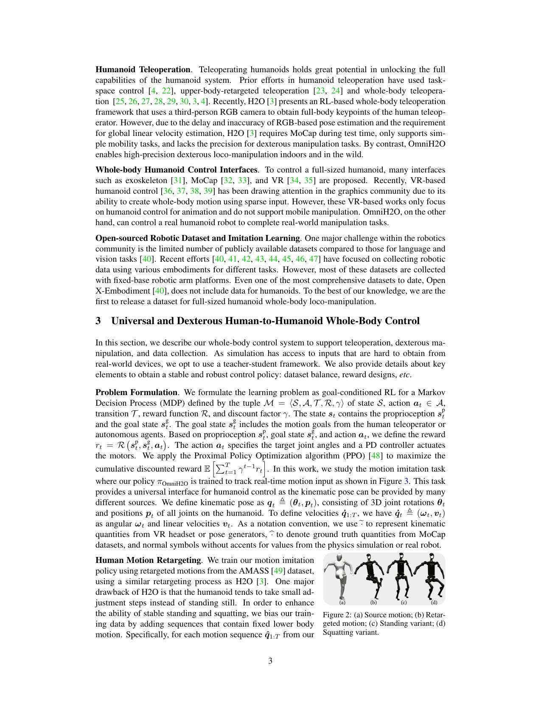

# OmniH2O: Turning Sparse Human Targets into Deployable Whole-Body Control

[中文版](../omnih2o-2406.08858v1.md)

Sources: [arXiv:2406.08858v1](https://arxiv.org/abs/2406.08858v1) · [version-pinned official code](https://github.com/LeCAR-Lab/human2humanoid/tree/750f1fa052641f0fde43669d50cb4e407dabe6c8)

Review scope: the complete 25-page paper and Appendices A–M. This page contains original analysis and links, not paper text or copied code.

> In one sentence: OmniH2O distills a full-state motion-tracking teacher into a student that uses sparse head/hand targets and long proprioceptive history, creating a practical whole-body teleoperation interface on H1.

Key terms are sparse-keypoint teleoperation (稀疏关键点遥操), privileged teacher (特权教师), student policy (学生策略), Dataset Aggregation (DAgger，数据集聚合), partial observability (部分可观测性), proprioceptive history (本体历史), kinematic retargeting (运动学重定向), and zero-shot sim-to-real transfer (零样本仿真到现实迁移).

## Engineering problem

Whole-body teleoperation combines three mismatches. Human and robot morphology differ; consumer VR reliably provides only head and two hand targets; and full-body velocities available in simulation are noisy or unavailable on hardware. A lower-body velocity controller does not automatically coordinate torso and support feet while the hands perform a task.

Three targets are like three puppet strings: they indicate where head and hands should go but do not uniquely determine pelvis, knees, or support transitions. On a contact-rich humanoid, resolving that ambiguity requires a motion prior and closed-loop stability, not geometric interpolation alone.

OmniH2O therefore fixes a kinematic pose interface between human intent and robot action, then uses a privileged teacher to compress simulation-only information into a deployable student. The important question is not whether a network can consume history, but whether that history is aligned with correct actions on states the student actually visits.

## Core insight

The paper separates learning full-body coordination from inferring it under sparse sensing. A privileged teacher first learns how a target motion can remain stable. The student then learns to approximate that teacher using three targets and history. This avoids asking sparse-target reinforcement learning to discover both whole-body coordination and latent-state estimation simultaneously.

History alone is insufficient. Table 1 shows that a long-history variant without DAgger performs far worse. A history buffer resembles a vehicle recorder: it contains trend and velocity evidence, but without action supervision the policy is not told which evidence matters for stable control.

The data distribution is also part of the controller. Adding standing and squatting variants teaches a negative correlation that ordinary motion datasets may lack: upper-body motion does not always require the feet to step.

## Method: input → processing → output

Inputs are three head/hand position targets plus deployable joint positions, joint velocities, base angular velocity, gravity direction, and previous actions. AMASS motions are retargeted to H1 and augmented with fixed-lower-body standing and squatting variants. A privileged RL teacher observes full rigid-body positions, rotations, and velocities.

The student rolls out using sparse goals and 25 steps of proprioceptive/action history. At the student's visited states, the teacher supplies target actions, and DAgger minimizes student-teacher action discrepancy. The student outputs 19 target joint angles for a lower PD loop; fingers and wrists use separate low-level or IK paths.

The current single-step input is 90 dimensions: 19 joint positions, 19 joint velocities, three base angular velocities, three gravity components, 27 motion targets, and 19 previous actions. Each historical step is 63 dimensions without the current motion target; 25 historical steps plus the current observation form a 1665-dimensional input. These figures align Appendix Table 6 with the pinned configuration.

## How to read the key figures

Figures 2–3 connect a data intervention to a control result. Standing/squatting variants repair the support distribution; the privileged teacher makes those references physically trackable; the student then reconstructs behavior from sparse goals and history. Every arrow is a potential interface failure, and the figure does not imply the three stages are interchangeable.

Table 1 reports 94.10% success for the student over roughly 14k simulated sequences, close to the teacher's 94.77% and above H2O's 87.52%; a long-history variant without DAgger reaches only 47.11%. Table 2 tests 20 standing motions on hardware. The no-explicit-linear-velocity design reports global/local MPJPE of 47.94/41.87 and acceleration/velocity errors of 1.84/2.20, outperforming the tested VIO, MLP, and GRU velocity inputs. The VIO variant fell and could not complete the test, an important negative result.

Figure 9 does not simply say “more data helps.” It shows that support behavior must match the downstream task. Without fixed-lower-body variants, the policy tends to associate upper-body motion with stepping. The figure provides qualitative causal evidence, but not the full numerical denominator of Tables 1–2.

## Strongest experiment

Table 2 is the most decision-relevant experiment because it directly tests whether deployment should rely on explicit global linear velocity. It includes VIO and neural estimators and preserves the VIO fall. The valid conclusion is narrow: for this H1 system and these 20 standing motions, the 25-step-history student without explicit global linear velocity performed better.

It does not prove that history is universally better than state estimation. Reproduction should stratify motion speed, support mode, occlusion, dropped history frames, and true time-window length. A 25-step buffer changes physical duration when policy rate, missed frames, or PD timing changes.

## Paper-to-code mapping

- [`LeggedRobot.load_expert` and `LeggedRobot.step`](https://github.com/LeCAR-Lab/human2humanoid/blob/750f1fa052641f0fde43669d50cb4e407dabe6c8/legged_gym/legged_gym/envs/base/legged_robot.py) load the privileged teacher, evaluate teacher actions on student-visited states, and expose labels.
- [`LeggedRobot.step`](https://github.com/LeCAR-Lab/human2humanoid/blob/750f1fa052641f0fde43669d50cb4e407dabe6c8/legged_gym/legged_gym/envs/base/legged_robot.py) maintains the 63-dimensional history without explicit root linear velocity and a comparison buffer that includes velocity.
- [`OnPolicyRunner.learn`](https://github.com/LeCAR-Lab/human2humanoid/blob/750f1fa052641f0fde43669d50cb4e407dabe6c8/rsl_rl/rsl_rl/runners/on_policy_runner.py) and [`PPO._optimize_kin`](https://github.com/LeCAR-Lab/human2humanoid/blob/750f1fa052641f0fde43669d50cb4e407dabe6c8/rsl_rl/rsl_rl/algorithms/ppo.py) pass teacher labels with rollout data and optimize student-teacher action discrepancy.
- [`H1TeleopCfg.domain_rand` and `control`](https://github.com/LeCAR-Lab/human2humanoid/blob/750f1fa052641f0fde43669d50cb4e407dabe6c8/legged_gym/legged_gym/envs/h1/h1_teleop_config.py) define H1-specific mass, CoM, gain, delay, disturbance, and control boundaries.

The repository uses CC BY-NC 4.0 and inherits other dependency licenses. The pinned main branch is newer than paper v1; differing table and default-config values must be audited rather than treated as exact reproduction.

## Limitations and safety boundary

The authors explicitly limit quantitative hardware evaluation to 20 standing motions because of space and measurement difficulty. The public repository is tailored to the demonstrated H1 hardware system and does not promise adaptation to other robots. Broader manipulation, outdoor terrain, and disturbance evidence is mostly demonstration or small-count evidence.

Independent limitations include lower full-body accuracy from three-point input compared with 22-point targets; the 25-step optimum is configuration-specific; and “stable” is not a formal safety guarantee for human-proximate operation. Frequencies, latency, and clock alignment must be audited as a coupled interface.

No gain, torque, velocity, or joint limit in the paper is a safe value for another robot. Hardware tests require simulation-first validation, robot-specific limits, emergency stop, a separated zone, and qualified technical review.

## Bounded engineering takeaway

When explicit global linear velocity is noisy, compare history plus teacher distillation against no-history, multiple history lengths, explicit velocity estimators, and an ideal-velocity upper bound. “No explicit velocity input” does not mean the policy lacks motion information; the joint, IMU, and action history carries temporal evidence.

## Reproduction and acceptance checklist

Preserve teacher, student, and no-DAgger training curves. Report results by history length, real time-window duration, compute latency, and velocity source. Evaluate standing, locomotion, and fast upper-body motions separately, while logging body errors, support contact, and hardware timing rather than allowing a success bit to replace precision and stability margins.
