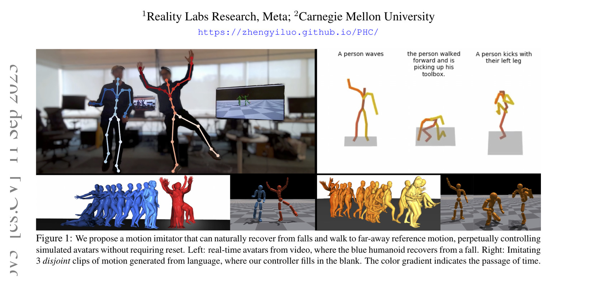
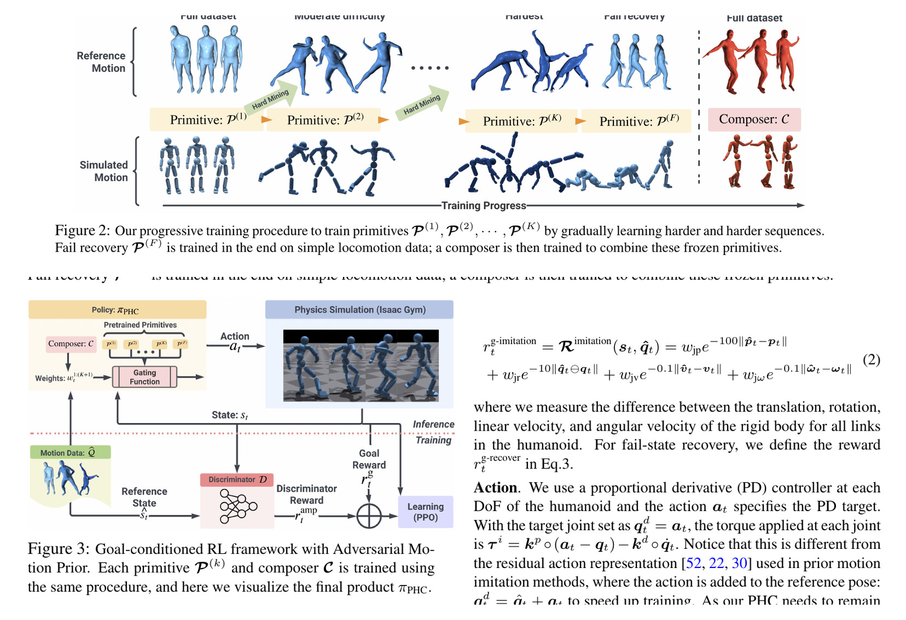
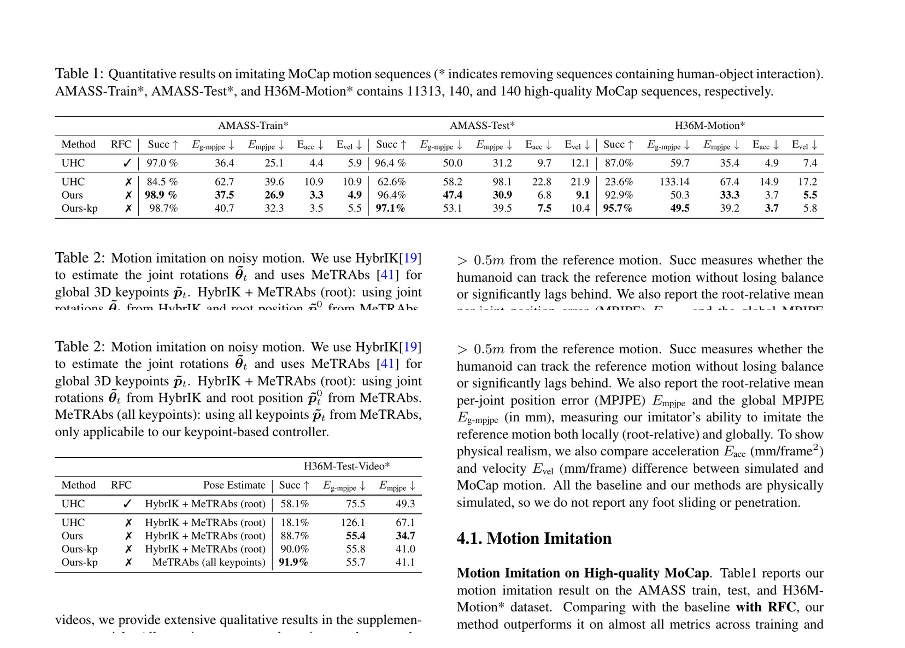
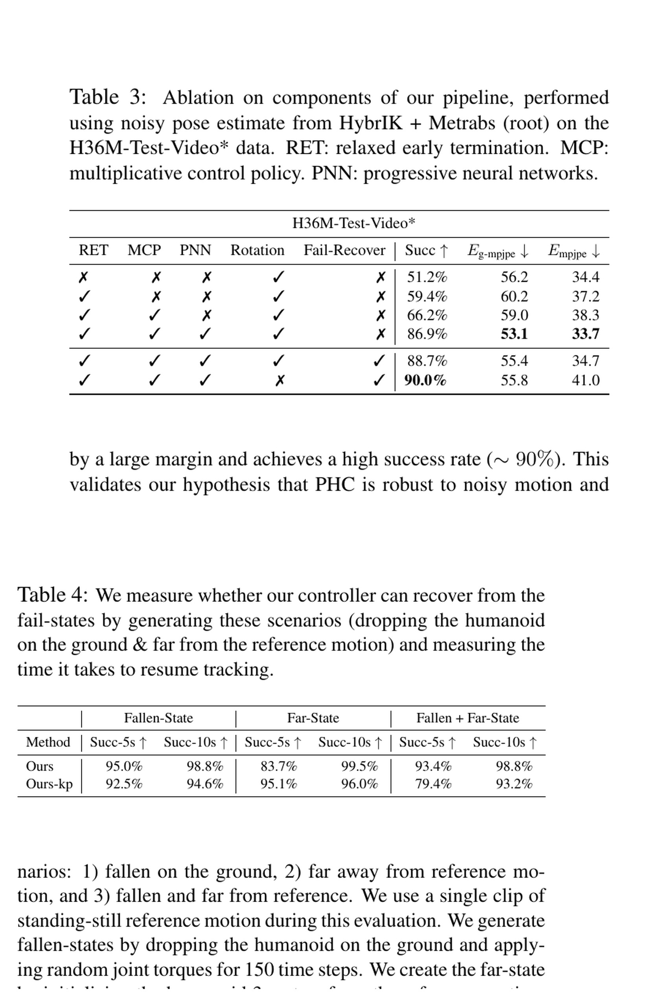

# PHC: Progressive Primitives for Large-Scale Tracking and Fail-State Recovery

[中文版](../phc-2305.06456.md)

Sources: [arXiv:2305.06456](https://arxiv.org/abs/2305.06456) · [pinned official code](https://github.com/ZhengyiLuo/PHC/tree/846988d433ce1f341e85ac6fbd2cd51911bb3341)

Review scope: the complete fourteen-page paper, supplement, hyperparameters, and the official Isaac Gym paths for imitation, multiplicative primitives, hard-example sampling, and get-up recovery. The evidence is for simulated avatars, not robot hardware.

> In one sentence: PHC repeatedly allocates a new frozen primitive to motions the current controller fails, composes four primitives at run time, reaches 96.4% success on the AMASS test split, and recovers within ten seconds in 98.8% of 1,000 combined fall-and-far trials, but none of those numbers validates robot actuators or physical-impact safety.

Key terms include Perpetual Humanoid Control (PHC, 永久人形控制), Progressive Multi-Controller Policy (PMCP, 渐进式多控制原语), Multiplicative Control Policy (MCP, 乘法控制策略), Progressive Neural Network (PNN, 渐进神经网络), hard-negative mining (困难负样本挖掘), relaxed early termination (放宽提前终止), keypoint tracking (关键点跟踪), and fail-state recovery (失败状态恢复).

## Engineering problem

A controller can overfit one acrobatic clip, yet a single network struggles with more than eleven thousand heterogeneous AMASS sequences. Easy locomotion dominates sampling, hard jumps and flips receive weak learning pressure, and continued training can erase earlier skills. Video input adds root drift, joint-rotation noise, identity switches, and timing mismatch. Once a character falls, the reference has moved away and a conventional tracker has no route back.

One useful analogy is a school that keeps adding courses. Retraining one teacher on everything risks forgetting, whereas PHC freezes teachers that already cover a portion of the curriculum and assigns new teachers to the remaining failed exams. Recovery resembles railway dispatch: first put the vehicle upright and return it near the route, then rejoin the moving timetable instead of chasing every missed frame.

## Method

At PMCP stage k, PHC trains a new primitive on the subset failed by the previous policy. Earlier primitive columns remain available through progressive lateral connections. An MCP composer combines their Gaussian action distributions rather than making a hard expert choice. Four primitives are used, with fail-state recovery introduced in the final stage. The motion library is not manually partitioned; measured failure determines where capacity is added.

The goal includes reference pose, position, velocity, and differences from the current state, with a keypoint-only alternative. Relaxed early termination does not immediately kill episodes for ankle and toe mismatch, allowing balance correction. Energy regularization reduces jitter and hard-negative sampling redirects computation toward current failures. During recovery, non-root imitation goals are removed; get-up, point-goal, AMP-style, and energy objectives take over until the root is within 0.5 m of the reference.

### Input → processing → output

The input is the simulated body state plus the next reference target, and the policy outputs actions at 30 Hz while physics runs at 60 Hz. Training uses 1,536 parallel humanoids. AMASS contributes 11,313 training clips; AMASS test and Human3.6M use 140 clips each. The authors report about seven days on one A100 and roughly ten billion samples, so the unified policy is not a low-cost model.

Recovery evaluation synthesizes three conditions: a fallen state generated with random joint torques, an upright state three meters from the reference, and both together. The policy first restores a viable body and approaches the root target without full-body tracking, then hands back to imitation inside the 0.5 m radius. A robot adaptation would need to validate this handoff as an explicit controller state transition.

## Key figures

Figure 1 places ordinary tracking, physical recovery, and catching a distant reference on one timeline. It defines “perpetual” as continued simulated service without an external reset, not infinite reliability.

Figure 2–3 show the shrinking failure subsets and the composer over frozen primitives. A reproduction should retain the per-stage failed-motion list and composer weights; an aggregate final score cannot reveal which capacity addition helped or interfered.

Table 1–2 report 98.9% AMASS-train and 96.4% AMASS-test success, while the keypoint policy reaches 97.1% on the test set. With noisy Human3.6M video pose, PHC variants are about 88.7%–91.9%, versus 58.1% for the reproduced UHC+RFC baseline. These remain simulated-avatar tracking metrics.

Table 3 separates relaxed termination, MCP, PNN, rotation, and recovery components. Table 4 uses 1,000 trials and reports 93.4% within five seconds and 98.8% within ten seconds for the combined fallen-plus-far condition. The same page states that backflips and high jumps remain hard because a one-frame target lacks future intent.

## Decisive evidence

The strongest evidence combines Table 3 and Table 4. The ablation distinguishes progressive capacity and recovery objectives from merely using a larger model, while the randomized recovery trials separately test falling, displacement, and their composition. It supports reduced resets inside the defined simulated failure generator, not arbitrary physical falls.

The noisy-pose experiment is also informative because keypoints outperform rotations. The authors argue that image-based keypoints are easier to estimate and let the controller choose a compatible joint configuration. The bounded engineering lesson is to select the control interface by end-to-end failure behavior, not by an isolated pose-estimator benchmark.

## Paper-to-implementation mapping

At commit `846988d433ce1f341e85ac6fbd2cd51911bb3341`, `phc/env/tasks/humanoid_im.py::HumanoidIm` constructs reference observations, while `compute_imitation_reward` and `compute_humanoid_im_reset` implement tracking and termination. `phc/env/tasks/humanoid_im_getup.py::HumanoidImGetup`, `_reset_fall_episode`, and `_compute_reset` expose the recovery episode and transition logic.

`phc/learning/amp_network_mcp_builder.py::AMPBuilder.Network` builds primitive networks and the `composer` that combines their outputs. `phc/env/tasks/humanoid.py` contains the `hard_negative` configuration and motion-sampling path. The repository later gained robot-related code, but this page treats only paths that map to the 2023 simulated-avatar paper as implementation evidence.

## Limits and evidence boundary

The authors explicitly identify less than 100% training success; difficult backflips, high jumps, and cartwheels that need future planning; degraded live-video operation from depth, velocity, frame-rate, and identity errors; an approximately level-camera assumption and manual subject height; asymmetric or visually abrupt recovery; and AMASS filtering that excludes interactions, stairs, and chairs.

Independent engineering limitations are stricter. An SMPL avatar has no high-ratio gearbox, bus latency, thermal envelope, structural-impact damage, or real foot friction. The 1,000 trials start from synthetic states, not a post-impact health condition. A three-meter point target says nothing about obstacle-aware return. Retraining after a robot or contact-model change may repeat the seven-day, ten-billion-sample cost.

PHC must not be sent directly to physical hardware. A transfer needs torque, speed, power, collision, and workspace limits; fall detection and post-impact health checks; human emergency stop; and a controller handoff that cannot cause a second impact while chasing the reference. Recovery should mean stable standing and safe nominal-controller takeover, not root distance alone.

## Bounded engineering takeaway

The reusable idea is failure-driven capacity allocation. Train a broad controller, preserve the actual failed-motion set, add capacity for those failures, and continuously regress old skills. For recovery, separate get-up, return-to-region, and resynchronization with explicit guards rather than blending them into one success flag.

PHC is also a useful simulation stress test for motion-data quality. Compare rotation and keypoint interfaces under identical motion, speed, flight, and estimator-noise buckets. Promote a primitive toward hardware only after the target actuator, contact, and latency model passes the same failure accounting.

## Reproduction checklist

Pin the PDF, commit, Isaac Gym version, AMASS/H36M splits, SMPL files, motion filters, four primitives, 1,536 environments, 30/60 Hz rates, seeds, and fail-state generator. Reproduce Table 1–4 and archive per-stage failure sets, old-skill regression, composer weights, sample count, and wall time.

Ablate relaxed termination, MCP, PNN, fail recovery, and rotation targets across at least three seeds. Freeze pose-estimator versions and camera assumptions for noisy-video tests. For recovery, report five- and ten-second success plus collision, energy, foot slip, and handoff transients.

Before any robot trial, add actuator saturation, latency, friction, IMU/encoder noise, and impact limits in simulation. Stage suspended and padded tests, classify failures as get-up, approach, resynchronization, limiting, collision, or perception, and stop on unknown states. PHC supplies an organization of the learning problem, not physical safety certification.

> **Engineering judgment:** let measured failures decide what new capacity should learn, then prove old coverage was not forgotten; “perpetual” describes simulated continuity, not unattended hardware operation.
