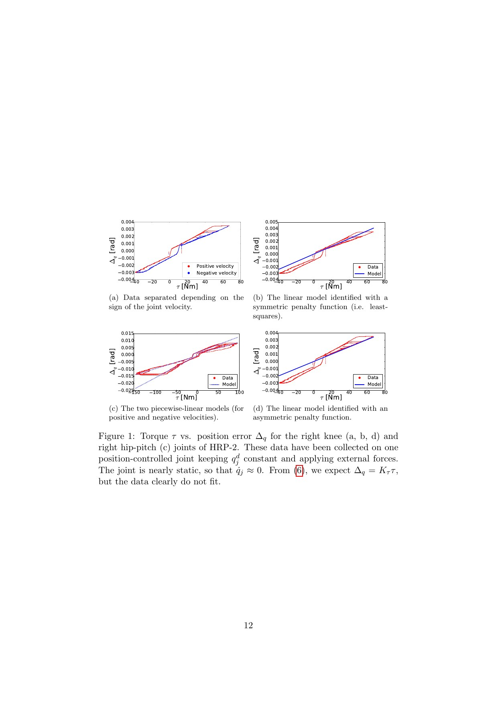
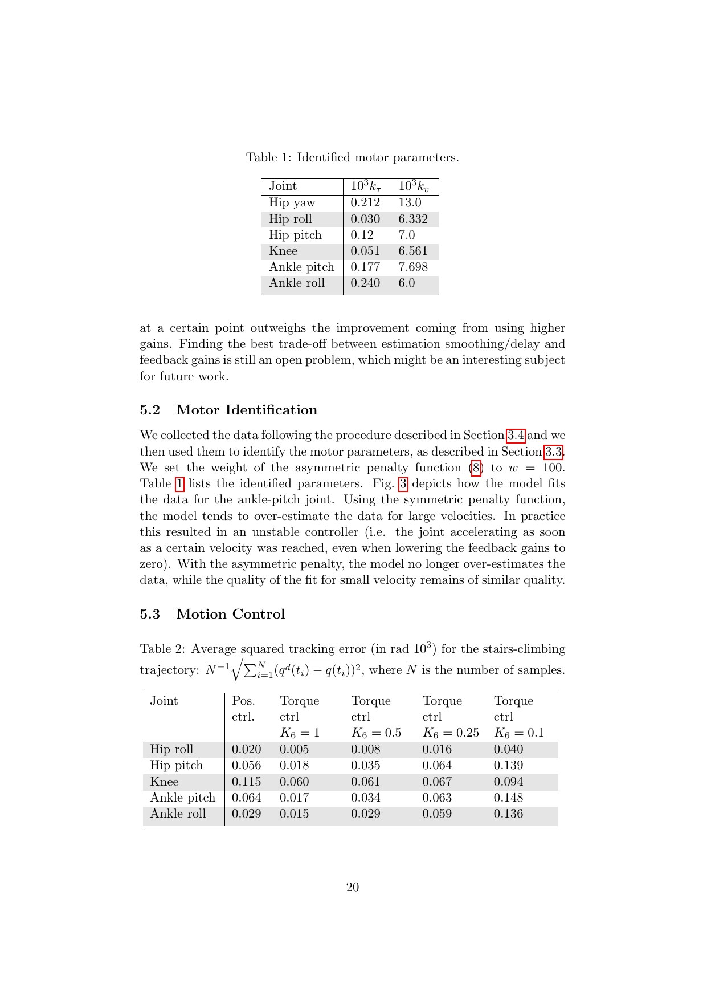
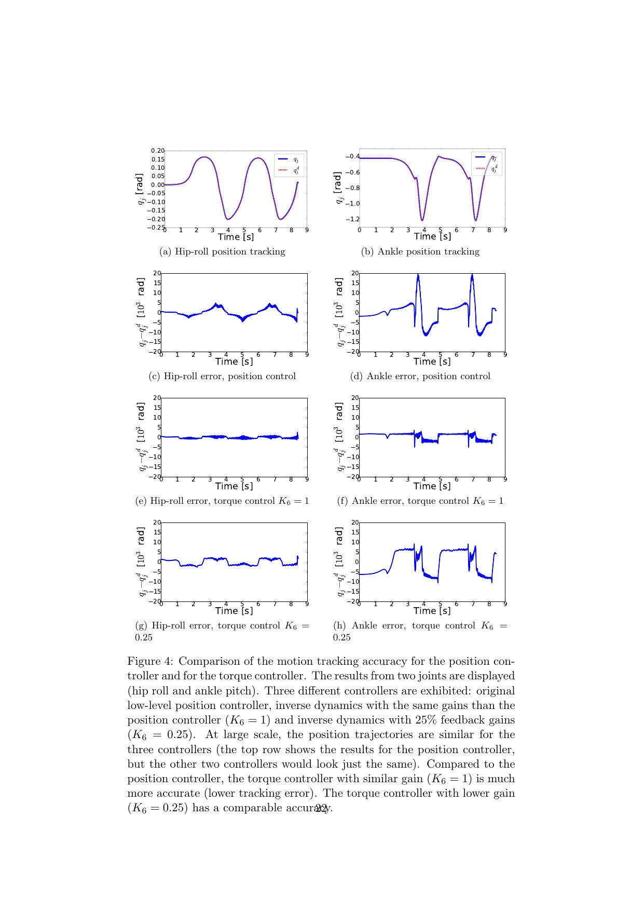

# Torque Control through a High-Ratio Position Interface

[中文版](../torque-control-high-ratio-gearboxes-2016.md)

Sources: [HAL: hal-01136936](https://hal.science/hal-01136936) · [author-hosted PDF](https://homepages.laas.fr/ostasse/hugo/publication/journals/delprete-ijhr-2015/delprete-ijhr-2015.pdf) · [pinned TSID code](https://github.com/stack-of-tasks/tsid/tree/eae96180ed8d289bc2c634f9d0857020ebfa6d90)

Review scope: all thirty-two pages, identification derivations, six-joint HRP-2 leg experiments, and the related open TSID task-space inverse-dynamics library. The low-level identification scripts are not published in TSID, so the mapping is explicitly partial.

> In one sentence: wrist/ankle six-axis sensors, IMU, encoders, and rigid-body dynamics estimate joint torque; a velocity-sign-dependent piecewise map translates desired torque into position offset; HRP-2’s right leg tracks motion more accurately at equal gains and approximately as accurately at quarter gain, and tracks a sinusoidal foot force, but the method still depends on force sensors and one-leg validation.

Key terms include high-ratio gearbox (高减速比齿轮箱), joint-torque estimation (关节力矩估计), six-axis force/torque sensor (六维力/力矩传感器), Savitzky–Golay filter (滤波器), inverse actuator model (逆执行器模型), asymmetric-penalty identification (非对称惩罚辨识), Task-Space Inverse Dynamics (TSID, 任务空间逆动力学), and Hierarchical Quadratic Programming (HQP, 层级二次规划).

## Engineering problem

Many stiff humanoids expose only joint-position commands. WBC computes desired torques, but firmware accepts a position error and no joint carries a torque sensor. Dividing torque by a guessed stiffness ignores friction, low-level dead zones, velocity direction, and undocumented firmware, causing poor tracking or instability.

This resembles controlling a car through an unknown driver: the upper layer can request a steering offset but cannot command tire force, so it must identify how the driver converts requests into force. Torque estimation resembles weighing through the feet: ankle forces, body motion, and dynamics infer internal loads, and every acceleration or inertial-model error enters the estimate.

## Core insight

HRP-2 has encoders, a torso IMU, and wrist/ankle F/T sensors. Savitzky–Golay filtering estimates joint derivatives; end-effector inertia and weight are removed from sensor measurements; floating-base dynamics propagate wrenches into joint torques. “Without joint-torque sensors” does not mean without force sensing—the four six-axis sensors are essential.

A first linear motor model fails. Torque versus position error contains a dead zone and switches with velocity sign. The authors fit three affine segments for each sign and penalize over-compensation more than under-compensation, because too much friction feedforward can create positive feedback. Desired inverse-dynamics torque passes through this inverse model, then estimated torque error adds feedback.

## Method: input → processing → output

Equation 1 expresses torque from configuration, velocity, acceleration, and contact wrench. Joint differentiation introduces delay, while base motion uses IMU and kinematics. Identification holds joints nearly static and applies external forces, avoiding high-frequency excitation by deliberately neglecting gearbox elasticity and the motor electrical pole.

The control input combines inverse-dynamics torque, friction feedforward, position feedback, and force feedback into a position increment. An end-effector force task can therefore be added above the same interface. The empirical model is not physical truth; it is a stable and identifiable adapter over the tested bandwidth.

## How to read the key figures

Figure 1 shows that knee torque versus position error is not one line. Splitting by velocity sign reveals fit branches, and asymmetric fitting avoids aggressive compensation above the observed relation.

Figure 2 separates suspended motion tracking from double-support force tracking; Table 1 lists six right-leg motor models. Suspension removes unknown contact but also bounds the motion evidence.

Figure 4 compares original position control, torque control at equal gain K6=1, and torque control at K6=0.25. Equal gain sharply reduces error, while quarter gain remains near the original accuracy, showing feedforward contribution.

Figure 5 tracks a sinusoidal right-foot vertical force against a rigid object. Gains were increased until instability was observed and then reduced, so the margin is empirical rather than a formal guarantee.

## Strongest experiment

The strongest evidence is the fair gain comparison. Better accuracy at equal feedback and similar accuracy at one-quarter feedback isolate the value of model feedforward better than a single best-tuned curve. Figure 6 further shows friction feedforward dominates motion, while desired-torque feedforward dominates force control.

The foot-force result proves that a position interface can host a contact task, but only for one foot, a rigid object, and limited frequency. It does not establish impact, compliant ground, contact switching, or whole-body manipulation stability.

## Paper-to-code mapping

At TSID commit `eae96180ed8d289bc2c634f9d0857020ebfa6d90`, `tsid::formulations::InverseDynamicsFormulationAccForce::computeProblemData` assembles motion, contact, and dynamics constraints. `addMotionTask` and `addRigidContact` expose the paper’s upper-layer task/contact structure. `tsid::tasks::TaskSE3Equality::compute` forms an end-effector task and `TaskActuationBounds::compute` supplies actuator limits.

TSID is the open upper-layer library from the same research line, not a release of HRP-2 firmware, complete piecewise identification, or the torque estimator used in the paper. Reproduction requires a separate estimator, inverse actuator model, and position-offset loop; running a TSID demo does not reproduce Figure 4–5.

## Limitations and safety boundary

The authors explicitly state that the piecewise model was selected from subjective observation, omits terms, and leaves estimation and identification improvements. They suggest using the model for prediction to cancel filtering delay and exploring disturbance observers. Gear elasticity and the motor pole remain neglected.

Independent engineering limitations include one HRP-2 right leg, dependence on calibrated F/T and inertial data, no whole-body walking or contact switching, no thermal or wear drift, and closed firmware whose change invalidates the model. Suspension and a rigid brick contact omit real impacts.

Asymmetric fitting lowers over-compensation risk but is not a stability proof. Open-loop inverse mapping, gains, and filter delay require low-energy joint-by-joint validation. F/T saturation, IMU faults, contact change, or large estimator residual should fall back to a safe position mode. Low-frequency success does not cover stored gearbox energy during collision.

## Bounded engineering takeaway

The paper is an engineering bridge from torque-level WBC to position-only hardware: establish observability, identify the actual low-level map, then combine conservative feedforward with estimated-torque feedback. It explicitly models the non-ideal interface rather than pretending it is an ideal torque source.

Modern robots with native current or torque control should prefer a validated manufacturer path. On position-only robots, re-identify every joint across temperature, load, and direction. Keep TSID task optimization and the actuator adapter modular so their faults can be separated.

## Reproduction and acceptance checklist

Pin firmware, gear ratio, sample rate, sensors, calibration, inertia, Savitzky–Golay window, segment thresholds, asymmetric weights, gains, trajectory, and TSID commit. Reproduce Figure 1, 4, 5 and Table 1–3 while reporting estimator delay and residual.

Collect positive/negative velocity, payload, and temperature data with train/validation separation. Check continuity, monotonicity, and over-compensation. Progress from replay to one suspended joint, six suspended joints, static contact, low-frequency force, then multi-contact, with position, velocity, force, power, and stop limits.

Monitor desired-estimated torque error, model branch switching, filter age, F/T saturation, and HQP feasibility. Firmware, lubrication, gearbox, or payload changes must expire calibration. Save both TSID and actuator-adapter logs to localize failure.

> **Engineering judgment:** “without joint-torque sensors” is not “without force measurement”; the method relies on end-effector F/T, dynamics, and conservative identification to create a bounded-bandwidth torque channel.
