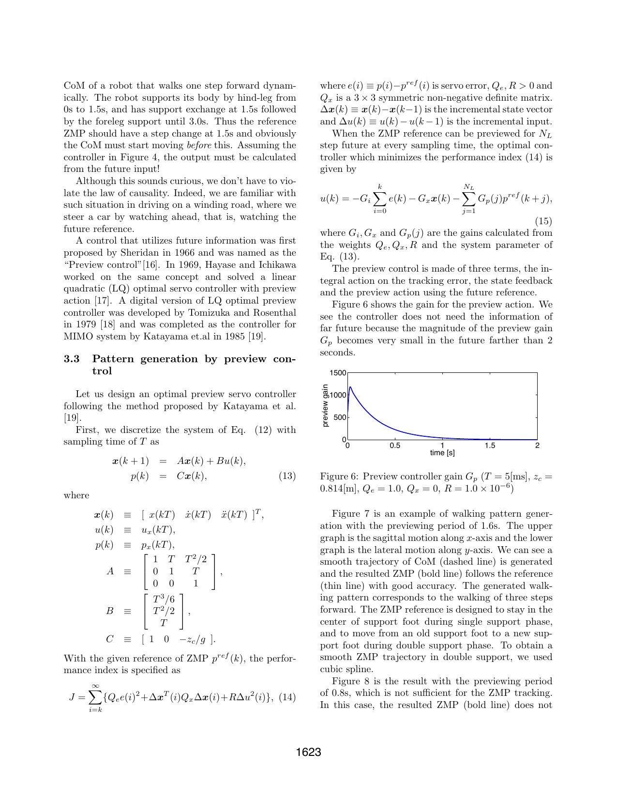
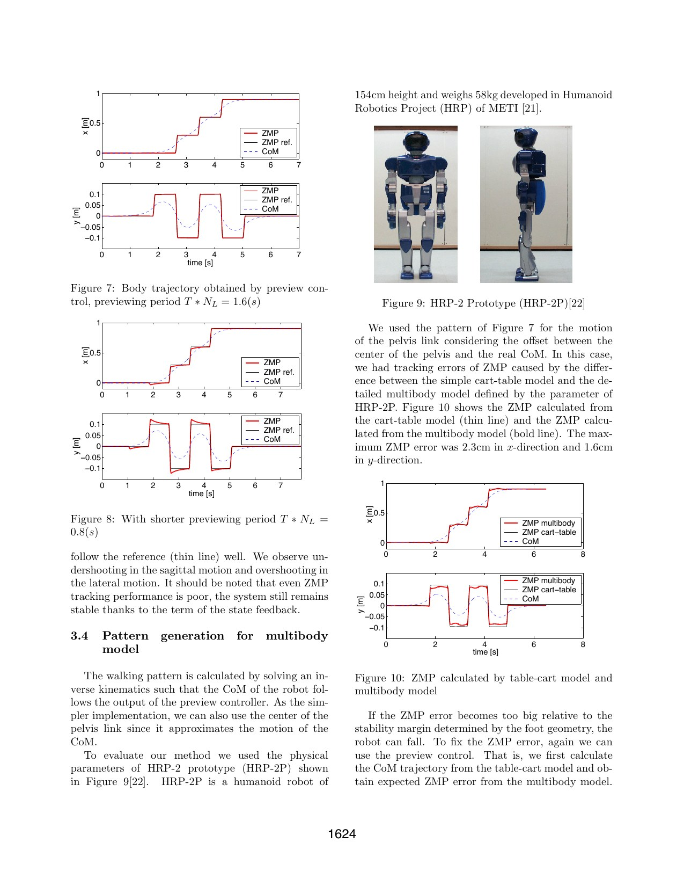
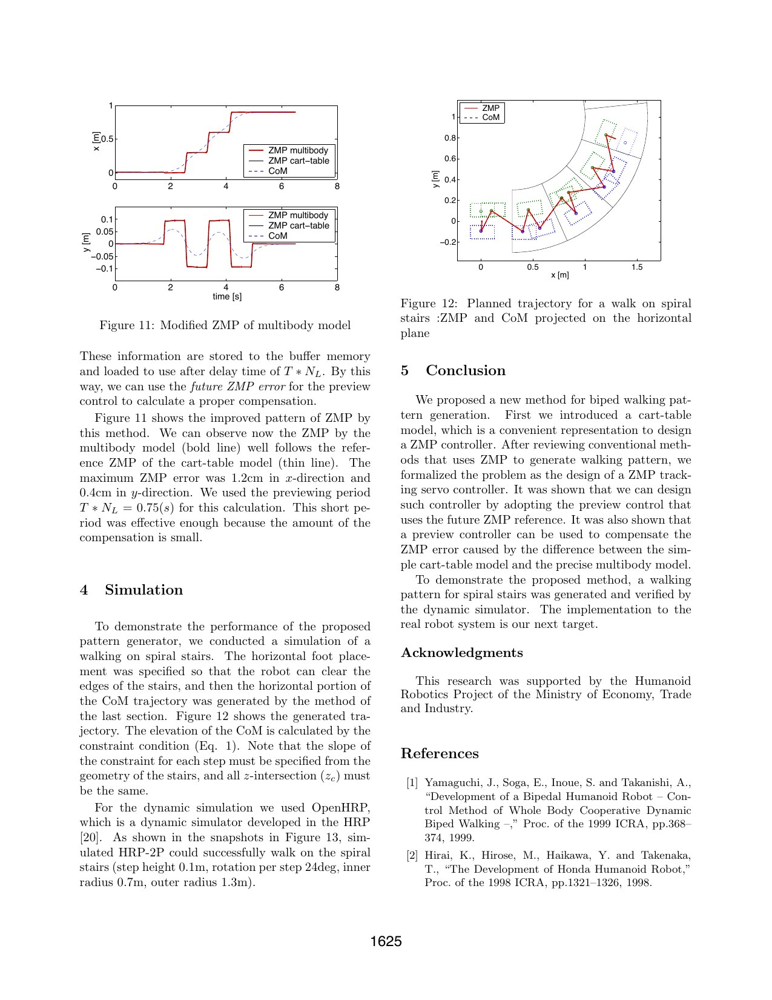

# ZMP Preview Control: Move the CoM Before the Support Transition

[中文版](../zmp-preview-kajita-2003.md)

Source: [DOI:10.1109/ROBOT.2003.1241826](https://doi.org/10.1109/ROBOT.2003.1241826). No author-maintained code for this 2003 paper was verified in the audit.

> **Bottom line:** Kajita et al. reformulate center-of-mass trajectory generation as ZMP tracking and use known future ZMP references to move the CoM before support changes. It is a walking-pattern generator, not a complete hardware stabilizer or proof that any motion with ZMP inside the foot is safe.

## Engineering problem
Footsteps determine a future support sequence, but the CoM must start responding before each boundary if the planned ZMP is to remain trackable. A controller using only current error reacts late and produces larger transitions.

## Method
A cart-table model yields a linear discrete system from CoM jerk to ZMP. An augmented servo uses integral ZMP error, current-state feedback, and a finite preview of future ZMP references. A second correction loop compensates the difference between the simplified model and the multibody robot.

## Key figures

These plots show how future-reference gains decay and why a shorter preview horizon worsens ZMP tracking.

The figures expose the residual model error and the iterative ZMP correction needed beyond the cart-table approximation.

The stair sequence demonstrates planned motion under prescribed footsteps; it is simulation evidence in the paper, not an unmodeled-terrain perception result.

## Decisive evidence
The horizon comparison directly isolates preview information, while the multibody correction experiment demonstrates that the linear planning model alone is insufficient.

## Paper-to-implementation mapping
A faithful implementation needs a discrete cart-table model, augmented LQR/servo gain computation, reference preview buffer, CoM/ZMP state update, and multibody ZMP correction. Because no official repository was verified, this page does not assign invented code symbols.

## Limits and evidence boundary
The model assumes a chosen CoM height and prescribed contacts, and classical ZMP reasoning does not cover arbitrary flight phases, foot slip, compliant ground, perception failure, actuator saturation, or estimation delay. Paper results do not constitute a hardware safety guarantee.

## Bounded engineering takeaway
Reuse the architecture—future-reference feedforward, current-state feedback, and full-model correction—rather than copying one gain table. Recompute the discrete model and gains whenever sample time, CoM height, or preview horizon changes.

## Reproduction checklist
Lock sample period, CoM height, preview length, ZMP reference, LQR weights, footsteps, multibody model, and correction iterations. Compare no-preview and multiple horizons; report ZMP error, CoM/jerk, support transitions, solver conditioning, and constraint violations.
