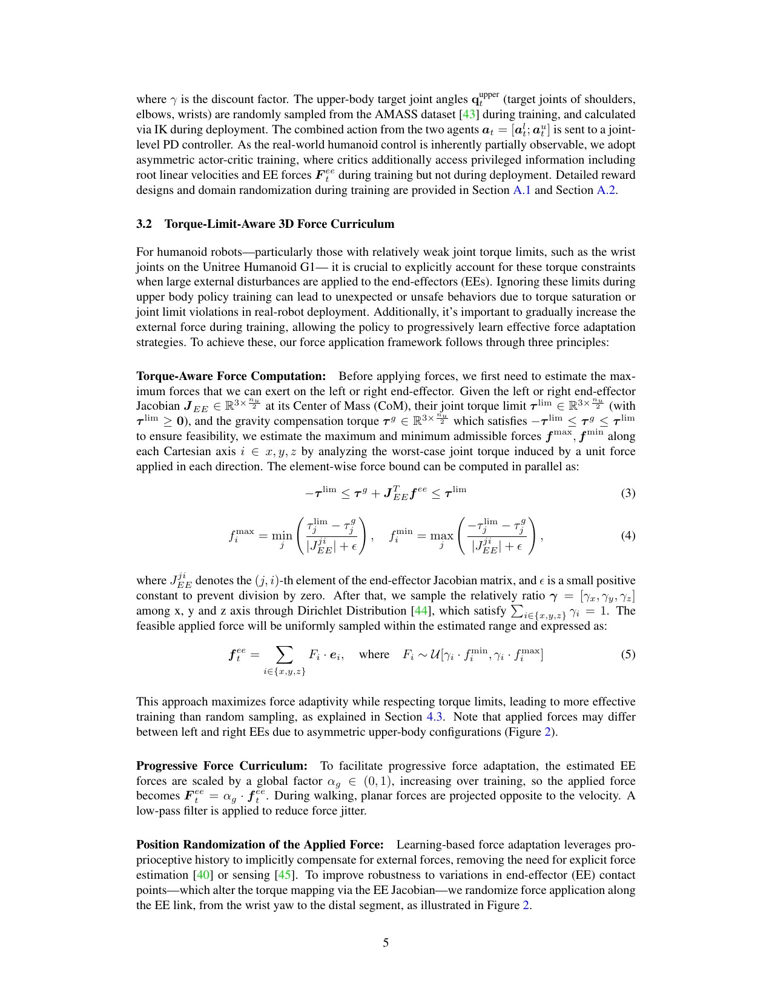
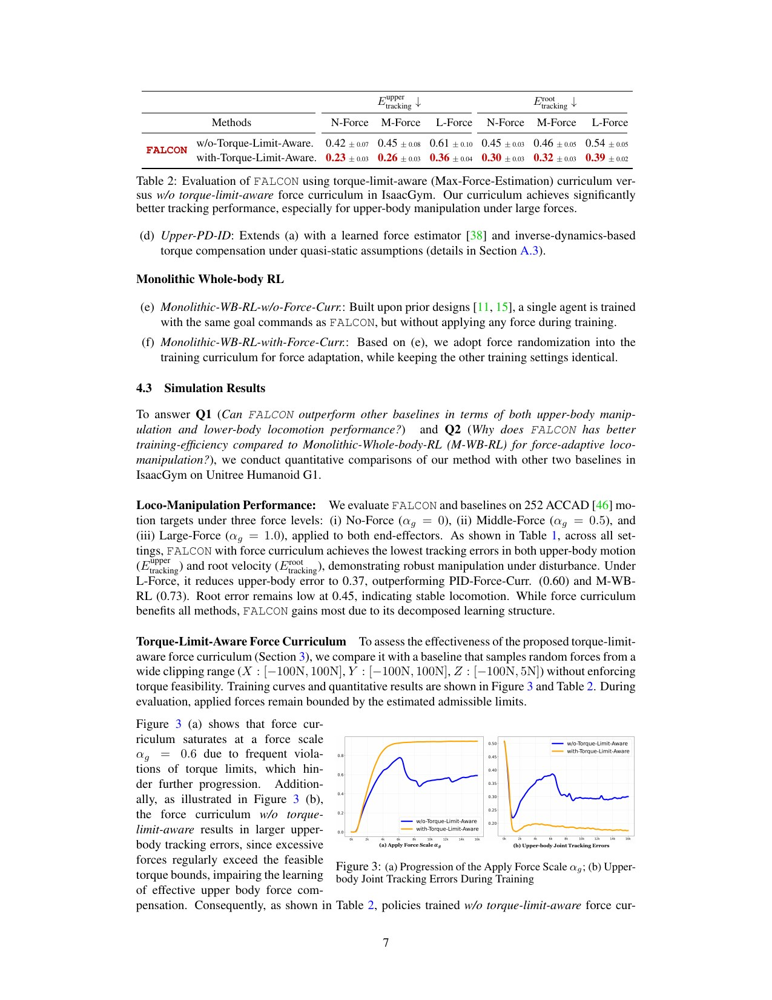
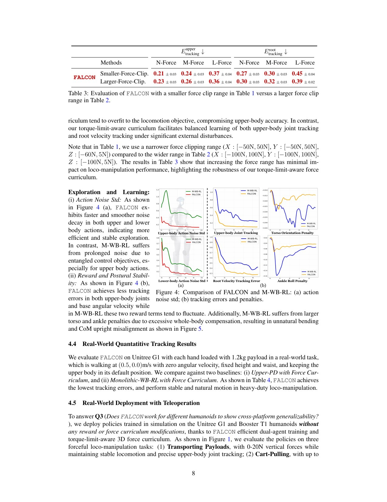

# FALCON：用双策略与力矩可行力课程学习受力移动操作

来源：[arXiv:2505.06776v2](https://arxiv.org/abs/2505.06776v2) · [固定提交官方代码](https://github.com/LeCAR-Lab/FALCON/tree/a967a6d8494f57777cf8d266a644ac8e45833301)

解读范围：完整 17 页正文与附录。

> 一句话总结：FALCON 将上、下身策略分开优化但共享全身历史，并用执行器力矩余量约束训练外力课程，从而让人形机器人在负载、拉车和开门时仍能协调移动。

术语导航：移动操作（loco-manipulation）同时要求支撑与末端任务，双策略分解（dual-policy decomposition）分开上下身奖励，却共享本体历史（proprioceptive history）。雅可比矩阵（Jacobian）、力矩可行域（torque-feasible set）、迪利克雷分布（Dirichlet distribution）、课程学习（curriculum learning）和残差扰动（residual disturbance）是理解外力生成器的关键。

## 工程痛点

搬运负载或推拉门车时，手上的力会通过肩、腰和支撑腿传到地面。如果只让腿部策略稳住速度，上身用 IK/PD 独立跟手，那么两套控制目标会在腰部和角动量上“拔河”。反过来，一个统一策略又要在单一奖励里平衡速度、姿态、手部跟踪和外力，探索容易被强势的站立奖励主导。

更难的是训练外力不能随便均匀采样。力太小学不到抗扰，力太大则执行器根本无法生成所需力矩，策略只会在不可行状态中跌倒。这就像训练举重时不能随机从一克到一吨抽杠铃：课程必须与关节当下的力学余量对齐。

## 核心洞察

FALCON 的第一个洞察是“分开优化”不等于“分开感知”。上、下身各自拥有奖励与 critic，让两类目标不在一个回报标量中相互淹没；但两个 actor 都看全身关节、IMU 和动作历史，因而上肢可以感知步态，下肢也可以感知手部受力后的躯干响应。

第二个洞察是外力课程应从执行器空间返推。论文用 `Jᵀf` 将末端力映射到关节力矩，再扣除重力补偿占用的余量。这好比先看每条保险丝还剩多少电流，再决定负载分配；不是先提一个任意手力，再期望关节自己承受。

但它仍然是一个训练分布生成器，不是实时安全控制屏障。逐轴界与 Dirichlet 配比没有完整表达多关节联合可行集，也没有包含冲击、摩擦锥、温度和长时间热额定。

## 方法主线

FALCON 处在“腿部 RL + 上身 IK/PD”和“单一全身 RL”之间：下身策略优化速度、站立、根高度与腰部目标，上身策略优化肩肘腕关节跟踪；两者各有 critic 和奖励，却共享五步全身关节/IMU/动作历史，联合训练后拼接为全身关节目标并交给 PD。训练 critic 可额外看根线速度与末端外力，部署 actor 不需要力传感。

训练难点由三维末端力课程处理。由末端 Jacobian、重力补偿力矩和关节力矩上限求各轴可施力区间：`-τ_lim ≤ τ_g + Jᵀf ≤ τ_lim`；再用 Dirichlet 比例分配三轴、逐步提高全局尺度，并随机化力在手腕到远端链段上的作用点。它限制的是训练扰动的静态力矩可行性，不是接触任务的完整动态安全证书。

## 关键图解

Figure 2 要沿两条线读：上面的上身 actor 追关节目标，下面的下身 actor 追速度、根高与腰部目标；两者输出拼成一个全身 PD 目标。两条线中间的共享历史是协调的通道，不应把结构简化成两个完全无关的控制器。

- Figure 2：双 agent 共享本体观测、独立目标/奖励并拼接动作；同时画出训练受力与遥操作/自主部署链。
- Equations 3–5：从 Jacobian 与力矩余量构造逐轴力边界和三维采样。
- Table 1：252 条 ACCAD 目标、无/中/大力下比较。大力时 FALCON 上身误差 0.37，PID 0.60，单体全身 RL 0.73；根速度误差 0.45。
- Table 2：力矩感知课程的大力上身误差 0.36，对无力矩约束宽裁剪的 0.61；对应训练曲线显示后者课程卡在约 0.6。
- Table 4：G1 双手各 1.2 kg、0.5 m/s 实机任务中，上身误差 0.39，优于单体 RL 的 0.81 和 PD 的 1.81；根误差与单体 RL 存在权衡。
- Figure 1/6：G1 与 Booster T1 完成载荷搬运、拉车、开门及料箱物流；多为定性任务展示。

Table 1 先比较双策略、单体 RL 与 PID，Table 2 再在力采样上比较力矩感知课程与宽裁剪。两表合在一起才能区分“策略结构”和“训练扰动”的贡献。大力工况中的上身误差差距是关键，但根速度误差的权衡也必须保留，否则会把全身问题说成只有手臂精度。

Table 4 将方法放到双手各 1.2 kg 且根速度 0.5 m/s 的 G1 工况中，是从仿真外力到真实负载的关键桥梁。但它只有一个定量负载行走设置，开门、拉车和搬箱的接触力、成功率与失败分母仍未通过该表回答。

最强证据是 Table 1/2 联合：同一目标与力课程下，结构对照隔离双策略分解；再用无力矩感知课程隔离可行力采样。它支持“在该命令分解和受力设置中改善探索与跟踪”，不证明双策略一般优于所有统一策略。

## 最有说服力的实验

Table 1-2 的联合消融最有说服力，因为它不仅问“FALCON 是否更好”，还问“好在哪一层”。双策略与单体 RL/PID 对照聚焦目标分解；力矩感知与宽裁剪对照聚焦课程采样。两个结果同时成立，才支持论文的完整机制链。

Table 4 提供实机定量落点，但它的窄范围必须写清：一种行走速度、一种双手负载与一台 G1。要验证移动操作，还应在持续推拉、突变卡顿、单手偏载和不同步速下报告成功、跌倒、力矩饱和和热状态。

## 论文—代码映射

| 组件 | 固定提交符号 | 对应关系 |
|---|---|---|
| 力矩可行边界 | `LeggedRobotDecoupledLocomotionStanceHeightWBCForce._calculate_max_ee_forces` | 读取 Jacobian 与力矩余量，计算左右手三轴上下界 |
| 力采样与课程 | `_init_force_settings`、`_scale_forces`、`_update_force_scale_curriculum` | Dirichlet 轴比例、低通、裁剪和逐步 force scale |
| 作用点随机化 | `_resample_force_settings`、`_pre_compute_observations_callback` | 在手部链段上随机作用比例并形成施力位置 |
| 上身目标 | `_reward_tracking_upper_body_dofs` 与多 agent PPO 配置 | 上身关节跟踪奖励和上下身独立策略配置 |

固定提交为 MIT；它晚于论文初稿且 README 曾保留发布 TODO，因此复现应以提交实际文件而不是历史宣传状态为准。

## 局限与工程判断

作者在论文结尾承认方法目前依赖关节角目标，未来需扩展末端笛卡尔跟踪；对接触力本身没有闭环目标。独立判断还包括：力不作为 actor 输入，适应来自短历史且可能对突变/持续摩擦存在延迟；力边界逐轴近似并经过裁剪，不能覆盖多接触、热限制、齿隙与冲击；跨平台“无需改奖励/课程”仍使用不同机器人配置；实机定量仅一个载荷步行工况。

此外，上下身动作在拼接点仍通过同一躯干与接触系统耦合。两个 actor 单独稳定不保证拼接后的联合动作不饱和，所以部署时需对全身力矩、支撑多边形和末端力同时做监控。

## 可执行但有边界的结论

适合复用的是“先按执行器可行域生成扰动，再用结构化策略比较”的训练思想。复现中应同时保留无力矩感知课程、单体策略和 PD 对照，否则无法区分数据生成与结构分解的收益。

真实门/车/载荷任务仍需末端力/接触监控、热保护、速度/力矩限幅和故障退出，不能把训练随机力范围直接当作实机许可范围。

## 复现与验收清单

还应将外力作用点从一个随机比例升级为评估轴：手腕、前臂远端与不同方向的拉/推力分开报告。同样的末端力在链段不同位置会产生不同关节力矩和躯干扰动，如果总表格对所有作用点取平均，可能掩盖某个特定接触位置始终导致力矩饱和。

力突变与持续力应作为两类测试。短历史可以从机器人响应中间接感知外力，但对接触刚发生的第一个控制周期没有先验。验收应报告初始峰值、恢复时间和长时间稳态误差，而不只在整条轨迹上取平均。

跨 G1 与 Booster T1 的转移应同时列出不变和已改变的部件。奖励与课程名称可以不变，机器人模型、力矩界、默认姿态、动作缩放与训练分布仍会变化。只有明确这些适配成本，才能将“同一方法可跨平台”与“完全零调整”区分开。

复现首先要把上、下身的 observation、command、action 和 reward 分别列表，再标出哪些本体历史是共享的。两个 actor 网络容量、更新次数、优势归一化与动作拼接顺序必须固定，否则与单体策略的比较会混入计算预算与输出接口差异。

外力生成器需要单独单元测试。对一组随机姿态，先计算重力补偿力矩、Jacobian 和逐轴余量，再检查采样力映射回关节后是否仍在训练边界内。还应保存 Dirichlet 轴比例、作用点、低通后的力与裁剪比例；若大量样本在最后被裁剪，真实训练分布已与课程设计不同。

结构消融应至少包含双策略、参数量匹配的单体策略、上身 PID/下身策略和无全身共享历史的双策略。最后一个对照能回答协调是来自奖励分开，还是来自两个 actor 能观察对方的身体响应。所有对照应使用相同动作目标、外力样本与环境步数。

实验指标不能只看手臂误差。每个外力档位应同时报告上身关节误差、根速度误差、躯干姿态、足滑、关节力矩饱和比例、跌倒和能耗。上身更准但根速度恶化，是明确权衡而不是可以在平均总分中消失的次要结果。

真机验收应从静态双手载荷开始，再扩展到低速行走、单手偏载、持续推拉与接触突然释放。每一级都应记录末端力、电流、温度、关节目标和接触事件，并在力、力矩或支撑边界被突破时退回安全姿态。开门和拉车还需要与物体约束相匹配的任务终止条件。

代码复核还应将论文公式中的力矩上下界与 `_calculate_max_ee_forces`、`_scale_forces` 的实际裁剪顺序逐步对齐。数学上的逐轴可行区在经过力比例分配、低通滤波和全局 scale 后，最终作用分布可能已明显变化。复现报告要同时给出理论候选力和实际施加力的直方图，并按关节姿态与作用点分层。这能避免只验证函数名一致，却没有验证课程真正产生的数据。

> **金句**：好的扰动课程不是把机器人推得更狠，而是把每一次受力都放在执行器有机会学会的边界里。

论文中的外力是训练扰动，不是任务所期望的闭环接触力。因而开门、拉车与搬运系统仍需上层提供任务轨迹、检测接触并处理卡死；只靠 FALCON 对扰动的适应性不能替代这些任务逻辑。
