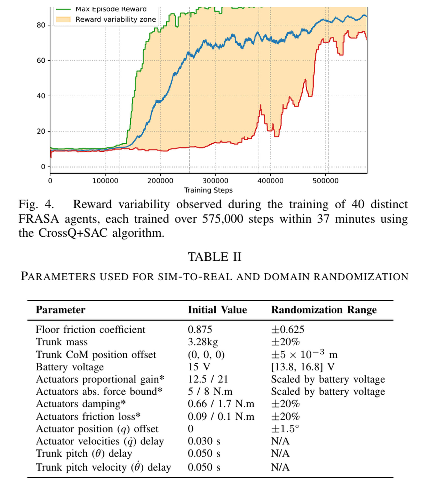

# FRASA：用一个端到端策略统一抗扰、倒地恢复与起身

[English version](en/frasa-2410.08655v3.md)

来源：[arXiv:2410.08655v3](https://arxiv.org/abs/2410.08655v3) · [固定提交官方代码](https://github.com/Rhoban/frasa/tree/78457df8fb1533b9bbda60a345c015c87cdf9732)

解读范围：完整 7 页正文与全部实验表格。

> 一句话总结：FRASA 利用 Sigmaban 的左右对称结构，把控制降到矢状面五类关节，用从随机跌倒姿态开始的 CrossQ/SAC 学到同一个既能抗扰、又能倒地后起身的端到端策略。

术语导航：跌倒恢复与站立抗扰（fall recovery and disturbance rejection）共用一个策略，左右对称降维（bilateral symmetry reduction）缩小动作空间。增量位置目标（incremental position target）、随机跌倒初始化（randomized fall initialization）、CrossQ 架构（CrossQ）、软行为者评论家（Soft Actor-Critic, SAC）、传感延迟（sensor latency）和执行器随机化（actuator randomization）构成完整训练闭环。

## 工程痛点

传统人形系统常把站立抗扰与起身分成两个控制器：一个尽力不摔，另一个在已经蹺下后执行预定动作。两者的切换阈值很难定义：机器人可能倾斜很大却仍能恢复，也可能脚还没离地就已经无法挽回。过早切换会主动放弃平衡，过晚切换则让起身动作从错误姿态开始。

FRASA 将两类状态放进同一训练分布，让策略根据姿态和动作历史在站立、受扰恢复、翻身与抬升之间连续过渡，而不是依赖人工模式开关。

然而，从随机姿态学习还面对奖励稀疏。策略早期很少偶然靠近站姿，所以论文以小概率从目标姿态附近开始，让 critic 先看到高回报区。它像在巨大迷宫的出口附近也放几个起点，使价值信号能沿路径逐步向外传播。

另一个工程难点是实机执行器比简化 MuJoCo 模型复杂。论文已经随机化电压、增益、力矩、摩擦与延迟，但实机仍出现明显震颤，最终需降低增益并将推理频率从 20 Hz 提到 100 Hz。这说明域随机化可以提高容错，却不会消除控制接口偏差。

## 核心洞察

第一个洞察是对称性是一个强先验，不是免费的通用技巧。对 Sigmaban 的矢状面起身与前后摆锤冲击，它将学习空间从左右关节组降为五个同步动作，显著降低探索难度。但一旦地面、初始姿态或外力存在左右不对称，这个先验就可能阻止必要的侧向跨步和单手支撑。

第二个洞察是动作输出的语义会影响鲁棒性。策略输出关节速度，再积分到位置目标，因而每步只做小的目标修正；同时 observation 保留当前目标与上一动作，让策略知道自己已经积累了多少命令。这个接口可以减少单步跳变，却也会因持续偏置积累到限位，所以仍需裁剪与终止。

第三个洞察是快速训练不等于免人工选择。Figure 4 显示多数代理在几十分钟内学会，但作者仍必须从多个候选中排除机械应力与磨损不可接受的策略。它像快速生成多张设计图：优化能快速找到可行外形，工程审查仍要排除难以制造和易损的方案。

## 方法主线

FRASA 把 Sigmaban 的左右对称结构作为强先验，只观察并控制肘、肩俯仰、髋俯仰、膝、踝俯仰五类自由度，动作对称施加到左右关节。状态为五个关节角/角速度、当前关节目标、躯干俯仰及角速度和过去动作；策略输出期望关节角速度，按 `qᵈ_{t+1}=qᵈ_t+Δt·a_t` 积分为位置目标。奖励由目标站姿接近度、动作变化平滑和无自碰三项组成。

每个 episode 先在物理关节限制内随机姿态与躯干角度，把机器人释放到地面并等其稳定；小概率从目标站姿附近开始，以便早期看到高回报。CrossQ+SAC 在 16 个并行 MuJoCo 环境中训练。域随机化覆盖地面摩擦、躯干质量/质心、电池电压、执行器增益/力矩、阻尼/摩擦和角度偏置，仿真还显式加入 30 ms 关节速度与 50 ms 躯干姿态延迟。论文训练决策频率为 20 Hz，实机推理提高到 100 Hz以减轻抖动。

## 关键图解

Figure 2 / Equations 1-3 定义了这篇论文最重要的约束：左右关节共用五个动作，速度动作经积分得到位置目标，状态同时包含关节、躯干与动作历史。因而论文的统一能力是在对称矢状面子空间中建立的，不是完整人形动作空间。

- Figure 2 / Equations 1–3：明确五自由度对称姿态目标、增量动作与带动作历史的状态。
- Equation 4 / Table I：目标姿态、动作变化和自碰奖励的完整组成。
- Table II：列出摩擦、3.28 kg 躯干质量、质心、电压、增益/力矩、摩擦及 30/50 ms 延迟等 sim-to-real 参数。
- Figure 4：40 个代理在 57.5 万步、37 分钟内的评估分布；最快约 13 分钟学会，约 30 分钟后趋于一致。
- Table III：各 20 次实机起身，俯卧 FRASA 2.135±0.042 s 对 KFB 3.154±0.005 s；仰卧 2.678±0.178 s 对 5.06±0.008 s。
- Figure 5 / Table IV：0.9 kg 摆锤以 4.0–7.3 J 冲击，每配置 10 次；7.3 J 前/后向恢复 2.44/2.26 s，KFB 为 5.74/4.47 s。

Figure 4 的 40 个代理分布说明 CrossQ/SAC 在该小尺寸对称问题上的学习速度，Table II 则说明这个速度不是在完全确定仿真中得到。但随机化范围仅与论文的 Sigmaban 和延迟模型对应，换成其他执行器时必须重新通过实验定义。

Table III-IV 是难得的同平台受控对照：起身每种姿态 20 次，摆锤每配置 10 次，对照是机器人原有 KFB。均值和方差让读者能看到起身重复性，不只是最快一次。但摆锤只沿前后方向，没有验证对称降维无法表达的侧向恢复。

最强证据是 Table III/IV：它把起身和受控摆锤抗扰都放到同一实机、同一 KFB 基线上，并报告重复次数与方差。它证明的是这台 70 cm、7.5 kg Sigmaban 在矢状面设置中的相对优势；不是任意人形机器人、侧向跌倒或任意冲击能量的结论。

## 最有说服力的实验

Table III 把俯卧与仰卧各 20 次的起身时间与 KFB 直接对照，显示 FRASA 在两类姿态都更快。Table IV 则把“不摔”问题也放到受控外力下，使同一策略的抗扰与倒地恢复不只是口头统一。其价值在于有实验分母、基线和受控冲击条件。

但实验能量不应被当成安全额定。0.9 kg 摆锤的 7.3 J 只定义该装置下的冲击，不包含接触时间、峰值力、击中位置与结构疲劳的完整安全信息。复现应从更低能量开始，并同时记录峰值关节负载、脚部滑移与机械检查结果。

## 论文—代码映射

| 组件 | 固定提交符号 | 对应关系 |
|---|---|---|
| 对称五自由度接口 | `StandupEnv.apply_control` / `StandupEnv.get_observation` | 同一控制向量写入左右关节，并构造论文的关节、躯干和动作历史状态 |
| 增量动作与安全终止 | `StandupEnv.step` | 速度模式积分成关节目标并裁剪；倒置、过大角速度和可选冲击条件触发终止 |
| 域随机化与随机跌倒 | `StandupEnv.apply_randomization` / `StandupEnv.randomize_fall` | 随机摩擦、质量/质心、电压、执行器参数、角度误差与初始跌倒姿态 |
| CrossQ 训练配置 | `train_sbx.py` / `hyperparams/crossq.yml` | 注册 CrossQ 并提供论文环境的训练超参数入口 |

官方仓库为 MIT，公开的是 MuJoCo 训练/评估环境与 Sigmaban 模型；论文中的实机控制集成不是由该仓库完整封装的一键部署路径。

## 局限与安全边界

作者明确指出：左右对称降维限制了侧向扰动与非对称动作；简单执行器模型曾导致实机明显震颤，只能通过降低增益和提高推理频率缓解；部分学得动作虽可执行但机械应力和磨损不可接受，因此还需要人工从多个候选策略中挑选；未来希望改进执行器模型并谨慎研究在线实机训练。

独立判断是：候选策略的人工筛选使“训练一次即可部署”不成立，Table IV 也未覆盖失败概率、峰值关节载荷或长期疲劳。人工筛选的准则应写入复现记录，包括排除了多少策略、因何种机械应力或行为异常排除，否则最终权重会带有不可见的幸存者偏差。

## 可执行但有边界的结论

对具有强左右对称结构、主要处理前后扰动的小型人形，可以把对称降维作为明确基线，并用同一策略比较站立恢复与完全倒地起身。但验收必须另加非对称初始姿态、侧向冲击和单侧支撑对照，直接暴露这个先验不能覆盖的区域。

摆锤能量只描述试验装置，不是安全冲击额定值。复现必须先在仿真中启用倒置/角速度/冲击终止并审查自碰，再用有系留或柔性捕获的低能量测试；实机须设置机器人专属位置/速度/电流/温度/接触阈值、独立急停、隔离区和机械检查周期，禁止直接在线探索未知姿态。

## 复现与验收清单

容易误读的一点是将 37 分钟左右训练时间当成跨平台可比指标。这个时间同时依赖 16 个 MuJoCo 环境、策略网络、硬件、软件版本与停止条件。更稳定的复现指标是环境交互步数、随机种子分布和达到固定评估阈值的曲线。

另一点是将“一个策略”理解为完全没有模式。策略内部可以根据躯干角度和动作历史学出隐式阶段，只是外部不再用手写切换器。因此仍要用状态轨迹分析策略何时从抗扰过渡到倒地恢复，以及是否存在迟滞或高频往返。

复现首先要验证对称映射：五个动作如何同时写入左右关节，传感观测如何折叠，关节限位与默认姿态是否也对称。单元测试应给每个动作一个小正/负值，检查左右关节的方向与幅度。任一关节轴定义不同都会把对称先验变成隐藏的反对称扰动。

随机跌倒初始化应画出躯干角、关节姿态、接触组合与目标站姿附近重置的比例。还要跑去掉“从高回报附近开始”的对照，查看它对收敛时间与最终策略的影响。如果正样本比例过高，策略可能学得很快，却在距目标很远的真实跌倒状态上缺少覆盖。

执行器对齐要把 20 Hz 训练、100 Hz 实机推理和 PD 内环之间的接口写清。提高推理频率时，增量速度动作如何按 `Δt` 积分必须与论文一致，否则频率变化会同时改变每秒最大关节目标速度。还应分别扫描增益与推理频率，而不在一次修改中混淆两者收益。

实机验收除了前后起身和摆锤，必须加上侧向、斜向冲击和左右不同初始关节姿态。这些不是为了证明 FRASA 失败，而是用实验画出对称策略 ODD 的边界。同时要记录策略候选数、人工排除数、排除原因、峰值关节负载和实验后机械检查，使人工筛选也成为可复现管线的一部分。
