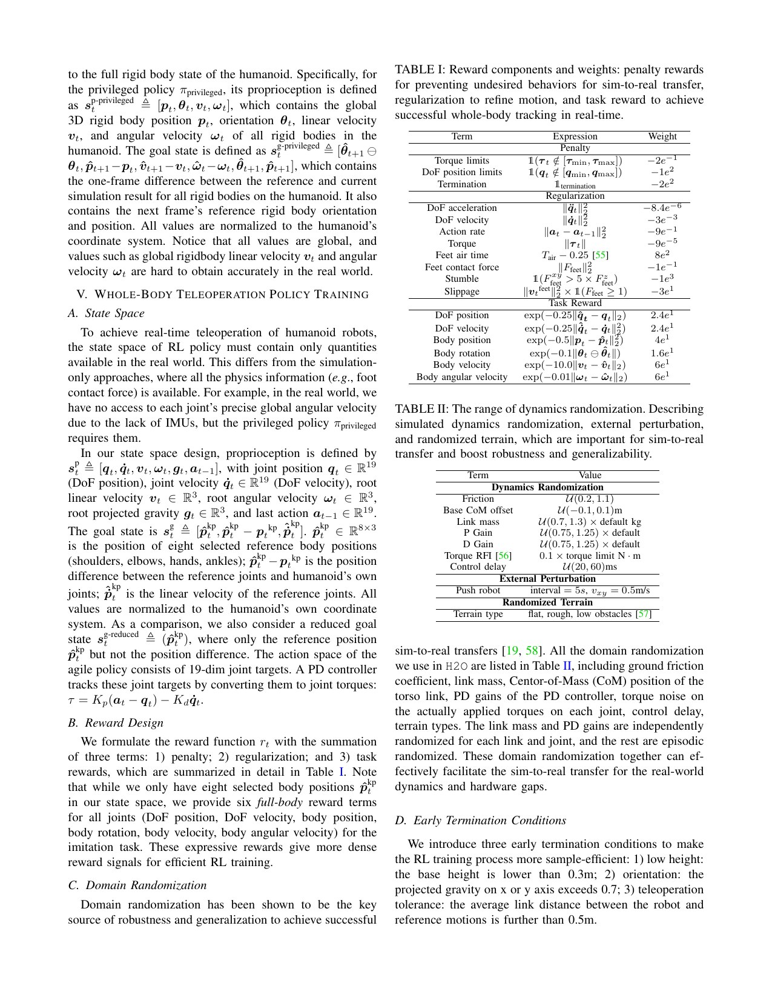
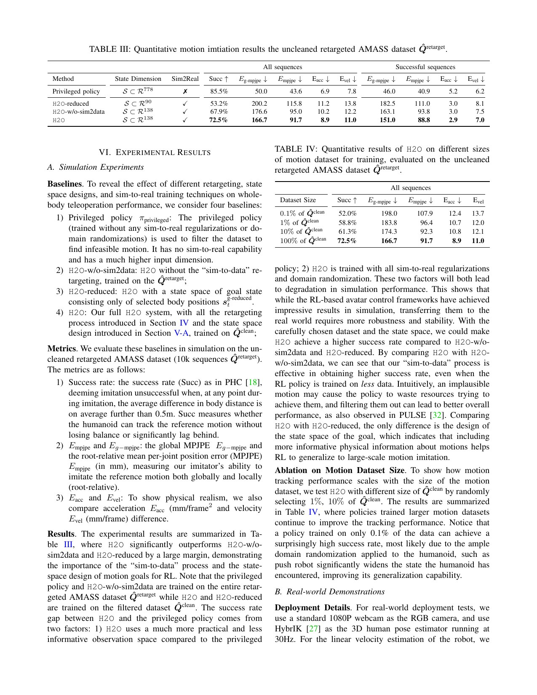

# H2O：单目人体姿态只是入口，真正决定实机遥操的是可行性筛选与闭环模仿

[English version](en/h2o-2403.04436v1.md)

来源：[arXiv:2403.04436v1](https://arxiv.org/abs/2403.04436v1) · [官方项目](https://human2humanoid.com/) · [官方代码固定提交](https://github.com/LeCAR-Lab/human2humanoid/tree/750f1fa052641f0fde43669d50cb4e407dabe6c8)

解读范围：完整 10 页正文与补充实验；本文保存原创分析、图表定位与代码链接，不保存论文全文、视频帧、动作数据或模型权重。

> 一句话结论：H2O 的可复用方法不是“摄像头姿态直接驱动机器人”，而是先把人体动作映射到 H1，再用特权模仿策略把不能稳定跟踪的序列从训练集剔除，最后训练能容忍视觉和实机误差的统一策略。

术语导航：单目人体姿态估计（monocular human pose estimation）、形体对齐（shape fitting）、动作重定向（motion retargeting）、仿真到数据筛选（sim-to-data filtering）、特权运动模仿器（privileged motion imitator）、运动跟踪策略（motion tracking policy）、动力学随机化（dynamics randomization）、零样本仿真到现实（zero-shot sim-to-real）。

## 工程痛点

只用 RGB 相机做全身遥操看起来减少了硬件，但把问题转化成一条更长的误差链：图像中的人体姿态可能有遮挡和抖动；人体与 H1 的关节拓扑、比例和活动范围不同；运动学上看起来合理的目标在接触动力学下可能无法跟踪；训练稳定的仿真策略还要面对实机质量、摩擦、增益、延迟和状态估计偏差。任何一层未审计，最终都可能表现成“机器人突然迈步或摔倒”。

H2O 的关键选择是没有把在线人体骨架直接送进逆运动学或逐帧 PD。它先离线构造机器人动作语料，再训练一个闭环策略。可以把单目姿态看成导航目的地，而策略像驾驶员：目的地不包含路面附着和车辆惯性，驾驶员必须根据机器人本体状态持续修正。

## 方法主线：人体视频到 H1 动作

离线阶段先用 SMPL 表示人体动作，通过形体拟合调整人体模型，使其关键骨段比例更接近 H1；随后优化机器人关节姿态，让机器人关键点追随人体目标。这个步骤只建立运动学对应，不能保证机器人在仿真中不摔倒。

第二步训练能够读取完整参考动作和特权状态的运动模仿器。作者让该策略逐条尝试重定向序列，根据闭环跟踪结果判断可行性，再保留策略真正能完成的动作。论文把这个方向称为 sim-to-data：不是继续把所有数据塞给策略，而是让仿真控制器反过来清洗数据。

第三步在筛选后的大规模动作上训练鲁棒统一策略，并通过质量、质心、摩擦、PD 增益、外力等随机化覆盖仿真—实机差异。在线阶段，摄像头人体姿态经过同类重定向接口形成参考目标，策略同时读取机器人本体状态并输出目标关节位置，底层 PD 执行。

复现时应把在线参考定义成正式接口，而不是一串没有语义的数组。接口至少需要参考帧时间戳、坐标系、根位置/朝向定义、关节旋转顺序、有效关键点掩码、置信度和丢失处理。训练数据与在线人体估计若使用不同的朝向消歧、地面高度或骨盆定义，策略会看到系统性分布偏移；这种偏移不能靠增加动力学随机化修复，因为它发生在命令语义层而不是动力学参数层。

为什么这条链可能有效：运动学优化解决人体/机器人形态差异，sim-to-data 去掉闭环控制无法消化的标签，策略学习补偿瞬时参考与机器人动力学之间的差异，随机化降低对单一仿真参数的依赖。四者承担不同职责；少掉任何一项，都不能由“数据更多”自动补回。

## 关键图解

Figure 4 是整篇论文的系统边界图。左侧原始人体动作先经过 SMPL-H1 形体拟合与运动学重定向；中间由特权模仿器进行 sim-to-data 筛选；右侧才是鲁棒策略与实时 RGB 输入。该图证明作者没有把视觉结果直接当作电机命令，也提示复现时必须分别记录视觉误差、重定向误差与控制误差。

Table I 给出刚体位置、旋转、速度和关键点等模仿奖励，Table II 给出仿真到现实随机化范围。它们像控制系统的两面：奖励规定“向哪里收敛”，随机化规定“在多大模型误差内仍需收敛”。表中的 H1 数值不是跨机器人默认参数；更换质量分布、减速器、脚底材料或控制频率后必须重新辨识与缩放。

Table III 比较未清洗动作、简单运动学过滤和 sim-to-data 过滤，直接回答“闭环可行性筛选是否有价值”。Table IV 再考察训练数据量。这两张表要连起来读：更多数据只有在标签可跟踪时才形成覆盖；不可行序列增加的是相互冲突的监督和终止样本，而不是有效多样性。

## 最有说服力的实验

最关键的是 Table III 的过滤对照，因为它隔离了数据选择机制。简单按关节/姿态阈值过滤只能发现显式越界，无法发现接触切换、惯性和控制器带宽导致的失败；用同一类闭环模仿器实际跑序列，才能把这些动力学约束折叠进通过/失败标签。这个结论对 AMASS、视频动作和人工关键帧都适用，但通过阈值仍依赖具体机器人和策略能力。

Table IV 支持扩大筛选后数据集能改善统一跟踪，却不能证明无限增加动作一定继续有效。训练集越大，动作类别和持续时间分布越容易失衡；策略可能通过偏向常见走动动作获得较好平均值，同时在原地上肢操作或快速转身上退化。复现应按动作类别、速度和支撑模式分层，而不是只报一个全库平均成功率。

实机展示覆盖行走、转身、踢腿、跳跃、挥手、推、拳击等动态动作，这是系统集成的重要证据。作者证明同一框架能在 H1 上运行，但视频展示不是统计安全保证；论文没有给出跨多台机器人、长时间连续运行或人与机器人近距离交互的风险率。

## 论文—代码映射

| 论文组件 | 代码位置 | 对应事实 |
|---|---|---|
| H1 运动跟踪环境 | [`LeggedRobot`](https://github.com/LeCAR-Lab/human2humanoid/blob/750f1fa052641f0fde43669d50cb4e407dabe6c8/legged_gym/legged_gym/envs/base/legged_robot.py) | 计算参考运动状态、观测、奖励、终止与动作执行，是闭环筛选和策略训练的共同基础 |
| 动作库与失败重采样 | [`MotionLib`](https://github.com/LeCAR-Lab/human2humanoid/blob/750f1fa052641f0fde43669d50cb4e407dabe6c8/legged_gym/legged_gym/utils/motion_lib.py) 与 `update_soft_sampling_weight` | 读取动作、采样时间并根据失败序列调整抽样；对应困难动作的训练分布管理 |
| 逐序列评估 | [`OnPolicyRunner.run_eval_loop`](https://github.com/LeCAR-Lab/human2humanoid/blob/750f1fa052641f0fde43669d50cb4e407dabe6c8/rsl_rl/rsl_rl/runners/on_policy_runner.py) | 顺序运行动作并统计提前终止，可作为 sim-to-data 闭环筛选的实现入口 |
| H1 控制与随机化 | [`H1TeleopCfg`](https://github.com/LeCAR-Lab/human2humanoid/blob/750f1fa052641f0fde43669d50cb4e407dabe6c8/legged_gym/legged_gym/envs/h1/h1_teleop_config.py) | 记录 H1 专用观测、控制、奖励、终止和域随机化配置 |

固定提交是后续同时承载 H2O/OmniH2O 的官方仓库状态，不应假设每个当前默认值都与 H2O v1 表格逐项相同。精确复现需要从论文配置和提交历史交叉核对。仓库采用非商业许可条款，动作数据、人体模型与第三方依赖另有许可证；本手册只链接和解释，不重新分发。

## 适用边界与局限

作者把系统限定在 Unitree H1 与其相机/状态估计/低层控制设置，并承认人体姿态噪声和人机形态差异会限制精度。单目方法还受遮挡、视角、光照和人物出画影响。人体估计一旦产生瞬时跳变，策略是否稳定取决于训练噪声、参考平滑、动作限幅和终止保护，不能只看平均关键点误差。

诊断时可按误差是否在机器人动作前出现建立故障树：人体骨架已经错误，先查视觉与相机坐标；人体正确但机器人参考错误，查形体拟合、重定向和关节约定；仿真参考正确但策略跌倒，查数据筛选、奖励、终止与控制带宽；仿真稳定而实机失败，查延迟、状态估计、驱动器和动力学差异。每层保存输入/输出回放，能把一次实机异常还原到确定接口，避免用反复调奖励掩盖上游错误。

作者报告的是零样本迁移到所用 H1，而不是对任意人形平台的通用零样本能力。独立工程判断是：sim-to-data 的通过集由当前模仿器能力定义。一个能力较弱的筛选器可能误删可行但困难的动作；能力过强、使用实机不可得特权信息的筛选器又可能保留部署策略无法完成的动作。因此过滤器、最终 actor 与低层控制边界应尽量一致，并保存失败原因而非只有布尔标签。

实时链路的端到端延迟也没有被单个策略频率充分描述。相机曝光、人体网络、网络传输、重定向、策略推理和电机循环会共同形成参考滞后。像接力赛一样，每一棒只增加少量延迟，累计后却会使快速踢腿和转身目标落后身体。复现必须用同一时钟测量从图像时间戳到关节命令生效的总延迟。

## 可执行但有边界的结论

若要建立低成本视觉遥操，首先实现可审计的离线链：人体姿态可视化、机器人运动学重定向、闭环跟踪筛选和失败分类；确认这一链稳定后再接实时相机。不要把摄像头调试、数据清洗、RL 训练和实机部署同时打开，否则同一种跌倒现象可能有四类根因。

sim-to-data 过滤应至少输出序列 ID、目标机器人与 URDF 哈希、策略提交、控制频率、终止原因、最大关节/关键点误差、足滑和碰撞统计。这样当策略升级时可以重新评估被拒序列，区分“动作本身不可行”与“旧控制器不会做”。

## 复现与验收清单

复现先用固定动作集建立四个基线：只做运动学重定向、未筛选数据训练、简单阈值过滤、闭环 sim-to-data 过滤。每组保持网络、训练步数和随机种子预算一致，分层报告跟踪成功、提前终止、足滑、关节限位和实机动作延迟；再单独测试遮挡、低光、人物出画、网络丢帧与参考跳变。

实机只应从低幅慢动作开始，设置机器人专用关节/速度/力矩限制、参考变化率限制、通信超时回落、物理急停、吊架和隔离区。本文不提供可直接执行的 H1 参数。踢腿、跳跃、推击等动作必须在对应硬件、地面和保护设施上重新验证，论文视频不能替代现场风险评审。

验收记录还应包含相机到策略的端到端延迟分布，而非只记平均值；尾部延迟会造成偶发大相位差。对参考目标施加阶跃、斜坡和短时丢帧，检查关节命令变化率、足底接触和超时状态机。只有实时链路在故障注入下可预测，单目遥操才从演示脚本变成可维护系统。

> **工程判断**：H2O 的护城河不在“识别人”，而在用目标机器人的闭环能力重新定义哪些人体数据值得学。
