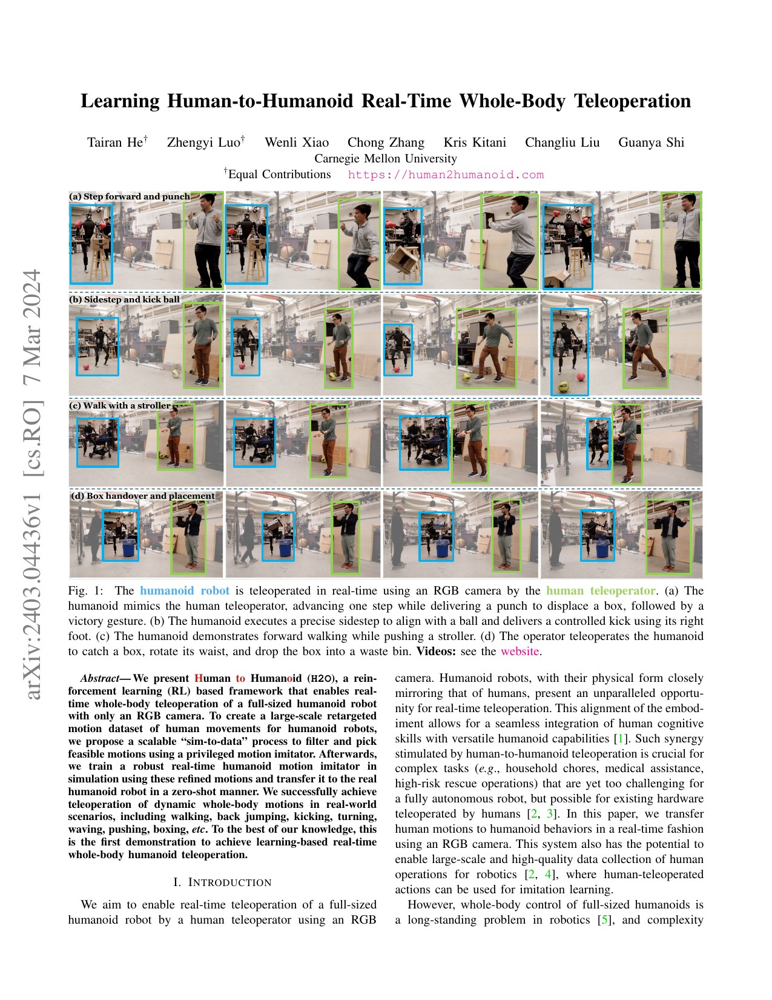
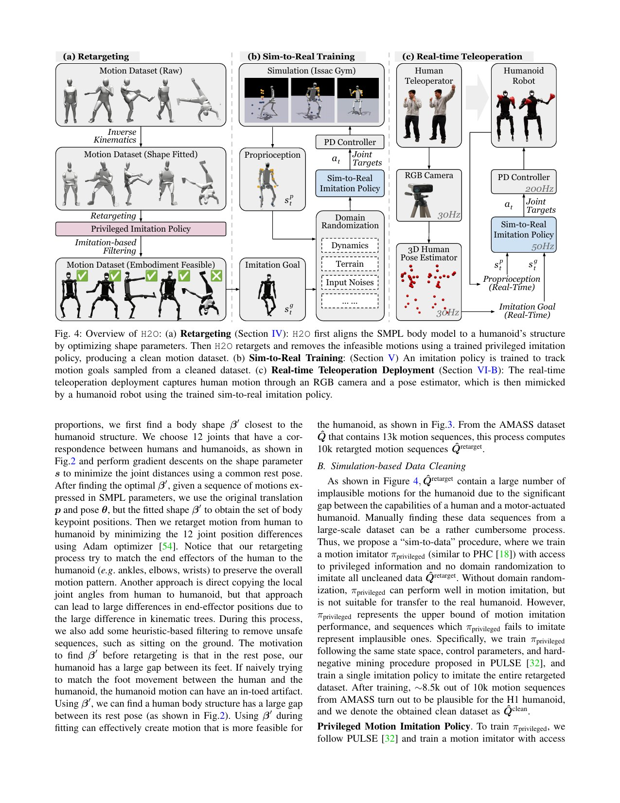
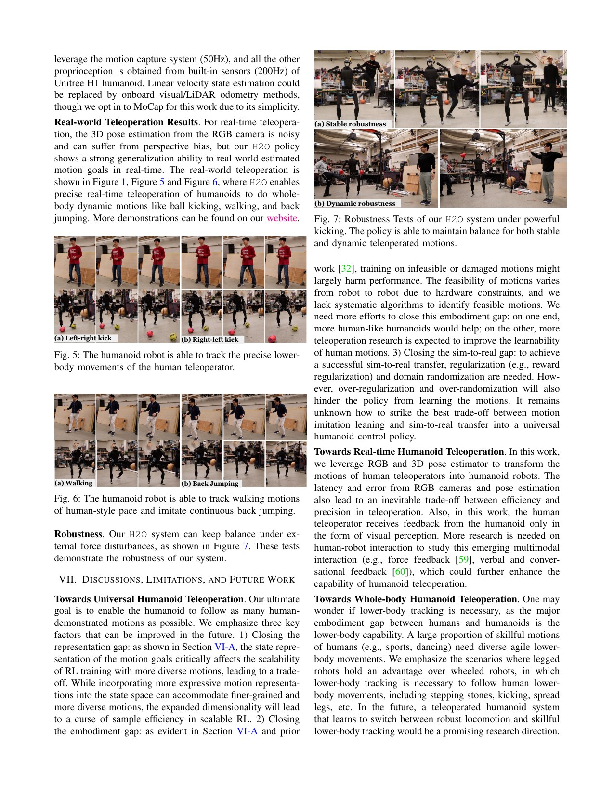

# Human2Humanoid（H2O）：从单目人体动作到 H1 实时全身遥操，真正难的是数据可行性

[English version](en/human2humanoid-2403.04436.md)

来源：[arXiv:2403.04436](https://arxiv.org/abs/2403.04436) · [固定提交的官方代码](https://github.com/LeCAR-Lab/human2humanoid/tree/750f1fa052641f0fde43669d50cb4e407dabe6c8)

解读范围：完整 10 页论文、实验与局限，以及官方 H1 观测、跟踪奖励、域随机化、终止和 PPO 代码。本文解读早期 H2O，不与后续 OmniH2O 混为一篇。

> 一句话总结：H2O 先把 AMASS 重定向到 H1，再用特权模仿器过滤机器人不可执行动作，最后训练 138 维可部署状态的鲁棒 imitator；它实现了实时全身遥操，但“只用 RGB”只描述人体命令入口，机器人线速度仍由外部 MoCap 提供。

术语导航：人体到人形遥操（human-to-humanoid teleoperation）、动作重定向（motion retargeting）、仿真到数据（sim-to-data）、特权模仿器（privileged motion imitator）、实施体可行性（embodiment feasibility）、关键点目标（keypoint goals）、域随机化（domain randomization）与 sim-to-real transfer（仿真到现实迁移）。

## 工程痛点

摄像头能估计人体 3D 姿态，不等于机器人能照做。人和 H1 的腿长、手臂比例、关节轴和自由度不同；把 SMPL 角度逐关节复制，末端会错位，足部可能穿地或坐下，动态动作还可能超过扭矩与带宽。遥操的第一道瓶颈不是网络延迟，而是目标动作本身是否属于机器人可行集合。

数据规模又放大这个问题。手工检查一万段动作像逐张检查整座仓库，昂贵且主观。H2O 的关键想法是把仿真策略当“海关”：能由特权策略稳定模仿的动作进入训练集，频繁失败的动作被拒绝。这不是从仿真生成数据，而是用动力学执行结果清洗运动学数据。

部署状态必须比特权状态更贫乏。训练时可以读取机器人和参考运动的完整状态，实机却只有本体传感与人体关键点。若直接删除输入，策略会失去对全局位移和可达性的判断；若保留难估计的线速度，又会把外部定位依赖藏进“单目遥操”的口号。

## 核心洞察

H2O 首先拟合一个更接近 H1 比例的 SMPL shape，再以 12 个对应关键点最小化位置误差。相比只对齐关节角，末端位置目标更接近机器人真正要完成的空间行为。启发式过滤坐地等明显危险片段，但几何过滤仍不能判断动态可执行性。

随后训练特权 imitator 追踪约 10,000 段重定向动作；实际约 8,500 段通过。这个 sim-to-data 步骤可以类比编译器：重定向动作是源代码，特权策略能在机器人动力学上“编译并运行”的才进入部署训练。失败不是噪声，而是实施体边界的信息。

最终策略使用 138 维状态，包含本体信息、8 个扩展关键点的目标/差值/速度以及上一动作，输出 19 个 PD 位置目标。域随机化覆盖摩擦、质量、质心、PD 增益、20–60 ms 控制延迟和周期推扰；不是靠一项随机化魔法，而是覆盖传感、动力学与控制链的组合误差。

## 方法主线

输入视频由 HybrIK 以约 30 Hz 产生人体 3D 姿态。机器人策略约 50 Hz，底层 PD 与传感链约 200 Hz。参考关键点被转换到机器人目标，策略根据当前关节、本体速度/重力、目标差和历史动作生成 19 维关节目标。

训练的 reward 同时约束选定关节位置/速度、8 个身体关键点位置、身体旋转、线速度和角速度，并惩罚力矩、加速度、动作变化、脚滑、碰撞和越限。早期终止按低高度、重力方向和参考距离淘汰明显失稳轨迹，这既加快训练，也定义了 sim-to-data 的“可行”。

真实部署用标准 1080p webcam 与 HybrIK，但论文明确写明机器人线速度来自 50 Hz 外部 motion capture，其他本体量来自 H1 约 200 Hz 传感器。因而正确表述是“人体命令使用单目 RGB”，而不是“整个闭环完全无外部定位”。

## 关键图解

Figure 1 展示迈步出拳、侧移踢球、推车与搬箱。它证明输入和动作输出可以实时闭环，也显示人的动作不是逐帧复刻：机器人必须为平衡重新组织下肢和躯干。这些序列是能力展示，不是成功率统计。

Figure 4 是整篇最重要的图。左侧从 inverse kinematics、形状拟合和重定向到特权策略过滤；中间训练含随机化的 sim-to-real imitator；右侧才是摄像头与实机。把左侧删掉只训练遥操策略，等于让策略同时承担数据清洗和控制两项难题。

Table III 在未清洗测试集上给出：特权上界 85.5%，90 维 reduced 状态 53.2%，无 sim-to-data 为 67.9%，完整 H2O 为 72.5%；全局 MPJPE 166.7 mm、root-relative 91.7 mm。Table IV 从 0.1% 数据的 52.0% 提升到全量的 72.5%，说明规模有用，但数据清洗和状态设计仍占主要差距。

Figure 5–6 给出踢球、行走和后跳，Figure 7 展示被踢扰动后保持平衡。图像支持 real-time feasibility；没有按动作类别的重复试验、失败数和延迟分布，因此不支持“任意动作都稳”的结论。

## 最有说服力的实验

最强证据是 Table III 的四组对照，而不是演示视频。把状态缩到可部署但信息不足的 90 维会显著降成功率；保留完整状态但不做 sim-to-data 也低于完整方法。这把收益分别归因到部署状态设计与动力学数据清洗。

数据规模消融同样重要：0.1% 已有 52% 成功率，100% 达 72.5%，说明基础动作可由随机化和共享结构学习，但长尾实施体差异需要更多动作。没有多 seed 置信区间与真机成功率，仿真百分比不能直接转换为硬件可靠性。

## 论文—代码映射

固定提交 `750f1fa052641f0fde43669d50cb4e407dabe6c8` 中，`legged_gym/envs/h1/h1_teleop_config.py::H1TeleopCfg` 固定 138 个 actor observation、214 个 privileged observation、19 个动作，并配置摩擦、link mass、CoM、PD 增益、控制延迟和推扰范围。

`legged_gym/envs/base/legged_robot.py::compute_observations` 组装关节、本体、扩展关键点目标和上一动作；`_reward_teleop_body_position_extend` 等函数实现全身关键点奖励，`check_termination` 与 `reset_idx` 负责失败筛选。代码里也保留 `v-teleop-extend-max-nolinvel` 等观测变体，说明线速度依赖是可见的工程选择，不应被宣传语遮蔽。

## 局限与工程判断

作者明确列出表示差距、实施体差距与 sim-to-real gap；扩大状态有精度—样本效率权衡，正则化不足无法迁移、过强又妨碍动作学习。相机延迟与 3D 姿态误差不可避免，操作者主要依赖视觉反馈，完整灵巧下肢仍受形态差异限制。

独立工程局限是外部 MoCap 为机器人线速度提供了隐藏基础设施；HybrIK 的人体遮挡、镜像翻转和深度尺度故障未系统注入；真机展示没有重复统计；过滤器可能删除困难但可通过另一策略学会的动作，使训练集偏向当前 imitator 的能力。

硬件安全上，遥操目标必须经过速度、工作空间、自碰撞和姿态健康检查。摄像头丢帧、人体跳变、目标离机器人过远时，应冻结或平滑回安全姿态，而不是把错误关键点送入策略。上线需要系留、软地垫、急停、限幅、温度/电流监测与旁站人员。

## 可执行但有边界的结论

可复用的核心不是“RGB 控制机器人”，而是三层漏斗：几何重定向排除明显不合理动作；特权策略用动力学执行筛选；可部署策略在系统化随机化下学习剩余动作。每层都要输出拒绝原因和保留率。

若改到新机器人，不能只换 URDF。要重新选择人体—机器人关键点、shape 拟合、动作范围、终止阈值、执行器模型和随机化，并重新构建 sim-to-data 数据。H2O 的 72.5% 是特定 H1 与测试集的结果，不是跨平台常数。

## 复现与验收清单

固定 AMASS 子集、重定向版本、H1 资产、Isaac Gym、策略提交和 seed。记录原始→重定向→特权可追踪→部署训练的每层数量，按动作类别报告拒绝原因。验证 138 维观测的每一段索引、坐标系、单位与归一化，并测试目标关键点缺失、跳变和延迟。

仿真至少复现 Table III/IV：特权、reduced、无 sim-to-data、完整状态，以及多数据规模；同时报告多 seed、MPJPE、失衡、脚滑、越限与饱和。把外部线速度逐步替换为 onboard estimator，并单独注入漂移、短时丢失和坐标偏置。

真机从静态手势、原地重心转移、低速迈步到动态动作逐级验收。每类动作做重复试验，记录端到端延迟、成功率、急停、峰值力矩、足滑和恢复时间；摄像头或定位失效时必须进入已测试的降级模式。

## 进一步工程审计

端到端延迟需要拆开测量。摄像头曝光、图像传输、人体姿态推理、目标坐标变换、策略推理、网络通信和关节执行分别产生时延，平均值无法描述偶发长尾。建议在画面中加入可识别触发，在机器人日志中记录目标到达与动作产生时间，计算中位数、九十五分位和最大值；长尾超过训练随机化范围时，系统应降低动作幅度或暂停，而不是继续追赶过期人体目标。

人体关键点也要有健康度，而非只有坐标。遮挡、出画、左右肢体交换、深度尺度突变和相机运动会产生看似数值合法的错误。可以为每个关键点维护置信度、速度上限和跨帧一致性，并把失败组合成明确状态：短时缺失保持并衰减目标，较长缺失回到中性姿态，整体追踪丢失则停止。任何自动修补都必须写入日志，避免把感知故障误判为策略控制问题。

仿真数据筛选器本身需要复核。特权策略失败可能因为动作不可行，也可能因为策略训练不足、初始状态不佳或终止阈值过紧。应对被拒绝动作分层抽样，使用更强优化器或不同初始化再测试，并区分几何越限、接触失败、动力学失稳和筛选器能力不足。否则数据集会形成自我强化偏差：当前策略不会的动作被删除，下一代策略永远没有机会学习。

全身跟踪精度也不应只用平均关节距离。遥操任务常把手部位置、足落点和躯干平衡置于不同重要性；相同平均误差可能来自无害手腕偏差，也可能来自危险足部错位。验收应按根、手、足和躯干分别报告位置、方向、速度与相位误差，并关联脚滑、支撑切换和力矩饱和。对踢球或搬箱等交互任务，还要记录对象结果而非只看人体相似度。

外部定位依赖必须作为部署配置公开。若使用场地动作捕捉提供线速度，应记录覆盖范围、遮挡率、坐标标定和故障切换；若切换到机载估计器，应重新训练或至少在仿真中回放真实估计误差。两种模式不能共用同一“无需外部设备”的能力描述，也不应只在运行脚本深处改变一个观测开关。

最后要给操作者建立可理解反馈。机器人无法跟上、目标越界或安全层限幅时，人体继续动作只会累积偏差。界面应显示当前跟踪健康度、延迟、是否限幅和恢复提示，使人能主动放慢或回到中性姿态。人机闭环中的操作者是控制系统的一部分，论文中主要依赖视觉观察，工程产品则应把这种隐含反馈变成明确协议。

> **工程判断**：H2O 的决定性贡献是把“人能做”转化为“这台机器人在动力学上能学会”，而不是把摄像头画面直接映射成关节角。
