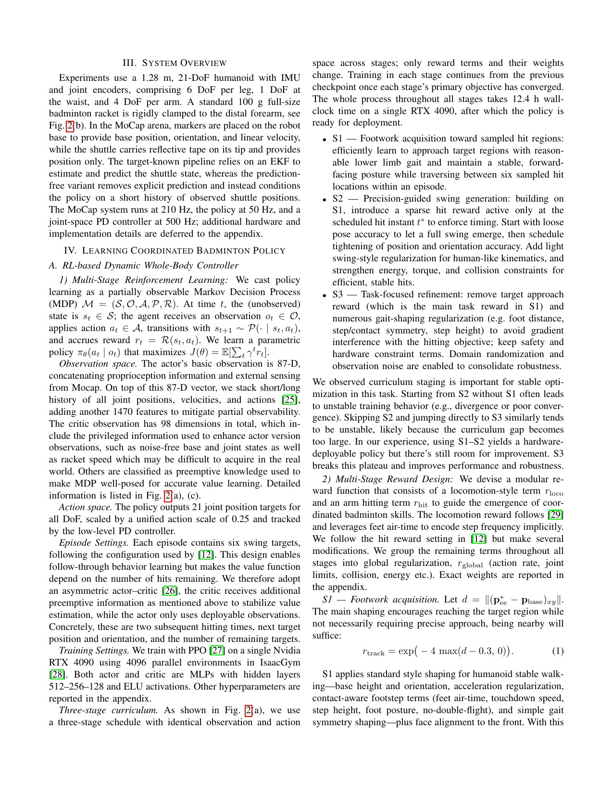
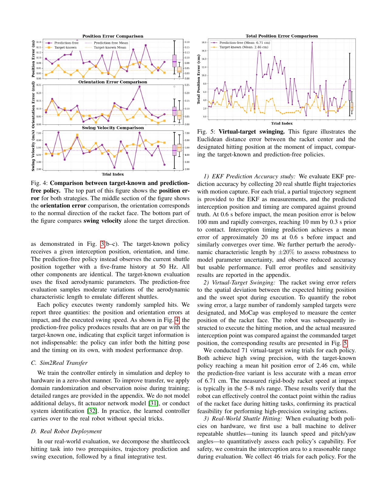
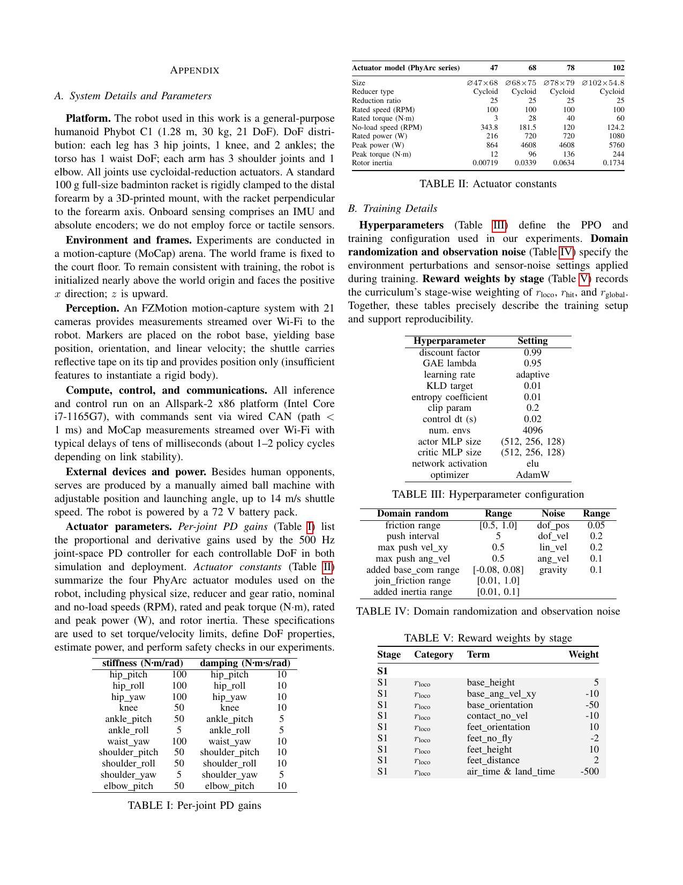

# Humanoid Badminton：从步法、挥拍到任务精修的三阶段全身强化学习

来源：[arXiv:2511.11218v3](https://arxiv.org/abs/2511.11218v3) · [官方项目页](https://humanoid-badminton.github.io/)

解读范围：完整 15 页正文与附录。项目页未提供可核验官方代码，本文不引用第三方实现。

> 一句话总结：Humanoid Badminton 使用“稳定步法 → 稀疏击球成功 → 任务效果精修”三阶段奖励，让同一个 21-DoF 策略从保持平衡逐步过渡到高速挥拍与真机回球。

术语导航：课程强化学习（curriculum reinforcement learning）逐阶段改变奖励，稀疏击球奖励（sparse hit reward）用接触事件触发。拍面姿态（racket-face orientation）、交点预测（interception prediction）、扩展卡尔曼滤波（Extended Kalman Filter, EKF）、无预测策略（prediction-free policy）、动作捕捉（motion capture, MoCap）和人机共域（human-robot shared space）是阅读实机证据的关键。

## 工程痛点

羽毛球把人形控制的三个难点压在同一秒里：脚需要快速到位，躯干要在加速中稳定，手臂和拍面又必须在很窄的时窗穿过交点。如果只奖励球最终过网，早期策略几乎收不到信号；如果永久保留大量姿态和接近奖励，它又可能学会“很像挥拍”却不把球打向目标。

这与教初学者开车很像：先在空场学会平稳起停，再学转向和观察，最后才按真实路况考试。一次性把所有标准都变成严格指标，不会得到更完整的技能，反而会让学习信号相互冲突。

感知链又带来第二个取舍。EKF 可直接给出预计击球时间与交点，却依赖 MoCap 与空气动力学模型；无预测版只看当前球位置与历史，接口简洁，但把时间估计压进了 actor。两者不是“老方法与新方法”，而是可解释状态估计与隐式历史推断的工程取舍。

## 核心洞察

三阶段训练最重要的不是每阶段“加奖励”，而是最后阶段主动移除多数风格与过程奖励。S1 和 S2 像脚手架，帮策略穿过早期探索空白；S3 拆掉部分脚手架，让出球效果而不是姿势相似度决定最终策略。

第二个洞察是感知对照应保持奖励、动作和低层接口不变。无预测版只替换球的输入表达，因而差距更容易归因到交点/时序估计。但“无预测”并不等于没有预测；策略使用五帧历史隐式推断球速和到达时间。

第三个洞察是安全选择本身也是实验结果。无预测版在仿真均值上接近，真机发球成功率和虚拟目标误差却明显落后；作者因此选 EKF 版做人机 rally。工程系统不应为了“端到端”标签而牺牲可量化的安全裕量。

## 方法主线

一个 1.28 m、21-DoF 人形策略在三个阶段保持相同观测/动作接口，只切换奖励：S1 先学原地/移动步法与稳定姿态；S2 加入稀疏击球、拍面位置和方向奖励，促成挥拍；S3 移除多数风格/接近目标项，以最终击球目标精修。actor 用 87 维本体与目标信息及历史，critic 额外看无噪声状态；输出 21 个关节目标，策略 50 Hz、PD 500 Hz。

目标已知版从约 20k 预生成羽毛球轨迹取击球时间、交点与拍面方向；实机由 210 Hz MoCap 和 EKF 在线产生。无预测版改看当前球位置及 5 帧历史，奖励与动作不变，让策略隐式推断时间/交点。两者都没有力或触觉输入。

## 关键图解

Figure 2 将仿真的球轨迹目标、三阶段奖励和真机 MoCap/EKF 接口连在一起。阅读时要区分训练期的预生成轨迹与部署期的在线估计：两者向 actor 交付相同语义的时间、交点和拍面目标，但噪声和延迟分布不同。

- Figure 2：训练观测、MoCap/EKF 部署和无预测观测替换的系统图。
- 三阶段奖励段与 Appendix Table V：同一策略如何从步法转到精准挥拍再转到任务效果；一次性训练和跨阶段过大变化会不稳定。
- Figure 3：仿真双机器人最好连续回合为 21 次，是最佳轨迹而非平均 rally 长度。
- Figure 4/5：匹配设置下无预测版仿真接近目标已知版；实机 71 次虚拟目标挥拍均值误差为 6.71 cm vs 2.46 cm。
- Figure 6：每版 46 次机器发球，EKF 版 42/46（91.3%），无预测版 33/46（71.7%）；峰值出球 19.1/18.1 m/s，平均 11.1/8.2 m/s。
- Appendix Figure 10–12：EKF 参数 ±20% 敏感性和各 20 次固定目标挥拍重复性，为感知与控制误差拆分提供证据。

Figure 3 的 21 次连续回合是最佳轨迹，不是平均 rally 长度；Figure 4 则用虚拟目标对比两种感知接口。这两张图适合说明能力形态，但需要与 Figure 6 的完整实验分母合读，否则容易把最佳案例当成典型性能。

Figure 5-6 提供了明确分母：两种策略各 71 次虚拟目标挥拍和各 46 次机器发球。EKF 版在误差、成功率和出球速度上都更好。这是一个有价值的负面结论：简化感知接口确实能工作，但在当前系统中尚不值得用于高速人机共域。

最有说服力的是 46+46 次同一发球机对照：它显示无预测方案可工作，但“可比”必须加限定——成功率低 19.6 个百分点、虚拟目标误差更大。论文最终因成功率与安全考虑选择 EKF 版做人机 rally，这个负面选择比只看仿真均值更有工程价值。

## 最有说服力的实验

46+46 次发球机试验的价值在于来球条件可重复、两个策略的分母对称，且报告了成功与出球速度。它比“最长 21 次”更能回答典型成功率。尤其是无预测版 71.7% 并非失败系统，却与 EKF 版 91.3% 存在足以影响部署选择的差距。

但发球机不等于真人对打：来球分布更稳定，也没有对手的假动作与人体进入路径。复现者应按来球速度、方向、落点与估计不确定性分层，并报告策略拒绝不可达来球的能力，而不是鼓励它对每个目标都勉强挥拍。

## 公开实现状态

截至 2026-08-10，论文和作者项目页提供论文/视频，但没有唯一官方代码仓库、提交或许可证。因此无法核对三阶段切换条件、羽毛球模拟器、EKF、奖励实现或硬件保护。附录参数属于论文平台，不在本手册重发布或建议下发。

## 局限与安全边界

作者明确列出：依赖 MoCap；击球风格单一，缺少反手、弓步和跳杀；有效拦截带窄，长回合仍做不到；无预测版精度/成功率低；未来需高层落点决策。独立判断：人机 rally 只描述“数个来回”，未给完整试验分母；发球机比真人来球更可重复；场地和天花板影响落点；训练中的气动模型与真实羽毛翻转仍有差距。

另一个独立风险是传感延迟、EKF 偏差和动作延迟可能在拍面交点上同向累加。平均误差无法显示少数晚挥或早挥的高能失败，因而应另外报告误差尾部分位数、拍头速度与急停前的最大能量。

## 可执行但有边界的结论

可复用的训练思路是：先用稳定步法和中间击球目标穿过稀疏奖励区，再移除会限制任务最优化的过程奖励。感知对照应在相同动作、奖励和发球分布下完成，并保留不适合人机 rally 的负面选择。

这是高速人机共域系统，属于硬件关键证据。任何复现都必须先在无人区仿真/假球/低速发球验证，限制拦截区、关节速度/力矩与拍头能量，配备独立急停、护网和安全员；不得仅凭 91.3% 回球率允许人与机器人近距离对打。官方代码尚未公开，附录参数也不构成安全许可。

## 复现与验收清单

还应将“击球成功”分解为接触、过网、落入有效区和能继续下一拍四个层级。一个高速出球可以过网，却可能出界或让机器人在挥拍后失去支撑。统计时应保留这个成功阶梯，不用一个“回球”标签把短期命中和可持续 rally 混在一起。

感知敏感性除了对 EKF 参数做 ±20% 扫描，还要注入时钟延迟、间歇丢帧、MoCap 遮挡和球姿态的系统性偏差。参数误差和延迟对交点的影响可能同向累加，分开的单因素测试无法覆盖最坏组合。验收应使用组合扰动并报告尾部误差。

官方代码未公开时，任何复现都需明确羽毛球接触、奖励切换、EKF 和安全监督是独立实现。与论文成功率接近只能说明行为结果相似，不能证明训练机制、失败边界和硬件保护与作者系统等价。

复现首先要固定羽毛球模型与目标生成器，包括质量、气动参数、羽毛朝向简化、拍球接触模型、轨迹库大小和交点采样范围。仿真球轨迹若比真实发球更平滑、更可预测，策略可能在仿真中学会过度精确的时序。因此还要用真实发球日志对速度、落点与姿态误差做分布对照。

三阶段课程需保存每一阶段的完整 reward 组成、权重、切换时刻、策略快照和前阶段能力回放。评估不只要比完整课程与一次性训练，还应比较在 S3 保留风格奖励和移除风格奖励。这个对照能验证最终改善是来自任务目标接管，而不只是训练时间更长。

感知管线应将 MoCap 测量、EKF 状态、交点预测和 actor 输入全部记录下来。对无预测版，也要保存五帧球位置，以便事后判断失败来自轨迹噪声、时基错位、不可达交点还是全身控制。只记录“没打中”会把感知和控制失败混成一个无法优化的标签。

实验应从虚拟固定交点开始，再扩展到机器发球、不同速度/方向/落点，最后才进入无人近距离的真球 rally。每层都应报告命中率、虚拟目标误差、出球速度、拍面时序、跌倒、急停和拒绝挥拍的次数。拒绝不可达来球应计作安全成功，不是策略失败。

人机共域验收还需独立的空间安全层：实时检测人体、拍头扫掠体积、关节速度与预计停止距离。安全监督器必须能在 actor 仍想挥拍时拒绝或改写动作，并在命令通信、MoCap 或 EKF 超时时进入低能量姿态。策略回球率再高，也不能替代这个独立故障边界。

还要检查课程是否导致单一击球风格锁定。在相同交点下给出不同拍面方向、躯干与步法初始状态，观察策略是否始终回到同一正手挥拍模式。如果 S2 的中间奖励把一条轨迹变成强先验，S3 移除风格项也未必能恢复已经丢失的多样性。这与作者报告的反手、弓步与跳杀缺失相呼应，应在后续数据与课程中显式处理，而不只增加更多训练步数。

> **金句**：高速体育中，能打中球只是能力证据；知道哪些球不应挥拍，才是可部署性证据。
