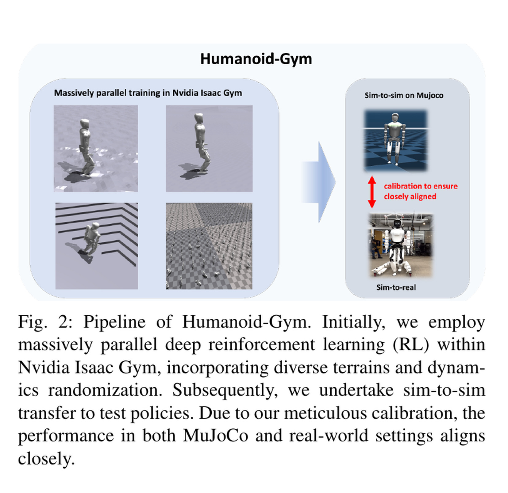
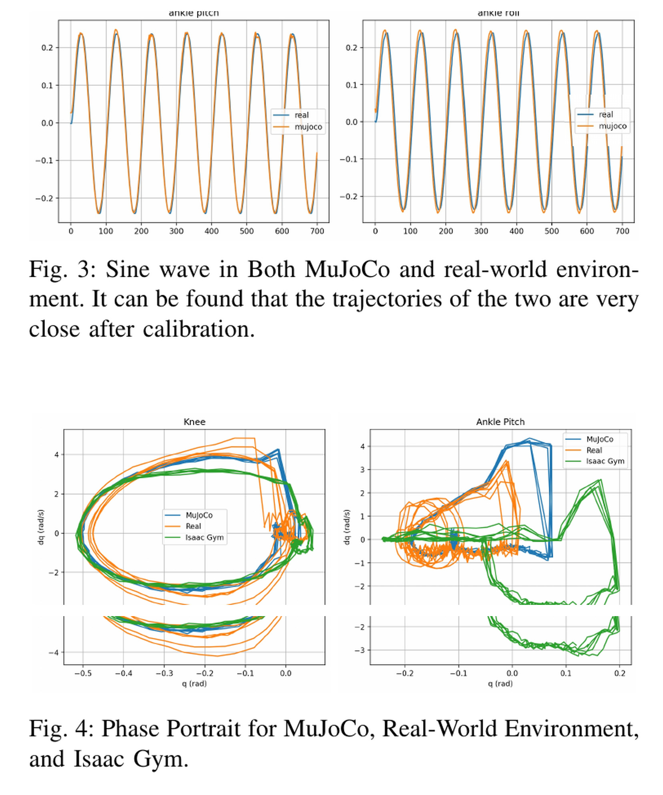
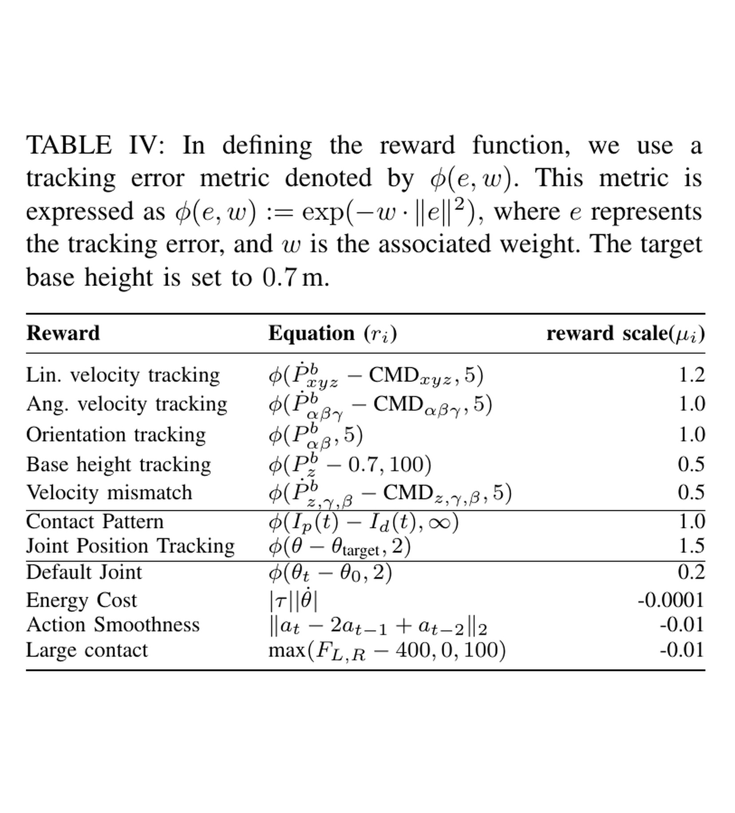

# Humanoid-Gym：把训练、跨仿真校准与实机部署做成最小开源闭环

[English version](en/humanoid-gym-2404.05695v2.md)

来源：[arXiv:2404.05695v2](https://arxiv.org/abs/2404.05695v2) · [固定提交的官方代码](https://github.com/roboterax/humanoid-gym/tree/ae46e201c85a2b17e7f2cea59a441dae7ea88a8f)

解读范围：完整 6 页正文和附录。

> 一句话总结：Humanoid-Gym 的价值不是再造一个步态算法，而是把 Isaac Gym 训练、MuJoCo 跨引擎回放和 XBot 实机执行连成一个小而可审计的开源闭环。

术语导航：零样本仿真到现实迁移（zero-shot sim-to-real transfer）不做实机梯度更新，跨仿真器验证（sim-to-sim validation）用第二物理引擎查找脆弱性。域随机化（domain randomization）、特权观测（privileged observation）、帧堆叠（frame stacking）、策略降采样（control decimation）和比例-微分控制（proportional-derivative control, PD）构成部署接口。

## 工程痛点

人形步态在一个仿真器里高分运行，并不代表上机后还会站立。训练引擎中的执行器延迟、阻尼、摩擦与接触求解误差可能相互抵消，策略甚至会利用某个引擎的偏差。直接上机才发现问题，就把昂贵且高风险的硬件当成了调试器。

Humanoid-Gym 在中间加了 MuJoCo，但不把它当作“另一个正确答案”。它先用实机关节正弦响应校准第二引擎，再用同一个策略回放。这好比在真实飞行前先换一台不同厂商的飞行模拟器：两台都过不了的策略，没有理由直接去赌硬件。

问题在于，跨引擎成功只是风险筛查，不是实机证明。如果两个引擎共用同一个错误的机器人模型，它们可以同时给出乐观结果。因而中间层的价值在于提前暴露问题，不在于取代实机安全验收。

## 核心洞察

这个工作最可复用的洞察是将“训练配方”和“部署门禁”放进同一仓库。观测堆叠、动作缩放、策略频率与 PD 频率如果在三个环境里不一致，那么 sim-to-real 失败很可能只是接口失配。明确这些边界，比单独报一个 PPO 回报更有工程价值。

第二个洞察是校准的对象应该是“输入到运动的链路”，而不仅是 XML 中的质量和摩擦数字。正弦激励同时经过命令、PD、执行器和传感器，响应曲线因而能暴露相位延迟与增益偏差。它像用音阶检查整套音响，不是只看功放标牌参数。

## 问题与主线

这篇论文的贡献更接近工程基线而非新算法：用 Isaac Gym 大规模训练 PPO，把同一策略先放进经实机摆动曲线校准的 MuJoCo，再零样本部署到两种尺寸的 RobotEra XBot。输入是速度命令、周期时钟、关节位置/速度、机身角速度/欧拉角和上一动作的 15 帧堆叠；训练 critic 另看摩擦、质量、基座线速度、接触和推力等特权状态。输出是 12 个关节目标位置，策略 100 Hz，PD 1000 Hz。

奖励把速度、周期接触、参考关节、姿态/高度、能耗、二阶动作平滑和大接触力组合为加权和。随机化覆盖观测噪声、0–10 ms 延迟、摩擦、载荷和电机强度。MuJoCo 校准用实机正弦关节响应和相图检查模拟动态，而不是把第二仿真器当成实机真值。

从输入到输出可以归纳为四步：指令与时钟相位进入 actor；15 帧本体历史弥补单帧速度和延迟信息；PPO 在随机化物理中输出关节目标；相同张量经 MuJoCo 和实机 PD 执行。复现时必须检查观测顺序、归一化、上一动作和时钟定义是否一致。

## 关键图解

Figure 2 应当按“能力生成—偏差筛查—风险验收”来读。Isaac Gym 的并行环境用于生成策略，MuJoCo 用于查找对单一引擎的过拟合，实机则只应接受已通过前两层的候选。这张图是测试顺序，不只是软件列表。

- Figure 2：Isaac Gym 训练 → MuJoCo 跨引擎检查 → 实机部署的完整流水线。
- Table I：单帧 47 维部署观测与 73 维特权状态的边界；Appendix Table II 指定 15/3 帧堆叠。
- Figure 3/4：校准后 MuJoCo 的关节正弦轨迹和相图更接近实机，提供的是定性曲线证据。
- Appendix Table III：噪声、延迟、摩擦、电机强度和载荷随机化范围。
- Appendix Table IV：`exp(-w||e||²)` 型跟踪奖励与动作平滑、能耗、接触力惩罚。

Figure 3-4 的曲线只支持“校准后某些关节响应在定性上更接近”。它没有给出全关节、全频段和接触工况的系统辨识误差。因此这张图应作为校准的起点证据，而不是“仿真已等于实机”的终点证书。

Table III-IV 把论文中简短的“做了域随机化”展开成可检查的边界。它们最重要的用法不是复制数值，而是对照自己的传感器、控制延迟、负载和摩擦范围是否落在训练支持集内。

最有价值的证据是同一框架在 1.2 m XBot-S 和 1.65 m XBot-L 上都实现零样本部署，说明接口与工程流程不只绑定一个尺寸。但论文没有成功率、里程、跌倒率或跨仿真预测性相关系数；“rigorously tested”不能等同于可统计复现。

## 最有说服力的实验

这篇论文没有一张足以独立支撑超强结论的量化表。相对最有说服力的证据，是同一流程在 XBot-S 与 XBot-L 两种尺寸平台上完成零样本部署，再与 Figure 3-4 的校准曲线一起读。它支持“流程具有一定跨平台可用性”，不支持“已量化证明鲁棒”。

如果要复现该结论，应预先固定命令集、地面、负载与测试时长，报告每台机器人的试验总数、跌倒、急停、速度误差和峰值接触力。同时应计算“在 MuJoCo 失败”对“在实机失败”的预测性，才能判断这层门禁真正节省了多少硬件风险。

## 论文—代码映射

| 组件 | 固定提交符号 | 对应关系 |
|---|---|---|
| 观测历史与特权历史 | `XBotLCfg.env.frame_stack/c_frame_stack`、`LeggedRobot.obs_history/critic_history` | 固定 15 帧 actor 与 3 帧 critic 堆叠 |
| 100 Hz/1000 Hz 控制 | `XBotLCfg.control.decimation`、`XBotLCfg.sim.dt`、`LeggedRobot.step` | 每 10 个 1 ms 物理步更新一次策略动作 |
| 奖励与随机化 | `XBotLCfg.rewards.scales`、`XBotLCfg.domain_rand` | 把论文附录机制落实为 XBot-L 专用配置 |
| 安全边界 | `XBotLCfg.safety`、`LeggedRobot.check_termination` | 含位置/速度/力矩缩放与非足部接触终止，但不是完整实机安全系统 |

仓库标注 BSD-3-Clause，并继承 legged_gym/rsl_rl 相关版权。本文只链接和解释，不复制代码或参数集。

## 局限与工程判断

论文没有独立局限章节。其主要不足是定量评测缺失、机器人均来自同一厂商、MuJoCo 校准只展示少量关节轨迹、训练配置与论文附录存在迭代差异。正弦响应接近不代表碰撞、摩擦突变、落脚冲击等动态都接近；sim-to-sim 只能作为失败筛查层，不能替代硬件验证。

作者没有独立限制章节，因而上述边界主要来自实验报告范围。独立工程判断还要加上：两个机器人共享厂商生态，不是执行器或传感器架构完全不同的跨平台对照；观测中的欧拉角、时钟与历史对姿态估计与时序很敏感；开源部署脚本不等于完整安全系统。

## 可执行但有边界的结论

可复用的做法是：把跨引擎回放放在仿真训练与实机之间，并用真实关节响应校准第二引擎。它应形成一个低成本失败筛查层，而不是绕过硬件验收的许可证。

复现时应补充固定场景成功率、跌倒率、速度误差、接触峰值和跨引擎/实机相关性。附录中的增益、随机化和限值只属于论文机器人，不能直接下发到其他硬件。

## 复现与验收清单

在这个流程中，应先定义五个常见失败类别：观测/动作接口不一致、第二引擎物理失配、策略对训练引擎过拟合、实机执行器/传感器偏差，以及超出训练分布的命令。每个终止都要归入其中一类或标记为待查，而不把所有问题统称为 sim-to-real gap。

跨引擎评估还需一个共同的初始状态生成器。根位姿、关节角、上一动作和历史帧必须在两个引擎里对齐，否则一个引擎从理想站立开始，另一个从微小倾斜开始，会在数十步后产生被误归因的巨大差异。相同随机种子也不能保证两引擎随机过程完全同步，需保存实际采样值。

最后要区分“门禁的召回率”和“门禁的精度”。一个很严格的 MuJoCo 阈值可能拦下所有真机失败，但也会拒绝大量本可安全的策略；一个宽松阈值则会留下危险漏网。只有将跨引擎结果与实机成功/失败对齐，才能量化这层工程门禁的实际价值。

第一步不是运行训练，而是生成三个后端共享的接口表。表中应列出每个 observation 的名称、维数、单位、坐标系、归一化和帧顺序，以及 action 的缩放、默认姿态、限幅和更新频率。Isaac Gym、MuJoCo 和实机任一字段不同，都应当作接口错误，不先归因于策略不鲁棒。

第二步是锁定训练快照：论文/代码版本、URDF/MJCF、机器人质量与关性、随机化分布、奖励权重、观测堆叠、策略频率和随机种子都应写入机器可读配置。只保存最终权重而不保存这些元数据，无法判断跨引擎差异是来自物理还是来自工程版本。

第三步是校准第二引擎。正弦关节响应应覆盖多个频率、幅值和关节，同时报告时域误差、相位差、峰值比与相图面积。仅凭一张肉眼接近的曲线，很容易忽略高频延迟或低频稳态偏置，这些差异在落脚冲击时可能被放大。

第四步是设计同一套场景同时跑两个引擎：固定速度命令、启停、转弯、外扰、摩擦变化和小负载。每个场景除了成功率，还要报告根速度误差、足滑、接触峰值、关节饱和和终止原因。两个引擎都成功却动力学指标差异很大，仍然是需要审查的警告。

第五步才是分级实机验收：悬挂检查命令方向和限幅，低增益站立检查传感与时钟，有系留低速行走检查接触，最后才扩展速度与扰动。每一级都要有明确的进入条件、中止阈值和回滚方式，不以单次成功直接跳过中间门禁。

还应定期用同一批锁定轨迹重跑三后端“回归套件”。仿真引擎、机器人资产、推理库、固件或内环增益的任何更新，都可能让原先通过的策略越界。回归套件不只比较是否跌倒，还应对每个主要指标设置可解释的漂移阈值。这使跨引擎门禁从一次性论文实验变成可持续维护的工程机制，也能阻止一个新默认配置在无日志的情况下改变历史结论。

> **金句**：第二仿真器的价值不是更像真理，而是让只对一个引擎成立的策略更早失败。

复现报告最终还应公布被门禁拒绝的策略，而不只展示通过者。失败的跨引擎轨迹能暴露门禁真正捕获的偏差，也能防止后续团队通过放宽阈值无意中撤销安全证据。
