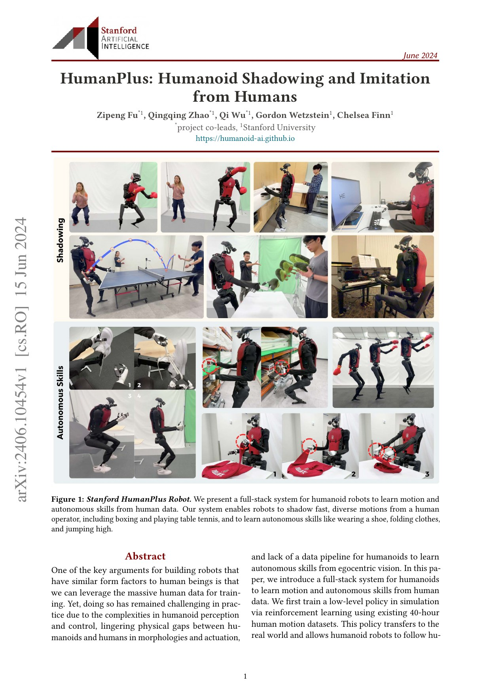
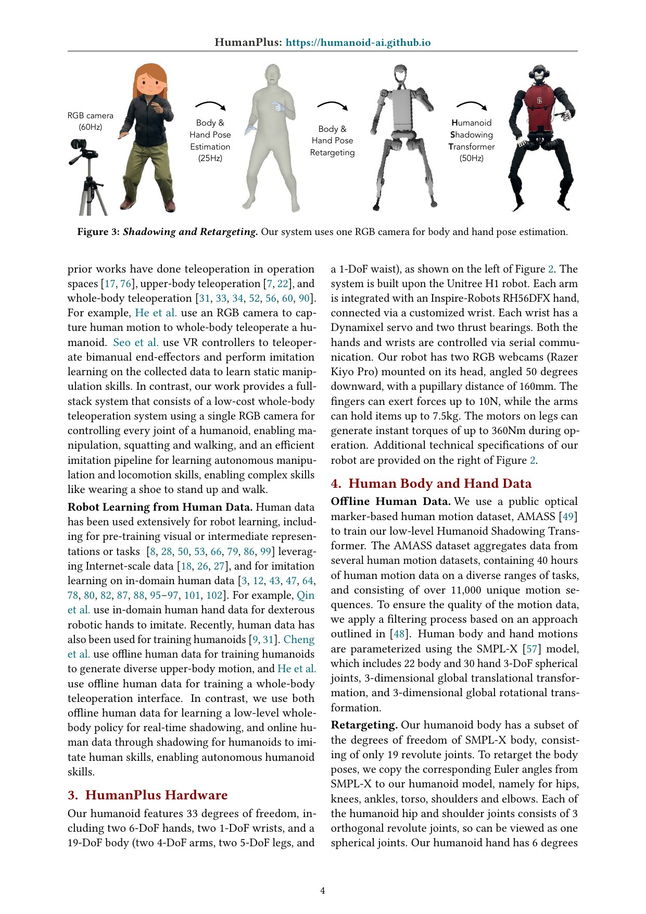
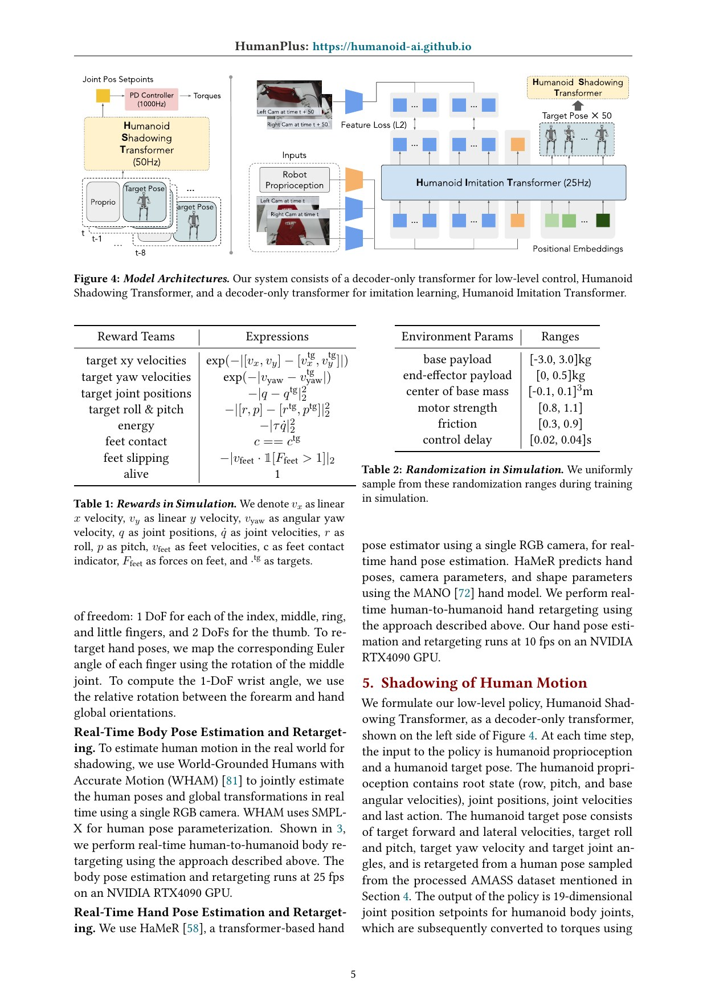
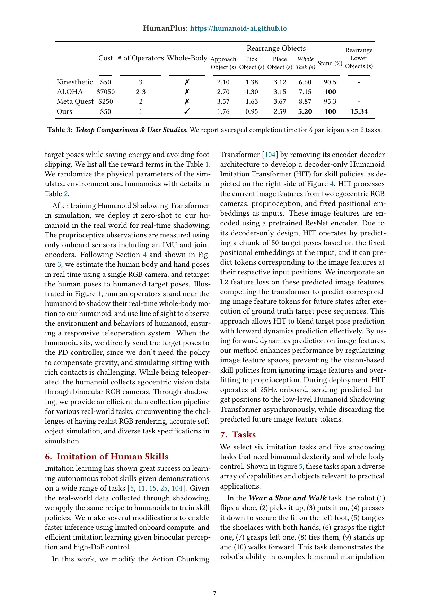
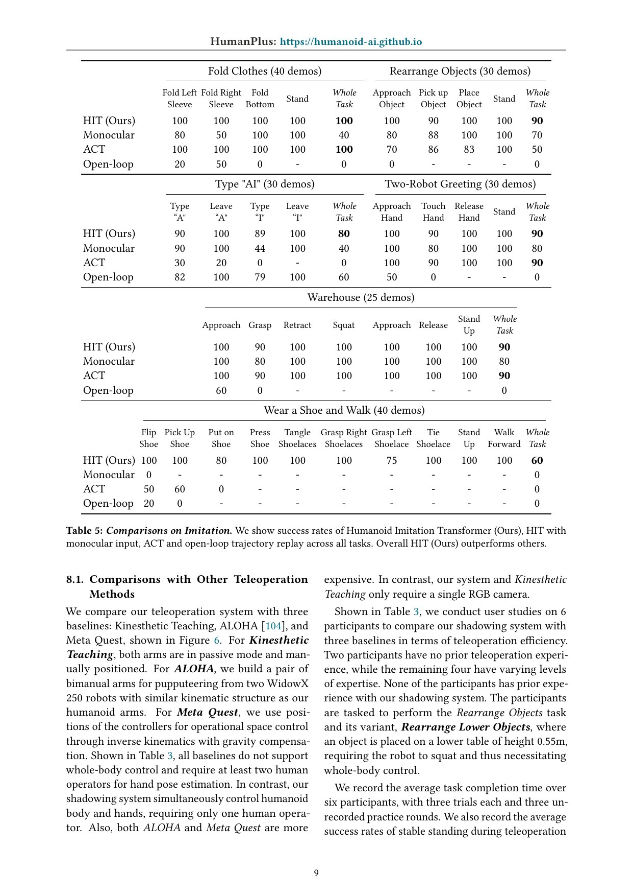

# HumanPlus：把真人影子跟踪、数据采集与自主模仿连成一套全身系统

[English version](en/humanplus-2406.10454.md)

来源：[arXiv:2406.10454](https://arxiv.org/abs/2406.10454) · [固定提交的官方代码](https://github.com/MarkFzp/humanplus/tree/ff7148903303ac2951857cf0b7df686d77323917)

解读范围：完整 17 页论文、奖励与实验附录，以及官方 HST、HIT、H1 环境和硬件接口。本文把实时 shadowing、遥操效率和自主 imitation 的证据分开，不用一个演示替代另一个环节。

> 一句话总结：HumanPlus 用 8 帧历史的 Humanoid Shadowing Transformer（HST）在 50 Hz 输出 19 个关节目标，再以头部双相机采集全身示教，用动作块为 50 的 Humanoid Imitation Transformer（HIT）学习六类任务；它在 6 人遥操研究和每项 10 次实机任务中给出结果，但固定相机遮挡、固定关节映射和坐下时绕过策略都是明确边界。

术语导航：人形影子跟踪（humanoid shadowing）、全身遥操（whole-body teleoperation）、动作重定向（motion retargeting）、本体感知（proprioception）、动作块（action chunking）、未来视觉特征预测（future visual feature prediction）、第一视角视觉（egocentric vision）、仿真到现实（simulation-to-reality, Sim2Real）与模仿学习（imitation learning）。

## 工程痛点

传统 VR 遥操需要头显、控制器或外骨骼，能高质量控制手，却常把操作者锁在有限空间或只处理上身。单目人体估计可以让操作者自然行走、下蹲和使用双手，但估计延迟、遮挡和人体—机器人形态差异会让 H1 失稳。即使 shadowing 可用，如何把这种全身示教转成自主策略仍需同步第一视角图像、机器人状态和动作。

可以把 HumanPlus 看成“演员—替身—学生”链路：真人演员提供姿态，HST 让机器人替身安全复现并顺便采集相机数据，HIT 再从这些录像学习独立完成任务。另一个类比是实时翻译：WHAM/HaMeR 负责把人体语言译成机器人目标，HST 负责根据过去上下文消除歧义；若字典中的关节不存在，固定映射只能丢掉信息，后端模型无法凭空补回。

## 核心洞察

机器人是定制 Unitree H1，共 33 DoF：19 个身体关节、2 个腕关节和 12 个手指关节，头部有两台 RGB 相机。HST 只控制 19 个身体关节，观测含 roll/pitch、根角速度、关节位置/速度/上一动作和目标姿态，保留 8 帧上下文，策略 50 Hz、底层 PD 1000 Hz。训练以 AMASS 约 40 小时、11k 动作作为目标并做动力学随机化。

实时人体输入由单 RGB 相机获得：WHAM 身体估计约 25 Hz，HaMeR 手估计约 10 fps，均在 RTX 4090。重定向采用人工定义的 Euler 角对应；手指也按有限关节映射。坐下时作者承认丰富接触难以在仿真学习，直接把目标关节送给 PD，而不是用 HST。这是系统工程 workaround，不应隐藏成统一策略能力。

## 方法主线

HST 是 decoder-only Transformer，把最近的本体状态与目标姿态序列编码后输出关节 setpoint。相较只看当前帧的 MLP，历史让策略从短暂遮挡和目标变化中推断惯性。奖励含目标水平/偏航速度、目标关节、roll/pitch、能量、足接触、足滑和 alive；随机化包括 3 kg 基座负载、0.5 kg 末端负载、CoM、motor strength、摩擦和 20–40 ms 控制延迟。

数据采集时，机器人跟随操作者完成任务，头部双相机记录第一视角，操作者保持在机器人视野附近。HIT 输入本体状态和双相机特征，一次预测 50 步动作；未来视觉特征损失要求当前隐表示能预测之后的图像特征，以强调与任务进展相关的信息。部署频率 25 Hz，每个任务用 25–40 条示教。

## 关键图解

Figure 1 展示 shadowing、收集和自主模仿三段。图中的鞋袜、仓储和折衣是能力范围，不是每个场景都具有相同统计可靠度；要结合 Table 5 阅读。

Figure 3 显示身体与手分开估计，再映射到 H1。工程上最关键的不是渲染姿态好看，而是固定映射、频率差与遮挡怎样进入控制目标；应分别记录 body/hand 更新时间和 stale-frame 数。

Figure 4 左侧 HST 用历史目标和本体状态输出 19 维 setpoint，右侧 HIT 用当前图像、本体与动作 queries 输出动作块，并加入 future feature loss。Table 1–2 同页给出 reward 和 randomization，形成从算法结构到部署假设的完整上下文。

Table 3 对 6 名参与者、两个任务、每人 3 次正式试验取平均。HumanPlus 是唯一能全身移动的比较方法，并给出较短完成时间；但操作者站在附近且先练习，不能外推到远程网络、长时任务或零经验用户。

Table 4 报告不同方向最大扰动力从默认 H1 的 24/36/40/40 N 提升到 32/44/70/100 N，恢复约 1.2 s 对默认 15 s。Table 5 中 HIT 多数任务为 90%–100%，穿鞋再走为 60%；每项 10 次，不能把 100% 当成长期失效率上界。

## 最有说服力的实验

最强证据是 Table 3、4、5 覆盖三层系统：人是否能有效遥操、低层是否抗扰、采集数据是否能训练自主任务。6 人×3 次比单一作者演示更能支持接口易用性；每项 10 次把 imitation 结果从视频提升到可核对统计。三者仍不是端到端无人运行，因为实验中有人旁站、任务短且场景固定。

穿鞋再走只有 60% 尤其重要。该任务要求下蹲、脚手协调、起身和移动，揭示固定头部相机可能看不到手、形态映射限制可达性、接触误差会跨阶段积累。失败任务比高成功任务更能说明下一步应改相机、数据还是控制器。

## 论文—代码映射

固定提交 `ff7148903303ac2951857cf0b7df686d77323917` 中，`HST/rsl_rl/rsl_rl/modules/actor_critic_transformer.py::ActorCriticTransformer` 和 `Transformer.forward` 实现 8 帧上下文到动作的 decoder-only 策略。`HST/legged_gym/legged_gym/envs/h1/h1.py::H1` 的 `_init_target_jt`、`update_target_jt`、`_compute_torques` 与 `_reward_target_jt` 对应目标序列、延迟、PD 和跟踪奖励。

`HIT/detr/models/detr_vae.py::DETRVAE_Decoder.forward` 构造 action queries，并在 `feature_loss` 开启时分离当前/未来相机特征；`HIT/policy.py::ACTPolicy` 组织动作块损失。`hardware/hardware_whole_body.py` 是机器人侧接口。代码证明模块存在，不证明仓库默认配置能在另一台 H1 上直接安全运行。

## 局限与工程判断

作者明确指出：H1 的 1-DoF 踝和 5-DoF 手臂使某些人体姿态不可达；固定头部相机可能在操作时丢失双手；固定重定向忽略人体但机器人没有的关节；身体/手估计遇遮挡会失败；论文侧重操作和有限 locomotion，长距离导航需要更多数据与更可靠速度估计。

独立工程局限包括：身体 25 Hz、手 10 fps、策略 50 Hz 形成异步目标，仓库未给出统一时间戳验收；坐下绕过策略直接 PD，意味着接触安全依赖目标质量；遥操对照设备和培训不完全等价；10 次任务没有报告置信区间、失败恢复或连续运行热状态；操作者始终在附近，远程链路的延迟和丢包未测试。

硬件安全上，影子跟踪必须有限制速度、力矩、功率、足滑和自碰撞的独立安全层。姿态估计 stale、相机遮挡或人体离开视野时应进入保持/低能量状态，而不是继续外推。坐下和起身属于丰富接触动作，应有接触检查、家具几何和人工急停，不能仅凭目标关节合法就执行。

## 可执行但有边界的结论

HumanPlus 的差异化价值是把数据采集接口和下游自主学习共用同一机器人形态：示教中看到的图像、状态和执行动作天然对齐，减少额外机器人数据标注。工程团队可以先把 HST 当成“具身数据记录器”，而非直接追求全自主；优先解决时间同步、遮挡与可达性，再扩大 HIT 任务。

具体部署应把能力拆成 shadowing、坐下 bypass、手部映射、视觉 imitation 四个可独立降级的服务。任何一个环节失效时记录根因，不把所有失败都归为“策略不稳”。中文页面中的术语与变量要保持论文命名，方便读者从问题快速跳到代码定位。

## 复现与验收清单

固定 H1 机械版本、33/19 DoF 配置、相机内外参、WHAM/HaMeR 模型、AMASS 切分、8 帧 context、50/1000 Hz、随机化、25–40 条示教、动作块 50 和 commit。复现 Table 3–5，并保存每个 trial 的操作者、练习、完成定义、失败原因和视频。

加入 body/hand/image/joint 的统一单调时钟，统计平均、P95 与最大 age；主动制造遮挡、掉帧、目标跳变、网络延迟和手消失，验证 hold、abort 与恢复。对固定 Euler 映射扫描关节限位、速度和自碰撞，建立不可达目标投影，而不是依赖 HST 自行消化。

实机从悬挂关节、原地 shadow、缓慢走动、蹲起、坐下再到操作递进；每一步限制速度和能量。自主任务除成功率外记录人工接管、物体损伤、脚滑、相机失手、阶段重试和控制器切换。只有跨人、跨光照、跨摆放和长时热状态达到门槛，才能扩大无人运行范围。

## 进一步工程审计

HumanPlus 的第一项上线指标应是端到端目标年龄，而不是单个网络帧率。身体估计、手估计、相机采集、重定向和控制循环各自看似实时，串联后可能在某些帧使用“新身体加旧手”。应给所有数据附同一时钟，把融合目标的最老组成部分作为 age，并在超限时冻结手、减速身体或整体停止。

固定重定向需要一张可审计的关节契约表。每个人体关节对应哪个机器人关节、旋转顺序、符号、零点、比例、限位和丢失时默认值都要版本化。真人做快速转体时 Euler 表示还可能跨越分支造成目标跳跃，最好在进入控制器前做连续性展开，并记录投影前后的误差，而不是只保存最终关节目标。

第一视角数据的优势也带来 covariate shift：示教时操作者会自然调整物体位置，让手保持可见；自主执行偏离后，物体和手可能离开训练画面。验收应主动移动物体、改变相机曝光、遮挡一只手并让机器人产生小偏差，观察 HIT 是恢复、停住还是继续错误动作。只在示教轨迹附近重复十次会低估这一问题。

动作块能减少逐帧抖动，却使错误一次持续更久。部署不应盲目执行完整 50 步；可以滚动重规划并对块内未来动作做关节、碰撞和功率前视检查。若新观测与原预测明显不一致，允许中断剩余动作，而不是为了保持 temporal aggregation 继续推进。

坐下 bypass 需要独立标识和安全报告。直接目标经 PD 控制时，HST 的鲁棒性、历史和 reward 保护都不参与，桌椅高度或摩擦改变可能产生大接触力。产品状态机应明确显示当前是 learned shadowing 还是 direct retargeting，并为后者设置更低速度、更严格接触与人工确认。

数据扩充应围绕失败而不是只增加成功示教。每次失手标注看不见手、不可达姿态、物体滑动、身体失衡、错误阶段或 controller delay，针对性补录。这样 25–40 条数据的增量能修复具体 coverage gap，也能让读者从问题页直接找到应补相机、映射、HST 还是 HIT。

最后还要审计机器人看到的画面是否真正包含任务状态。若相机长期只看到手臂而看不到物体接触，增加示教数量不会补足信息。应先做可观测性试验：遮住某一路画面、改变头部姿态、比较任务成功和模型注意区域，再决定增添相机、调整安装角度或增加触觉，而不是默认视觉模型会从不完整画面推断一切。

> **工程判断**：HumanPlus 最强的是把自然全身示教变成第一视角机器人数据，但固定相机、固定映射和异步估计决定了它首先是一套有边界的数据采集系统，而不是任意动作的通用遥操保证。
