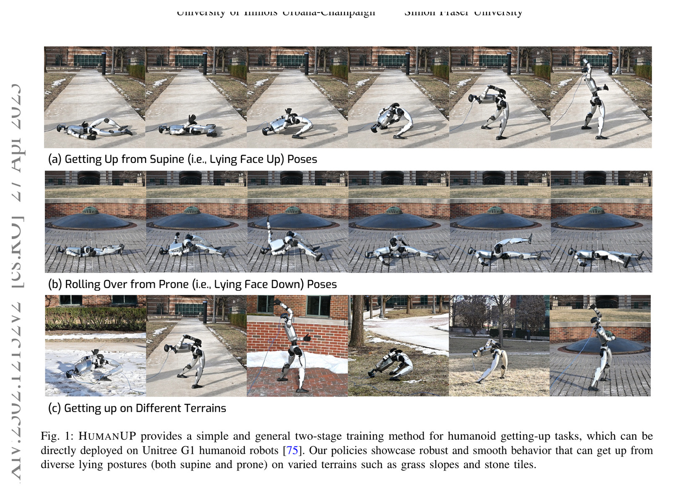
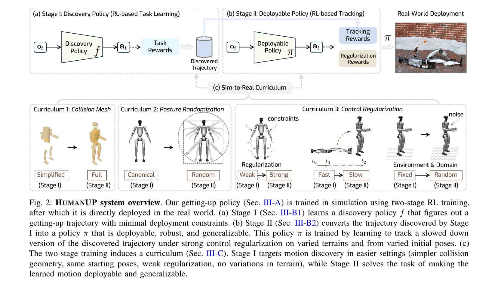
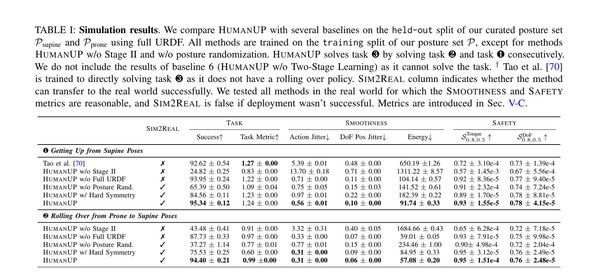
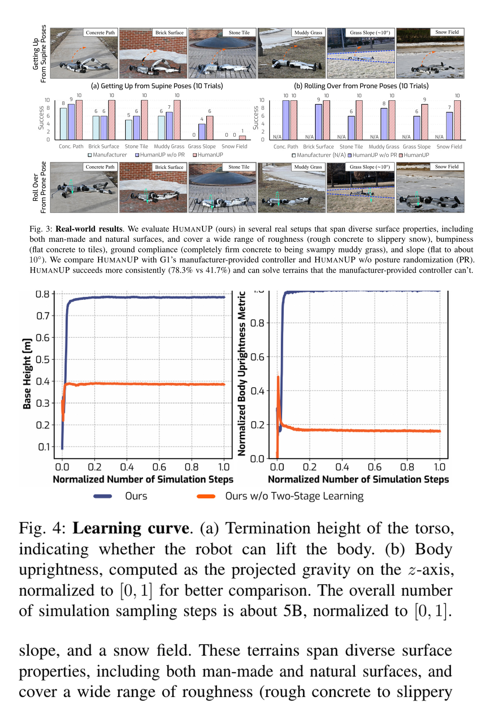

# HumanUP：把“发现能起身”与“变成可实机起身”拆成两阶段课程

[English version](en/humanup-2502.12152.md)

来源：[arXiv:2502.12152](https://arxiv.org/abs/2502.12152) · [固定提交的官方代码](https://github.com/RunpeiDong/HumanUP/tree/7516e0f27e6f4d1e7365cf64ea577a78247bd8cb)

解读范围：完整 15 页论文、奖励/训练附录与官方 G1 discovery、tracking、课程和安全惩罚代码。本文区分仿真成功、真实重复试验与未覆盖的跌倒安全。

> 一句话总结：HumanUP 让 Stage I 在弱正则与简化碰撞下先发现接触丰富的快速起身，再把轨迹减速 8 倍，由 Stage II 在完整 URDF、随机姿态/地形和强控制正则下追踪；G1 六类地面起身 78.3%、翻身 98.3%，但雪地和草坡仍有明确失败。

术语导航：跌倒恢复（fall recovery）、起身策略（getting-up policy）、动作发现（motion discovery）、轨迹追踪（trajectory tracking）、接触丰富任务（contact-rich task）、仿真到现实课程（sim-to-real curriculum）、姿态随机化（posture randomization）、控制正则化（control regularization）、安全分数（safety score）与完整碰撞模型（full collision geometry）。

## 工程痛点

起身不同于周期行走。身体、手臂、膝、髋会以未知顺序接触地面，早期动作甚至可能先降低躯干高度；只奖励最终站立十分稀疏。直接加入真机所需的低速度、低力矩和平滑约束，又会让探索连第一条可行接触序列都找不到。

Stage I 先搜索可完成起身的轨迹，Stage II 再加入速度、平滑和随机化约束；若粗路线本身穿过现实障碍，后续修整再认真也无法部署。

若一开始同时施加全部平滑、限速与接触约束，策略可能得不到成功信号；先获得可行参考，再逐步收紧部署约束。HumanUP 因此不是普通 reward curriculum，而是 task difficulty 与 deployment constraint 的反向两阶段课程。

碰撞几何也是决定性因素。行走常只精细建模脚，起身却依赖全身接触。简化 collision mesh 在仿真可能成功，却会让策略期待现实不存在的接触点；论文的消融显示这种 policy 在 full URDF 仿真仍看似良好，却在真实平地 5/5 失败。

## 核心洞察

Stage I discovery policy 只用稀疏任务与软对称 reward，采用简化碰撞、固定初始姿态、平地和弱正则，允许不到 1 秒的快速动作。仰卧起身 reward 包含高度、增量高度、直立、双足支撑、足力增量和软对称；俯卧先由独立 policy 翻成仰卧。

Stage II 不再从稀疏 reward 重找动作，而追踪 Stage I 轨迹。起身轨迹插值到 8 秒，翻身到 4 秒；完整 URDF、20k 仰卧和 20k 俯卧随机姿态、随机地形/动力学和强力矩、速度、动作率、脚姿态等正则同时加入。任务从“发现”变简单，部署条件则变难。

策略观测为 868 维：74 维本体、过去 10 步状态与 54 维在线适应 latent，输出 23 维动作。作者刻意不使用线速度与 yaw，因为实机难可靠估计，仅用 roll/pitch、角速度和关节状态推断整体姿态。这是面向摔倒场景的重要 observation contract。

## 方法主线

G1 有 29 个可动 DoF，起身禁用腕部 3 DoF，实际控制 23 DoF。Stage I 使用 PPO 训练 discovery，Stage II 从发现轨迹生成 tracking reference。Isaac Gym 仿真 1 kHz、低层 PD 50 Hz；附录说 Stage I 总约 5B steps，Stage II 文本记录为 20K simulation steps，并在 4096 环境、单张 RTX 4090/L40S 上训练。

姿态集由 canonical lying pose 随机关节、从 0.5 m 掉落并仿真 10 秒消除 self-collision，仰/俯各 20k，训练/验证各一半。Stage II 随机 flat、rough、slope 地形，并加入 CoM、延迟等 dynamics randomization。4×减速力矩/速度过大，10×不收敛，8×是试验选择而非理论常数。

安全评价不仅看 success。论文定义 action jitter、DoF position jitter、energy，以及 torque/DoF 相对限位的 safety score，阈值 δ=0.8、峰值与持续超限权重各 0.5。这使“能站起来”和“动作可部署”分开度量。

## 关键图解

Figure 1 展示仰卧起身、俯卧翻身与多地面。它证明全身接触动作可迁移到 G1，但连续帧不能替代统计；真正成功率应读 Figure 3。

Figure 2 把 Stage I discovery 与 Stage II tracking 分开，并列出 collision、posture、regularization、speed 与 domain 的变化。最重要的不是“两个网络”，而是先放松部署限制找到 trajectory，再把完整现实约束加入更容易的 tracking problem。

Table I 中完整方法在仰卧、翻身、俯卧连续任务上分别为 95.34%、94.40%、92.10%。Tao baseline 仰卧成功 92.62%，却 action jitter 5.39 对 0.56、energy 650.19 对 91.74，不能实机；单阶段完全无法解任务。高 success 不等价于 deployable。

Figure 3 对 concrete、brick、stone tile、muddy grass、约 10° grass slope 与 snow 每项 10 次。完整方法仰卧起身总体 78.3%，翻身 98.3%，制造商起身 41.7%；Figure 4 显示单阶段 termination height 停在约 0.4 m，说明强正则从零开始阻断探索。

## 最有说服力的实验

最强证据是 full URDF 消融与真实重复试验的组合。无 full URDF 方法在仿真 success 93.95%/87.73%/89.59%，表面不差，却在真实平地 5 次全部失败；这直接证明 contact geometry mismatch 能躲过常规仿真验证。

实机 10 次×6 地面给出比演示视频更可信的统计，同时 Figure 6 诚实展示雪地打滑和草坡足落点不稳。78.3% 是覆盖复杂地面的进展，不是无人监管恢复的可靠性门槛。

## 论文—代码映射

固定提交 `7516e0f27e6f4d1e7365cf64ea577a78247bd8cb` 中，`simulation/legged_gym/legged_gym/envs/g1waistroll/g1waistroll_up.py::G1WaistRollHumanUP` 实现 discovery 环境；`_update_standing_prob_curriculum`、`_update_regularization_scale_curriculum` 和各 `_reward_*` 函数对应 Stage I 的起身/软对称/控制课程。

`simulation/legged_gym/legged_gym/envs/g1rolltrack/g1waistroll_track.py::G1WaistRollTrack` 加载并插值发现轨迹，`_reward_tracking_dof_error` 与 `_reward_base_roll_gravity_error_cosine` 实现 Stage II tracking；同文件 torque/DoF/energy/action-rate reward 对应附录安全正则。

## 局限与工程判断

作者明确指出：Stage I 发现的动作理论上可能与 Stage II 强正则不兼容；高频高保真 physics simulator 是依赖；欠指定 reward 会 reward hacking，例如为平衡不自然抬手；楼梯和更复杂不平地形仍未充分研究，更强手臂平台可能需要不同动作。

独立工程局限包括：俯卧需要先翻身再起身的 policy handoff，切换条件和失败恢复未定量；实机只覆盖一台 G1、每地面 10 次；外界敲击/抛物 robustness 主要是定性；没有自主 fall detection、碰撞后结构检查和连续多次跌倒的热/磨损统计。

硬件安全上，“跌倒后自动起身”不等于“跌倒过程安全”。启动前必须确认机器人/人体/障碍距离、关节和电机健康、地面空间、通信与急停；策略中仍需 torque/rate/current/temperature 限制和 contact anomaly stop。未知姿态不在训练分布时应请求人工而非强行起身。

## 可执行但有边界的结论

HumanUP 最可复用的是把稀疏、接触丰富的 task search 与 sim-to-real regularization 解耦。Stage I 负责找到一种能完成的动作，Stage II 负责把它变慢、变平滑、随机化并在完整接触模型下验证。

这一模式可推广到爬行、翻滚和某些接触丰富操作，但 Stage I trajectory 不应成为唯一答案。最好发现多条候选，再按 torque、碰撞、时间和可迁移性筛选，避免第一条局部最优路线锁死 Stage II。

## 复现与验收清单

固定 G1 URDF/collision、Isaac Gym、发现/追踪配置、插值速度、姿态集、terrain、randomization、提交与 seed。复现 Table I 的单阶段、无 Stage II、简化 URDF、无 posture randomization 与 hard symmetry，并报告多 seed。

为 20k+20k 姿态集保留生成 seed、落高、自碰撞解析和 train/validation hash。验证 4×/8×/10×轨迹的 tracking、力矩、速度、jitter、energy 与 success；对 contact geometry、摩擦、延迟、CoM 和软地面逐项做外推。

真机先做 suspended signal check、软垫 canonical 仰卧、随机仰卧、翻身，再扩展地面。每项重复记录成功、partial、fall-back、峰值 torque/current、温升、碰撞和急停。上线还需 fall detector、区域检查、健康状态机与人工接管，目标应高于论文 78.3% 才能接近自主运行。

## 进一步工程审计

起身系统的入口条件必须比普通 locomotion 更严格。机器人刚跌倒时可能仍在滑动、某个肢体被物体压住、电机过热或通信尚未恢复。策略启动前应等待角速度和接触趋稳，检查关节编码器、驱动故障、温度、电池、周围人员与可用空间，并确认当前姿态落在训练覆盖。入口检查失败时保持低能量姿态并请求人工，不应用“策略可能会恢复”替代诊断。

俯卧到站立由翻身与起身两个策略串联，切换状态需要专门验收。仅以躯干朝向达到阈值切换，可能在仍有较大角速度或手臂压在身体下时启动起身。应同时检查姿态、速度、关键接触和稳定持续时间，并为切换失败设置回退或有限重试次数。两个单策略各自高成功率，其乘积和切换误差才是完整俯卧恢复能力。

完整碰撞几何不是越复杂越好，而是要与真实接触点足够一致。网格过细会降低仿真速度并引入尖锐法向，过粗会重现论文消融中的接触错配。可用实机缓慢压靠或手动摆位采集关键身体部位接触，校准胶壳、软垫和突出部；然后以接触顺序、法向和穿透统计比较模型版本，而不只看最终 success。

姿态随机化数据也要覆盖真实跌倒分布。论文从 canonical pose 随机关节后下落生成稳定姿态，这能产生大量自洽样本，却未必包含墙角、台阶边缘、物体缠绕和高速倒地后的构型。实机应只在明确支持的场景自动恢复；新增场景先采集或合成姿态、验证碰撞与安全，再扩展策略。把“任意姿态”写进产品能力会超出论文证据。

动作减速不只改变速度，也改变动力学。八倍插值减少惯性和冲击，但某些借动量完成的动作在过慢时无法克服几何或扭矩条件，十倍不收敛正体现这一点。对新平台应联合扫描时间尺度和参考路径，而不是单独拉长时长；每个候选都报告峰值力矩、正负功、足手接触冲量、滑移和可跟踪性。

安全分数要与真实硬件限制对应。论文以相对 torque/DoF 阈值衡量峰值与持续超限，但驱动器还有速度相关力矩曲线、温度降额、总线电压和机械冲击限制。部署验收应读取厂家 envelope 与实测保护触发，计算时间积分和连续次数。一个平均 safety score 很高的策略，仍可能有单次危险冲击。

成功定义也要更贴近长期运行。头高超过 1.1 米且保持站立是清晰仿真指标，但真机还需确认双足接触稳定、关节不过热、没有持续大力矩，并能安全交接到 locomotion controller。建议增加站稳保持、控制器切换和恢复后健康检查；若起身后立即跌倒或无法行走，应记为 partial 而非成功。

失败重试尤其危险。雪地或草坡上第一次失败后，机器人位置、姿态和温度已经改变；无限重试可能逐步滑向障碍或积累损伤。状态机应限定重试次数与总能量，比较每次姿态是否更有利，并在没有进展时停止。每次重试都保存根姿态、接触、力矩和停止原因，供后续扩展数据集，而不是只保留最终结果。

恢复与保护落地还需形成闭环。HumanUP 解决倒地后的动作，但机器人跌倒过程中如何减小冲击、识别结构损伤和选择最终姿态属于前置问题。理想系统在 fall detector 触发后先执行 protective fall，再静止与健康检查，最后才选择翻身/起身策略。各阶段的责任和接口清楚，才能避免起身功能让团队低估跌倒本身的风险。

最后，实机成功率应按环境和失败原因持续积累，而不只复刻论文六类地面。记录摩擦、坡度、软硬、湿度、鞋底状态、温度和电量，将失败分为打滑、足落点、手卡住、力矩限幅、感知/通信与未知。只有在支持域内达到预设下限并经过独立安全评审，自动起身才应默认开启；其余情况保持人工确认模式。

完整恢复系统应依次执行跌倒检测、落地保护、静止与健康检查、翻身起身以及站稳后控制交接。任何一步失败都要停止或回退，不能因为最后一步已有策略就跳过前面的检查。因此成功率必须按完整流程计算，而不是只统计策略在已准备好的姿态上是否站起。

现场操作中，策略只负责生成动作，安全员独立确认空间、设备和人员状态。前者不能替代后者，后者也不能靠观看一段成功视频判断风险。把启动许可、急停权限、重试上限和人工接管写成状态机，并在每次试验自动记录，才能让研究原型逐步接近可重复的工程系统。

面向中文读者，最重要的边界可以直接表述为：论文证明方法在规定机器人、规定初态和六类地面上显著优于对照，也如实记录困难地面失败；它没有证明任意跌倒、任意障碍或无人旁站条件下都能恢复。页面中的所有建议都应围绕这一证据范围展开，既不低估两阶段方法的价值，也不把有限试验放大为普遍安全保证。

> **工程判断**：起身最难的不是把动作做慢，而是在不受真机约束时先找到有效接触序列，再证明减速和正则没有把这条路堵死。
