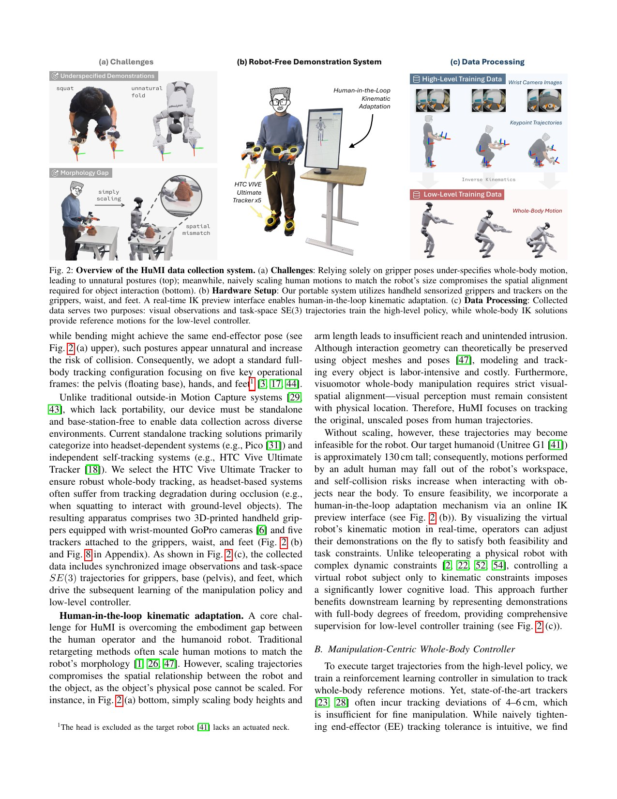
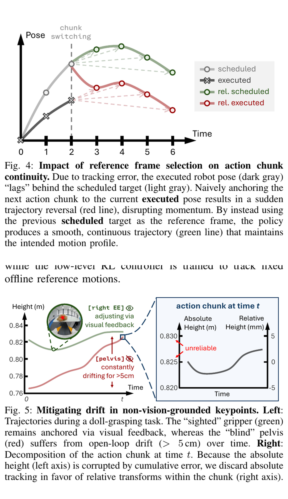
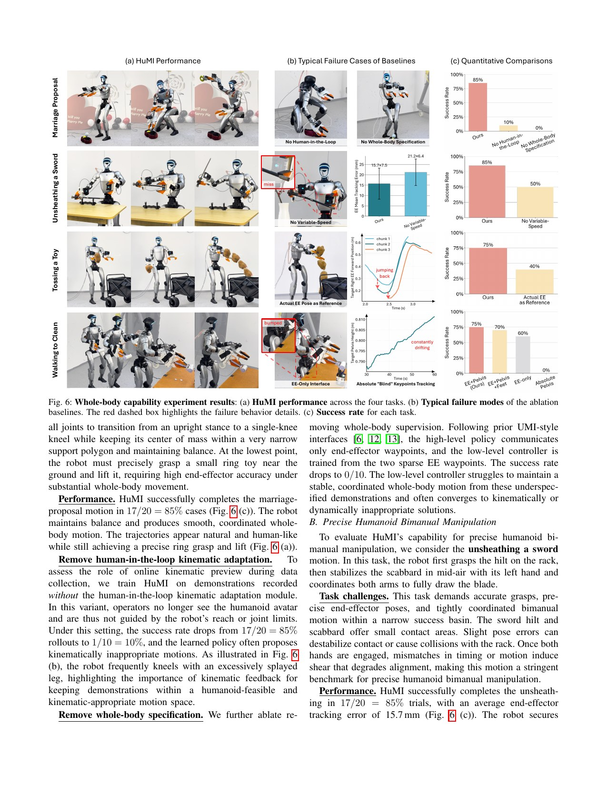

# HuMI：先让人适应机器人，再把无机器人示范变成全身操作策略

[English version](en/humi-2602.06643v2.md)

来源：[arXiv:2602.06643v2](https://arxiv.org/abs/2602.06643v2) · [官方项目页](https://humanoid-manipulation-interface.github.io/)

解读范围：完整 15 页正文与附录 A-F。项目页展示 Code/Dataset 入口，但截至本次核验没有获得可唯一检查的公开代码仓库和提交，因此本文不提供虚构代码映射。

> 一句话总结：HuMI 先用人在环逆运动学预览把“人能做”改成“G1 能做”的示范，再用高层视觉扩散策略与低层全身跟踪器把示范转成可执行的机器人行为。

术语导航：无机器人示范（robot-free demonstration）不等于无机器人约束，人在环（human-in-the-loop）以可视化 IK 反馈修改动作。任务空间（task space）保留环境几何，动作块（action chunk）负责高层时序，变速回放（variable-speed playback）给低层留出纠错时间。盲关键点（blind keypoint）、本体感知（proprioception）、扩散策略（Diffusion Policy）与教师-学生蒸馏（teacher-student distillation）共同构成数据到控制的闭环。

## 工程痛点

固定机械臂的 robot-free demonstration 往往只记录两只手：手到哪、夹爪何时开合，就足够描述任务。但对人形机器人，同一个手部轨迹可以由弯腰、深蹲、跪地或迈步完成；这些解的稳定性、碰撞风险和后续可操作空间完全不同。

直接缩放人体动作也行不通。舞蹈动作可以整体缩短，但桌子、瓶子和剑不会跟着机器人一起缩放。如果把手臂长度缩短，原来能抓到的目标会落到机器人工作空间之外。HuMI 的选择很实在：不缩放环境中的任务轨迹，让示范者看着虚拟 G1 的实时 IK 结果，主动把动作改到机器人能做到的位置。

这个界面像驾校教练车：人仍然在决定去哪里，但他在采集当下就能看见“这个转向机器人打不过去”，而不是等收集完数百条数据后才发现全部失败。它节省的不只是采集时间，还减少了下游策略被迫学习不可达目标的冲突。

## 核心洞察

HuMI 的核心不是某一个更准的 IK 求解器，而是把“体现差异”提前到采集者的感知-动作环里。人可以快速改变弯腰、蹲跪或迈步方式，而纯离线优化器只能在事后的数值目标中猜测什么算“自然又可执行”。

第二个洞察是高低层之间必须有明确的误差协议。高层计划还没执行完就生成下一块，如果它把当前落后的实际手位当成新起点，目标会像拉链卡齿一样向后折返。使用上一块的计划目标作锚点，则把局部跟踪滞后留给低层纠正，不让它污染长期任务轨迹。

## 方法主线：输入 → 处理 → 输出

输入来自两只带 GoPro 与夹爪宽度标记的手持 gripper，以及手、骨盆、双脚共五个 VIVE Ultimate Tracker。处理链分为两条：

1. 实时 Mink IK 把五点 SE(3) 目标映射到 G1 全身关节，加入自碰撞与自然姿态约束；操作者根据虚拟机器人预览即时修正动作。
2. GoPro 陀螺仪角速度与 tracker 角速度做互相关，实现视频—姿态同步；ArUco 标记恢复夹爪宽度。
3. 图像、夹爪和关键点轨迹训练 5 Hz 的高层 Diffusion Policy；IK 全身解与关键点轨迹训练 50 Hz 的低层 tracker。
4. 低层先学全身协调，再用速度自适应末端奖励逐步收紧精度，并以变速回放增加纠错时间。
5. 高层每次生成 action chunk。下一段以“上一段计划目标”而不是实际滞后姿态作参考；无视觉锚点的骨盆/脚只表达 chunk 内相对变化。

输出是高层未来两秒的十个关键点 waypoint，以及低层根据这些目标与本体状态生成的关节位置命令。机器人内置 PD 执行关节目标，夹爪另行控制。

## 控制接口与公式

基础全身奖励把位置、姿态、线速度和角速度误差分别放进指数核。末端奖励不是始终保持同一严格容差：当手移动慢、基座也近乎静止时，位置/姿态容差收紧；快速移动或基座行走时放宽甚至关闭末端精度项，优先保证全身稳定。训练期间末端权重从 0 增加到 0.5，最小位置容差再从 0.1 m 逐步降到 0.01 m。

学生 observation 使用 25 步关节/速度/IMU/动作历史。command 为未来两秒十个 waypoint：有腕部视觉的手使用局部绝对目标和当前误差；没有视觉锚点的骨盆、脚使用相对当前参考的变化。这相当于把“看得见的误差”交给闭环纠正，把“看不见的长期漂移”限制在短 horizon 内。

## 关键图解

Figure 2 把论文的“接口贡献”讲得最清楚：只看两手会留下大量全身自由度，整体缩放又会改变物体与环境几何。五点跟踪和虚拟 G1 预览把这两类问题在采集时暴露给操作者，这是数据质量提升的直接因果路径。

- Figure 2：说明为什么仅两手欠约束、为什么整体缩放破坏物体空间关系，以及五 tracker + 人在环 IK 如何补齐可行全身姿态。
- Figure 3：给出 5 Hz 高层、50 Hz 低层和内置 PD 的层级接口；两个策略的失败会在这里耦合。
- Figure 4：如果下一 action chunk 以实际滞后手位为参考，目标会突然向后折返；用上一计划目标可保持运动方向连续。
- Figure 5：没有视觉锚点的骨盆高度会累计漂移超过 5 cm，说明世界坐标绝对命令并不总比相对命令可靠。
- Figure 6：四个能力任务与逐项消融，是判断每个接口设计是否必要的主要证据。
- Figure 7：15 分钟采集对比中，HuMI 记录 62 次、TWIST2 记录 28 次；有效率分别为 96.7% 与 64.3%。它支持“在该任务与熟练操作者下更高效”，不是普遍的人时成本结论。
- Appendix Table I/II：明确低层奖励、接触惩罚、摩擦/质心/末端质量/推力/重置/速度随机化；这些是特定 G1 训练设置，不可直接复制。
- Appendix Table III：高层视觉输入为双 224×224 图像，动作频率 20 Hz、horizon 48，Diffusion Policy 在 5 Hz 外层运行。

Figure 4 是高低层接口的反例图：实际手位因跟踪滞后落在计划后方，下一块如果从实际位姿重新锚定，原本连续的轨迹就会产生反向跳变。Figure 5 表明骨盆这类缺少视觉锚点的部位用世界坐标绝对跟踪时会长期积累超过 5 cm 的开环漂移。

Figure 6 不应只当成一张成功率图。每个任务故意压力测试一个接口选择：求婚检验全身规格与人在环预览，拔剑检验变速回放，投掷检验块锚定，行走清桌检验盲部位的相对表达。这样的任务-组件对应比展示更多花样更有分析价值。

## 最有说服力的实验

Figure 6 的因果消融比演示视频更有价值：求婚任务去掉人在环可行性预览后从 17/20 降到 1/10，去掉全身 specification 后为 0/10；拔剑去掉变速增强后从 85% 降到 50%；投掷把 chunk 参考改回实际手位后从 75% 降到 40%；行走清桌若对无视觉骨盆使用世界绝对姿态，从 75% 降到 0%。

这些结果共同说明：robot-free 数据并不意味着可以忽略机器人。真正有效的是把机器人约束前移到采集界面，再把不可消除的低层跟踪误差显式纳入高低层协议。

不过，这些消融的分母并不大，而且每个任务只对应一个主要组件。它们能证明某个设计在该任务中是必要因素，却不能证明相同结论对不同夹爪、不同尺寸机器人或无外部定位的系统仍成立。复现时应保留完整失败分类，不只报一个总成功率。

## 论文—实现状态

论文给出了足够详细的组件级实现信息：Mink/Viser 在线 IK、GoPro/VIVE 同步、teacher-student DAgger、速度自适应奖励、Diffusion Policy、ZeroMQ 通信、5 Hz/50 Hz 调度与 G1 内置 PD。但本次没有从作者官方页面解析到可唯一核验的 GitHub 仓库、许可证和提交。

因此当前记录为 `advertised_unverified`：可以把论文和项目页作为方法/实验的原始证据，不能声称代码已开源，也不能给出具体函数/文件映射。等官方仓库可直接访问后，应补做许可证、commit、训练/部署入口、配置与论文差异审计。

官方代码未公开时，最容易出现的错误是用同名第三方仓库填空。这会把“可运行的类似系统”偷换成“论文的公开实现”。在当前状态下，正确的工程输出是模块级复现清单和未知项，而不是虚构函数符号。

## 适用边界与局限

作者明确指出：VIVE 视觉 tracker 依赖环境纹理和照明；低层 controller 还不是跨任务通用策略；只验证一台 G1。部署还依赖自定义轻量夹爪、双腕 GoPro、外部工作站、无线网络、机器人骨盆与地面的额外 VIVE tracker，不能简化成“仅靠机器人 onboard sensing”。

独立工程判断还包括：

- 采集者需要超过 20 小时 HuMI 经验，TWIST2 对照操作者也超过 10 小时；3×效率来自一个任务、一次 15 分钟协议，不能外推到新手与所有任务。
- 多数主结果为 20 次，消融常为 10 次，失败率的不确定区间仍较宽。
- 五点 IK 预览能处理运动学可行性，却不能预测动力学接触、执行器热、地面摩擦或真实夹爪碰撞。
- 70% 泛化来自 350 条、七场景/七物体训练和 20 次测试；它证明一定程度的跨环境能力，不等于开放世界泛化。

将这些限制转成验收项时，可以把整条链分成三个失败源：采集端的 IK/同步失败、高层视觉与 chunk 规划失败、低层跟踪与接触失败。每次试验应记录是哪一层先越界，否则一个“任务失败”标签无法告诉研发者应该补数据、改接口还是调整控制器。

尤其要报告示范到下发的时间同步误差、高层目标连续性、低层末端误差和急停触发比例。这些指标能把一次成功演示变成可追责的系统证据。

## 可执行但有边界的结论

构建人形 robot-free 数据系统时，至少记录手、骨盆和脚；在采集界面实时展示目标机器人 IK、自碰撞与关节限位；把高层 chunk 连续性、低层跟踪滞后和无视觉关键点漂移作为接口设计问题，而不是事后靠更大网络掩盖。

本文不提供可直接执行的 PD、摩擦、推力或关节参数。任何复现应先在仿真中验证 IK、轨迹连续性、碰撞、限位和低层稳定性，再以命令限幅、急停、隔离区与机器人专用审查分阶段上机。

最容易误读的一点是把“采集时不用真机”写成“数据不需要机器人模型”；HuMI 的可行性恠恰来自采集者一直在看目标 G1 的 IK 反馈。

> **金句**：“无机器人示范”省掉的是采集时占用真机，不是机器人的形态、接触和安全约束。

## 复现与验收清单

复现交付物不应只有一个任务成功率，还应保存每条示范的 IK 可行率、视频—姿态同步误差、高层 chunk 连续性、低层手/骨盆/脚跟踪误差与失败分类。只有这些中间量才能判断新任务失败是采集、规划还是控制问题。
