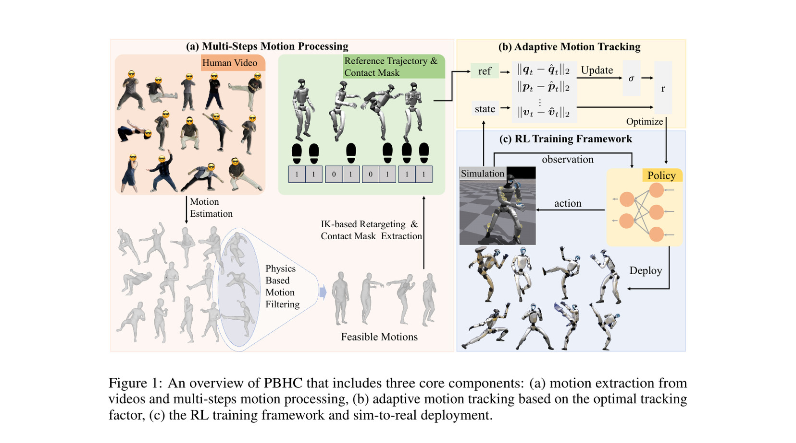
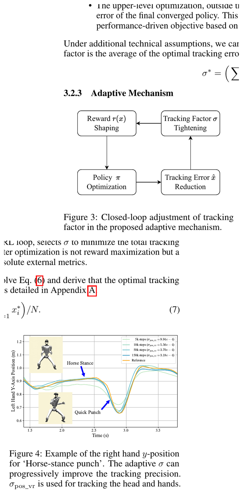
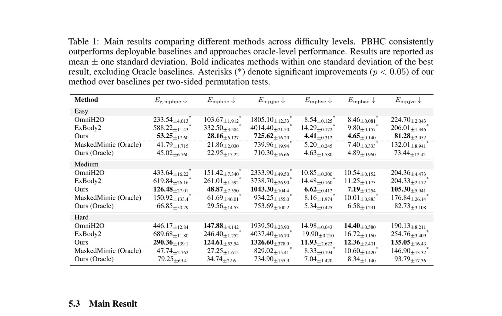
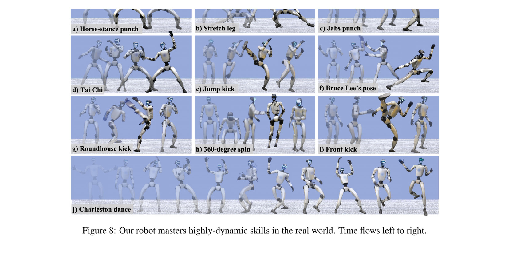
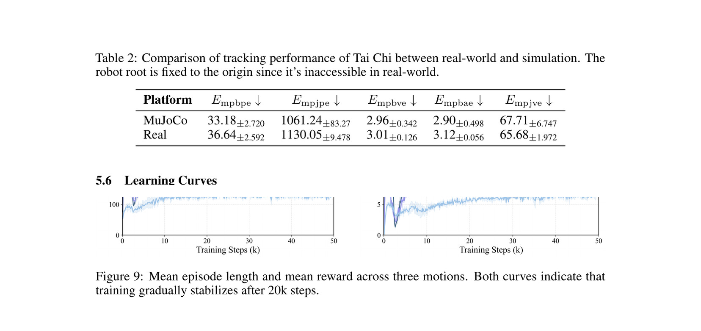

# KungfuBot / PBHC：先修动作，再让跟踪容差随误差自动收紧

[English version](en/kungfubot-2506.12851.md)

来源：[arXiv:2506.12851](https://arxiv.org/abs/2506.12851) · [固定提交的官方代码](https://github.com/TeleHuman/PBHC/tree/ffac5cded61fe78b39b051f09ac2ed0f6a1ccea0)

解读范围：完整 28 页论文与附录、全部 reward/randomization/动作数据说明，以及官方 motion filtering、retargeting、自适应 reward 与部署实现。

> 一句话总结：PBHC 用 GVHMR 提取人体动作，经 CoM/CoP 物理筛选、接触 mask、落地修正和 IK 重定向后，为每条动作单独训练策略；跟踪 reward 的容差 σ 取误差 EMA 并只允许单调减小，使难动作先得到梯度、后提高精度。G1 实机展示丰富，但只有太极给出 10 次定量试验，且每个动作一个 policy、无环境感知。

术语导航：物理人形控制（Physics-Based Humanoid Control, PBHC）、人体动作恢复（Human Motion Recovery, HMR）、质心/压力中心（Center of Mass/Center of Pressure, CoM/CoP）、接触掩码（contact mask）、微分逆运动学（differential inverse kinematics）、跟踪因子（tracking factor）、双层优化（bi-level optimization）、指数移动平均（Exponential Moving Average, EMA）与非对称 actor–critic（asymmetric actor–critic）。

## 工程痛点

高动态视频动作常包含 HMR 漂移、脚浮空、人体可做而机器人不可做的关节/速度。若直接用很小 σ 的指数 tracking reward，初期误差大时 reward 接近零，策略没有梯度；σ 太大又长期容忍误差。一个固定 σ 很难同时适配太极、跳踢和 360° 转体。

动作处理先剔除超出机器人可达范围或违反接触条件的片段，再校正节奏和落点。自适应 σ 根据跟踪误差逐步收紧容差；若第一天就用比赛标准，学员可能完全得不到有效反馈。

## 核心洞察

动作管线依次执行单目 GVHMR、CoM/CoP 稳定性过滤、接触估计、z 向落地修正与 EMA 平滑、G1 IK retargeting。还吸收 AMASS/LAFAN 动作。论文用 10 条序列验证过滤：6 条接受动作得到高 ELR，4 条拒绝动作最高 ELR 仅 54%，说明前处理减少了注定失败的训练。

tracking reward 为 exp(−x/σ)。作者把最终误差最小化写成双层问题，并在假设下得到最优 σ 等于收敛误差均值。实际训练无法预先知道收敛误差，于是用在线误差 EMA 估计，并更新 σ←min(σ, x_hat)。单调约束避免策略暂时变差时放宽标准形成反向课程。

## 方法主线

G1 控制 23 DoF，action 是 PD target。actor 只看五步本体历史和 phase，critic 额外看参考位置、根线速度与随机物理参数。reward vectorization 为每项 reward 建独立 value head，再合成 advantage。每个 reference motion 单独训练 PPO，Isaac Gym 三个 seed，评估 1000 episode。

sim-to-real 采用动力学随机化与 MuJoCo sim-to-sim，无实机微调。动态数据按 easy/medium/hard 分类。附录给出 contact、reward、randomization、PD 与 adaptive σ 配置，允许从论文结果追到具体工程参数。

## 关键图解

Figure 1 把 HMR、过滤、接触修正、retargeting、adaptive tracking 和策略部署连起来。任何复现失败都应先判断来自数据不可行还是 policy 学习，而不是只调 PPO。

Figure 3–4 显示 reward shaping 与 tolerance tightening 的闭环，以及拳击手部轨迹随训练更贴近参考。Equation 8 的 min 约束是关键，不能只用普通可升可降 EMA 替代。

Table 1 以三个 seed、1000 rollout 比较 PBHC、OmniH2O、ExBody2 与 oracle。PBHC 在 easy/medium 六项指标显著改善，hard 仍有较大方差；oracle 忽略部分可部署约束，不能作为实机目标直接复制。

Figure 7 说明 fixed Coarse/Medium/Upper/Lower 在不同动作上互有胜负，自适应设置较稳定；Figure 8 展示拳击、踢击、转体、舞蹈和太极。连续帧证明可执行性，不提供失败概率。

Table 2 对太极做 10 次试验，实机与 MuJoCo 的 body/joint/velocity error 接近；Figure 9 显示三条动作约 20k steps 后稳定。其他高动态动作没有同等重复统计，因此结论需限定。

## 最有说服力的实验

最强证据是 fixed σ 消融加难度分层 Table 1。它直接检验论文核心机制，而不是把改进归因于更多数据或更大网络。每个设置三 seed、1000 episode 也使方差可见，hard motion 的大标准差提醒读者不能只看均值。

太极 10 次 sim-real 对照是唯一较强实机量化。它说明 selected motion 的 onboard state error 没有明显放大，但根位置在实机不可测而被固定到原点，且太极不是最激烈的跳踢/转体。高动态动作仍主要是定性视频证据。

## 论文—代码映射

固定提交 `ffac5cded61fe78b39b051f09ac2ed0f6a1ccea0` 中，`smpl_retarget/motion_filter/utils/motion_filter.py::MotionFilter` 计算动作物理筛选，`smpl_retarget/mink_retarget/convert_fit_motion.py::correct_motion` 做接触相关高度修正，`mink_retarget.py::retarget_fit_motion` 完成 G1 retargeting。

`humanoidverse/envs/motion_tracking/general_tracking.py::_update_adaptive_sigma` 实现 σ 单调更新，各 `_reward_teleop_*` 把误差送入 adaptive tracker；`_reward_teleop_joint_position`、`_reward_teleop_body_position_extend` 直接对应主要跟踪项。代码还保留大量通用 HumanoidVerse 路径，复现需锁定 PBHC 配置而非混用默认任务。

## 局限与工程判断

作者明确指出：方法没有 terrain perception 或 obstacle avoidance，限制非结构环境；每个 policy 只模仿一条 motion，面对大动作库效率低，未来需兼顾高动态与多技能泛化。

独立工程局限包括：CoM/CoP 静态判据可能拒绝本来可行的动态腾空动作；10 条过滤样本很小；GVHMR、接触 mask、IK 与 RL 错误会累积；根位置真机指标不可测；除太极外没有重复试验；每个动作独立策略带来切换、存储和安全审核负担。

硬件安全上，高踢、转体和跳跃需要独立的自碰撞、足滑、腾空落地、力矩/速度/功率与空间限制。自适应 σ 只改善 tracking reward，不保证参考动作物理安全；过滤通过也不能替代机器人 collision 和 actuator envelope。现场需吊绳、软垫、急停与逐动作审批。

## 可执行但有边界的结论

PBHC 最可复用的不是“功夫动作”，而是两个闭环：上游先用控制结果审计动作数据，下游让 reward tolerance 随可达误差自动收紧。对新动作，先看过滤和 retargeting artifact，再看 adaptive σ 和 rollout，不要从 PPO 超参数开始盲调。

单动作 policy 适合研究阶段建立高质量技能基线。若转向统一 policy，应保留每条动作独立基线作为回归 oracle，统计 unified 模型在同一误差、能量和实机门槛上退化多少。

## 复现与验收清单

固定 PDF、PBHC commit、GVHMR、SMPL、AMASS/LAFAN、G1 模型、contact threshold、CoM/CoP 阈值、EMA、σ 初值/下限、PPO、PD、randomization、三个 seed 与动作清单。复现 Figure 6–9、Table 1–2 与附录 Table 10–13。

保存每条动作的原视频、HMR、mask、修正前后、retarget 后 hash，报告 accepted/rejected 和 ELR。对 fixed σ 四档、自适应、无接触修正、无 mask 逐项消融；hard 动作必须报告分位数和失败模式。

实机从低速太极、拳击到踢击、转体、跳跃递进，每项多次重复并记录 fall、partial、滑移、碰撞、峰值力矩/电流、落地冲量和人工介入。策略切换前回到已验证稳定状态，未知 reference 或环境障碍立即拒绝执行。

## 进一步工程审计

动作过滤不能只输出接受/拒绝。应为每条序列保存 CoM/CoP 距离、边界帧、接触置信度、最大关节速度、腾空区间和拒绝原因，形成可人工复核的质量卡。若一个精彩动作被拒绝，工程师应知道是 HMR 漂移、稳定判据还是目标机器人限位，而不是为了加入数据直接关闭过滤器。

CoM/CoP 判据对动态动作存在语义边界。跳跃腾空时没有常规 CoP，快速转体也可能暂时越出准静态支撑区域；过滤流程必须识别 flight/contact phase，再按阶段使用不同标准。否则系统可能系统性偏向慢动作，或者为了保留跳跃而放宽全部序列，失去筛选价值。

接触 mask 是 retargeting 与 reward 的共享契约。上游判断脚应接触，落地修正改变根高度，下游 policy 又奖励同一接触；mask 错误会被三个环节共同放大。复现应人工标注一个小而覆盖全面的验证集，分别报告 precision/recall，并观察假阳性导致粘脚、假阴性导致脚滑的具体比例。

自适应容差需要下限和停止条件。σ 单调变小后，如果 reference 含无法消除的系统误差，reward 会再次饱和，策略可能以更大力矩追逐不可能目标。除了配置最小值，还应监控误差是否下降、能量是否上升和 termination 是否增加；满足“精度不再改善但代价变大”时冻结 σ。

每动作一个 policy 使部署选择成为安全关键。动作名称不能直接映射 checkpoint，必须验证机器人型号、reference hash、PD、observation schema、起始姿态和可用空间。选择错误 policy 会造成 reference、观测和 PD 配置不一致并立即失步。策略 manifest 应自动拒绝不匹配。

高动态动作的结束同样需要设计。论文主要关注 tracking 过程，但实机必须从最后一帧平滑回到站立或下一技能。参考末端若仍有角速度，简单循环或定格会产生冲击。为每条技能定义 entry/exit pose、允许速度和 fallback，验证切换时的接触和力矩。

统一模型研究可以从现有单技能基线获得清晰判据：相同 reference、相同 episode 初始化、相同 σ 机制下比较统一与独立 policy。若统一模型平均更好，却在 jump kick 的尾部风险显著增加，应保留独立策略或显式路由，而不是用总平均掩盖关键技能。

对读者而言，“为什么高动态跟踪训练不动”应按顺序排查：reference 是否可行、接触是否正确、retarget 是否穿地、自适应 σ 是否过早收紧、actor 是否缺历史、critic privileged 信息是否泄漏到部署。这样比从 reward weight 随机搜索更快定位根因。

动作修正还要避免把错误隐藏掉。把最低顶点简单抬到地面可以去除浮空，却可能让膝、手或衣物网格决定整体高度；平滑之后视觉更好，真实脚接触时序仍可能错误。应按足底、手和其他身体部位分别检查接触，比较修正前后的根速度与关节加速度，防止为了消除一种伪影引入另一种不可跟踪跳变。

逆运动学重定向不能只追末端位置。人体与机器人腿长、髋宽和关节轴不同，同一手脚轨迹可能要求躯干倾斜或关节贴限。优化时应报告末端误差、关节余量、自碰撞距离和连续性，并对多个初值检查局部最优。若某段只能在关节限位附近实现，应标为高风险，而不是与普通动作一起训练。

训练相位变量假设参考时间准确。视频动作若有变速、掉帧或不同阶段难度，线性相位会让策略在错误时刻追目标。可先离线检查速度峰值和接触对齐，必要时重新定时；部署中也应防止循环边界从最后一帧跳回第一帧。动作开始和结束最好各有稳定缓冲段。

评论家使用真实根速度和随机参数等特权信息，有助于训练但会使价值估计与演员观测不对称。应验证移除或扰动这些信息后策略性能是否异常敏感，并确保导出只包含演员需要的输入。若配置误把特权量送入演员，仿真结果会很好，实机却没有对应传感器，这是必须自动检测的契约错误。

容差收紧速度也应与策略学习速度匹配。估计窗口太短会被单次好轨迹拉低，随后大多数环境拿不到奖励；窗口太长则长期停留在宽松标准。记录每个奖励项的容差曲线、误差分布和有效梯度比例，比只看最终数值更容易判断课程是否过快。不同动作不应默认共用同一时间常数。

高动态动作的能量和机械代价需要与跟踪误差并列排名。一个策略误差更小，却使用更大力矩、更猛烈落地或更频繁接近限位，未必更适合真机。候选选择应先满足安全上限，再在可行集合中比较精度；不能把所有指标加成一个分数后允许精度抵消危险峰值。

从视频收集新动作时，应保留来源、授权、帧率、裁剪和处理版本。网络视频可能经过变速和镜像，动作作者也未必允许重新分发。Handbook 可以保存链接、摘要和处理清单，但不应把第三方视频或动作文件直接纳入仓库。可复现性与内容授权需要同时满足。

若希望从单技能走向组合技能，最先解决的是稳定入口和出口，而不是马上扩大网络。为每条动作寻找站立或公共姿态的连接段，构建可切换图，再训练路由或统一策略。没有公共边界时，两个各自成功的动作直接串联仍可能产生巨大目标跳变。

最终验收应把视频展示降为补充证据。每种技能需要规定成功、部分成功、失败和停止原因，至少重复若干次，并公开最差条件。读者看到“会功夫”时，能同时看到哪种动作有定量、哪种只有展示、环境和安全限制是什么，才不会把视觉震撼误当成普遍可靠。

> **工程判断**：先证明参考动作对机器人可行，再逐步收紧跟踪标准；一个漂亮的高动态视频既不能替代动作数据审计，也不能替代重复安全统计。
