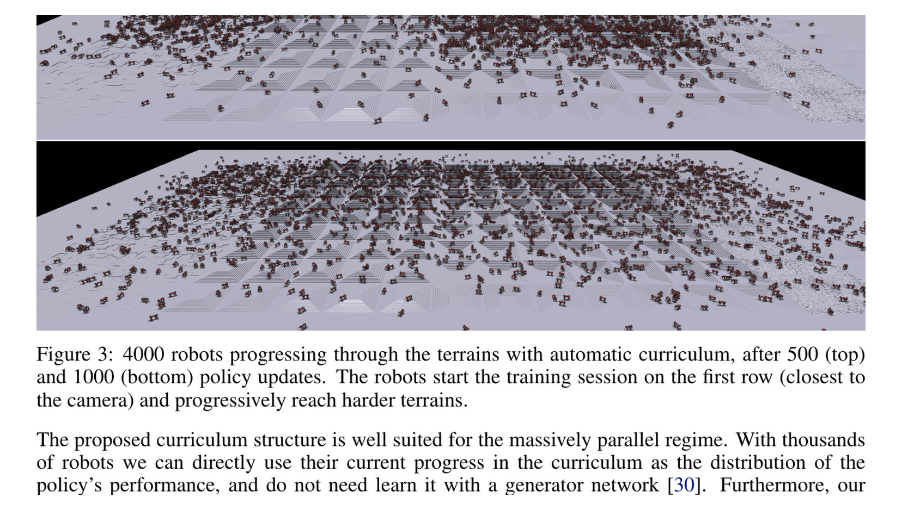
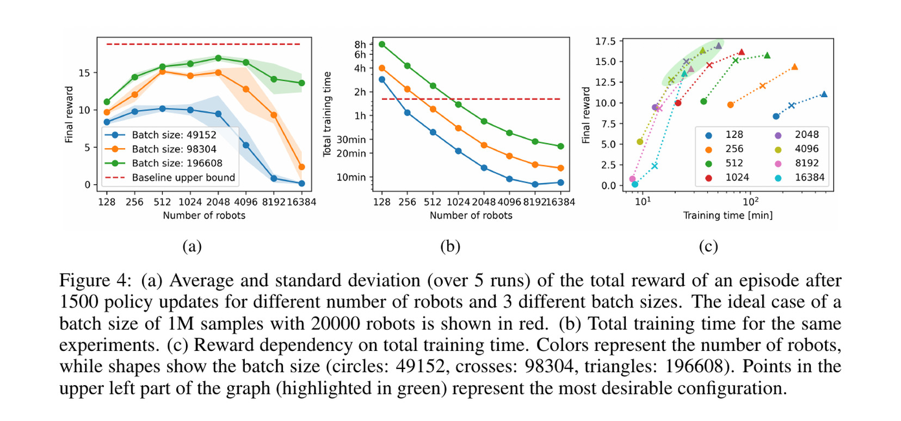
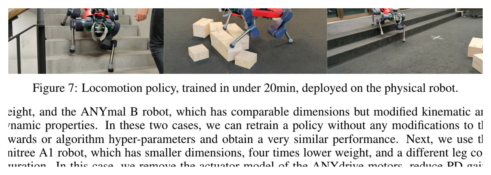

# Learning to Walk in Minutes：大规模并行训练的经典配方，以及速度数字背后的边界

[English version](en/learning-walk-2109.11978.md)

来源：[arXiv:2109.11978](https://arxiv.org/abs/2109.11978) · [固定提交的官方代码](https://github.com/leggedrobotics/legged_gym/tree/8fa29acc6fd1910c3d9659eef6310bdd301cde0a)

解读范围：完整 14 页论文及补充材料、官方 legged_gym 的地形课程、观测、timeout bootstrapping、奖励与 PPO 配置。

> 一句话总结：这篇经典工作证明 4096 个并行机器人、约十万级 rollout batch 和自动地形课程能在约 20 分钟训练 ANYmal 复杂地形策略；训练快不等于鲁棒性绝对最强，真实部署仍受高度图、状态漂移和地图误差限制。

术语导航：大规模并行强化学习（massively parallel reinforcement learning）、地形课程（terrain curriculum）、时间截断自举（time-out bootstrapping）、策略视野（rollout horizon）、域随机化（domain randomization）、高度图（height map）、比例—微分位置控制（PD position control）与仿真到现实迁移（sim-to-real transfer）。

## 工程痛点

腿式强化学习曾经把大量时间花在串行仿真和手工课程上。一次 PPO 更新需要等待环境产生足够样本；地形过难时，早期策略反复摔倒，过易时又学不到台阶、斜坡和障碍。训练耗时长让奖励、观测和随机化的每次工程迭代都变昂贵。

GPU 物理仿真提供了另一种工作方式：不是让一台机器人经历更长时间，而是让几千台机器人同时经历不同地形和扰动。每个并行环境同时采样不同地形和扰动，并按各自进展调整课程难度。问题随之变成 batch、horizon、课程和显存之间的系统配比。

论文最重要的工程问题不是“GPU 越多越好”。若每个环境的 rollout 太短，回报估计缺少时间上下文；若 batch 过大而更新次数不变，新数据利用率会改变；若 time-out 被当作失败终止，有限时长会给价值函数错误负反馈。并行规模必须与 PPO 统计一起设计。

## 核心洞察

第一，地形被组织成有方向的难度网格。机器人在当前 tile 上走得足够远就升级到更难一行，表现差则降级，达到最高难度后循环回不同级别。几千个机器人当前所在行自然形成能力分布，无需额外生成器学习课程。

第二，训练速度来自完整链路而不是单一 CUDA 内核：GPU 上同时完成仿真、观测、奖励、reset 和神经网络更新，避免 CPU—GPU 频繁搬运。4096 个机器人、每个 24 步形成 98,304 个样本的更新 batch；论文在 1500 次更新内完成复杂地形训练，总时间少于 20 分钟，平地甚至少于 4 分钟。

第三，时间截断自举纠正固定 episode 长度带来的假终止。time-out 是有限 horizon 截断而非机器人真实终止；价值目标应从剪断处的下一状态继续估计。实验表明这一处理可带来约 10–20% 回报提升，且短于约 25 步的 horizon 明显伤害 PPO。

## 方法主线

策略观测包含本体量：基座线速度和角速度、重力方向、关节位置/速度、上一动作，以及机器人周围网格采样的 108 个地形高度。动作是目标关节位置，底层 PD 产生力矩。奖励跟踪命令速度，并惩罚非期望速度、力矩、关节加速度、动作变化、碰撞与机身接触，同时鼓励较自然的长步。

环境覆盖斜坡、楼梯和离散障碍等地形。每个环境根据本次运动距离调整课程级别；随机化地面摩擦、观测噪声并在 episode 中随机推机器人。训练在 Isaac Gym 中并行，actor 使用部署可见观测，PPO 按 24 步 horizon 收集 4096 环境的数据。

Figure 4 所研究的并行规模并非越大越快：模拟吞吐到约 4000 环境近似线性增加，而 2048–4096 环境和约 100k–200k batch 在学习速度与墙钟时间之间最好。扩大环境数同时会改变每次更新覆盖的状态分布，需要按总样本、更新次数和时间三种横轴共同报告。

实机部署到 ANYmal，最大速度命令降低到 0.6 m/s，部分原因是局部地图不完美。论文没有加入显式安全过滤器或在线约束检查；策略依靠训练分布、PD 与系统已有的硬件保护。这一边界不能因成功视频被忽略。

## 关键图解

Figure 3 上下两幅分别是 500 与 1000 次更新后的环境分布。机器人从靠近相机的低难度行出发，根据表现向难地形移动。它展示课程是每个环境的离散状态机，而不是一个需要另训的神经网络；也提醒我们按地形类型分别统计进度，避免某类容易地形主导总体平均。

Figure 4 是论文最有复用价值的系统实验。它把环境数、batch size、reward 和墙钟时间放在一起，说明约 2048–4096 环境是当时硬件与网络下的甜点区。这个数不是跨 GPU 世代的常数，复现应重新 sweep，而不是照抄 4096。

Figure 7 证明训练出的单一策略能在真机穿越多种障碍，但图像不提供失败次数、地图误差分布或置信区间。它与正文中最大命令降到 0.6 m/s、依赖高度感知的说明一起读，支持 sim-to-real 可行性，不支持任意环境鲁棒性。

## 最有说服力的实验

最强证据是 Figure 4 的系统 sweep 与少于 20 分钟的复杂地形训练，而不是单次最快数字。论文比较环境数、batch 和 horizon，指出过短 horizon 的质量损失，并展示 time-out bootstrapping 的回报收益；这让“分钟级”拥有可解释机制。

硬件结果增加了迁移可信度，但作者也明确说训练速度不代表绝对最佳鲁棒性，真实表现受高度图和状态漂移限制。一个现代复现应在固定 GPU、总环境步与随机种子下报告达到预设成功率的时间，同时单独报告真机通过率、足滑、急停和估计误差。

## 论文—代码映射

官方提交 `8fa29acc6fd1910c3d9659eef6310bdd301cde0a` 中，`legged_gym/envs/base/legged_robot.py::_update_terrain_curriculum` 实现按距离升降地形等级；同文件 `compute_observations` 组装本体与地形观测，reward 函数和 reset 逻辑对应论文训练环境。

`legged_gym/envs/base/legged_robot_config.py` 固定 `num_envs=4096`，PPO 配置使用 `num_steps_per_env=24`，`send_timeouts=True` 把 time-out 信息交给学习器做自举。ANYmal 配置还包含 learned actuator model。复现应锁定 Isaac Gym、PyTorch、GPU、资产与配置提交，避免把运行时变化误成算法变化。

## 局限与工程判断

作者明确指出训练更快并不意味着鲁棒性绝对最优；真实部署受高度图精度与状态漂移限制，并提出 teacher–student 路线以减少对地形测量的依赖。真机命令上限降低到 0.6 m/s，说明仿真能力没有原样搬到硬件场景。

独立工程局限还包括：课程以移动距离作为能力代理，可能奖励高速但不稳的策略；4096 环境的最优性绑定当时 GPU、仿真器和网络规模；高度采样在传感器遮挡或台阶边缘会出错；未显式报告长期跌倒率、热限制和执行器饱和。

训练代码中的 termination 和 reward 不构成硬件安全层。策略上线需要命令限幅、姿态和关节监测、电流/温度保护、急停和系留流程。任何增大速度、负载或地形范围的改动都要重新验证随机化覆盖与内环裕量。

## 可执行但有边界的结论

可复用配方是：数千并行环境、约二十几步 horizon、十万级 batch、按实际成功自动升降的地形课程，以及正确处理 time-out。它把训练从“等一夜看一个结果”变成可快速迭代的工程循环。

数字 4096、24 和 20 分钟不是通用标准答案。新的 GPU、仿真器、人形机器人或更大网络都需要重新 sweep，并用达到统一质量阈值的时间比较。真机能力仍必须独立验收。

## 复现与验收清单

先固定硬件、驱动、Isaac Gym、PyTorch、官方提交、机器人资产与 PPO seed。对 1024、2048、4096 和更高环境数做短 sweep，记录仿真 FPS、更新耗时、显存、总样本和达到相同 reward/success 阈值的时间。

分别 sweep horizon 和 batch，不要只保持更新次数。验证 time-out 与真正跌倒在 buffer 中有不同标记，并用单元测试构造仅 time-out 的轨迹检查 value target。按地形类型报告课程行分布、成功和退级率。

仿真验收加入摩擦、载荷、延迟、观测噪声、外推速度和地图缺失。实机按悬挂、平地低速、系留障碍、有限速度扩展，报告至少多次试验的通过率、速度误差、足滑、峰值力矩、饱和、跌倒、急停和连续运行时长。

建立性能回归：仿真器、GPU、网络或奖励变化后，用同一阈值重新测训练时间与最终质量。只有同时保持训练效率和部署指标，才能称为优化，而不是更快学会一个更脆弱的策略。

训练时间还应拆为环境构建、第一次编译、轨迹生成、优势估计、网络更新和评估。只报告从第一个更新到最后一个更新，可能排除资产加载和编译开销；只报告总时间，又可能把一次性缓存混入。公开两种口径并记录预热状态，跨机器比较才公平。

课程本身需要防止遗忘。机器人升级后若几乎不再访问低难度地形，策略可能在追求高台阶时丢失平地启停和低速稳定。最高等级循环回不同层是一种缓解，但复现还应固定一套不参与课程的验证地形，持续监测旧能力，不让训练分布移动掩盖退化。

对人形平台，跌倒成本、上肢惯量和脚底几何与 ANYmal 不同。相同并行配方可以复用，但观测、终止、课程推进与奖励不可直接复制。尤其不能用“移动距离过半”作为所有地形的唯一成功条件：机器人可能高速冲过障碍后摔倒，仍拿到升级资格。

时间截断实现要通过可复现目标值检查。构造一条没有碰撞、只因最大时长结束的轨迹，确认最后一步价值被加入；再构造真实跌倒，确认不做同样自举。这个小测试能避免一个布尔字段在环境、缓冲区和学习器之间传递错误，却长期被更大的并行吞吐掩盖。

真机地图失效应作为独立故障注入：全零高度、局部缺失、整体偏置、延迟和边缘尖峰分别测试。策略若在地图异常时继续给出大动作，就需要在策略外增加观测健康检查和降级模式。随机化只能提高容忍，不能替代对传感器失效的明确处理。

复现报告还要公布未成功的随机种子。大规模并行会让单次训练曲线很平滑，却不能消除初始化和策略更新的随机性；至少多次独立训练并报告达到阈值时间的中位数与范围，才能判断“分钟级”是否稳定，而不是某一次有利运行。若某个种子快速达到训练奖励却在固定验证集退化，也应保留它作为课程过拟合案例。

此外，训练用高度图与真机感知输出必须采用相同坐标、采样位置、裁剪和归一化。仿真直接查询地形几何近乎无噪声，真机地图却经历感知、融合和时延。最小验收是把录制的真实地图回灌仿真，确认策略面对真实缺口和伪影仍保持受控动作。

> **工程判断**：并行仿真缩短的是试错周期，不能缩短真实硬件的安全验收。
