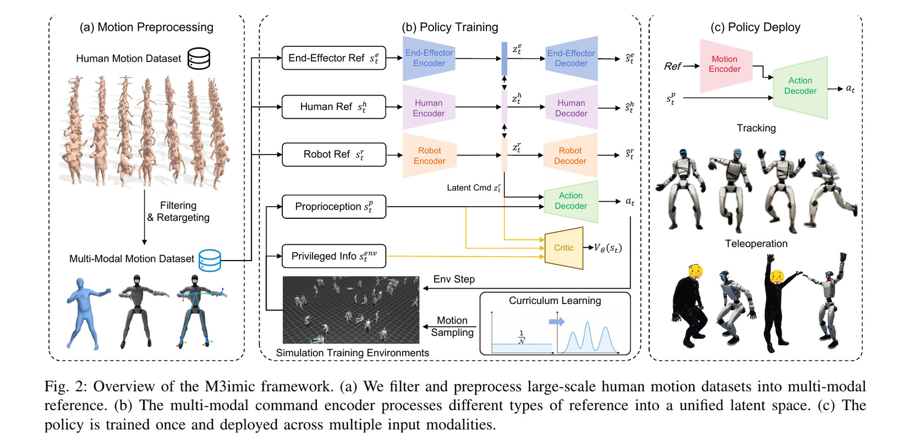
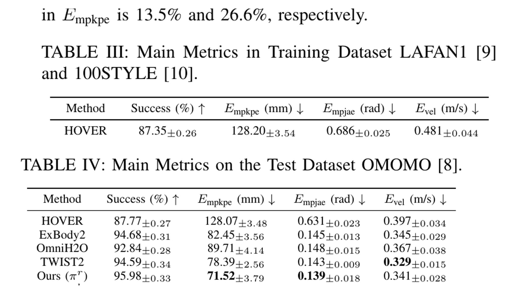
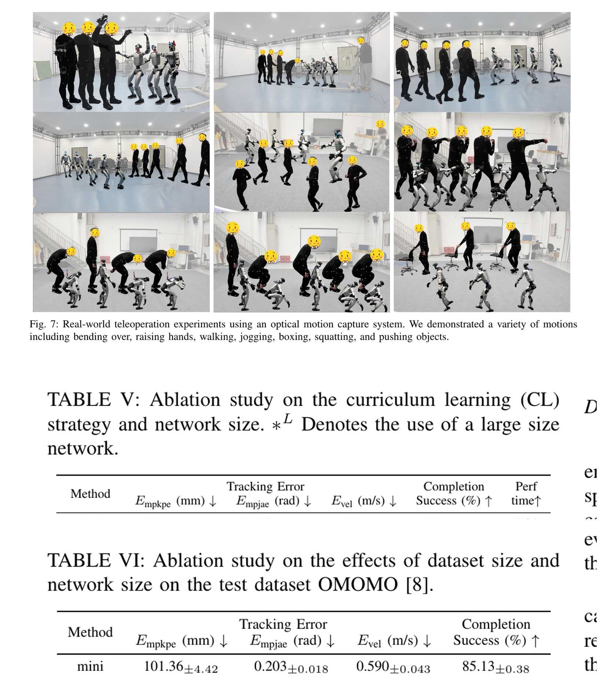

# M3imic：把三种动作条件压进共享潜在指令，但“统一”不等于每种输入都同样精确

[English version](en/m3imic-2606.04829v1.md)

来源：[arXiv:2606.04829v1](https://arxiv.org/abs/2606.04829v1) · [固定提交的官方代码](https://github.com/Renforce-Dynamics/MultiModalWBC/tree/1628d0e3c0e05b9e2ec95c141568bd8c3f480e51)

解读范围：完整 8 页论文、官方 MultiModalWBC 仓库中的 triple-AE actor-critic、PPO 损失、课程采样与 G1 配置。

> 一句话总结：M3imic 用模态专用编码器把机器人关节、SMPL-X 人体姿态和五个末端位姿压到 64 维共享潜在命令，使一个策略覆盖跟踪和遥操；不同模态仍存在精度—鲁棒性取舍，真机表格也没有提供足以证明长期可靠性的试验统计。

术语导航：多模态动作模仿（multimodal motion mimicking）、共享潜在空间（shared latent space）、模态专用编码器（modality-specific encoder）、非对称演员—评论家（asymmetric actor-critic）、本体感知（proprioception）、失败率指数滑动平均（failure-rate exponential moving average）、课程采样（curriculum sampling）与域外输入（out-of-distribution input, OOD）。

## 工程痛点

全身控制器常因上游接口不同而重复训练：动作库可能给机器人关节角，视频重建可能给人体骨架，遥操设备可能只给手脚和胸部位姿。为每种输入维护独立策略，会让奖励、随机化、安全门禁和部署代码不断分叉；但简单地把不同张量补零后拼接，又会让网络把“模态身份”与动作内容混在一起。

M3imic 的目标是让三类 reference 进入同一控制策略。三类专用 encoder 先把输入投影到共享 latent command，再由同一动作 decoder 控制机器人。中间语言若对齐得好，同一动作的关节、人形和末端描述应落在相近位置；若对齐失败，统一控制器只是把三个任务藏进同一权重文件。

工程上真正困难的是“信息不同”。29 维机器人关节参考精确描述每个目标关节，21 个 SMPL-X 关节的 6D 旋转需要跨骨架解释，五个末端的 SE(3) 位姿则没有肘膝等中间关节信息。一个控制器能接受三种输入，不代表这些输入拥有相同可观测性或能达到相同姿态精度。

## 核心洞察

论文为机器人、人类和末端三种模态分别设置编码器与解码器，将长度为 10、步距为 2 的短参考窗口映射到 64 维潜在向量。训练不仅用重构损失保证每种编码保留自身信息，还用对齐与一致性损失约束同一运动的跨模态表示。这样共享空间承担的是“未来一小段动作意图”，而不是当前帧姿态的简单降维。

控制采用非对称 actor-critic：actor 只看可部署的潜在命令与本体状态，不看全局根位置和线速度；critic 在训练时可看更完整的环境信息。训练期 critic 使用完整状态，而部署 actor 只依赖本体可观测量。它降低部署依赖，却不会自动解决状态估计偏差和参考延迟。

第三个洞察是用每条动作的失败率 EMA 调整采样概率，让难动作更多进入训练。课程不是按人工标签分级，而是根据策略当前失败动态改变。这能避免容易动作占满 batch，但也可能过度集中在噪声大或本就不可行的样本，因此失败统计、裁剪和最小采样概率必须一起审计。

## 方法主线

机器人参考为 29 维关节序列；人体参考把 21 个 SMPL-X 关节转为 6D 旋转；末端参考包含双手、双脚与胸部五个部位的根相对位置和 6D 朝向，共五组 9 维。每种编码器接收十个时刻、间隔两帧的短窗口，输出 64 维潜在命令，专用解码器重构原模态。

Equation 2 将策略目标与多模态自编码目标结合；重构、跨模态对齐和潜在一致性推动三种表示共享结构。actor 输入潜在命令与本体状态，输出关节动作；critic 额外读取根位置误差、人体 link 状态和线速度等特权信息。训练仍以 clipped PPO 为主，不是单纯监督学习。

动作预处理先过滤和重定向人体数据，构造彼此配对的机器人、SMPL-X 和末端描述。若配对或重定向本身带偏，潜在对齐会学习这个偏差。因而“一个 motion 有三种表示”的数据契约比网络结构更基础，必须保存原动作、重定向版本和每种 reference 的生成参数。

部署时只选择一种 reference 编码器，产生潜在命令并与本体状态一起进入共享 action decoder。三种入口共享控制躯干，但 reference encoder 不同；所谓 multimodal 指输入模态可切换，并不意味着传感器原始 RGB、语言或触觉直接输入。

## 关键图解

Figure 2 左侧是同一动作的三种 reference，中央三套 encoder/decoder 对齐到共享 latent，右侧同一个策略用于 tracking 与 teleoperation。图中 critic 的黄色特权分支只在训练使用；部署边界应以 actor 的可见字段为准，而不是把整张图的状态都当成实机输入。

Table III 报告主方法在训练分布上 99.54% 成功率并取得最低或接近最低的跟踪误差。Table IV 更关键：在未见 OMOMO 动作上，机器人关节策略保留较好精度，末端策略达到 98.42% 成功率但姿态细节较弱。它揭示 sparse end-effector command 的优势是容错与任务可达性，不是全身逐关节复现。

Figure 7 展示光学动捕驱动 G1 的遥操链路，Table V-VI 则检查课程、数据量和网络配置。真机表给出若干位置与姿态误差，但没有公开每个动作的总试次、连续时长、跌倒、急停或成功判据，因此只能支持“系统在展示条件下运行并有误差测量”，不能推出长期可靠率。

## 最有说服力的实验

最有说服力的是 Table III 与 Table IV 的组合：训练数据上的统一策略达到 99.54% 成功率，而未见 OMOMO 上不同模态形成可解释的 fidelity–robustness trade-off。比只展示成功视频更重要的是，论文承认末端输入缺少全身细节，因此能成功不等同于姿态最准确。

复现时应把“域外”拆成至少三类：同类新动作、未见动作类别和硬件/环境变化。论文的 OMOMO 更接近输入动作数据域变化，不足以代表执行器、延迟、地面或传感器 OOD。真机还应报告多次独立运行、持续时间、跌倒和急停，才能建立稳定性结论。

## 论文—代码映射

官方提交 `1628d0e3c0e05b9e2ec95c141568bd8c3f480e51` 中，`third_party/rsl_rl/rsl_rl/modules/actor_critic_triple_ae.py` 的 `ActorCritic_Triple_AE` 定义三套编码/解码与共享策略。`third_party/rsl_rl/rsl_rl/algorithms/triple_ae_ppo.py` 组合 PPO、重构、对齐和一致性损失，是 Equation 2 的实现入口。

`source/.../tasks/tracking/mdp/commands.py` 的 `_adaptive_sampling` 根据失败统计更新动作采样；`source/.../config/g1/agents/rsl_rl_ppo_cfg.py` 固定 latent 维度、encoder 参数与损失系数。复现应锁定这些配置及其上游数据生成脚本，并对每种 reference 导出输入窗口和 latent，检查配对误差。

## 局限与工程判断

作者实验显示不同模态的精度和鲁棒性不一致，并用 OMOMO 测未见动作。真机部分依赖光学动捕，表格主要给误差而缺少成功率、跌倒率、连续运行时长和样本数；因此作者证据边界停留在“可运行的多模态控制与若干误差对照”。

独立工程局限包括：共享 latent 可能发生模态塌缩或用模态标签走捷径；reference 配对错误会被对齐损失固化；短窗口在长时任务中缺少目标级记忆；末端输入对肘膝姿态欠约束；部署仍依赖准确的本体估计、时序同步和目标坐标变换。

硬件安全不能由 PPO termination 替代。光学动捕跳变、reference 模态切换和 latent 突变都应经过限速与平滑；关节位置、速度、力矩、电流、温度和机身姿态必须有控制器外的监测与急停。新模态上线前应先在仿真做输入异常和延迟注入。

## 可执行但有边界的结论

M3imic 值得借鉴的是“模态专用前端 + 可部署共享策略 + 动态难例采样”的接口设计。它能减少三套控制栈的重复维护，并让遥操、人体动作与机器人轨迹共享训练资产。

工程验收必须按模态分别报告精度、成功和故障。不能用关节模态的高保真为末端模态背书，也不能用末端模态的高成功率宣称全身动作被准确复现。共享权重只是软件复用证据，不是等价能力证据。

## 复现与验收清单

先锁定动作数据版本、人体到 G1 的重定向、五个末端坐标定义、采样频率、十步窗口与间隔。对同一动作保存三种 reference，并检查关节、人体与末端在世界/根坐标中的时间对齐。

训练阶段记录每种模态的重构误差、跨模态 latent 距离、动作失败 EMA 和实际采样概率。除总体成功率外，按速度、转身、下蹲、单足和上肢大幅动作分层，避免容易动作掩盖尾部失败。

部署阶段分别测试三种入口，再测试运行中受控切换。注入一帧跳变、持续偏置、延迟、丢帧和坐标旋转错误，观察动作限幅、恢复与终止。先悬挂验证符号和尺度，再低增益站立、系留慢动作，最后才扩展动态动作。

验收报告至少包含每模态的成功率、位置/姿态误差、足滑、关节饱和、跌倒、急停、连续运行时长和失败动作列表。只要这些指标按模态分开，M3imic 的共享潜在空间才真正成为可审计接口。

还要专门检查共享空间是否真的跨模态对齐。固定一批动作，计算三种编码的近邻一致率，并做交叉解码：用人体编码进入机器人解码器、用末端编码寻找最接近的机器人参考。若同一动作的潜在向量相距很远，但策略仍靠编码器特有偏置完成任务，就只能称为多头共享网络，不能称为语义统一空间。

模态切换必须定义状态机。实际遥操中可能从动作库切到人体姿态，再切到末端控制；若直接替换潜在命令，动作解码器会看到不连续输入。可以在切换前比较距离，超过阈值时先回到安全站姿或使用有限时间插值，并在过渡期间降低速度和动作幅度。

失败课程还需要防止“不可学样本”垄断。对持续高失败且重定向检查不通过的动作，应从训练难例池转入数据修复队列；对物理可行但暂时困难的动作才提高概率。每轮训练保存采样分布和被裁剪概率，才能区分算法改进与数据分布变化。

若面向其他机器人，不能只替换关节数。人体与末端模态看似形态无关，最终动作解码器、关节范围、躯干比例和接触几何仍绑定 G1。迁移应先重新建立三模态配对数据，再验证共享空间是否保留原语义，而不是默认 64 维向量天然跨机器人。

这些检查应形成自动报告并随权重发布，方便版本间直接比较。

> **工程判断**：统一控制器最重要的不是把入口藏起来，而是让每个入口的能力边界仍然可见。
