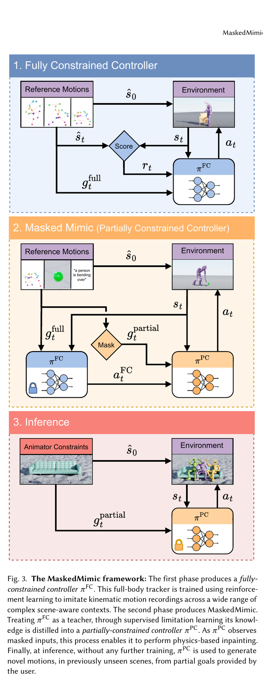
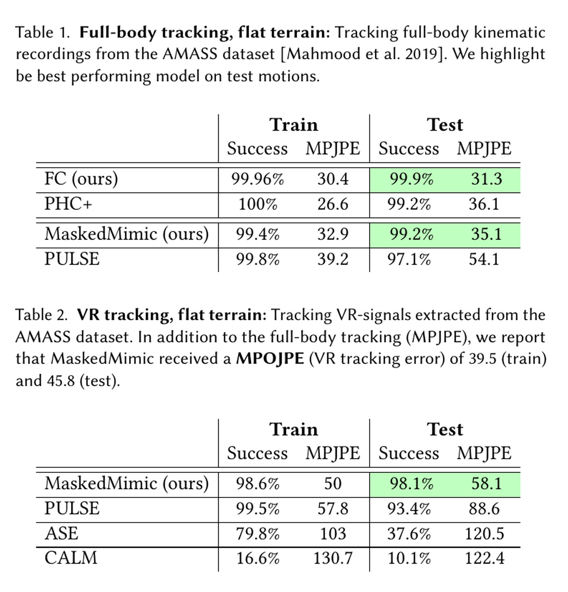
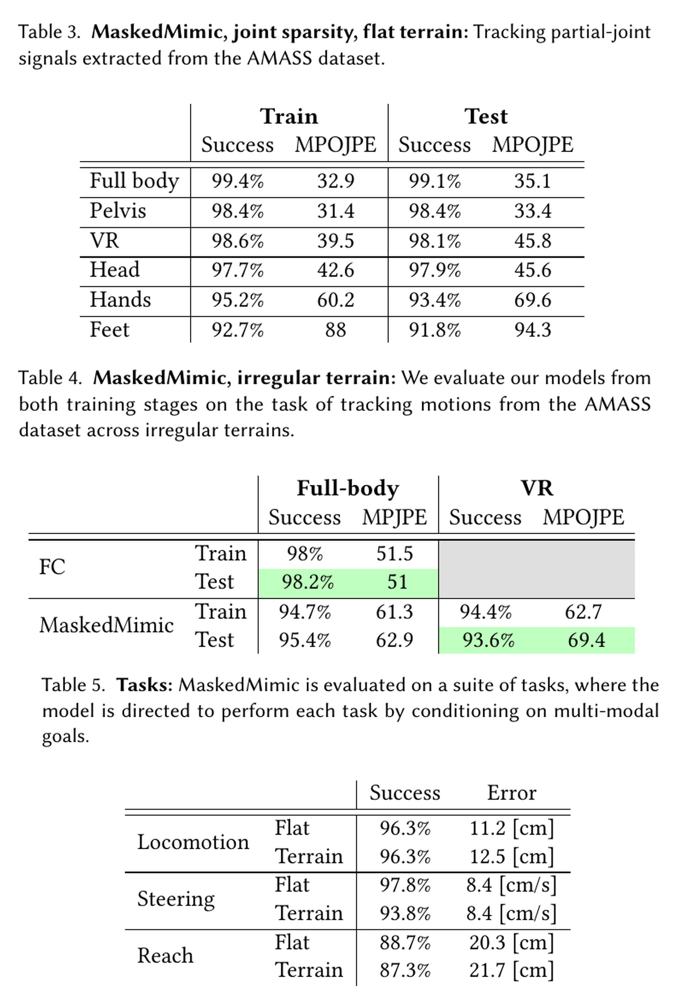

# MaskedMimic：用随机遮罩把多种动作控制统一成物理补全

[English version](en/maskedmimic-2409.14393v1.md)

来源：[arXiv:2409.14393v1](https://arxiv.org/abs/2409.14393v1) · [ProtoMotions 官方实现固定提交](https://github.com/NVlabs/ProtoMotions/tree/5241478e35a7dcf5d1455dac2df0486d5e7f440a)

解读范围：完整 22 页论文与附录、官方 ProtoMotions 固定提交；本页只保存原创分析、图表定位与代码链接，不重分发论文全文、数据或权重。

> 一句话结论：MaskedMimic 先用强化学习训练看到完整未来动作的全约束跟踪教师，再用 DAgger 将教师动作蒸馏给只看随机遮罩目标的学生；一个学生因此能接受全身轨迹、VR 头手、任意关节关键帧、文本和物体等部分约束。它统一的是控制接口，不是已经解决长时规划、任意地形或真实人形机器人部署。

术语导航：物理动作补全（physics-based motion inpainting）、全约束控制器（fully-constrained controller）、部分约束目标（partially-constrained goal）、结构化遮罩（structured masking）、条件变分自编码器（conditional VAE）、学习先验（learned prior）、在线数据聚合（DAgger）、目标工程（goal engineering）、轨迹跟踪（motion tracking）、根坐标规范化（root-frame canonicalization）。

## 工程痛点

传统物理动画控制器往往“一种输入一个模型”：全身模仿、VR 稀疏跟踪、指定某只手到位、文本生成和坐椅子分别训练。每增加一种传感器组合或漏失模态，就需新建任务、奖励和策略；系统的代码与数据边界随之分裂。

MaskedMimic 把这些输入重写成同一个问题：给定动作时间线上部分可见的关节、关键帧或语义条件，补全剩余全身动作，同时在物理仿真中保持平衡和接触。训练时随机遮蔽条件，推理时便能处理不同可见关节和时间约束。

## 方法主线：先学动力学动作，再学不完整条件

第一阶段的 `πFC` 看到完整未来姿态序列、当前角色状态和地形/物体高度图，通过强化学习输出 PD 目标并跟踪动捕。它的任务是把运动学参考转为能在仿真中执行的动作，并用优先采样更多训练失败率高的动作。这一阶段不靠遮罩解决跟踪难题，而是先建立强教师。

第二阶段的 `πPC` 只看部分目标。训练系统从真实动作序列中随机选择哪些时刻、哪些身体位和位置/旋转分量可见，再让学生模仿教师在学生自己访问到的状态上给出的动作。DAgger 很关键：若只在教师轨迹上监督，学生的小误差会把状态带到训练集外，之后误差累积。

学生使用 conditional VAE：encoder 训练时同时看完整目标和部分条件，learned prior 只看部分条件；encoder 作为 prior 的残差来表示某个确切答案。推理时丢弃 encoder，从 prior 采样 latent，因此同一稀疏条件可以有多个合理的全身解。这像导航只给出终点而不锁定道路：prior 提供可能路径分布，而不是硬把所有未观测关节压成唯一均值。

结构化遮罩不是独立 Bernoulli 丢帧。论文设计了时间上保持一段的可见模式、任意关节的位置/旋转控制、近期与远期关键帧，以及全身、VR 等特定结构。这使训练分布覆盖推理时真正会出现的输入；若只随机掉单个数值，模型不会自然学会“只有头和手”的完整 VR 模式。

文本和物体不直接变成关节奖励。文本用预训练嵌入成为条件，物体交互依赖数据中带场景的动作和物体表示。论文的 goal engineering 再用简单 FSM 切换方向、文本和物体目标；所以“无任务专用训练”不等于“无任务逻辑”。

## 关键图解

Figure 3 将两个问题分开：上半部分用 RL 把完整运动学动作落到物理控制，下半部分才遮罩条件并蒸馏。图中的 score/环境闭环只属于教师训练；学生主要学教师动作，不能把整个系统简写成一次端到端稀疏奖励 RL。

Table 1 中 MaskedMimic 在 AMASS 测试分割全身跟踪成功率 99.2%、MPJPE 35.1 mm；Table 2 给出 VR 头手稀疏信号结果，用统一模型对比任务专用方法。数字支持同一控制器可处理两种条件密度，但评估仍是仿真角色，不含真实 VR 传感器丢帧和机器人域迁移。

Table 3-5 把“统一”拆成可验证维度：可见关节减少后的误差，不规则地形上的跟踪，以及 joystick、reach、path following 等目标工程任务。它们证明接口可复用；不证明模型能从自然语言自主分解任意长任务。

## 最有说服力的实验

对首页路线选择最有价值的不是单个任务的视频，而是同一权重在全身、VR、任意关节和地形上的定量表。这直接支持“遮罩训练形成通用部分条件接口”的主张，而不只是模型能生成好看动作。

物体坐下任务的 Table 6 是关键消融：完整方法成功率 96.9%，去掉 residual prior 降到 21.1%，去掉 structured masking 降到 0%。这说明变分结构和遮罩分布是方法实体，不是可随意替换的数据增强。去掉 history 的退化较小但仍可见，对应从静止状态卡住的问题。

文本对照反而给出清晰边界：“salute”、“kick”等原子指令可生成，“走四步后举手”这类长程时序指令会困难。作者将其归因于观测历史较短。这是比一张成功生成图更有用的工程信息：接口多模态，不代表已有长时任务记忆。

论文附录给出约 300 亿环境步的全约束教师训练和约 100 亿步的部分约束学生训练量级。这个数字必须和统一模型的覆盖并列阅读：它不是用少量蒸馏便宜地代替一组任务策略，而是用大规模跟踪和遮罩数据将多个接口的成本前置。项目评估时应比较总训练步数、环境数、教师建设和数据准备，不只比较最终权重个数。

输入条件还有“可见”与“可信”的差别。论文中的 mask 主要表示目标是否提供，已提供的关键点则被当作正确条件。真实设备会出现目标存在但带偏置、时间戳错位或左右识别交换的情况；模型可能忠实跟随错条件，而不是像处理 mask 一样自动忽略。所以部署管线需要质量分数、超时和异常值拒绝，不应把所有感知故障都委托给训练时遮罩。

对多解性的验收也不能只用“样本不同”。从 prior 采样多个 latent 后，应分别检查条件满足误差、动作间距、接触可行性和失败率。如果多个结果只是手臂小抖动，不是有意义的多样性；如果差异很大却频繁违反已给关键帧，则是条件控制不足。这两类指标应和成功率一起保存，才能判断 VAE 是扩展合理解集，还是只增加输出方差。

## 论文—代码映射

| 论文组件 | 固定提交位置 | 对应事实 |
|---|---|---|
| 遮罩时间线 | [`MaskedMimicControl._shift_and_sample_body_masks`](https://github.com/NVlabs/ProtoMotions/blob/5241478e35a7dcf5d1455dac2df0486d5e7f440a/protomotions/envs/control/masked_mimic_control.py) | 前移现有关键帧遮罩，在新时间位采样条件 |
| 结构化身体遮罩 | `MaskedMimicControl._sample_body_masks` 与 `_sample_new_body_masks` | 依配置采样可见身体数、位置/旋转可见性及特定模式 |
| VAE 学生 | [`MaskedMimicModel`](https://github.com/NVlabs/ProtoMotions/blob/5241478e35a7dcf5d1455dac2df0486d5e7f440a/protomotions/agents/supervised/masked_mimic_model.py) | 组合 prior、encoder、latent 及动作预测 |
| 可调试观测契约 | [`protomotions/envs/obs/masked_mimic.py`](https://github.com/NVlabs/ProtoMotions/blob/5241478e35a7dcf5d1455dac2df0486d5e7f440a/protomotions/envs/obs/masked_mimic.py) | 构造稀疏未来姿态、历史和条件可见标记 |

固定提交中还有 `test_masked_mimic_model.py`、`test_masked_mimic_supervised_loss.py` 与 control component tests，说明模型形状、损失和遮罩采样可独立回归。但官方开源代码依赖配置、数据处理和大规模训练资源；“有代码”不等于用默认命令就能复刻论文所有表格。

## 适用边界与局限

作者明确列出三类局限：部分动作会抖动，后空翻和 breakdance 等难动作仍无法完整复刻；不规则地形更倾向复制普通行走，没有学到人类式长时落脚规划；复杂任务的 goal engineering 仍需人工，且尚未覆盖动态场景、移动物体和多智能体交互。

独立工程判断是：随机遮罩只能覆盖你显式定义的缺失分布。若部署会出现持续传感器偏置、延迟抖动或整段失联，而训练只遮住理想关节 token，统一模型仍会分布外失败。遮罩 manifest 应像传感器故障注入一样版本化。

另一个容易忽略的失败是条件互相矛盾，例如文本要求向前行走，但远期骨盆关键帧在身后，或手的位置与物体几何不可同时满足。论文展示了灵活组合，却没有提供一个对任意矛盾条件输出不可行证明的求解器。接口层应先做几何一致性检查，并在无解时明确降级或拒绝，而不是将模型生成的任何折中动作视为有效。

更重要的边界是论文对象为物理仿真角色，不是真实人形机器人。角色 PD、关节能力、地形感知与动作数据都不包含真机的执行器延迟、力矩限幅、基座估计和碰撞安全证据。不能把动画中的“物理可行”直接替换为机器人的“硬件可执行”。

## 可执行但有边界的结论

若项目需要多种稀疏跟踪接口，最先借鉴的应是“完整目标教师—部分目标学生”分层和可版本化遮罩分布。先确保教师在动作集上的失败密度可接受，再蒸馏；否则学生会在输入信息更少的同时继承教师失败。

统一模型的回归测试不能只混成一个平均成功率。应以“模态×稀疏度×时间延迟×地形”建矩阵，并单列失败动作类。一个全身跟踪的高分不能掩盖只观测头手时的足滑或长指令失效。

为了让结果可定位，每个失败样本应同时保存原始条件、mask bitmap、采样 latent、教师动作和学生执行状态。只保存最终动画，无法区分是输入条件矛盾、prior 采样异常、蒸馏误差还是 PD 执行失败。这些中间量才是统一控制器的最小调试记录。

## 复现与验收清单

锁定训练/测试动作划分、场景数据、重定向、教师版本、优先采样、DAgger rollout、遮罩配置、历史/关键帧长度、VAE/KL 调度、PD 和随机种子。至少做无 structured masking、无 residual prior、无 history、无 VAE 四组消融，且在同一测试集上报成功率、MPJPE/MPOJPE、足接触与失败类型。

代码验收先运行官方模型、监督损失和遮罩组件测试，再用小动作集统计每种 mask pattern 的实际频率。配置中写了 20% VR 模式并不代表采样后一定是 20%；时间掩码、episode reset 和条件分支会改变有效分布。

若尝试机器人迁移，必须另建机器人可行动作筛选、延迟/观测故障遮罩、动力学随机化、状态估计、力矩/速度/关节限制、接触检查和急停。论文结果可作为多模态控制架构证据，不是实机安全证书。

> **工程判断**：MaskedMimic 的核心不是“一个大模型会所有动作”，而是用可审计、可回归和可版本化的遮罩分布，把多种控制输入稳定收敛为同一个部分条件接口，并让每次失败可以追回具体条件。
