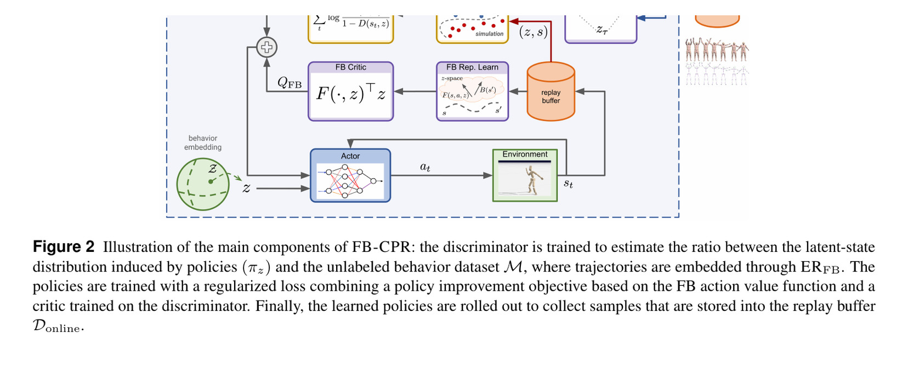
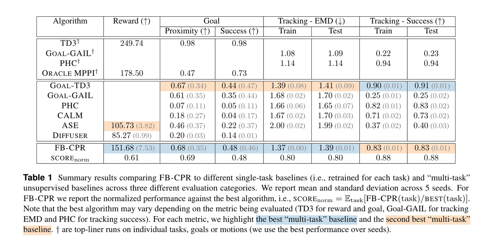
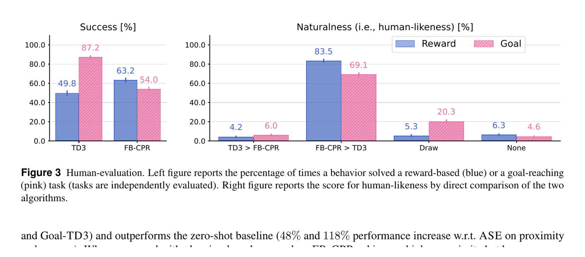
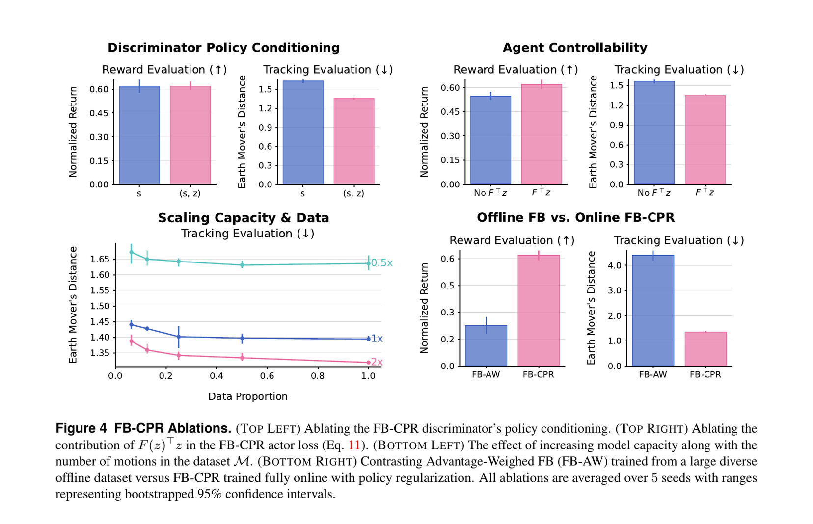

# Meta Motivo：从无动作标注动捕训练 zero-shot 行为基础模型，离人形实机还有多远

[English version](en/meta-motivo-2504.11054.md)

来源：[arXiv:2504.11054](https://arxiv.org/abs/2504.11054) · [固定提交的官方代码](https://github.com/facebookresearch/metamotivo/tree/ff8dcc55cf58f766d365ab0be23a021a7e34d53d)

解读范围：完整 55 页论文、附录和参考文献，以及官方 FB-CPR agent、forward-backward 推断与 HumEnv benchmark wrapper。

> 一句话总结：Meta Motivo 的 FB-CPR 把无动作标注的 AMASS 动捕与在线交互结合，学习可用奖励、目标状态或参考动作在测试时直接推断的潜在任务；它在 MuJoCo SMPL 人体上覆盖多类 zero-shot 任务，却没有机器人执行器、真实传感或硬件证据。

术语导航：行为基础模型（behavioral foundation model）、前向—后向表示（forward-backward representation, FB）、连续占用测度（successor measure）、条件策略正则化（conditional policy regularization, CPR）、无动作标注动作数据（action-free motion data）、零样本推断（zero-shot inference）、占用分布（occupancy distribution）与目标状态推断（goal-state inference）。

## 工程痛点

传统强化学习通常为每个 reward、目标或动作片段重新训练。若用户今天想跑向一个点、明天想模仿一段动作、后天改变 reward，控制器需要新的优化或规划。行为基础模型希望把大量动作先验和交互经验压进一个策略，使下游任务通过一个 latent `z` 在测试时定义。

动捕数据规模大，却通常没有施加在仿真人体上的 action。仅做 behavior cloning 不知道哪些控制产生动作；仅用在线 RL 又难以覆盖人类动作分布。数据只包含状态轨迹而没有产生轨迹的控制 action：模型既要从录像学习“哪些状态像人”，又要靠交互学会“怎样控制到那里”。

Meta Motivo 还试图统一三类接口：用户给 reward、给 goal state 或给 motion trajectory。统一能力的关键不是用同一网络名称，而是 latent 是否能在这些任务间复用 successor dynamics，并让策略访问与人类数据相近的状态占用。

## 核心洞察

forward-backward 表示把策略的 successor measure 近似为低秩内积。前向网络 `F(s,a,z)` 描述在 latent 条件下从当前状态动作出发的未来占用，后向网络 `B(s)` 为状态提供基向量。给定 reward，可将数据状态的 reward 加权后向特征聚合成 `z`，无需重新训练策略。

仅有 FB 可能学会到达状态，却不保证动作像人。CPR 增加 latent-conditioned discriminator，区分 motion dataset 与策略占用，并估计密度比；critic 与 actor 同时结合 FB 回报和 discriminator 回报。任务目标决定到达状态，判别器约束占用分布接近人类动作数据。

训练的 `z` 不是单一来源：论文约 60% 从专家动作编码，20% 从在线目标状态，20% 均匀采样。混合让模型既覆盖动作流形，也探索新任务。latent 维度 256，训练约 3000 万环境步；深模型扩到约 288M 参数只带来有限提升，说明数据与目标可能比纯容量更关键。

## 方法主线

环境是 MuJoCo 中的 SMPL 模拟人体，状态约 358 维、动作 69 维，物理 450 Hz、控制 30 Hz。训练集来自 AMASS 的 8,902 个动作，约 29 小时；测试 990 个动作，约 3 小时。动作数据只提供状态序列，没有仿真 action。

ERFB 从动作数据编码 expert latent；online goal 与 uniform latent 补覆盖。FB critic 学习未来占用低秩结构，actor 最大化对应价值。CPR discriminator 在 `z` 条件下估计 motion/agent 状态的密度关系，并作为正则回报加入更新。Equation 7–11 给出这种联合目标。

测试时，reward inference 将 reward 加权的 `B(s)` 聚合为 latent；goal inference 用目标状态的后向特征；tracking inference 根据参考序列构造时变或聚合命令。策略随后在不更新权重的情况下执行 reward optimization、goal reaching 或 motion tracking。

“zero-shot”指测试任务不再梯度训练，不指系统不使用任务样本或参考状态。reward 推断仍需能计算 reward 的状态，tracking 仍需参考动作，goal 仍需目标状态。接口成本应与能力一起说明。

## 关键图解

Figure 2 与 Equation 7–11 展示 FB dynamics objective 和条件 discriminator 如何共同更新 actor。图中的 motion dataset 不包含 action，因此 discriminator 主要约束占用外观，真正的可控性来自在线交互学到的 F 与策略。

Table 1 报 reward、goal 和 tracking。FB-CPR 的归一化 reward 0.61，goal proximity 0.69、success 0.48，tracking EMD 0.80、test success 0.88。它并非每项胜过重训单任务 top-line，而是在无需任务重训的前提下取得其一部分性能。

Figure 3 由 50 名评估者比较 FB-CPR 与单任务 TD3，在 reward 与 goal 场景中更常被判断为人类化，约为 83% 和 69%。人类偏好补充了数值 reward，但受视频选择、展示角度和题目设计影响，不是动力学安全指标。

Figure 4 检查 discriminator 条件化、FB 目标、数据、网络容量和在线训练。它说明 CPR 不能脱离 FB controllability 单独理解，也说明更大模型收益有限。复现应优先对齐数据、采样和目标，再讨论参数规模。

## 最有说服力的实验

最强证据是 Table 1 横跨 reward、goal、tracking 的统一评测，并区分单任务 top-line 与多任务/无监督基线。模型在测试动作跟踪达到 83% 报告成功率（表中归一口径为 0.88），同时 goal 与 reward 不需要重新学习，这支持“一个 latent 接口覆盖多类任务”。

但环境仍是仿真 SMPL 人体。论文没有机器人几何、执行器、state estimator、接触传感、延迟或真实硬件。MPPI 等规划基线计算预算也不同：文中 oracle MPPI 一段 episode 约 30 分钟，FB-CPR 整体推断与 rollout 约十余秒，比较应按计算预算解释。

## 论文—代码映射

官方提交 `ff8dcc55cf58f766d365ab0be23a021a7e34d53d` 中，`metamotivo/fb_cpr/agent.py::FBcprAgent` 组织 `sample_mixed_z`、`encode_expert`、`update_discriminator` 与 actor/critic 更新，对应 expert/goal/uniform latent 混合和 CPR 目标。

`metamotivo/fb/model.py` 的 `reward_inference`、`goal_inference`、`tracking_inference` 对应三种 zero-shot 接口。`metamotivo/wrappers/humenvbench.py` 适配 HumEnv benchmark。复现需锁定 HumEnv、AMASS 处理、SMPL 资产、MuJoCo 与评测任务，代码 checkpoint 本身不能重建数据许可链。

## 局限与工程判断

作者明确列出理论缺口、地面动作与摔倒/起身表现差、偶发不自然行为、仅本体感知、没有导航和物体交互、动捕成本高、也没有语言接口。论文把这些视为行为基础模型向更通用系统扩展的主要方向。

独立工程局限是：SMPL actuator 与真实人形电机差异巨大；无动作标注数据只能约束状态占用，不能提供真实能耗和接触力；人类偏好可能奖励视觉流畅却忽视足滑；zero-shot latent 在分布外 reward 上没有安全保证；测试成功阈值也未对应硬件可接受误差。

若迁移到人形机器人，应先 retarget 并训练机器人 tracker，再让高层 latent 只给受限参考或目标，不能直接输出 69 维 SMPL action。机器人侧需要关节、力矩、接触和自碰撞约束，以及跌倒恢复和控制器外急停。

## 可执行但有边界的结论

Meta Motivo 的差异化价值是将 reward、goal、tracking 变成同一行为表示上的推断问题，并用 action-free motion data 约束占用风格。它适合作为动作生成和高层意图研究锚点。

它不是现成的人形 WBC。要进入机器人栈，需要显式的形态适配、低层动态跟踪与安全过滤，并重新验证每类任务。仿真人体上的 zero-shot 不应直接改写为机器人真机 zero-shot。

## 复现与验收清单

锁定 AMASS 许可与处理列表、训练/测试拆分、SMPL 资产、HumEnv、MuJoCo、官方提交和随机种子。核对 8,902/990 动作与 29h/3h 时长，保存被过滤动作原因。

分别复现 reward、goal、tracking，并报告每任务的输入构造时间、策略 rollout 时间、成功阈值和失败分布。对 expert/goal/uniform 的 60/20/20 混合、discriminator 条件化、在线数据和模型容量做消融。

机器人迁移先在仿真完成 retarget feasible yield、足滑、碰撞、力矩和 tracking；再把 latent 转成有限参考，不直接控制电机。硬件从静态目标、慢速跟踪到复杂动作分级，报告跌倒、急停、饱和与不自然行为。

统一评测还应防止三类任务使用不同难度却被一个平均分合并。奖励任务按函数族、目标任务按距离与姿态差、跟踪任务按动作速度和接触类型分层；每层公布成功分布和最差样本。行为基础模型的价值在长尾覆盖，不能由大量简单站立或短动作抬高平均。

对奖励推断，必须记录用于构造潜在任务的状态样本来自哪里、数量多少以及是否覆盖高奖励区域。如果推断阶段先用大量环境交互搜索高奖励状态，“零样本”仍然没有梯度更新，却消耗了显著任务交互。把数据构造成本和策略执行成本分开报告，才能公平比较规划与重训练方法。

对目标推断，要测试目标是否位于训练占用分布内。一个视觉上合理但动力学不可达的状态可能生成极端指令，策略随后以不自然动作逼近。可以在进入策略前使用后向特征密度或重建误差作为分布外指标，并为低置信目标选择拒绝或投影。

对动作跟踪，参考序列的时间尺度、根轨迹和接触若与模拟人体不一致，成功阈值可能只反映局部姿态。报告逐关节误差之外，还应包含根漂移、脚滑、接触时序和动作完成率。人类评估视频也应随机化视角并包含失败样本，避免只评价最顺滑片段。

从模拟人体迁移到机器人时，高层表示应只生成候选，再交给有约束的重定向和低层控制器；直接映射到电机会把形态和执行器差异全部压给一个未经验证的缩放。

动作数据的许可与可追溯性也属于复现。AMASS 汇集多个子数据集，研究许可、人物隐私和再分发条件可能不同。模型发布应保存数据清单与过滤规则，不在仓库中隐式复制受限资产；否则代码可运行也无法合法重建训练语料。

若基础模型作为长期项目组件，新增动作或在线数据后必须重跑旧任务回归，特别是摔倒、起身和地面动作等作者已知弱项。容量扩大不应成为绕过失败分析的默认答案；先确认数据是否包含对应行为、目标是否提供学习信号、评测是否能看见改善。

部署前应建立潜在指令的允许域。仅接受由已验证奖励、目标或动作生成且通过密度检查的指令；对任意外部输入先投影、限幅或拒绝。每次推断保存输入、生成方式、置信度和执行结果，出现异常时能够追溯到目标构造，而不是把所有责任归给策略。

统一策略还需要明确能力目录。对每类任务列出已验证状态范围、持续时间、接触类型与失败恢复能力，用户选择目标时先检查是否在目录内。没有目录的通用模型很容易被名称诱导到未测场景；有边界的能力表反而更接近可用工程组件。

对地面动作和起身这些已知弱项，可先建立专门数据与评测，而不是只把更多普通走跑片段加入训练。收集失败状态、低高度接触和恢复转移，检查判别器是否错误排斥必要的非直立姿态，再决定是否调整数据、目标或模型。

最终，机器人版本需要把视觉“像人”和物理“可执行”拆成两套指标。前者可用动作分布与盲评，后者必须测接触、足滑、关节与力矩裕量。只有两套同时通过，才可以把基础行为先验升级为机器人技能。

> **工程判断**：行为基础模型能把“想做什么”统一成 latent，但“机器人能否安全做到”仍是另一层控制问题。
