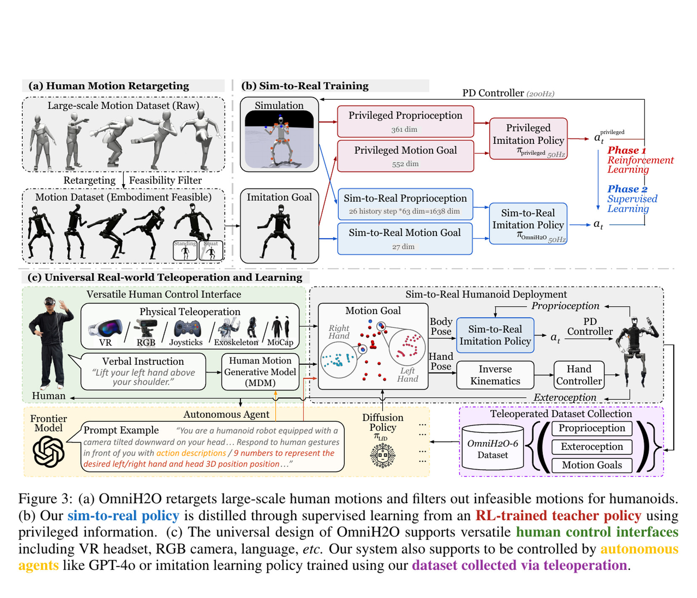
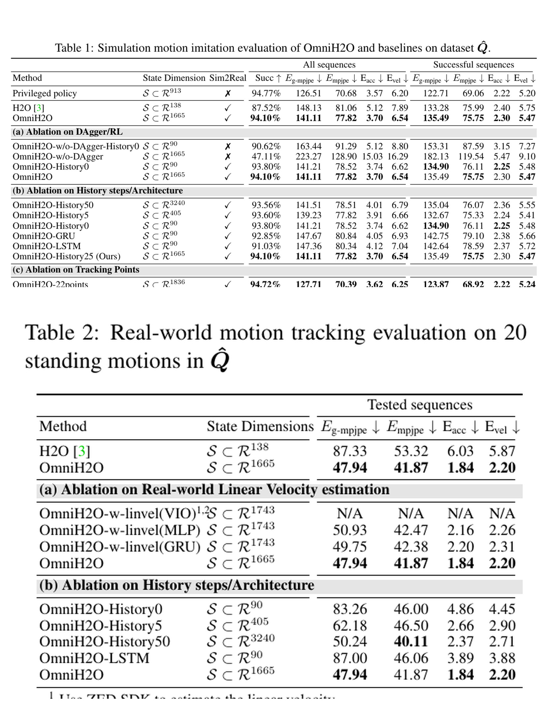
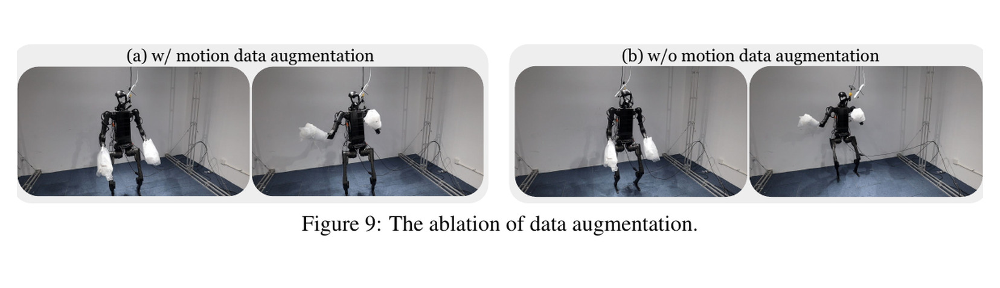

# OmniH2O：用历史与教师蒸馏把稀疏人体目标变成可部署的全身控制

[English version](en/omnih2o-2406.08858v1.md)

来源：[arXiv:2406.08858v1](https://arxiv.org/abs/2406.08858v1) · [版本固定的官方代码](https://github.com/LeCAR-Lab/human2humanoid/tree/750f1fa052641f0fde43669d50cb4e407dabe6c8)

解读范围：完整 25 页正文与附录 A-M；本文只保存原创分析、定位信息和链接，不保存论文全文或代码。

> 一句话总结：OmniH2O 用“完整状态教师 + 稀疏头手目标 + 长历史学生”的蒸馏链，把三点遥操从动作演示变成可在 H1 上部署的全身控制接口。

术语导航：稀疏关键点遥操（sparse-keypoint teleoperation）只给头与双手目标，特权教师（privileged teacher）在仿真中使用完整状态，学生策略（student policy）只看可部署观测。数据集聚合（Dataset Aggregation, DAgger）、部分可观测性（partial observability）、本体历史（proprioceptive history）、运动学重定向（kinematic retargeting）与零样本仿真到现实迁移（zero-shot sim-to-real transfer）是读这篇论文的六个关键词。

## 工程痛点

全身遥操作同时面对三个矛盾：人和机器人形态不同；VR 设备通常只稳定提供头和双手三个目标；仿真里容易得到的全身速度与状态，实机上往往噪声大或根本不可得。只追速度的下肢策略也难以在操作时自动协调躯干、手臂和支撑脚。

OmniH2O 的核心不是一种新的低级控制器，而是把“人体/上层意图”与“机器人关节动作”之间固定成运动学姿态接口，再通过特权教师把仿真信息压缩进可部署学生策略。

三个关键点像木偶的三根提线：它们能告诉系统手和头要去哪里，却没有唯一决定骨盆、膝盖和支撑脚如何配合。放在有接触和平衡约束的人形机器人上，这不是普通的插值问题，而是一个需要动作先验来消除歧义的闭环控制问题。

## 核心洞察

论文最关键的拆分是：先让教师在完整状态下学会“这个全身动作怎样才能不摔倒”，再让学生回答“只看三个目标和历史时，如何近似教师”。这避免了稀疏目标 RL 同时搜索全身协调与隐状态估计的双重难题。

第二个洞察是历史不能脱离教师监督单独起作用。Table 1 中“有长历史但不用 DAgger”的显著下降，表明历史像一段黑匣行车记录仪：它包含速度与趋势线索，但没有正确的行为标签时，网络不会自动知道应该读出什么。

## 方法主线：输入 → 处理 → 输出

输入是三个头/手位置目标，以及实机可测的关节位置、关节速度、基座角速度、重力方向和上一动作历史。处理分为五步：

1. 把 AMASS 人体运动重定向到 H1，并添加固定下肢的站立/下蹲变体，避免训练分布只教会“不断挪步”。
2. 在仿真中用完整刚体位置、旋转和速度训练特权 RL 教师。
3. 用稀疏目标和 25 步本体感知/动作历史运行学生，让学生访问自己实际会到达的状态。
4. 在这些状态上查询教师动作，以 DAgger 方式最小化学生动作与教师动作的差异。
5. 学生输出 19 个目标关节角，由下层 PD 回路执行；手指和腕部另走逆运动学/低级控制链。

为什么可能有效：历史提供了状态变化线索，使策略可以隐式推断运动趋势；特权教师降低了长历史、高维输入直接用 RL 探索的难度；站立/下蹲数据补齐了操作场景所需的“下肢保持稳定”分布。

## 公式与状态空间

论文把控制写成目标条件 MDP，策略动作是关节目标角。运动学目标由各关节三维旋转与位置构成；部署时只使用头和双手三个位置目标。

学生的单步输入维数为 90：19 维关节位置、19 维关节速度、3 维基座角速度、3 维重力、27 维运动目标和 19 维上一动作。历史部分每步 63 维，不再包含当前运动目标；25 步历史加当前步得到 1665 维。这个维数关系在附录 Table 6 与公开训练配置中相互对应。

蒸馏目标是教师动作与学生动作之间的动作空间距离。论文写成平方 L2，公开实现的 `PPO._optimize_kin` 使用批量动作范数作为训练损失；两者表达同一教师动作监督意图，但数值归约方式应以所使用的具体代码版本为准。

## 关键图解

Figure 3 把“数据问题”和“控制问题”连在一起。固定下肢的站立/下蹲变体先补足操作场景的运动分布；特权教师再把这些全身动作变成物理可跟踪的行为；最后学生才从稀疏目标与历史中恢复这种行为。因而图中每个箭头都是一个可独立测试的误差边界。

- Figure 2：原始重定向运动之外，增加站立与下蹲版本。它解释了数据分布如何直接服务“操作时下肢别乱动”这一工程目标。
- Figure 3：把重定向/过滤、特权 RL 教师、监督蒸馏、50 Hz 策略、200 Hz PD、遥操作数据采集和自主策略串成一条系统链，是理解整篇论文最重要的图。
- Table 1：仿真 14k 序列上，学生成功率为 94.10%，接近特权教师的 94.77%，高于 H2O 的 87.52%；带长历史但不使用 DAgger 的变体只有 47.11%，说明“历史本身”并不足够。
- Table 2：20 条实机站立动作上，无显式线速度的版本在全局 MPJPE、局部 MPJPE、加速度误差和速度误差上分别为 47.94、41.87、1.84、2.20；均优于论文测试的 VIO、MLP、GRU 线速度输入方案。VIO 方案因机器人跌倒未完成测试，这是很重要的负面结果。
- Table 15/16：奖励由关节/刚体跟踪、动作平滑、接触、限位等部分组成，并配合逐步提高惩罚权重的课程；域随机化覆盖摩擦、质量、质心、PD、力矩扰动、延迟、外推和地形。这里的数值是论文特定 H1 配置，不应直接搬到其他机器人。
- Figure 9：未加入固定下肢运动分布时，策略难以原地站稳并完成上肢动作；它提供了数据配比设计的直观消融证据，但没有像 Table 1/2 那样给出完整数值统计。

Table 1 与 Table 2 回答了两个不同问题：前者检验学生有没有保留教师能力，后者检验无显式全局线速度的观测设计能否在实机上更稳。两表不能合并成一个“综合精度”，因为一个策略可以很少跌倒，却仍在本地姿态上偏离目标。

Figure 9 的信息不是“多加一些数据就会更好”，而是数据中的支撑策略要与下游任务匹配。如果训练运动几乎总在移动，策略会把“上肢有动作”与“下肢应该踏步”错误绑定。固定下肢变体实际在训练一个重要的负例：手在动时，脚也可以不动。

## 最有说服力的实验

Table 2 最关键，因为它直接检验了部署时最容易踩坑的选择：是否值得依赖显式全局线速度。它不仅比较 H2O，还比较 VIO 与两个神经估计器，并保留了 VIO 跌倒这一失败结果。结论应严格表述为“在该 H1 设置和 20 条站立动作中，无线速度输入的 25 步历史学生更好”，不能扩写成“历史在所有机器人上都比状态估计更好”。

复现时最值得增加的不是另一个平均误差，而是按动作速度、支撑模式、遮挡和长历史断流分层报告。这样才能区分改善来自隐速度估计、动作先验，还是测试集里站立动作占比较高。

## 论文—代码映射

以下仅给出定位，不复制实现：

| 论文组件 | 代码位置 | 对应关系 |
|---|---|---|
| 特权教师产生动作标签 | [`LeggedRobot.load_expert` / `LeggedRobot.step`](https://github.com/LeCAR-Lab/human2humanoid/blob/750f1fa052641f0fde43669d50cb4e407dabe6c8/legged_gym/legged_gym/envs/base/legged_robot.py) | 加载教师，在学生访问的状态上计算教师动作并写入训练信息 |
| 25 步历史 | [`LeggedRobot.step`](https://github.com/LeCAR-Lab/human2humanoid/blob/750f1fa052641f0fde43669d50cb4e407dabe6c8/legged_gym/legged_gym/envs/base/legged_robot.py) | 维护不含全局线速度的 63 维历史缓冲，同时保留对照用的含线速度缓冲 |
| DAgger 更新 | [`OnPolicyRunner.learn`](https://github.com/LeCAR-Lab/human2humanoid/blob/750f1fa052641f0fde43669d50cb4e407dabe6c8/rsl_rl/rsl_rl/runners/on_policy_runner.py) 与 [`PPO._optimize_kin`](https://github.com/LeCAR-Lab/human2humanoid/blob/750f1fa052641f0fde43669d50cb4e407dabe6c8/rsl_rl/rsl_rl/algorithms/ppo.py) | 把教师标签随 rollout 送入更新，并优化学生—教师动作差异 |
| H1 随机化与控制边界 | [`H1TeleopCfg.domain_rand/control`](https://github.com/LeCAR-Lab/human2humanoid/blob/750f1fa052641f0fde43669d50cb4e407dabe6c8/legged_gym/legged_gym/envs/h1/h1_teleop_config.py) | 定义 H1 专用质量/质心/增益/延迟/扰动随机化与动作/控制设置 |

代码仓库许可证为 CC BY-NC 4.0，并包含继承依赖许可证。该许可证并不等于本手册的 Apache-2.0；本项目只记录链接与原创分析，不重分发代码、配置、模型、动作数据或权重。

## 适用边界与局限

作者明确说明实机定量测试因场地与评测难度只覆盖 20 条站立动作。公开仓库也说明代码只面向展示的 H1 硬件系统，不负责适配其他机器人。论文没有独立的“Limitations”章节；更广泛的操作、户外地形、受击鲁棒性与自主任务主要依赖视频/小规模成功次数，而不是跨平台、大样本对照。

独立工程判断还包括：

- 三点输入会牺牲全身姿态精度，Table 1 中 22 点方案的误差更低。
- 25 步最佳是该频率、观测、网络和训练分布下的消融结果，不是通用常数。
- 主分支当前代码晚于论文 v1；论文表格与当前默认配置存在数值差异时，应锁定提交并逐项审计，不能把 README 命令当作论文精确复现。
- 论文展示“能保持稳定”不等于提供形式化安全保证，也不等于适合人与机器人近距离接触。

还要单独审计高低层频率、计算延迟和时钟对齐。25 步历史是按训练频率定义的；若真机丢帧、重复帧或 PD 循环延迟变化，“25 步”对应的实际时间窗口就已经改变。

## 可执行但有边界的结论

如果显式全局线速度在实机上噪声大，可以把“历史观测 + 教师蒸馏”作为候选设计，而不是先假设必须部署 VIO。复现实验时至少同时比较无历史、不同历史长度、显式速度估计和理想速度上界，并在自己的机器人和动态动作集上重新标定结论。

本文不提供可直接执行的实机增益、力矩、速度或限位参数。任何硬件验证都应遵守项目的仿真优先、命令限幅、急停、隔离区和机器人专用审查要求。

## 容易误读的结论

“不使用显式根线速度”不等于策略不需要运动信息。25 步关节、IMU 和动作历史仍包含丰富的时序线索，只是不把一个单独全局速度估计器放进 actor 输入。

“学生接近教师成功率”也不等于学生复制了教师的全部精度和稳定裕量。局部/全局刚体误差、支撑接触和实机延迟仍要独立测量，不能由成功事件替代。

> **金句**：长历史不是一个低成本速度传感器；只有在教师动作和学生闭环状态之间对齐过，它才会成为可用的隐状态线索。

## 复现与验收清单

一份可审计的复现应同时保存教师、学生和学生无 DAgger 对照的训练曲线，并按历史长度、实际时间窗口、计算延迟与显式速度来源建表。还应在站立、行走和上肢快速动作中分层评测，防止用大量站立片段得出过宽结论。
