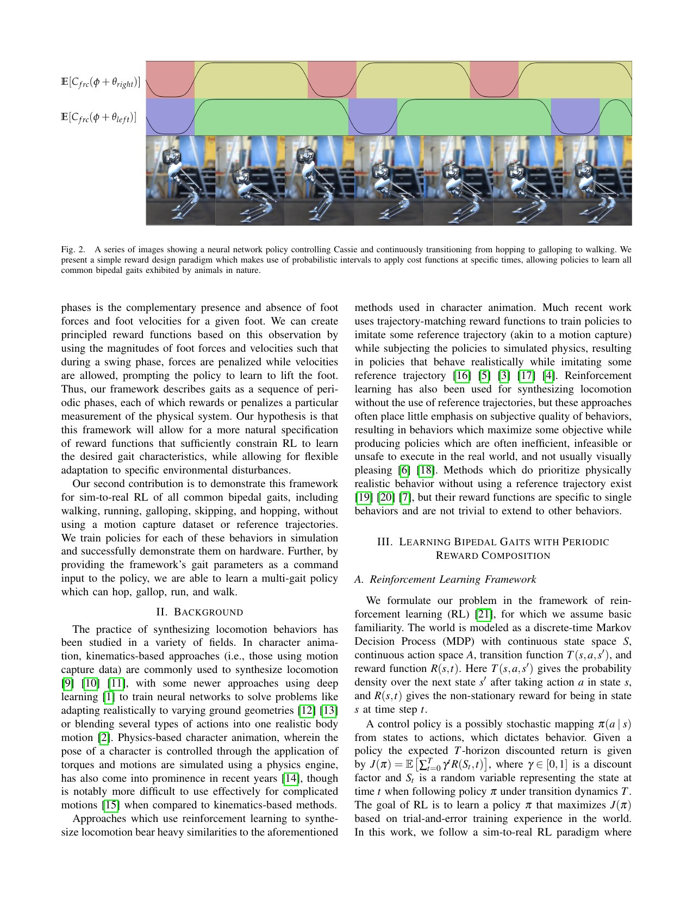
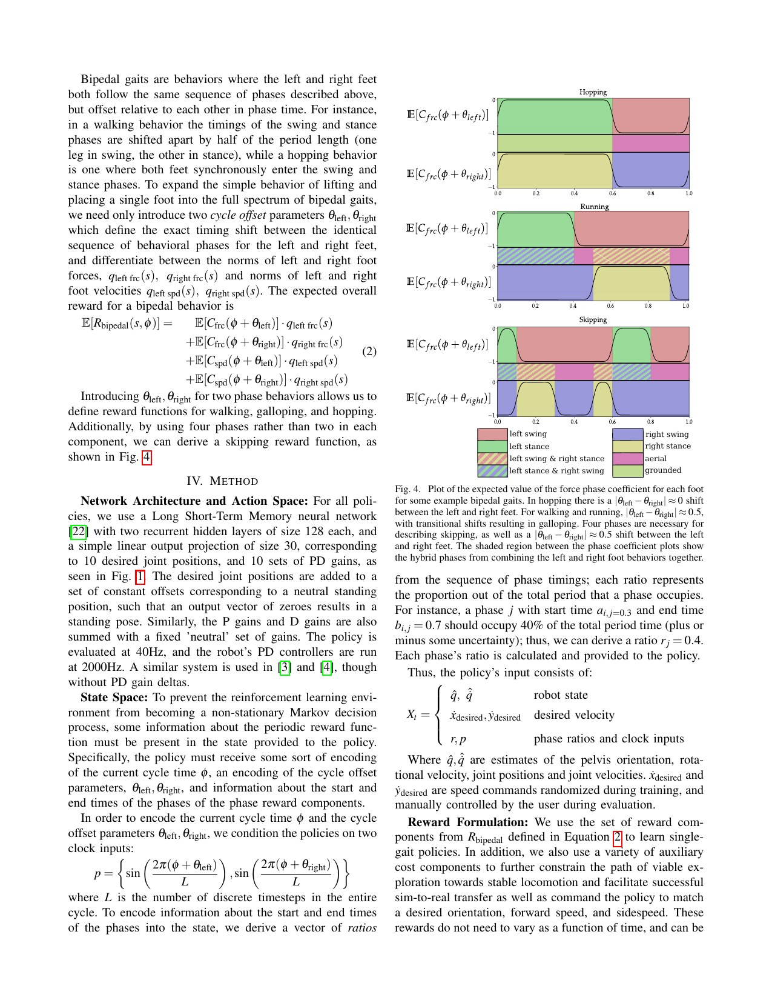
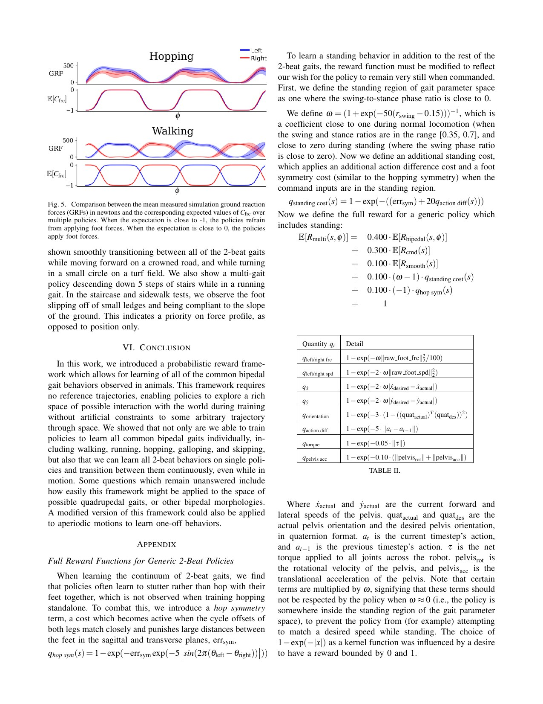

# 周期奖励组合：不用关节参考轨迹，怎样让 Cassie 学会站、走、跑、跳与跳步

[English version](en/periodic-gaits-2011.01387v2.md)

来源：[arXiv:2011.01387v2](https://arxiv.org/abs/2011.01387v2) · [官方 APEX 代码固定提交](https://github.com/osudrl/apex/tree/82c44af2b5d7bffe884fd2f69856bb1b3c9948e0)

解读范围：完整 7 页 ICRA 2021 版本；本文只保存原创分析、图表定位与代码链接，不保存论文全文、策略权重或机器人参数文件。

> 一句话结论：这篇论文用“某相位应接触/摆动”的概率时钟约束足端力与速度，而不是逐关节复制参考动作，从同一奖励语法构造多种双足步态；它减少了动作轨迹依赖，但没有消除奖励设计、相位估计和实机随机化工作。

术语导航：周期奖励（periodic reward）、步态相位（gait phase）、接触力（contact force）、足端速度（foot velocity）、摆动期（swing phase）、支撑期（stance phase）、双拍步态（two-beat gait）、动力学随机化（dynamics randomization）、循环策略（recurrent policy）、仿真到现实迁移（sim-to-real transfer）。

## 工程痛点

用参考关节轨迹训练步态，目标明确但需要为每种速度和步态准备高质量轨迹，策略也容易被固定姿态细节束缚。只奖励向前速度又过于欠约束：机器人可能拖脚、蹦跳、用异常冲击换速度，且不同随机种子得到完全不同动作。工程需求是用少量可解释参数说明“脚什么时候承重、什么时候移动”，同时把其余身体协调留给 RL 搜索。

作者把双足步态的共性下沉到接触时序。站立、行走、跑步、双脚跳和跳步虽然关节轨迹不同，但都能用左右脚的周期、相位偏移和支撑占空比描述。可以把它理解为乐谱只写节拍与哪只脚落拍，而不逐毫秒规定每个关节角；策略负责在动力学约束下“演奏”出具体动作。

## 方法主线：概率时钟如何变成奖励

每只脚由周期相位变量表示。作者为某个相位是否处于 swing/stance 定义随机变量，并将其期望映射为足端接触力和足端速度的系数：摆动期希望接触力小、足端允许运动；支撑期希望足端速度小、允许承重。平滑概率边界避免硬切换奖励在相位边界产生不连续梯度。

这里的“概率”主要用于把硬相位边界平滑成连续期望，并不是策略在在线估计接触概率。实现中需要明确符号：系数为正时是鼓励还是惩罚，力与速度是否先归一化，不同脚的项怎样求和。若把论文中的 cost 系数直接当 reward 权重，符号颠倒可能让策略在摆动期主动踩地。最小单元测试应给定四种相位和人工足力/足速，逐项核对期望得分。

左右脚相位差决定步态族：接近半周期错相可形成走/跑，接近同相可形成双脚跳；支撑比例与空中期区分走与跑，进一步组合不同周期成分可构造 skipping。奖励再加入期望平面速度、骨盆朝向、动作变化和力矩等任务/正则项，而不是仅靠两条时钟项维持整机。

策略输入包含机器人状态、期望速度和步态参数，网络使用两层 128 单元 LSTM。动作是围绕中性站姿的关节目标偏置，由固定 PD 增益执行。循环网络用于吸收部分不可观测动力学与历史，但论文的关键创新仍是奖励接口，不应把效果归因于 LSTM 本身。

为实现通用策略，作者在训练中改变相位偏移、支撑比例和速度命令，使策略在两拍步态之间连续过渡。简单连续插值会出现“不像走也不像跳”的融合动作，所以论文又为 hopping 和 standing 区域加入对称与动作差异惩罚。这说明统一参数空间并不会自动保证所有中间点都有合理语义。

## 关键图解

Figure 1 展示站立、走、跳、跑、跳步等策略，Figure 2 展示同一策略从 hopping 经 galloping 过渡到 walking。它证明周期参数能够作为可命令接口，而不是只训练多个不可切换的独立网络；图片不能量化长期稳定率，也不能说明参数空间任意插值都安全。

Figure 3 把每只脚的 force/velocity 奖励系数画成周期区间，Figure 4 对比 hopping、walking/running 与 skipping 的左右相位关系。这里最重要的不是曲线具体颜色，而是奖励只约束接触模式：同一个相位定义可由不同关节动作满足，因此策略仍有空间适应速度、扰动与台阶。

Table I 覆盖阻尼、质量、摩擦、地面坡度、编码器偏置等随机化；Figure 5 比较仿真与实机地面反力（ground reaction force, GRF）及相位期望。实机 GRF 大体呈现目标接触时序，支持奖励语义迁移，但曲线并非完全重合，也没有证明仿真力峰值或冲击可直接预测硬件载荷。

## 最有说服力的实验

真正有区分度的实验是单一参数化奖励生成五类步态并在 Cassie 实机展示，而不是某个平均回报。它说明 designer 不必为每种步态提供逐关节参考轨迹，且同一接口可以命令速度与步态切换。这种结果对缺少完整动作库的双足平台有直接价值。

通用策略的失败讨论同样关键：直接同时随机化多个步态参数会学出不对称 walking 或混合行为，作者必须增加 hopping 对称项和 standing 区域代价。该负面结果表明“奖励组合”仍需要针对参数空间奇点设计条件项；它不是完全免调参的通用步态生成器。

评估统一策略时，不能只从一种步态顺序切换。参数空间存在路径依赖：从走到跑、从跳到走、从站立到跑可能经过不同中间接触模式，循环网络历史也不同。应构造有向切换矩阵，对每个起点—终点组合测量切换时间、最小躯干高度、错误接触次数、冲击和恢复；否则少数演示路径会掩盖其他入口的不稳定。

论文展示在草地绕圈、路缘单脚高低、台阶和小障碍上的鲁棒性，并给出实机跑步/跳步等行为。证据支持 Cassie 平台上的多样性与迁移，却没有跨机器人复现、严格成功率统计或与参考轨迹方法在相同训练预算下的全面对照。

## 论文—代码映射

| 论文组件 | 代码位置 | 对应事实 |
|---|---|---|
| 周期奖励生成 | [`CassieEnv.set_up_clock_reward`](https://github.com/osudrl/apex/blob/82c44af2b5d7bffe884fd2f69856bb1b3c9948e0/cassie/cassie.py) 与 `create_phase_reward` 调用 | 根据 swing/stance 持续时间、平滑程度和模式生成左右脚时钟 |
| 足力/足速奖励 | [`clock_reward`](https://github.com/osudrl/apex/blob/82c44af2b5d7bffe884fd2f69856bb1b3c9948e0/cassie/rewards/clock_rewards.py) | 读取左右脚 force/velocity clock，计算归一化地反力与足端速度得分 |
| 相位与频率命令 | [`CassieEnv`](https://github.com/osudrl/apex/blob/82c44af2b5d7bffe884fd2f69856bb1b3c9948e0/cassie/cassie.py) 的 `phase`、`phase_add`、`phaselen` | 维护周期位置，并把时钟/速度等命令并入观测 |
| 策略检查与扰动 | [`mirror_policy_check.py`](https://github.com/osudrl/apex/blob/82c44af2b5d7bffe884fd2f69856bb1b3c9948e0/mirror_policy_check.py) | 调整频率、施加外力并检查镜像策略行为 |

固定提交包含多代 Cassie 环境和历史奖励文件；论文机制与当前入口并非一一对应的最小实现。复现时应锁定实际训练命令、环境类、奖励名和提交，不能只运行 README 的最新默认项后称为论文复现。代码依赖 Cassie 仿真和模型许可，本手册不重分发。

## 适用边界与局限

作者明确依赖 Cassie 的状态估计、关节目标 PD 接口与动力学随机化，并将结果限定在所报告平台。周期奖励假设任务具有可定义相位；急停避障、非周期推拉或不规则落脚不能仅用固定时钟描述。相位若与真实接触逐渐失配，策略可能在脚仍承重时进入“允许足速”的区域。

独立工程判断是：时钟奖励告诉策略何时承重，却不显式限制摩擦锥、冲击峰值、关节力矩或支撑域。Figure 5 的平均 GRF 相似不能替代峰值载荷与硬件疲劳测量。把周期奖励当成“接触语法”而不是安全约束，才能正确接入 WBC/安全层。

动力学随机化也应围绕可辨识误差设计。Table I 给出论文范围，但新平台应先用系统辨识和日志估计质量、阻尼、摩擦、编码器偏置与执行延迟的合理区间。范围过窄会造成仿真过拟合，范围过宽又可能迫使策略采用保守或高冲击动作来覆盖互相矛盾的模型。可以把随机化看成模型不确定性的训练集，而不是越大越安全的噪声旋钮。

站立被嵌入步态参数空间也存在边界。接近零速度和零摆动比例时，某些相位量失去可辨识性；作者用专门 standing cost 处理。其他机器人若有双脚尺寸、膝型或被动关节差异，站立区域和对称项都需重新定义。

## 可执行但有边界的结论

当团队缺少高质量关节参考轨迹、但能描述左右脚接触节拍时，可以用周期力/速奖励建立可解释基线。先分别训练站、走、跑、跳，验证相位—接触一致性；再逐步扩展参数随机化与切换，不要一开始就把整个步态空间交给同一个策略。

奖励调试应同时画相位、目标 force/velocity 系数、实测足力、足速、骨盆速度和动作差分。若只看 episode return，很难判断是接触时钟正确但速度项失衡，还是相位已经与支撑脚错开。

还应加入相位故障注入：突然偏移相位、冻结一个周期、改变步频或在意外接触后继续推进时钟，观察策略能否恢复。若系统只在完美开环时钟下工作，实机一次打滑就可能长期错相。可选改进是用接触事件有限度校正相位，但校正规则本身要避免噪声触发和左右脚身份翻转。

## 复现与验收清单

复现至少保存 reward clock 生成参数、策略频率、PD 频率、相位推进规则、观测与动作归一化、随机化范围和随机种子。对每种步态报告接触混淆矩阵：目标支撑/摆动与实际接触是否一致；再报告速度误差、足滑、冲击峰值、力矩、恢复和步态切换瞬间的最差值。

实机阶段必须重新标定 Cassie 之外机器人的接触阈值、关节/速度/力矩限制与随机化，先吊架或保护设施、低速低幅、单步态测试，再开放切换。本文不提供可直接执行的增益或命令范围，论文参数不能替代机器人制造商限制与现场急停方案。

最终验收要区分“产生目标步态”和“安全地持续运行”。前者可以用接触相位与速度跟踪判断，后者还需要长时间热状态、电池电压、驱动器温度、峰值/累计载荷和故障回落测试。论文支持方法可行性，但这些运维指标必须由目标平台补齐。

> **工程判断**：周期奖励的价值是用少量接触节拍约束替代密集关节参考；它扩大了动作自由度，也把“自由度是否安全可靠”留给了额外工程约束、独立系统测试和硬件验证。
