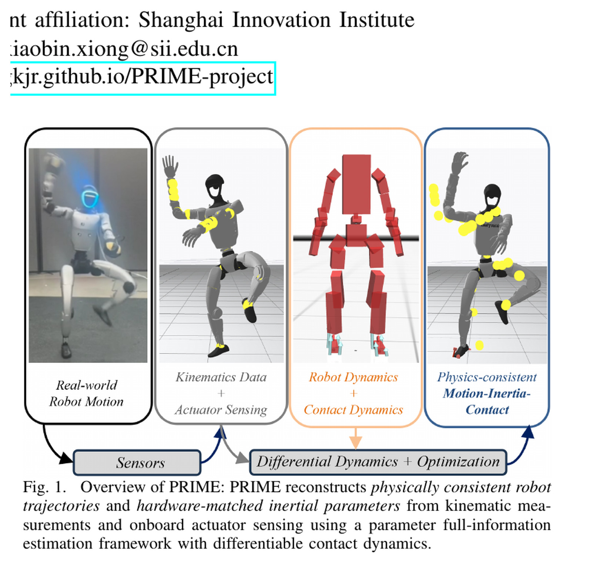
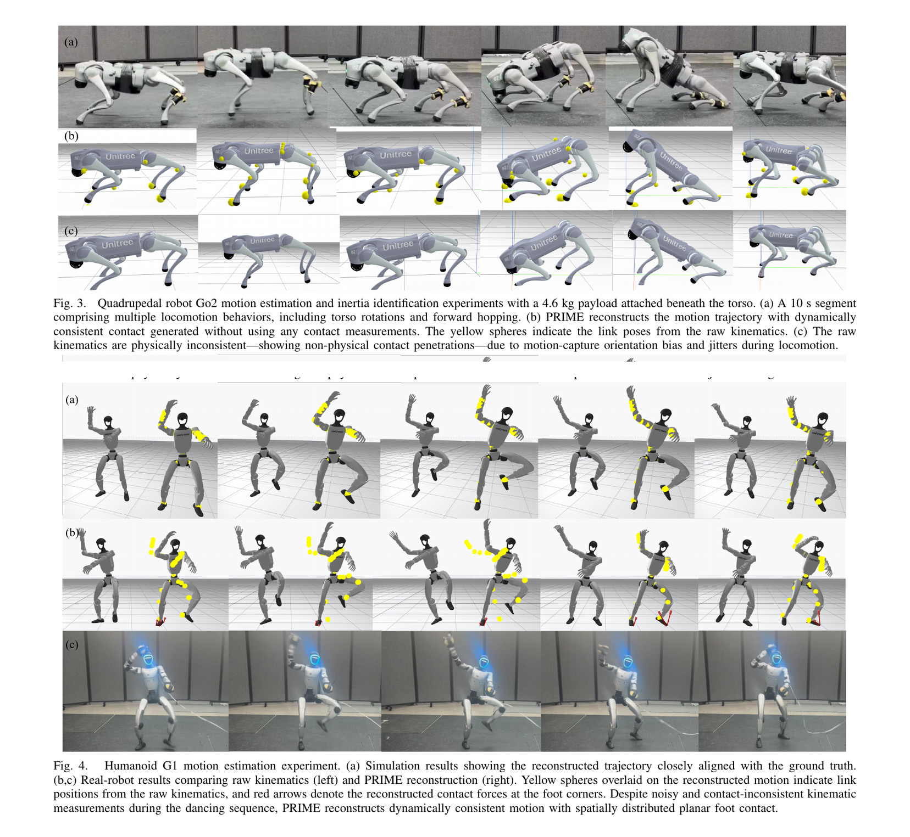
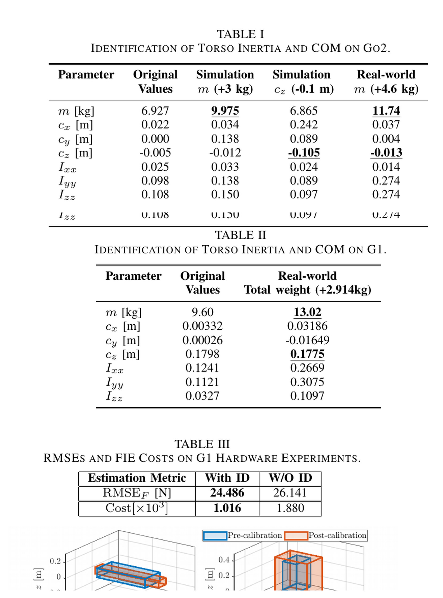
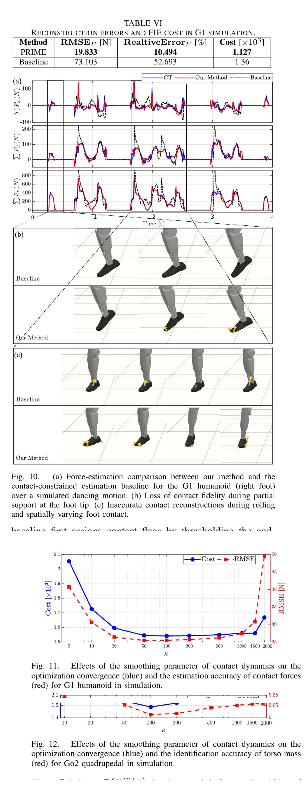

# PRIME：用可微接触把运动、接触力和惯性参数放进同一个离线估计问题

[English version](en/prime-2605.17681.md)

来源：[arXiv:2605.17681](https://arxiv.org/abs/2605.17681) · [固定提交的官方代码](https://github.com/well-robotics/PRIME/tree/b848ceecd451f4786ce39dcefa59e96dbaa369ba)

解读范围：完整 14 页论文、附录和参考文献，以及官方可微 Anitescu contact solver、惯性参数化、contact-ID action model 和 FDDP 集成。

> 一句话总结：PRIME 将带噪运动学、关节力矩、未知接触力和惯性参数写成带平滑接触动力学的 MAP/FDDP 问题，能离线恢复更物理一致的 G1/Go2 轨迹；G1 15 秒数据约需 400 秒求解，它是数据校准与估计工具，不是实时状态估计器。

术语导航：物理一致估计（physically consistent estimation）、最大后验估计（maximum a posteriori estimation, MAP）、平滑 Anitescu 接触（smooth Anitescu contact）、摩擦冲量（frictional impulse）、惯性参数识别（inertial parameter identification）、对数 Cholesky 参数化（log-Cholesky parameterization）、隐式解析导数（implicit analytical derivatives）与可观测性（observability）。

## 工程痛点

真实机器人日志里的姿态、速度和接触往往彼此不一致。动捕或里程计给出的脚可能穿地或滑动，数值微分放大噪声，名义 URDF 的质量和惯量又可能漏掉电池、线缆和载荷。WBC 若直接使用这些数据，会把模型误差解释成接触力或状态误差。

传统滤波器常把接触序列预先固定，再估状态；系统辨识又可能假设状态与接触力已知。PRIME 的问题是把三者联合起来：寻找一条接近测量、符合刚体与摩擦接触、并能解释关节力矩的轨迹，同时校正惯性参数。

运动学、力矩与接触模型必须由同一组状态、接触力和惯性参数联合解释；单独平滑一个通道会破坏跨模态一致性；联合优化要找到同时能解释画面、声音和乐谱的版本。

## 核心洞察

刚性接触的开闭与库仑摩擦不光滑，直接求导困难。PRIME 使用平滑 Anitescu formulation 和 log-barrier Newton solve，将距离、速度和摩擦统一到可微 contact impulse。Equation 15–20 描述 barrier contact 与恢复的 impulses；有限的平滑参数 `κ` 允许“有距离也有小力”的近似，从而获得稳定梯度。

运动、接触力与惯性参数共同进入 MAP 目标。测量误差是 likelihood，轨迹平滑与参数先验是 regularization，接触动力学提供物理一致约束。惯性用 log-Cholesky 参数化，保证质量和转动惯量保持物理合法，而不是任意更新矩阵元素。

隐式解析导数由 contact solver 的最优性条件得到，Equation 33–34 给出对状态和参数的 sensitivity。外层使用 FDDP/PFIE 交替或联合优化长时间轨迹。优势是不用力传感器也能估接触；代价是离线计算与模型依赖。

## 方法主线

输入为机器人几何/名义惯性、离散运动学测量和关节力矩，可包含动捕或本体估计。每个 time step 由可微 contact action model 根据 signed distance、速度、摩擦和控制解 barrier impulses，再推进动力学。

外层损失惩罚状态与测量差异、动力学/接触不一致、控制和参数偏移。PFIE 联合更新 shooting trajectory、接触 impulse/force 与 log-Cholesky inertial parameters。预先固定的平面接触几何仍是建模输入，但具体各点接触力由优化推断。

Go2 使用约 10 秒、1000 个 0.01 秒样本，普通 PC 求解约 200 秒；G1 使用约 15 秒、1500 样本，约 400 秒。这个量级明确定位在 offline log refinement、数据标注与标定，不适合作为 WBC 高频闭环 estimator。

输出是物理一致的状态轨迹、接触冲量/力和识别后的惯性。它可用于校正训练数据、比较名义模型和载荷、生成 force-grounded labels；若供在线控制使用，应由离线结果更新模型或训练轻量 estimator，而不是在控制周期内直接运行 PRIME。

## 关键图解

Figure 1 展示原始运动学和力矩进入同一优化，输出轨迹、接触力与惯性。图中箭头应理解为 batch/offline inference，不是传感器每帧即时输出。它也说明力板不是算法必需输入，而可作为实验 ground truth。

Figure 3-4 对比原始运动学与 contact-consistent reconstruction。脚与地面关系变得平滑并符合滚动接触，尤其 G1 舞蹈中的 heel-to-toe 变化。视觉上更合理仍需与测量 residual 和 force 结果一起看，防止优化过强地“修漂亮”。

Table II 指出 G1 名义模型 35.115 kg 与秤测 38.029 kg 相差 2.914 kg，PRIME 估计额外约 3.4 kg。Table III 中带 ID 的 G1 力 RMSE 为 24.486 N、FIE cost 1.016×10³，不带 ID 为 26.141 N 和 1.880×10³。力误差改善有限但整体物理代价明显下降，需避免只挑一个最好指标。

固定接触序列基线的力 RMSE 为 73.103 N、相对误差 52.693%，PRIME 为 19.833 N 与 10.494%。Figure 10-12 还显示 `κ` 太小接触过软、太大优化困难，约 500 是精度与收敛的折中。该值绑定单位、尺度与数据，不是通用常数。

## 最有说服力的实验

最有说服力的是 G1 力板对照、惯性识别和固定接触基线的组合。系统无需用力传感器作输入，却能用力板检查恢复力；识别质量又能降低 FIE cost。这说明联合估计比单独平滑轨迹更有物理约束。

不过 G1 真值惯性不可得，秤重只能验证总质量，不能验证各轴惯量。作者明确把有限传感下的可观测性和可识别性列为未来工作；结果可能依赖动作是否充分激励参数。一次舞蹈识别出的载荷不能自动泛化到所有动作和安装状态。

## 论文—代码映射

官方提交 `b848ceecd451f4786ce39dcefa59e96dbaa369ba` 中，`include/crocoddyl/contact_id/anitescu/DifferentiableAnitescuSimulator.hpp` 的 `solveBarrierNewton` 与 sensitivity 路径实现平滑接触和隐式导数。`include/crocoddyl/contact_id/anitescu/Logchol.hpp` 提供物理一致惯性参数化。

`include/crocoddyl/contact_id/actions/contact-fwddyn-anitescu-id.hxx` 与 `src/contact_id/problem/contact-anitescu-id.cpp` 把接触 ID action model 装进问题；`src/core/solvers/fddp.cpp` 集成外层求解。复现需锁定 Crocoddyl/Pinocchio、线性求解器、模型、接触点、坐标和测量协方差。

## 局限与工程判断

作者明确指出需要研究有限传感下运动、接触力与惯性的 observability/identifiability。方法目前离线且计算约为数据时长的 20–27 倍；G1 未建模手指等结构会产生力矩差异，真实惯性也无法完整获得。

独立工程局限包括：平滑 contact 允许 force-at-distance；测量协方差和 prior 可强烈影响结果；错误接触几何会被参数或力吸收；时间同步偏差可能看起来像惯性错误；多个参数组合可能同样解释有限动作。应报告 Hessian/敏感度或多初始化方差，而不只给一个估计。

PRIME 输出不应直接当实机安全状态。离线修正可能使用未来信息，在线 controller 无法获得；估计接触力没有经过力传感器全工况验证。用于模型更新前应设置参数变化上限、交叉验证动作和回滚版本。

## 可执行但有边界的结论

PRIME 适合把机器人日志转成 contact- and force-consistent training data，或诊断名义惯性和载荷偏差。它补上 WBC 数据链中“看起来连续”与“动力学能解释”的差别。

它不是实时 state estimator，也不保证所有参数可识别。最可靠用法是离线批处理、多动作交叉验证，再把稳定参数或标签交给在线系统，并保留不确定度和原始日志。

## 复现与验收清单

锁定 PDF、官方提交、机器人模型、接触点、摩擦、坐标、采样率、时间同步、测量噪声与先验。先在合成数据分别注入质量、质心、惯量、运动噪声和 contact timing 误差，检查是否能恢复已知真值。

真实数据同时保留原始日志、重建轨迹、力板对照和参数版本。报告 state residual、force RMSE、FIE cost、总质量误差、运行时间和多初始化方差；按动作片段做 train/validation，避免用同一段同时识别和证明。

对 `κ`、摩擦、协方差与 prior 做 sweep，检查 force-at-distance、穿透、收敛和参数漂移。任何模型更新都先在未参与识别的动作和仿真 WBC 上回归，再进入系留低风险硬件测试。

可观测性评估不能只写成未来工作。实际工程可以对识别结果附近计算参数敏感度或近似信息矩阵，查看哪些质量、质心和惯量方向几乎没有曲率。若某参数在不同初始化间大幅变化却代价接近，应输出区间或“不可辨识”，而不是选择一个小数很多的值。

动作设计应主动激励待识别参数。匀速平地行走可能足以观察总质量，却很难区分某些转动惯量；躯干转动、不同支撑、加减速和已知载荷变化提供互补信息。识别动作与验证动作分离，才能检查参数是否跨动作解释数据，而非只拟合一次轨迹。

测量时间同步需要独立标定。动捕、编码器、力矩估计和力板常有不同延迟，一个几十毫秒偏移会在快速接触中制造大残差。先用触地事件或共同激励估时延，再运行 PRIME；也可以把少量时延作为外层参数扫描，但不要让惯性参数吸收同步错误。

接触几何同样需要版本化。G1 平面脚用四角点近似，Go2 足端模型不同；若鞋底变形、加装垫片或地面不平，有符号距离和力矩臂都会变化。每份结果应记录几何、地面平面和摩擦设置，硬件改装后旧识别不应继续默认有效。

数据标注用途还需保留原始与重建两套字段，并给每帧残差、不确定度和接触置信度。下游学习器可以按置信度加权，而不是把优化输出当无噪声真值。若某段没有收敛，宁可拒绝该段，也不要把失败优化静默写入训练集。

参数上线应采用影子评估：新模型先离线重放和仿真闭环，与旧模型比较状态估计、接触力、控制代价和稳定裕量；再在实机只记录新模型预测、不用于控制；最后才在低风险动作启用。每一步都保留一键回滚到名义模型。

运行时间也应分解接触求解、导数、反向/前向过程与线性代数，并报告迭代分布。数据长度翻倍是否线性增长、接触点增加是否导致瓶颈，决定方法能否用于日常批处理。只报 200/400 秒两个总数不足以规划大规模数据流水线。

批处理系统还应定义明确失败状态：接触内层不收敛、外层代价停滞、参数触及先验边界、穿透超过阈值或力与力板严重不符。失败任务保留日志并进入复核队列，不自动重试到某次“成功”后丢弃前面的不稳定证据。

若将恢复接触力用于学习监督，应先按法向、切向和接触点分解验证。总合力接近力板并不保证每只脚或每个角点分配正确；全身控制可能对力矩分布更敏感。至少在双支撑和滚动接触段检查中心压力与合力矩，避免只用三维合力掩盖错误分配。

参数数据库需要关联具体硬件配置：机器人序列号、电池、球拍或载荷、鞋底、线缆和维修状态。相同型号不等于相同惯性；配置变化后触发重新识别或回退到名义模型。这样离线估计才能支持长期维护，而非生成一份很快失效的表格。每次更新还应记录审核人、适用动作和失效条件。

每次参数更新还要记录审核人、适用动作和失效条件，确保后续控制日志可追溯到当时生效的精确模型版本。

> **工程判断**：物理一致重建能修正日志，但若数据没有激励某个参数，优化器的确定数字仍可能只是漂亮的猜测。
