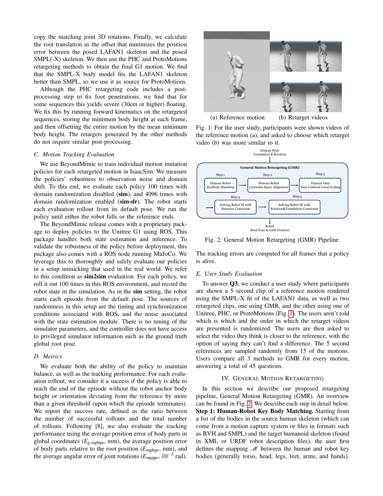
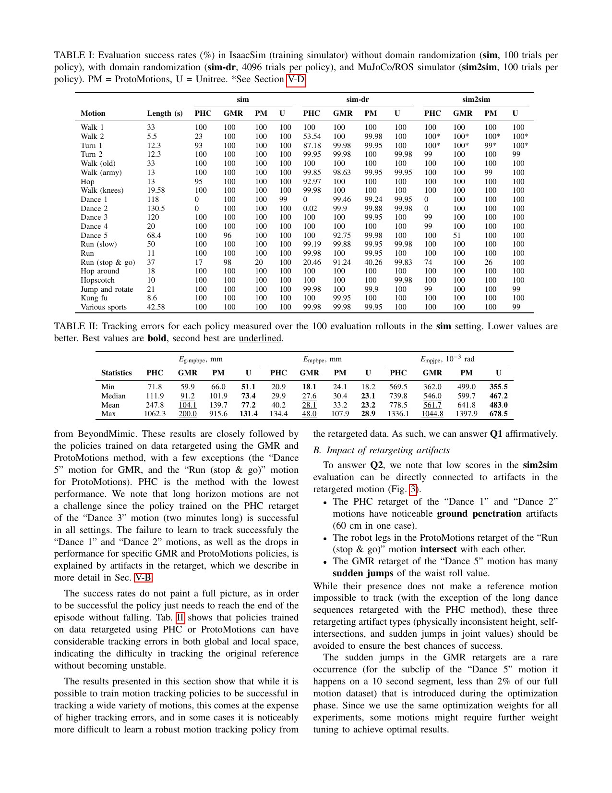
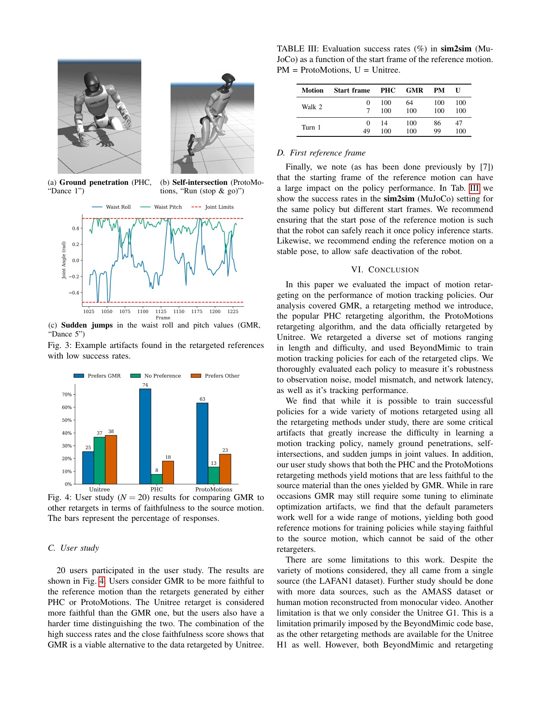

# GMR：重定向不是数据清洗尾活，而是跟踪策略的上游动力学约束

来源：[arXiv:2510.02252v1](https://arxiv.org/abs/2510.02252v1) · [版本固定的官方代码](https://github.com/YanjieZe/GMR/tree/bb1bbe40774794fceb2a7c579a3464a28e68c844)

解读范围：完整 9 页论文、实验与参考文献，以及官方仓库中 `GeneralMotionRetargeting` 与 LAFAN1→G1 配置。本文只保存原创分析、定位信息和链接。

> 一句话总结：GMR 不是让动作“看起来更像人”的修图工具，而是在跟踪策略开始学习前，把形态差异、关节可达性和接触伪影变成可检查的数据质量问题。

术语导航：动作重定向（motion retargeting）负责跨骨架映射，差分逆运动学（differential inverse kinematics）逐步求解关节速度，运动学可行性（kinematic feasibility）与动力学可行性（dynamic feasibility）必须分开。下游跟踪器（motion tracker）、域随机化（domain randomization）、模拟器间迁移（sim-to-sim transfer）和操作设计域（operational design domain, ODD）是判断这份数据能否进入实机链路的四个后续关口。

## 工程痛点

把人类动作变成机器人参考轨迹，常被当作 tracker 训练前的一次格式转换：人体骨架缩放一下、跑一遍 IK、让 RL 自己修正剩余误差。问题是，地面穿透、自碰撞或某个关节的一帧突跳并不是普通噪声。策略一边被奖励要求追上不可能的参考，一边又必须遵守接触与关节约束，最终只能在“像参考”和“别摔”之间找折中。

这篇论文刻意压低下游 reward engineering 的影响，用同一个 BeyondMimic 训练管线比较 PHC、ProtoMotions、GMR 与 Unitree 的闭源重定向数据。它问的不是“哪个 IK 数值误差更小”，而是“重定向结果进入物理控制后，策略能否稳定把整段动作走完”。

可以把参考轨迹理解为铁路轨道，把策略理解为列车。轨道自己突然钻入地面或在一帧之间拐了急弯，再强的列车也只能在“脱轨”与“不按轨道走”之间取舍。这个类比解释了为什么加奖励、加噪声或加网络容量，不能稳定补救上游数据的几何断裂。

## 核心洞察

GMR 最重要的洞察不是“两阶段 IK 比一阶段好”，而是评估单位变了：不再只在每帧测量人体与机器人的几何误差，而是问物理策略在给定噪声、延迟和模型差异后能否完成整段动作。这把数据工程与控制性能建立了可实验的因果链。

第二个洞察是“局部比例”和“世界位移”不能混成一个缩放因子。手臂和腿要适应机器人连杆长度，但根节点在地面上的前进距离必须保持一致，否则脚底接触会被不同身体分区各自拉扯。这就像缩小人偶的四肢时不能同时缩小地板上的脚印间距。

## 方法主线：输入 → 处理 → 输出

输入是 BVH/SMPL 等人体运动、人体身高、机器人 XML/URDF、人体—机器人关键刚体对应关系，以及两阶段的位置/姿态权重。处理分五步：

1. 人工定义躯干、四肢、手脚等关键刚体对应，明确哪些几何关系要保留。
2. 在静止姿态上对齐人体与机器人局部坐标系，消除轴向不一致。
3. 以人体身高为全局尺度基础，但对上肢、下肢和关键刚体使用不同局部尺度；根节点平移保持统一缩放。
4. 第一阶段 IK 重点满足所有关键刚体姿态与手脚位置，先找一个不容易落入坏局部极值的解。
5. 第二阶段加入所有关键刚体的位置约束做细化；连续动作以前一帧结果作为下一帧初值，最后统一修正地面高度。

输出是机器人根位姿与关节角序列。它仍是运动学参考，不保证动力学可执行；论文通过训练 tracker 并施加噪声、模型偏差和延迟，间接检验这份参考对控制学习是否友好。

## 公式与缩放逻辑

Equation 2 把每个非根关键点写成“相对人体根的位置 × 该身体局部尺度，再加缩放后的根平移”。Equation 3 则让根平移只使用自己的统一尺度。这个区别很要紧：四肢长度需要非均匀适配机器人形态，但前进距离如果也按各身体部位分别缩放，脚在世界坐标里的位移一致性会被破坏，脚滑就从数据层进入控制层。

Equation 4 的第一阶段只追所有关键体姿态与末端位置；Equation 5 把它写成带关节上下限的差分 IK，每次求能降低误差的广义速度。Equation 6 再对所有关键体同时追位置和姿态。两阶段像先把人体轮廓“站对”，再把局部几何“拧紧”；直接一次性满足全部约束，更容易被形态差异推到坏解。

## 关键图解

Figure 2 应从左向右读：先固定人体与机器人关键刚体的语义对应，再消除局部坐标轴差异，然后分区缩放，最后用两阶段 IK 从末端/姿态约束逐步收紧到全关键体。图中每一步都对应一类可单独验收的数据错误，因而它比一个不透明的端到端优化器更适合工程审计。

- Figure 2：完整五步管线，清楚区分坐标对齐、局部缩放与两阶段 IK；这是论文最重要的方法图。
- Table I：21 条 LAFAN1 动作分别在 IsaacSim 无随机化 100 次、带随机化 4096 次和 ROS/MuJoCo sim2sim 100 次评测。大多数动作所有方法都能成功，但 PHC 在两段长舞蹈上为 0，ProtoMotions 在停跑动作上显著下降，GMR 也在 Dance 5 暴露了自身突跳问题。
- Table II：只看“没摔”会掩盖参考偏差。GMR 的平均全局刚体位置误差为 104.1 mm，低于 PHC 的 247.8 mm 与 ProtoMotions 的 139.7 mm，但仍高于 Unitree 数据的 77.2 mm。
- Figure 3：把低成功率直接对应到三种可检查伪影——最高约 60 cm 地面穿透、腿部自交、腰部 roll/pitch 突跳。
- Figure 4：20 人感知实验认为 GMR 比 PHC/ProtoMotions 更接近原人体动作，但 Unitree 仍略占优势；感知相似度不能代替物理可行性，却能避免“策略成功地学会了另一个动作”。
- Table III：同一策略只换参考起始帧，成功率即可大幅变化。参考片段的首尾姿态因此是部署接口的一部分，不是剪辑细节。

Table I-II 要合在一起读。成功率只告诉你策略有没有触发终止条件，刚体位置误差才告诉你它是否真在执行那个动作。一个策略可能站着走完了整段，却通过改变躯干或步幅规避了不可行参考；因此两类指标不能相互替代。

Figure 3 把失败从一个回报数值还原成可见的几何伪影：最高约 60 cm 穿地、腿部自交与腰部角度突跳。Table III 则说明即使中间帧相同，片段从哪一帧开始也会改变初始可达性。所以数据门禁必须审查时序连续性与首尾条件，不只审查单帧姿态。

## 最有说服力的实验

Table I 与 Figure 3 的组合最有说服力。论文没有只给平均分，而是保留了失败动作并追到具体参考伪影；同一个下游 tracker、同一批动作和多种扰动设置，使“数据质量影响控制鲁棒性”比单纯展示 GMR 视觉效果更可信。

结论必须保持窄：在 Unitree G1、21 条不含复杂环境交互的 LAFAN1 动作、单轨迹 BeyondMimic 策略与所用噪声/延迟设置中，重定向方法会显著影响成功率与误差，GMR 是所测开源方法中整体更强的一种。它没有证明 GMR 对所有机器人、数据源或物体交互都最优，也没有实机对照。

## 论文—代码映射

以下只给定位，不复制实现：

| 论文组件 | 代码位置 | 对应关系 |
|---|---|---|
| 局部非均匀缩放与根平移缩放 | [`GeneralMotionRetargeting.scale_human_data`](https://github.com/YanjieZe/GMR/blob/bb1bbe40774794fceb2a7c579a3464a28e68c844/general_motion_retargeting/motion_retarget.py) | 先转为相对根位置，对每个身体使用配置尺度，再加统一缩放的根平移，对应 Equation 2/3 |
| 两阶段差分 IK | [`GeneralMotionRetargeting.retarget`](https://github.com/YanjieZe/GMR/blob/bb1bbe40774794fceb2a7c579a3464a28e68c844/general_motion_retargeting/motion_retarget.py) | 依次运行 `tasks1` 和 `tasks2`，每阶段以误差改善阈值或最多 10 次迭代停止，对应 Equation 4-6 |
| 关键体、权重与尺度 | [`bvh_lafan1_to_g1.json`](https://github.com/YanjieZe/GMR/blob/bb1bbe40774794fceb2a7c579a3464a28e68c844/general_motion_retargeting/ik_configs/bvh_lafan1_to_g1.json) | 把 G1 刚体映射到 LAFAN1 人体关键体，分别配置两阶段位置/姿态权重与上、下肢尺度 |
| 地面偏移 | [`offset_human_data_to_ground` / `apply_ground_offset`](https://github.com/YanjieZe/GMR/blob/bb1bbe40774794fceb2a7c579a3464a28e68c844/general_motion_retargeting/motion_retarget.py) | 对脚部最低点或外部地面偏移做整体平移；不能替代接触一致性检查 |

该提交晚于论文 v1，包含更多机器人、输入格式和速度限制等后续扩展。手册只把上述核心符号作为实现证据，不把当前 README 的全部能力反推为论文实验。仓库使用 MIT 许可证；本项目不复制代码、配置、机器人模型或动作数据。

代码审计时要特别区分“论文实现”与“仓库现在能做的事”。例如后来增加的速度限制或新机器人配置可以是很有价值的工程改进，却不能被倒写回 v1 的实验结论。复现报告应同时写清论文版本、代码 commit、配置和运动数据快照。

## 适用边界与局限

作者明确列出：动作都来自 LAFAN1，只测试 G1，没有物体、场景或多主体交互；GMR 偶尔仍出现优化突跳，需要调整权重。论文评测是 IsaacSim 与 ROS/MuJoCo sim2sim，没有给出不同重定向方法的实机随机对照。

独立工程判断还包括：

- “完成整段且未越过根高度/姿态阈值”不等于脚底接触正确、能耗合理或不会磨损硬件。
- 每条动作单独训练一个策略，有利于隔离重定向变量，但不能直接代表大规模通用 tracker 的容量竞争和采样偏差。
- Unitree 闭源数据是强基线，却无法审计生成过程；它能说明开源方法还有差距，不能作为可复现方法的一部分。
- 首尾帧需要稳定、关节速度要连续、脚底接触与自碰撞应在 tracker 训练前形成自动数据门禁。

完整的复现不应以“IK 跑通”为终点。至少要产出每段动作的关节位置/速度连续性、脚底高度与滑动、自碰撞、初始可达性和下游 rollout 统计。这些检查应保留失败样本，否则只展示成功动作会再次把上游问题藏起来。

还应把“能不能跟”与“值不值得跟”分开：前者看成功率与物理约束，后者看动作语义、能耗、接触质量与硬件损耗。两层门禁都通过后，一段参考才有资格进入通用 tracker 的训练集。

## 可执行但有边界的结论

训练 tracker 前，先对参考数据做四类检查：地面/物体穿透、自碰撞、关节位置和速度突跳、首尾姿态可达性。不要只用 IK 平均误差筛数据；至少用下游 rollout 成功率、局部/全局刚体误差和跨模拟器扰动评测共同判断。

本文不提供可直接上机的关节限位、速度限位、PD 或力矩参数。实机使用重定向数据前仍需仿真回放、碰撞检测、命令限幅、急停和机器人专用参数审查。

> **金句**：参考轨迹不是跟踪器的原料而已，它本身就是控制系统的一部分；把不可行的轨迹交给 RL，只是把数据错误改名为策略失败。

## 复现与验收清单

最小复现记录应同时固定输入动作版本、人体—机器人关键体映射、缩放因子、IK 权重、关节限位、地面偏移和代码 commit，否则一次“GMR 复现”无法与论文设置对照。
