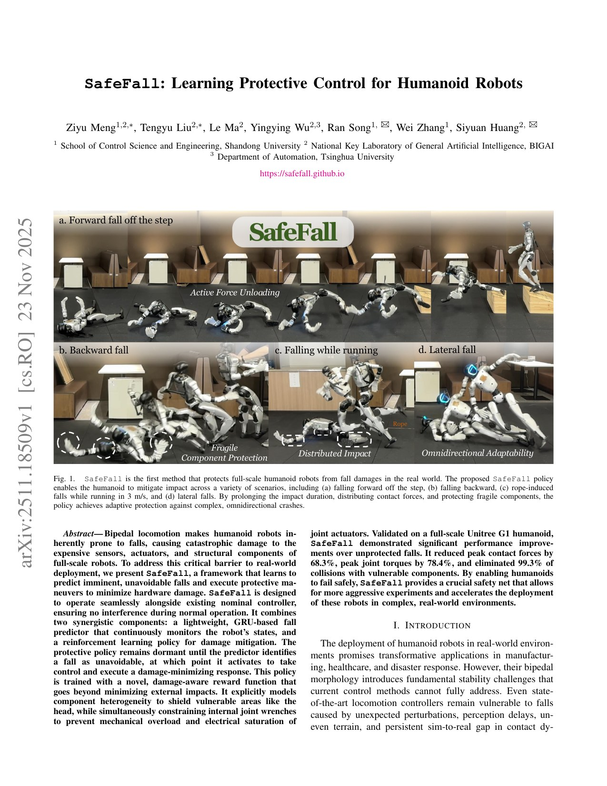
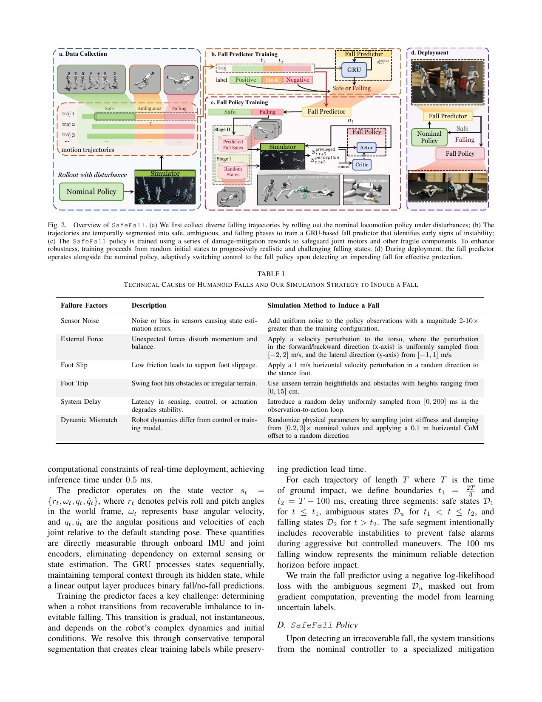
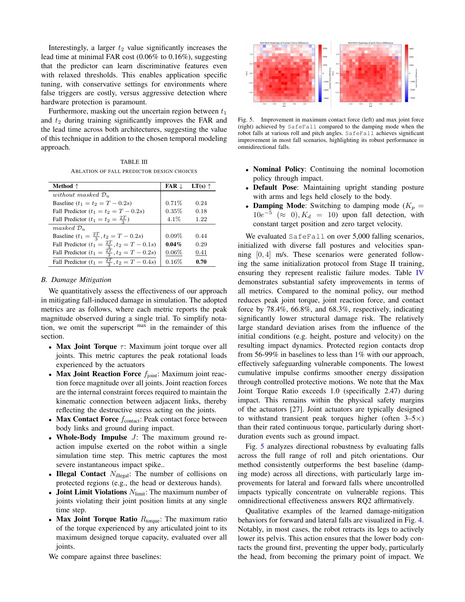

# SafeFall：在“不可避免跌倒”后接管控制，最小化结构与执行器损伤

[English version](en/safefall-2511.18509.md)

来源：[arXiv:2511.18509](https://arxiv.org/abs/2511.18509) · [项目页](https://safefall.github.io/)

解读范围：完整 9 页论文、失败数据生成、GRU 预测、两阶段保护策略、仿真/实机实验与作者局限。截至本次审计未找到可唯一核验的官方公开代码仓库，因此本页不提供伪代码映射或第三方实现替代。

> 一句话总结：SafeFall 从 nominal locomotion 在六类故障下的 81,920 条轨迹训练轻量 GRU，判断跌倒是否不可恢复；触发后由 damage-aware RL policy 接管，按头/手等脆弱度、接触力、关节反力和力矩限值学习卸力。G1 实机报告峰值冲量比 damping 降低 22.1%，仿真相对未保护跌倒将接触力降 68.3%、关节力矩降 78.4%，但训练约 280 GPU 小时、预测器换 nominal policy 需重训，且只可靠覆盖平地/近似平地。

术语导航：保护性跌倒（protective falling）、跌倒预测器（fall predictor）、不可恢复状态（irrecoverable state）、门控循环单元（Gated Recurrent Unit, GRU）、部分可观测马尔可夫决策过程（Partially Observable Markov Decision Process, POMDP）、损伤感知奖励（damage-aware reward）、关节反力（joint reaction force）、时间信用分配（temporal credit assignment）与误报率（false alarm rate, FAR）。

## 工程痛点

人形机器人即使有强 locomotion，也会因传感漂移、外力、足滑、绊脚、时延与动力学失配跌倒。普通 damping mode 在确认失稳后只降低刚度，没有根据方向分散冲击，也不区分能承受碰撞的躯干/肘与昂贵的相机、LiDAR、手。更困难的是，接触峰值只在短暂撞击出现，RL 很难把最终损伤归因到更早的预备动作。

可以把 SafeFall 理解成汽车安全气囊：正常行驶只运行轻量检测器，确定碰撞不可避免才接管，接管太早会干扰驾驶，太晚又来不及保护。另一个类比是人体摔倒时“用较结实部位分段着地”：不是让所有接触力最小，而是延长碰撞时间、把载荷分到躯干和肘，同时让头、手和关节电机远离危险峰值。

## 核心洞察

作者从硬件实验总结六类故障，在仿真中每条轨迹组合 1–3 个：观测噪声放大 2–10 倍、躯干速度扰动、支撑足 1 m/s 滑移、0–15 cm 障碍、0–200 ms 时延、刚度/阻尼 0.2–3 倍和 CoM 偏移。65,536 条训练、16,384 条验证。GRU 只有一层 64 hidden units，输入 pelvis roll/pitch、base angular velocity、关节位置/速度，推理 <0.5 ms。

标签不把临界状态强行二分类。轨迹前段为 safe，撞击前 100 ms 之后为 falling，中间 ambiguous mask 不参与 loss。检测到不可恢复后，29 维关节目标 policy 接管。训练 episode 聚焦 detection 到 impact，解决稀疏信用；Stage I 用简化碰撞和随机低姿态探索，Stage II 用完整碰撞和预测器认定的真实 falling state 精修。

## 方法主线

damage-aware reward 将身体按脆弱度加权：头/手高，胫/肩中，躯干/大腿/肘低；同时惩罚外部接触力、关节反力和 motor torque。相邻 link 的仿真重叠会产生非物理接触峰值，作者过滤这类接触并用 joint reaction force 表达内部载荷。regularization 保持关节、动作变化和姿态可行。

部署时 nominal policy 正常运行，GRU 持续监控；falling 判定后一次性切换 SafeFall。方法只依赖 IMU/encoder 的 proprioception 与部件脆弱度，不需要全局根位置或外部 F/T。保护 policy 对新 stylized locomotion 可直接迁移，但 fall predictor 因动作 signature 改变需要重训。

## 关键图解

Figure 1 展示前向台阶、后倒、3 m/s 跑动绊倒与侧倒。连续帧说明策略会转体、用肘分散冲击并避开手/头，但不能从图片推导力峰值，需结合 Table IV 和实机冲量。

Figure 2 把数据、预测器、两阶段 policy 和部署切换连起来；Table I 的六类诱因定义训练覆盖。工程复现应保留每条轨迹具体因子组合，否则“多样跌倒”无法审计。

Table III 比较 GRU、MLP 和时间边界/课程，报告 accuracy、FAR 和 lead time。最终 FAR 约 0.06%，论文控制推力试验中零误报；低 FAR 很重要，因为误触发会在可恢复扰动中主动放弃 nominal controller。

Table IV 中完整 Stage I&II 相对 nominal 将峰值 torque 613±401 降到 132±76 N·m，接触力 4096±3058 降到 1361±1351 N，illegal contact 从 99% 降到 0.7%。Table V 换 stylized locomotion 后保护 policy 仍降约 49% joint force、50% contact force，但预测器需重训。实机 100 ms 峰值冲量 286.1 对 damping 367.1 N·s。

## 最有说服力的实验

最强证据是仿真 Table IV 与真实冲量测量组合。完整方法不仅降低外部接触，还同时降低 joint reaction、torque、脆弱部件碰撞与超限，说明 reward 没有简单把伤害从地面接触转移到电机。高速度相机测得 22.1% 实机冲量下降，为 sim-to-real 提供独立量。

cross-policy Table V 也揭示真实边界：mitigation policy 可迁移，predictor 不可直接迁移。产品架构应把两者版本分别管理，不能换 nominal locomotion 后只跑一次保护 policy 视频就认为系统仍有效。

## 论文—实现状态

论文给出了 GRU 结构、状态输入、PPO policy、reward 方程、故障分布、随机化与两阶段课程，足以建立复现规格；项目页提供视频与论文。但截至本次审计，未找到可唯一核验的官方公开代码或带作者归属的仓库，代码状态因此保持“未公开/无法核验”。

这意味着 Handbook 不能像开源论文一样给出 commit、函数和配置行。任何第三方 SafeFall 实现应作为独立来源审查，不自动等价于论文；未来官方代码公开时，按需更新机制应锁定 commit、license，并映射 predictor segmentation、damage reward、curriculum 和 handoff 至少两个具体符号。

## 局限与工程判断

作者明确的两个主要局限是：稀疏冲击 reward 使训练约需 280 GPU 小时；当前系统只在平地或近似平地可靠，楼梯、边缘和明显不平地面具有不同跌倒动力学，需要视觉感知后才能扩展。

独立工程局限包括：只验证 Unitree G1；实机冲量统计未给大样本分布；不同 nominal policy 要重训 predictor，版本错配会改变 FAR/漏报；脆弱度和机械阈值依赖机器人硬件；保护切换没有讨论通信故障、驱动已损坏和碰撞后健康检查；论文声称避免损伤不等于每次跌倒无损。

硬件安全上，研究保护跌倒本身就会反复撞击真机。必须使用吊绳/保护区、高速数据记录、结构检查、有限次数、温度/裂纹/松动检查和现场急停。predictor 的漏报导致无保护撞击，误报导致主动放弃可恢复行走，两种风险需分别设阈值与验证，不能只优化 accuracy。

## 可执行但有边界的结论

SafeFall 的方法论价值是把 nominal control、fall inevitability detection 和 damage mitigation 分开：恢复控制器负责还能救回的扰动，保护策略只处理不可避免撞击。reward 同时建模外部冲击、内部关节载荷与部件价值，避免单一 contact-force 指标造成伤害转移。

真正部署应加入第四阶段：撞击后静止与健康检查，再决定 HumanUP/HoST 起身或人工救援。保护、检查和恢复各有版本与日志。这样 Handbook 的读者能从“机器人要跌倒了”一路找到预测、减伤和起身的证据边界。

## 复现与验收清单

固定 G1 碰撞/材料、nominal policy、六类故障分布及组合、81,920 轨迹切分、GRU 64 hidden、safe/ambiguous/falling 边界、100 ms window、PPO、两阶段碰撞、脆弱权重、机械阈值、randomization、seed 和论文 PDF。复现 Table III–V 与 Figure 5。

预测器报告按故障类型的 precision/recall、FAR、漏报、lead-time 分布和跨 seed；换 nominal policy 必须自动判 stale。保护 policy 报告 peak/impulse、joint reaction、torque、illegal contact、limit、能量、最终姿态和不同方向，而非只看一次平均。

真机先用仿真/假机器人信号验证 handoff，再做吊绳低能量、软垫低高度、平地不同方向，最后才做跑动/台阶。每次检查外壳、手、头传感器、减速器、关节间隙和温度；达到累计冲击或异常阈值立即停止。未覆盖复杂地形必须拒绝自动保护实验或降级到外部物理保护。

## 进一步工程审计

预测器标签的定义决定整个系统风险。撞击前 100 ms 才标为 falling 可以降低误报，却可能留给 policy 太短；更早标记又会把可恢复扰动当跌倒。应按方向、速度、地面与 nominal policy 分桶画 precision–lead-time 曲线，让安全评审选择工作点，而不是只接受论文的一组综合 accuracy。

ambiguous mask 是合理设计，但掩码区不能从评估中消失。部署状态最常落在模糊边界，应单独统计模型输出、最终是否恢复以及触发会造成什么后果。可以设置两级状态：高置信 falling 立即接管，中等置信先降低 nominal 动作或准备保护，同时限制频繁来回切换。

controller handoff 必须是原子且可验证的。切换时 nominal 与 protection 可能给出差异很大的关节目标，第一帧跳变会增加冲击。应记录两策略动作差、做受限 blend 或让 protection 观测 nominal 上一动作，并保证通信线程不会在一部分关节切换、一部分仍旧命令的混合状态。

部件脆弱权重需要硬件团队维护。更换相机、手、外壳或加装 payload 后，替换成本、承载能力和碰撞几何都改变；旧 policy 即使 predictor 正确也可能把新脆弱部件当支撑点。机器人配置变更应使 damage model 和 policy 一同过期，不能只看 URDF 关节数未变。

Table IV 的多个损伤量应保留 Pareto 关系。降低 contact force 可能增加滚动距离，降低 torque 可能增加头部接近地面，减少 illegal contact 可能延长碰撞。上线门槛应对每个关键指标设上限并检查最坏分位，而不是用一个加权 reward 或平均改善决定通过。

实机冲量需要明确测量链。高速相机估计、力传感器或动力学反推各有带宽与误差；100 ms window、滤波和接触起止会影响数值。复现应公开传感器、采样率、同步和置信区间，并与仿真使用可比定义。否则 22.1% 改善难以跨团队比较。

撞击后的策略责任必须结束。保护 policy 不应在机器人已经静止时继续高能量调整；先进入 damping/低能量锁定，检查 IMU、编码器、驱动错误、温度和结构，再选择起身。若头部相机或某关节已损坏，即使姿态属于 HumanUP 训练分布也不能自动恢复。

由于没有公开代码，复现团队尤其要防止“看论文重写后自称官方等价”。应记录所有自行选择，包括 reward normalization、collision filter、Stage I/II 起点和 GRU label，明确标为 independent reproduction。未来官方实现出现时再做差异审计，而不是覆盖历史结果。

对 Handbook 读者，“机器人经常摔坏怎么办”的回答应先区分还能恢复的失衡和不可避免的跌倒，再分别链接 recovery 与 SafeFall。保护策略是最后一道防线，不能成为放宽 nominal 稳定性测试或减少现场物理保护的理由。

最后，失效试验要有累计寿命预算。单次冲击未超过门限，也可能让外壳、紧固件、线缆和减速器逐步疲劳；应记录每台机器人各方向跌倒次数、累计冲量、维修和零件更换。达到预算后停止并检查，避免后续实验把旧损伤误认为新策略失败，也避免用“每次都没坏”掩盖不可逆磨损。

公开报告还应同时列出未触发、及时触发、过早触发和触发后仍损伤四类结果。只有这样，读者才能区分预测问题、交接问题与保护动作问题。一个综合成功率会把这些故障混在一起，无法指导下一轮改进。

部署界面必须清楚显示当前保护模型、预测模型和普通行走模型是否匹配，以及复杂地形是否被禁用。任何版本未知、健康检查未通过或现场无人监护的情况，都应拒绝开始跌倒试验。

> **工程判断**：SafeFall 不是“让跌倒安全”，而是在有限平台与地面上显著降低若干损伤指标；完整系统还需要版本匹配的预测器、撞击后健康检查和受控起身。
